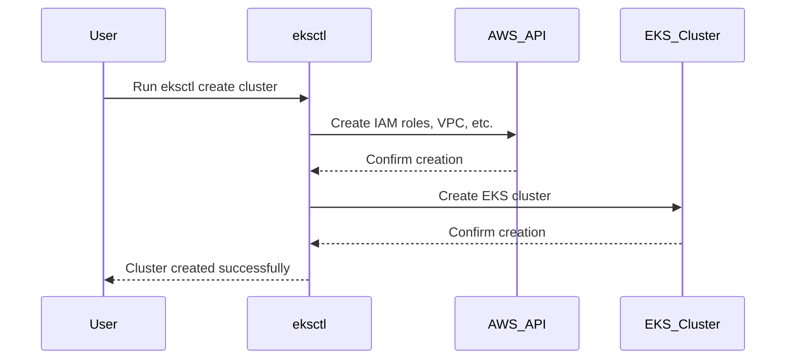

## Introduction to EKS Cluster Creation Using EKS Control

In the context of DevOps and cloud-native applications, Amazon Elastic Kubernetes Service (EKS) plays a pivotal role in managing containerized workloads. Creating an EKS cluster manually involves several steps, including setting up roles, creating the VPC, and configuring the cluster itself. This process can be time-consuming and error-prone, especially when replicating environments across different stages such as staging and production.

### Background Theory

Before diving into the specifics of EKS cluster creation, it's essential to understand the underlying concepts:

1. **Amazon Elastic Kubernetes Service (EKS)**: EKS is a managed service that makes it easy to run Kubernetes on AWS without needing expertise in Kubernetes cluster setup and management. It supports open-source Kubernetes applications and is compatible with all Kubernetes tools.

2. **Kubernetes**: Kubernetes is an open-source system for automating deployment, scaling, and management of containerized applications. It groups containers that make up an application into logical units called pods, which can be managed and scaled more easily.

3. **VPC (Virtual Private Cloud)**: A VPC is a virtual network dedicated to your AWS account. It allows you to launch AWS resources in a logically isolated virtual network.

4. **IAM Roles**: Identity and Access Management (IAM) roles define permissions for entities within AWS. These roles are crucial for granting necessary permissions to services and resources.

### Manual EKS Cluster Creation Process

Creating an EKS cluster manually involves several steps:

1. **Create IAM Roles**: Define roles for the EKS cluster and worker nodes.
2. **Create VPC**: Set up a VPC with subnets and route tables.
3. **Create EKS Cluster**: Use the AWS Management Console or CLI to create the EKS cluster.
4. **Configure Node Groups**: Add node groups to the cluster to provide compute capacity.

This process can be cumbersome and prone to errors, especially when replicating environments across different stages.

### EKS Control: An Efficient Alternative

To streamline the process, AWS provides `eksctl`, a command-line tool specifically designed for creating and managing EKS clusters. `eksctl` simplifies the creation process by handling many of the manual steps automatically.

#### What is `eksctl`?

`eksctl` is a simple command-line utility for creating and managing EKS clusters. It is built on top of the AWS SDK and Kubernetes client libraries. `eksctl` abstracts away many of the complexities involved in setting up an EKS cluster, making it easier to manage and scale.

#### Why Use `eksctl`?

Using `eksctl` offers several advantages:

1. **Efficiency**: Automates the creation of IAM roles, VPC, and other necessary components.
2. **Consistency**: Ensures that clusters are created consistently across different environments.
3. **Ease of Use**: Simplifies the process with a straightforward command-line interface.

### Installing `eksctl`

To use `eksctl`, you first need to install it. The installation process varies depending on your operating system.

#### Installation on Linux

```bash
curl --silent --location "https://github.com/weaveworks/eksctl/releases/latest/download/eksctl_$(uname -s)_amd64.tar.gz" | tar xz -C /tmp
sudo mv /tmp/eksctl /usr/local/bin
```

#### Installation on macOS

```bash
brew install weaveworks/tap/eksctl
```

#### Installation on Windows

Download the latest release from the [GitHub releases page](https://github.com/weaveworks/eksctl/releases) and follow the instructions provided.

### Creating an EKS Cluster with `eksctl`

Once `eksctl` is installed, you can create an EKS cluster using a simple command. Here’s an example:

```bash
eksctl create cluster \
  --name my-cluster \
  --region us-west-2 \
  --version 1.21 \
  --node-type t3.medium \
  --nodes 3 \
  --nodes-min 2 \
  --nodes-max 4
```

This command creates an EKS cluster named `my-cluster` in the `us-west-2` region with the specified Kubernetes version and node configuration.

### Understanding the Command

Let's break down the command:

- `--name`: Specifies the name of the cluster.
- `--region`: Specifies the AWS region where the cluster will be created.
- `--version`: Specifies the Kubernetes version.
- `--node-type`: Specifies the EC2 instance type for the worker nodes.
- `--nodes`: Specifies the initial number of worker nodes.
- `--nodes-min`: Specifies the minimum number of worker nodes.
- `--nodes-max`: Specifies the maximum number of worker nodes.

### Full Raw HTTP Request and Response

When you run the `eksctl` command, it interacts with the AWS API to create the necessary resources. Here’s an example of the HTTP request and response:

```http
POST / HTTP/1.1
Host: eks.amazonaws.com
Content-Type: application/json
Authorization: Bearer <your-token>

{
  "clusterName": "my-cluster",
  "region": "us-west-2",
  "version": "1.21",
  "nodeType": "t3.medium",
  "nodes": 3,
  "nodesMin": 2,
  "nodesMax": 4
}
```

Response:

```http
HTTP/1.1 200 OK
Content-Type: application/json

{
  "status": "success",
  "message": "Cluster 'my-cluster' created successfully"
}
```

### Diagramming the Process

Here’s a mermaid diagram illustrating the process:



### Common Pitfalls and How to Avoid Them

1. **Incorrect Region**: Ensure you specify the correct AWS region.
2. **Insufficient Permissions**: Make sure the IAM user or role has the necessary permissions.
3. **Network Configuration**: Verify that the VPC and subnet configurations are correct.

### How to Prevent / Defend

#### Detection

- **Logging and Monitoring**: Enable CloudTrail and configure monitoring tools like CloudWatch to track changes and detect anomalies.
- **Audit Logs**: Regularly review audit logs to ensure compliance and detect unauthorized access.

#### Prevention

- **IAM Policies**: Use least privilege principles when assigning IAM roles.
- **Security Groups**: Configure security groups to restrict inbound and outbound traffic.
- **Network ACLs**: Use Network ACLs to further restrict traffic at the subnet level.

#### Secure Coding Fixes

Here’s an example of a vulnerable IAM policy and its secure counterpart:

**Vulnerable Policy**:

```json
{
  "Version": "2012-10-17",
  "Statement": [
    {
      "Effect": "Allow",
      "Action": "*",
      "Resource": "*"
    }
  ]
}
```

**Secure Policy**:

```json
{
  "Version": "2012-10-17",
  "Statement": [
    {
      "Effect": "Allow",
      "Action": [
        "eks:*",
        "ec2:*",
        "iam:*",
        "cloudformation:*",
        "autoscaling:*",
        "elasticloadbalancing:*",
        "route53:*"
      ],
      "Resource": "*"
    }
  ]
}
```

### Real-World Examples

#### Recent CVEs and Breaches

- **CVE-2021-20225**: A vulnerability in the AWS SDK for Java allowed attackers to bypass authentication mechanisms. Ensure you are using the latest versions of the SDK and libraries.
- **AWS RDS Data Exfiltration**: In 2021, a misconfigured RDS instance led to data exfiltration. Ensure proper network isolation and access controls.

### Hands-On Labs

For practical experience, consider the following labs:

- **PortSwigger Web Security Academy**: Focuses on web application security but includes sections on cloud security.
- **CloudGoat**: Provides a series of labs to practice securing AWS environments.
- **flaws.cloud**: Offers a range of labs to identify and mitigate security issues in cloud environments.

### Conclusion

Creating an EKS cluster using `eksctl` simplifies the process significantly. By automating many of the manual steps, `eksctl` ensures consistency and efficiency. Understanding the underlying concepts and best practices is crucial for effective management and security of EKS clusters.

---
<!-- nav -->
[[01-Introduction to Amazon EKS (Elastic Kubernetes Service)|Introduction to Amazon EKS (Elastic Kubernetes Service)]] | [[DevOps/DevOps Bootcamp/09-Container Orchestration (Kubernetes)/18-EKS Cluster Creation Using EKS Control/00-Overview|Overview]] | [[03-Configuring AWS Credentials for EKS Control|Configuring AWS Credentials for EKS Control]]
