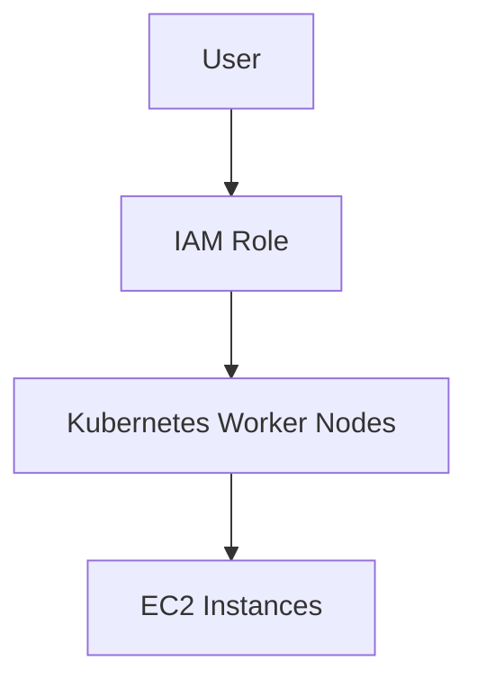
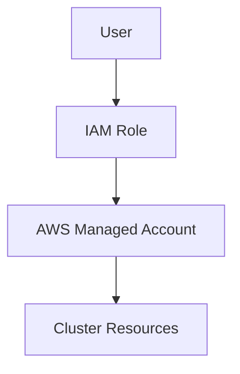
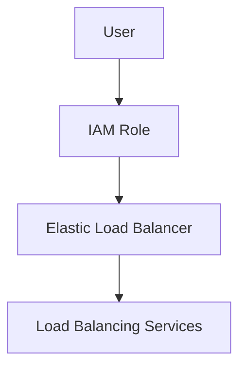
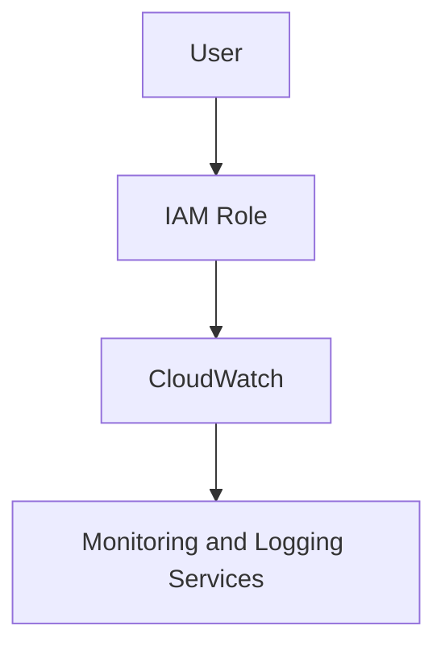

## Kubernetes Cluster Creation Using EKS Control

### Introduction to Kubernetes and EKS

Kubernetes is an open-source system for automating deployment, scaling, and management of containerized applications. It was originally designed by Google and is now maintained by the Cloud Native Computing Foundation. Kubernetes provides a platform for automating deployment and scaling of containerized applications, as well as operations on them.

Amazon Elastic Kubernetes Service (EKS) is a managed service that makes it easy to run Kubernetes on AWS without needing expertise in Kubernetes cluster setup and management. EKS supports the standard Kubernetes API, so you can use existing tools to interact with your cluster and applications.

### Understanding the Kubernetes Cluster Components

When you create an EKS cluster, several components are automatically configured and managed by AWS. These components include:

- **Nodes**: The worker nodes where your applications run. In EKS, these are typically EC2 instances.
- **Control Plane**: The control plane manages the cluster and consists of the API server, etcd, scheduler, controller manager, and cloud controller manager.
- **IAM Roles and Policies**: IAM roles and policies are used to grant permissions to the control plane and worker nodes.

#### Kubernetes Processes Running in the Cluster

The Kubernetes processes running in the cluster include:

- **kube-apiserver**: Exposes the Kubernetes API.
- **etcd**: Stores the cluster’s configuration data.
- **kube-scheduler**: Assigns newly created pods to nodes.
- **kube-controller-manager**: Runs controllers that watch the state of the cluster and make changes to move the current state towards the desired state.
- **cloud-controller-manager**: Extends the functionality of the control plane to integrate with cloud-specific APIs.

### IAM Roles and Policies in EKS

When you create an EKS cluster, several IAM roles and policies are automatically created to manage permissions. Let's dive into the details of these roles and policies.

#### Role: EKS Control Demo Cluster Node Group Role

This role is associated with the node group you created. It grants permissions to the worker nodes to perform necessary actions within the cluster.



**Permissions and Policies**:
- **Policies**: The policies attached to this role include permissions to access the Kubernetes API, manage pods, and other resources.
- **Example Policy**:
  
  ```json
  {
      "Version": "2012-10-17",
      "Statement": [
          {
              "Effect": "Allow",
              "Action": [
                  "eks:DescribeCluster",
                  "eks:ListClusters"
              ],
              "Resource": "*"
          }
      ]
  }
  ```

#### Role: Cluster Service Role

This role is associated with the cluster itself and grants permissions to the AWS-managed account to perform actions in your AWS account.



**Permissions and Policies**:
- **Policies**: The policies attached to this role include permissions to access the Kubernetes API, manage pods, and other resources.
- **Example Policy**:
  
  ```json
  {
      "Version": "2012-10-17",
      "Statement": [
          {
              "Effect": "Allow",
              "Action": [
                  "eks:DescribeCluster",
                  "eks:ListClusters"
              ],
              "Resource": "*"
          }
      ]
  }
  ```

### Additional Policies Created

In addition to the roles mentioned above, several other policies are created to manage specific services like Elastic Load Balancer (ELB) and CloudWatch.

#### Elastic Load Balancer Permission

This policy grants permissions to the ELB to manage load balancing for the Kubernetes services.



**Permissions and Policies**:
- **Policies**: The policies attached to this role include permissions to access the Kubernetes API, manage pods, and other resources.
- **Example Policy**:
  
  ```json
  {
      "Version": "2012-10-17",
      "Statement": [
          {
              "Effect": "Allow",
              "Action": [
                  "elasticloadbalancing:Describe*",
                  "elasticloadbalancing:Create*",
                  "elasticloadbalancing:Delete*"
              ],
              "Resource": "*"
          }
      ]
  }
  ```

#### CloudWatch Permission

This policy grants permissions to CloudWatch to monitor and log the Kubernetes cluster.



**Permissions and Policies**:
- **Policies**: The policies attached to this role include permissions to access the Kubernetes API, manage pods, and other resources.
- **Example Policy**:
  
  ```json
  {
      "Version": "2012-10-17",
      "Statement": [
          {
              "Effect": "Allow",
              "Action": [
                  "logs:CreateLogGroup",
                  "logs:CreateLogStream",
                  "logs:PutLogEvents"
              ],
              "Resource": "*"
          }
      ]
  }
  ```

### How to Prevent / Defend

To ensure the security and integrity of your EKS cluster, follow these best practices:

#### Secure IAM Roles and Policies

- **Least Privilege Principle**: Ensure that IAM roles and policies are granted the minimum permissions required to perform their tasks.
- **Regular Audits**: Regularly review and audit IAM roles and policies to identify and remove unnecessary permissions.
- **Secure Configuration**: Use secure configurations for IAM roles and policies to prevent unauthorized access.

#### Example of Vulnerable vs. Secure Configuration

**Vulnerable Configuration**:
```json
{
    "Version": "2012-10-17",
    "Statement": [
        {
            "Effect": "Allow",
            "Action": "*",
            "Resource": "*"
        }
    ]
}
```

**Secure Configuration**:
```json
{
    "Version": "2012-10-17",
    "Statement": [
        {
            "Effect": "Allow",
            "Action": [
                "eks:DescribeCluster",
                "eks:ListClusters"
            ],
            "Resource": "*"
        }
    ]
}
```

### Real-World Examples and Recent CVEs

#### CVE-2021-25741: Kubernetes API Server Privilege Escalation

CVE-2021-25741 is a privilege escalation vulnerability in the Kubernetes API server. An attacker with access to the Kubernetes API server could exploit this vulnerability to gain elevated privileges.

**Impact**:
- **Privilege Escalation**: An attacker could escalate their privileges to gain administrative access to the Kubernetes cluster.
- **Data Exposure**: Sensitive data could be exposed to unauthorized users.

**Mitigation**:
- **Update Kubernetes**: Ensure that your Kubernetes cluster is updated to the latest version to mitigate this vulnerability.
- **Least Privilege Principle**: Apply the least privilege principle to limit the permissions granted to users and roles.

### Hands-On Labs

For hands-on practice with EKS cluster creation and management, consider the following labs:

- **PortSwigger Web Security Academy**: Offers comprehensive labs on web application security.
- **OWASP Juice Shop**: A deliberately insecure web application for practicing web security skills.
- **DVWA (Damn Vulnerable Web Application)**: A PHP/MySQL web application that is riddled with vulnerabilities.
- **WebGoat**: An interactive, gamified training application for learning about web application security.

### Conclusion

Creating an EKS cluster involves setting up various components, including nodes, control plane, and IAM roles and policies. Understanding these components and their interactions is crucial for managing and securing your Kubernetes cluster. By following best practices and regularly auditing your configurations, you can ensure the security and integrity of your EKS cluster.

---
<!-- nav -->
[[03-Configuring AWS Credentials for EKS Control|Configuring AWS Credentials for EKS Control]] | [[DevOps/DevOps Bootcamp/09-Container Orchestration (Kubernetes)/18-EKS Cluster Creation Using EKS Control/00-Overview|Overview]] | [[DevOps/DevOps Bootcamp/09-Container Orchestration (Kubernetes)/18-EKS Cluster Creation Using EKS Control/05-Practice Questions & Answers|Practice Questions & Answers]]
