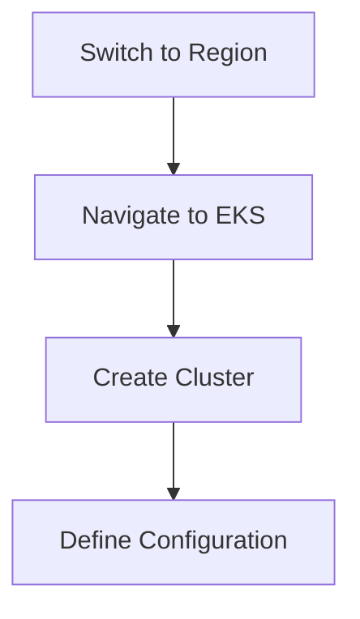
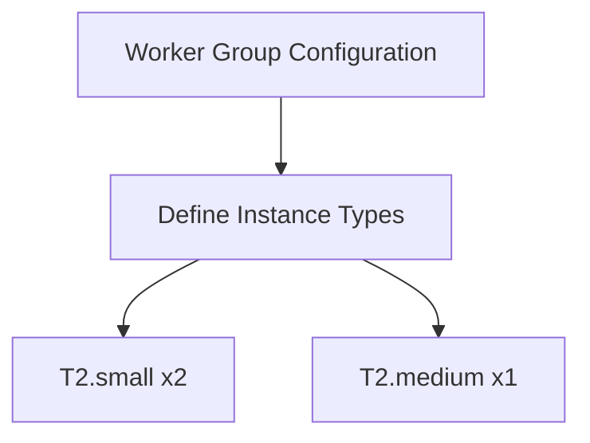

## Introduction to EKS Cluster Setup and Resource Verification

In this section, we will delve into the setup and verification of an Amazon Elastic Kubernetes Service (EKS) cluster. We will cover the creation process, resource management, and verification steps using the AWS Management Console. Additionally, we will discuss the underlying concepts, potential pitfalls, and security measures to ensure a robust and secure environment.

### Background Theory

Amazon Elastic Kubernetes Service (EKS) is a managed service that makes it easy to run Kubernetes on AWS without needing expertise in Kubernetes orchestration. EKS supports the Kubernetes API, allowing you to use existing tools and plugins to interact with your cluster. Kubernetes is an open-source system for automating deployment, scaling, and management of containerized applications.

#### Kubernetes Concepts

1. **Cluster**: A set of nodes that run containerized applications managed by Kubernetes.
2. **Nodes**: Machines (VMs or physical servers) that run your applications and are managed by the master components.
3. **Pods**: The smallest deployable units that can be created and managed in Kubernetes. Pods hold one or more containers.
4. **Services**: An abstraction that defines a logical set of pods and a policy by which to access them.
5. **Deployments**: A deployment controller provides declarative updates for pods and replica sets.

### Setting Up an EKS Cluster

To create an EKS cluster, you need to follow several steps:

1. **Create the EKS Cluster**:
    - Use the AWS Management Console or AWS CLI to create the cluster.
    - Specify the desired Kubernetes version and other configurations.

2. **Configure Node Groups**:
    - Define the worker nodes that will run your applications.
    - Specify the instance types and counts.

3. **IAM Roles**:
    - Create IAM roles for the EKS cluster and worker nodes.
    - Ensure the roles have the necessary permissions to interact with AWS services.

### Detailed Steps

#### Step 1: Creating the EKS Cluster

Let's start by creating the EKS cluster using the AWS Management Console.

1. **Switch to the Desired Region**:
    - Navigate to the AWS Management Console.
    - Select the region where you want to create the cluster (e.g., `us-east-2`).

2. **Navigate to EKS**:
    - Go to the EKS dashboard.
    - Click on "Clusters" and then "Create".

3. **Define the Cluster Configuration**:
    - Choose the Kubernetes version.
    - Provide a name for the cluster.
    - Configure the VPC settings.



#### Step 2: Configuring Node Groups

Next, we configure the node groups to define the worker nodes.

1. **Worker Group Configuration**:
    - Define the number and types of EC2 instances.
    - In this example, we have two T2.small instances and one T2.medium instance.



2. **Node Names**:
    - Each node will have a unique name.
    - These names are visible in the AWS Management Console under the "Nodes" section.

#### Step 3: Verifying the Cluster

Once the cluster is created, we verify the resources and configurations.

1. **Check the Cluster Status**:
    - Navigate to the EKS dashboard.
    - Verify that the cluster is active.

2. **Check the Nodes**:
    - Ensure that all nodes are in the "Ready" state.
    - Check the pod status on each node.

3. **IAM Service Roles**:
    - Verify that the IAM roles for EKS and EC2 have been created.
    - Ensure these roles have the necessary permissions.

### Example Code and Configuration

#### Creating the EKS Cluster via AWS CLI

Here is an example of creating an EKS cluster using the AWS CLI:

```bash
aws eks create-cluster \
    --name my-cluster \
    --role-arn arn:aws:iam::123456789012:role/eksClusterRole \
    --resources-vpc-config subnetIds=subnet-12345678,subnet-abcdefgh \
    --version 1.21
```

#### Configuring Node Groups

To configure node groups, you can use the following command:

```bash
aws eks create-node-group \
    --cluster-name my-cluster \
    --node-group-name my-node-group \
    --scaling-config minSize=2,maxSize=4,desiredSize=3 \
    --instance-types t2.small,t2.medium \
    --subnets subnet-12345678 subnet-abcdefgh \
    --ami-type AL2_x86_64 \
    --remote-access ssh.key=your-key-pair \
    --tags key=value
```

### Pitfalls and Best Practices

#### Common Mistakes

1. **Incorrect IAM Roles**:
    - Ensure that the IAM roles have the correct permissions.
    - Missing permissions can lead to issues with cluster creation and node management.

2. **Insufficient Node Resources**:
    - Ensure that the nodes have sufficient resources (CPU, memory) to run the applications.
    - Insufficient resources can lead to performance degradation and application failures.

#### Best Practices

1. **Use Managed Node Groups**:
    - Managed node groups handle the lifecycle of EC2 instances, reducing the management overhead.

2. **Enable Auto Scaling**:
    - Enable auto-scaling for node groups to handle varying workloads efficiently.

3. **Secure IAM Roles**:
    - Use least privilege principles for IAM roles.
    - Regularly review and update IAM policies.

### Security Considerations

#### Vulnerabilities and Mitigations

1. **CVE-2021-25741**:
    - This vulnerability affects Kubernetes versions prior to 1.20.10, 1.21.5, and 1.22.2.
    - Ensure that your EKS cluster is running a patched version of Kubernetes.

2. **IAM Role Permissions**:
    - Misconfigured IAM roles can lead to unauthorized access.
    - Use IAM policies to restrict permissions to the minimum required.

#### Secure Configuration Example

Here is an example of a secure IAM policy for an EKS cluster:

```json
{
    "Version": "2012-10-17",
    "Statement": [
        {
            "Effect": "Allow",
            "Action": [
                "eks:Describe*",
                "eks:List*"
            ],
            "Resource": "*"
        },
        {
            "Effect": "Allow",
            "Action": [
                "ec2:DescribeInstances",
                "ec2:DescribeInstanceStatus",
                "ec2:DescribeSubnets",
                "ec2:DescribeSecurityGroups",
                "ec2:DescribeVpcs",
                "ec2:DescribeTags"
            ],
            "Resource": "*"
        }
    ]
}
```

### How to Prevent / Defend

#### Detection

1. **Monitoring Tools**:
    - Use AWS CloudTrail to monitor API calls made to your EKS cluster.
    - Set up alerts for suspicious activities.

2. **Logging**:
    - Enable logging for your EKS cluster.
    - Analyze logs regularly to detect any anomalies.

#### Prevention

1. **Least Privilege Principle**:
    - Assign minimal necessary permissions to IAM roles.
    - Regularly review and update IAM policies.

2. **Regular Patching**:
    - Keep your EKS cluster and associated components up to date with the latest security patches.

#### Secure Coding Fixes

Here is an example of a vulnerable IAM policy and its secure counterpart:

**Vulnerable Policy**:
```json
{
    "Version": "2012-10-17",
    "Statement": [
        {
            "Effect": "Allow",
            "Action": "*",
            "Resource": "*"
        }
    ]
}
```

**Secure Policy**:
```json
{
    "Version": "2012-10-17",
    "Statement": [
        {
            "Effect": "Allow",
            "Action": [
                "eks:Describe*",
                "eks:List*"
            ],
            "Resource": "*"
        },
        {
            "Effect": "Allow",
            "Action": [
                "ec2:DescribeInstances",
                "ec2:DescribeInstanceStatus",
                "ec2:DescribeSubnets",
                "ec2:DescribeSecurityGroups",
                "ec2:DescribeVpcs",
                "ec2:DescribeTags"
            ],
            "Resource": "*"
        }
    ]
}
```

### Hands-On Labs

For hands-on practice, consider the following labs:

- **PortSwigger Web Security Academy**: Focuses on web application security but also covers Kubernetes basics.
- **OWASP Juice Shop**: A deliberately insecure web application for practicing web security skills.
- **CloudGoat**: A series of labs designed to help you learn about securing AWS environments.

These labs provide practical experience in setting up and managing EKS clusters securely.

### Conclusion

Creating and managing an EKS cluster involves several steps, including cluster creation, node group configuration, and verification. By following best practices and implementing security measures, you can ensure a robust and secure environment. Regular monitoring and patching are essential to maintaining the integrity of your EKS cluster.

---
<!-- nav -->
[[DevOps/DevOps Bootcamp/09-Container Orchestration (Kubernetes)/19-EKS Cluster Setup and Resource Verification/00-Overview|Overview]] | [[02-EKS Cluster Setup and Resource Verification|EKS Cluster Setup and Resource Verification]]
