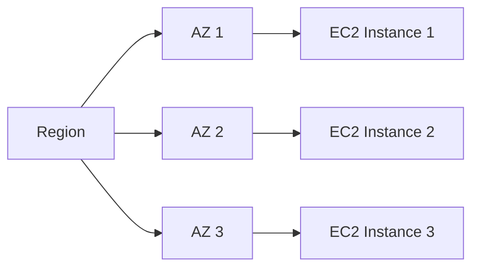
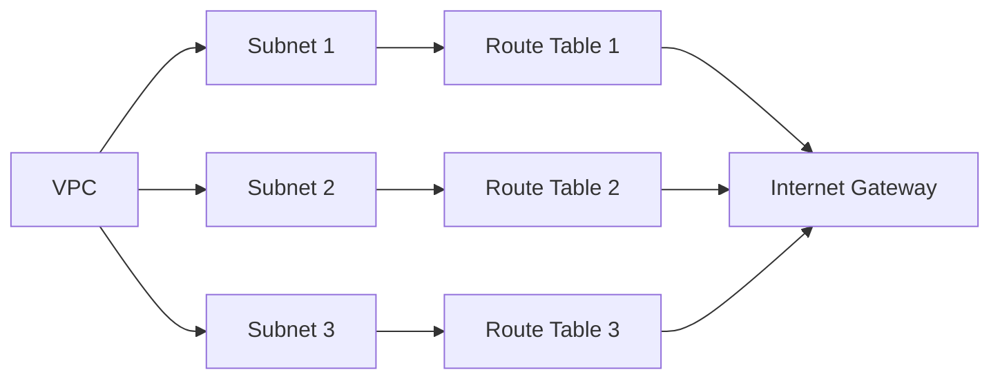
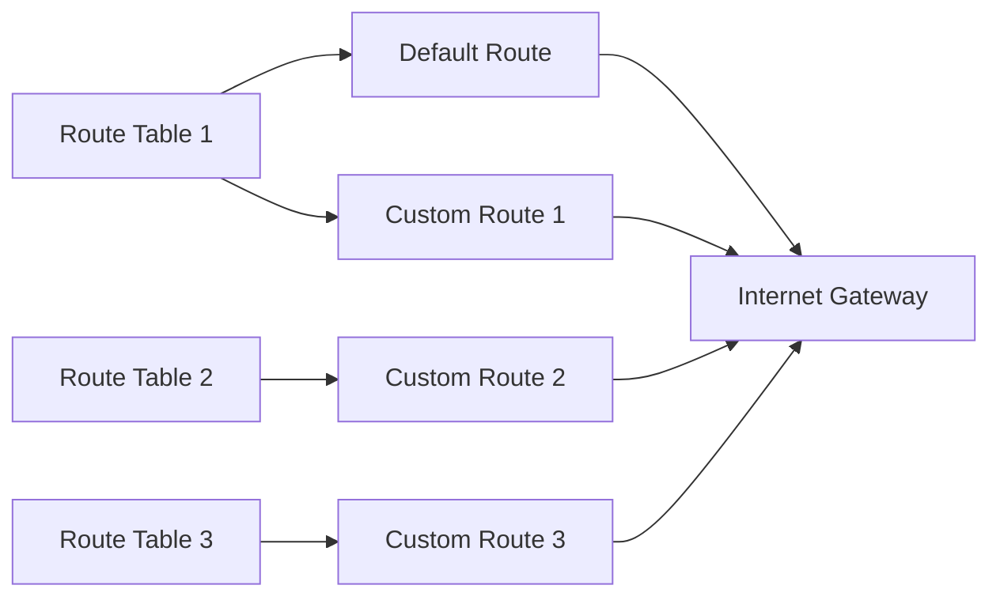
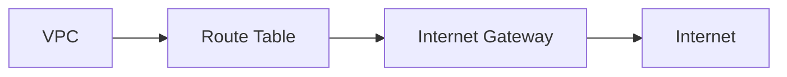

## EKS Cluster Setup and Resource Verification

### Introduction to EKS and AWS Roles

In this section, we will delve into the setup and verification of an Amazon Elastic Kubernetes Service (EKS) cluster. We will start by discussing the roles that are created during the EKS cluster setup process and their significance.

#### What Are AWS Roles?

AWS roles are a type of identity that you can use to grant permissions to entities that interact with AWS services. These roles are crucial for managing access control in your AWS environment. In the context of EKS, roles are used to manage permissions for various components such as the worker nodes, the control plane, and other AWS services that interact with the EKS cluster.

#### Why Are AWS Roles Important?

AWS roles are important because they help in maintaining least privilege access, which is a fundamental principle of security. By using roles, you can ensure that each component of your EKS cluster has only the permissions it needs to perform its tasks. This reduces the risk of unauthorized access and potential security breaches.

#### How Are AWS Roles Created?

In the previous AWS section, we manually created roles. However, in this setup, the roles are created automatically by the EKS module. This automation simplifies the process and ensures that the necessary roles are correctly configured.

### EC2 Service Nodes

Next, we will explore the EC2 service nodes that form the worker nodes of our EKS cluster.

#### What Are EC2 Service Nodes?

EC2 (Elastic Compute Cloud) instances are virtual servers in the AWS cloud. In the context of EKS, EC2 instances serve as the worker nodes where your Kubernetes pods run. Each EC2 instance is a separate node in the EKS cluster.

#### Why Are EC2 Instances Important?

EC2 instances are important because they provide the compute resources needed to run your Kubernetes applications. By distributing these instances across different availability zones (AZs), you can achieve high availability and fault tolerance.

#### How Are EC2 Instances Distributed Across AZs?

In our setup, we have three EC2 instances, each running in a different availability zone. This distribution ensures that even if one AZ fails, the other AZs can continue to operate, providing high availability.



### VPC Service Overview

Now, let's dive into the Virtual Private Cloud (VPC) service and understand its role in our EKS cluster setup.

#### What Is a VPC?

A VPC is a virtual network dedicated to your AWS account. It allows you to launch AWS resources in a logically isolated virtual network. The VPC provides the network infrastructure for your EKS cluster.

#### Why Is a VPC Important?

A VPC is important because it provides a secure and isolated network environment for your EKS cluster. It allows you to control the network traffic and manage the security of your resources.

#### How Is a VPC Configured?

In our setup, we have a default VPC that comes with the region, and we have also created a custom VPC. The custom VPC is defined by the `SiderBlock` we have specified.



### Route Tables and Internet Gateway

Let's examine the route tables and the internet gateway in more detail.

#### What Are Route Tables?

Route tables are used to determine where network traffic is directed. Each subnet in a VPC is associated with a route table that defines the routes for outbound traffic.

#### Why Are Route Tables Important?

Route tables are important because they control the routing of network traffic within the VPC. Properly configured route tables ensure that traffic is directed to the correct destinations.

#### How Are Route Tables Configured?

In our setup, we have three route tables. One is the default route table, and the other two are custom route tables with different rules.



#### What Is an Internet Gateway?

An internet gateway is a horizontally scaled, redundant, and highly available VPC component that allows communication between your VPC and the internet.

#### Why Is an Internet Gateway Important?

An internet gateway is important because it enables your VPC to communicate with the internet. This is essential for allowing your EKS cluster to send and receive traffic to and from external sources.

#### How Is an Internet Gateway Configured?

In our setup, we have configured a route table to route traffic through the internet gateway. This allows the VPC to send and receive traffic to and from the internet.



### High Availability and Fault Tolerance

High availability and fault tolerance are critical aspects of our EKS cluster setup.

#### What Is High Availability?

High availability refers to the ability of a system to remain operational and accessible at all times. In the context of EKS, high availability means that the cluster remains functional even if one or more components fail.

#### Why Is High Availability Important?

High availability is important because it ensures that your applications remain accessible and responsive to users. This is particularly important for mission-critical applications that cannot afford downtime.

#### How Is High Availability Achieved?

In our setup, high availability is achieved by distributing the EC2 instances across different availability zones. This ensures that even if one AZ fails, the other AZs can continue to operate.

### Security Considerations

Security is a paramount concern when setting up an EKS cluster.

#### What Are the Security Risks?

The primary security risks in an EKS cluster include unauthorized access, data breaches, and misconfigurations. These risks can lead to loss of sensitive data and disruption of services.

#### How Can Security Risks Be Mitigated?

To mitigate security risks, you should:

1. **Use IAM Roles**: Ensure that IAM roles are properly configured to enforce least privilege access.
2. **Secure Network Traffic**: Use VPCs and route tables to control network traffic and ensure that only authorized traffic is allowed.
3. **Enable Encryption**: Enable encryption for data at rest and in transit to protect sensitive information.
4. **Regular Audits**: Perform regular audits and monitoring to detect and respond to security incidents.

### Recent Real-World Examples

Recent breaches and vulnerabilities highlight the importance of proper security practices.

#### Example: AWS S3 Bucket Exposure

In 2021, a major breach occurred due to misconfigured S3 buckets. This breach exposed sensitive data and highlighted the importance of proper configuration and access controls.

#### Example: Kubernetes API Server Vulnerability

In 2022, a vulnerability in the Kubernetes API server allowed unauthorized access to cluster resources. This vulnerability underscores the importance of keeping your EKS cluster and its components up to date.

### Complete Code Examples

Here are some complete code examples to illustrate the concepts discussed.

#### Creating IAM Roles

```yaml
# IAM Role Policy for EKS Worker Nodes
{
  "Version": "2012-10-17",
  "Statement": [
    {
      "Effect": "Allow",
      "Action": [
        "ec2:Describe*",
        "elasticloadbalancing:*",
        "autoscaling:*",
        "cloudwatch:*"
      ],
      "Resource": "*"
    }
  ]
}
```

#### Configuring VPC and Subnets

```yaml
# VPC Configuration
{
  "VpcId": "vpc-12345678",
  "Subnets": [
    {
      "SubnetId": "subnet-abcdefgh",
      "AvailabilityZone": "us-west-2a"
    },
    {
      "SubnetId": "subnet-ijklmnop",
      "AvailabilityZone": "us-west-2b"
    },
    {
      "SubnetId": "subnet-qrsuvwxz",
      "AvailabilityZone": "us-west-2c"
    }
  ]
}
```

#### Configuring Route Tables

```yaml
# Route Table Configuration
{
  "RouteTableId": "rtb-12345678",
  "Routes": [
    {
      "DestinationCidrBlock": "0.0.0.0/0",
      "GatewayId": "igw-abcdefgh"
    }
  ]
}
```

### How to Prevent / Defend

#### Detecting Misconfigurations

To detect misconfigurations, you can use tools like AWS Config and AWS Trusted Advisor. These tools provide continuous monitoring and alerting for misconfigurations.

#### Preventing Unauthorized Access

To prevent unauthorized access, you should:

1. **Use IAM Roles**: Ensure that IAM roles are properly configured to enforce least privilege access.
2. **Enable MFA**: Enable multi-factor authentication (MFA) for all users with administrative privileges.
3. **Audit Regularly**: Perform regular audits and monitoring to detect and respond to security incidents.

#### Secure Coding Practices

To implement secure coding practices, you should:

1. **Validate Inputs**: Validate all inputs to prevent injection attacks.
2. **Use Parameterized Queries**: Use parameterized queries to prevent SQL injection.
3. **Encrypt Data**: Encrypt sensitive data both at rest and in transit.

### Conclusion

In this section, we have covered the setup and verification of an EKS cluster, including the roles, EC2 service nodes, VPC service, route tables, and internet gateway. We have also discussed the importance of high availability and fault tolerance, as well as the security considerations and recent real-world examples. By following the best practices and secure coding practices outlined in this section, you can ensure that your EKS cluster is secure and reliable.

### Practice Labs

For hands-on practice, consider the following labs:

- **PortSwigger Web Security Academy**: Focuses on web application security and includes exercises related to Kubernetes and EKS.
- **OWASP Juice Shop**: A deliberately insecure web application for practicing web security skills.
- **CloudGoat**: A series of labs designed to teach cloud security principles using AWS.

By completing these labs, you can gain practical experience in setting up and securing an EKS cluster.

---
<!-- nav -->
[[01-Introduction to EKS Cluster Setup and Resource Verification|Introduction to EKS Cluster Setup and Resource Verification]] | [[DevOps/DevOps Bootcamp/09-Container Orchestration (Kubernetes)/19-EKS Cluster Setup and Resource Verification/00-Overview|Overview]] | [[03-Infrastructure as Code (IaC) and Terraform|Infrastructure as Code (IaC) and Terraform]]
