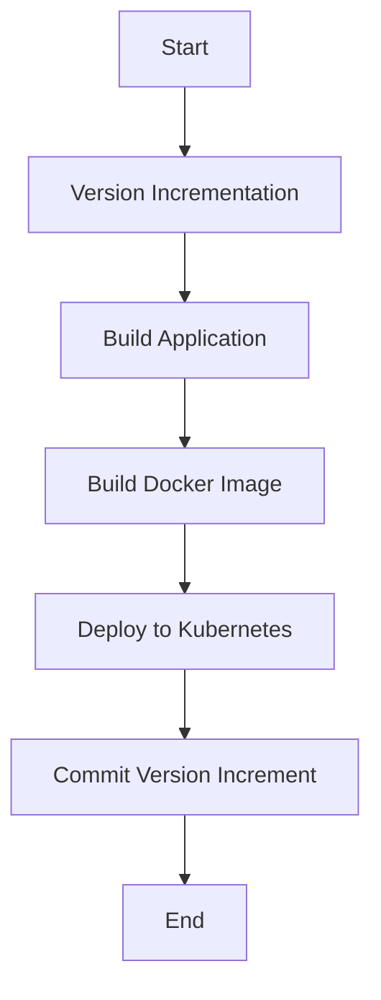

## Introduction to Integrating Kubernetes Deployment into CI/CD Pipeline

In modern DevOps practices, integrating Kubernetes deployments into a Continuous Integration and Continuous Delivery (CI/CD) pipeline is crucial for ensuring efficient and reliable software delivery. This chapter will guide you through the process of integrating a Kubernetes deployment stage into an existing CI/CD pipeline using Jenkins. We'll cover the necessary steps, concepts, and best practices to ensure a seamless integration.

### Background Theory

Before diving into the practical aspects, let's understand the key components involved:

1. **Continuous Integration (CI)**: This is the practice of merging all developers' working copies to a shared mainline several times a day. Each integration is verified by an automated build and test process.
   
2. **Continuous Delivery (CD)**: This extends CI by ensuring that the software can be released to production at any time. It involves automating the release process so that the software can be deployed to production with minimal human intervention.

3. **Kubernetes**: An open-source container orchestration system for automating deployment, scaling, and management of containerized applications. It provides a framework to run distributed systems resiliently.

4. **Jenkins**: An open-source automation server that provides hundreds of plugins to support building, deploying, and automating any project.

### Prerequisites

To follow along with this chapter, you should have:

- A basic understanding of Docker and containerization.
- Familiarity with Jenkins and its configuration.
- Access to a Kubernetes cluster.
- Basic knowledge of Groovy scripting for Jenkins pipelines.

### Setting Up the Environment

Let's assume you have a Jenkins setup with a pipeline defined in a `Jenkinsfile`. The pipeline includes stages for version incrementation, building the application, building the Docker image, and committing the version increment to the Git repository. Now, we'll integrate a deployment stage to Kubernetes.

#### Step-by-Step Integration

1. **Version Incrementation**:
   - This stage ensures that each pipeline run generates a new version number for the application.
   - Example:
     ```groovy
     stage('Version Incrementation') {
         steps {
             script {
                 def version = sh(script: 'git describe --tags', returnStdout: true).trim()
                 env.VERSION = version
             }
         }
     }
     ```

2. **Building the Application**:
   - This stage cleans up the target folder and builds a new JAR file with the incremented version.
   - Example:
     ```groovy
     stage('Build Application') {
         steps {
             sh 'mvn clean package'
         }
     }
     ```

3. **Building the Docker Image**:
   - This stage builds a Docker image using the newly built JAR file.
   - Example:
     ```groovy
     stage('Build Docker Image') {
         steps {
             script {
                 docker.build("myapp:${env.VERSION}")
             }
         }
     }
     ```

4. **Deploying to Kubernetes**:
   - This stage deploys the Docker image to a Kubernetes cluster.
   - Example:
     ```groovy
     stage('Deploy to Kubernetes') {
         steps {
             script {
                 sh 'kubectl set image deployment/myapp-deployment myapp=myapp:${env.VERSION}'
             }
         }
     }
     ```

5. **Committing Version Increment**:
   - This stage commits the version increment to the Git repository.
   - Example:
     ```groovy
     stage('Commit Version Increment') {
         steps {
             sh 'git add .'
             sh 'git commit -m "Bump version to ${env.VERSION}"'
             sh 'git push origin HEAD'
         }
     }
     ```

### Complete Jenkinsfile Example

Here is the complete `Jenkinsfile` with all the stages integrated:

```groovy
pipeline {
    agent any

    environment {
        VERSION = ''
    }

    stages {
        stage('Version Incrementation') {
            steps {
                script {
                    def version = sh(script: 'git describe --tags', returnStdout: true).trim()
                    env.VERSION = version
                }
            }
        }

        stage('Build Application') {
            steps {
                sh 'mvn clean package'
            }
        }

        stage('Build Docker Image') {
            steps {
                script {
                    docker.build("myapp:${env.VERSION}")
                }
            }
        }

        stage('Deploy to Kubernetes') {
            steps {
                script {
                    sh 'kubectl set image deployment/myapp-deployment myapp=myapp:${env.VERSION}'
                }
            }
        }

        stage('Commit Version Increment') {
            steps {
                sh 'git add .'
                sh 'git commit -m "Bump version to ${env.VERSION}"'
                sh 'git push origin HEAD'
            }
        }
    }
}
```

### Diagramming the Pipeline

Let's visualize the pipeline using a Mermaid diagram:



### Pitfalls and Best Practices

#### Common Pitfalls

1. **Manual Interventions**: Avoid manual steps in the pipeline. Ensure all steps are automated.
2. **Environment Consistency**: Ensure that the development, testing, and production environments are consistent.
3. **Security Risks**: Be cautious about exposing sensitive information such as API keys and secrets in the pipeline.

#### Best Practices

1. **Use Secrets Management**: Utilize tools like Kubernetes Secrets or HashiCorp Vault to manage sensitive data securely.
2. **Automate Testing**: Include automated tests in the pipeline to catch issues early.
3. **Rollback Mechanism**: Implement a rollback mechanism to revert to a previous version if something goes wrong.

### Real-World Examples and Recent Breaches

#### Example: Docker Hub Breach (CVE-2021-29443)

In 2021, Docker Hub experienced a breach where unauthorized access was gained to user accounts. This highlights the importance of securing your CI/CD pipeline and ensuring that sensitive data is not exposed.

#### Secure Coding Practices

1. **Secure Docker Images**: Use trusted base images and scan Docker images for vulnerabilities.
2. **Least Privilege Principle**: Run containers with the least privileges necessary.

### How to Prevent / Defend

#### Detection

1. **Monitoring**: Use monitoring tools to detect anomalies in the pipeline execution.
2. **Logging**: Enable detailed logging to track the pipeline activities and identify potential security issues.

#### Prevention

1. **Access Control**: Implement strict access control policies for the CI/CD pipeline.
2. **Regular Audits**: Conduct regular audits of the pipeline to ensure compliance with security standards.

#### Secure-Coding Fixes

#### Vulnerable Code Example

```groovy
stage('Deploy to Kubernetes') {
    steps {
        script {
            sh 'kubectl set image deployment/myapp-deployment myapp=myapp:${env.VERSION}'
        }
    }
}
```

#### Secure Code Example

```groovy
stage('Deploy to Kubernetes') {
    steps {
        script {
            withCredentials([usernamePassword(credentialsId: 'kube-credentials', usernameVariable: 'KUBE_USER', passwordVariable: 'KUBE_PASS')]) {
                sh 'kubectl --server=https://kubernetes.example.com --username=$KUBE_USER --password=$KUBE_PASS set image deployment/myapp-deployment myapp=myapp:${env.VERSION}'
            }
        }
    }
}
```

### Hands-On Labs

For hands-on practice, consider the following labs:

- **PortSwigger Web Security Academy**: Offers a comprehensive set of labs covering various aspects of web security.
- **OWASP Juice Shop**: A deliberately insecure web application for security training.
- **Kubernetes Goat**: A series of challenges designed to help you learn Kubernetes security.

By following these steps and best practices, you can effectively integrate Kubernetes deployment into your CI/CD pipeline, ensuring a robust and secure software delivery process.

---
<!-- nav -->
[[DevOps/DevOps Bootcamp/09-Container Orchestration (Kubernetes)/21-Integrating Kubernetes Deployment Into CI CD Pipeline/00-Overview|Overview]] | [[02-Introduction to Kubernetes Deployment Integration in CICD Pipelines|Introduction to Kubernetes Deployment Integration in CICD Pipelines]]
