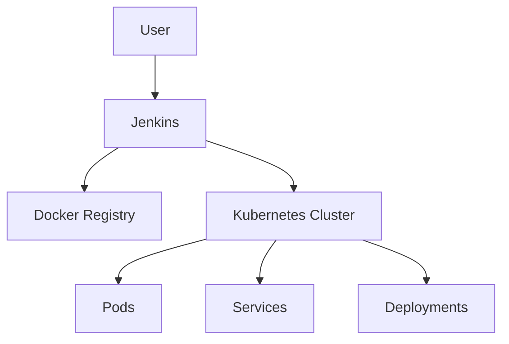
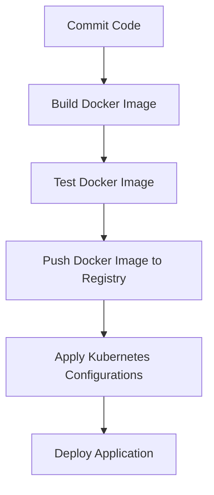

## Integrating Kubernetes Deployment into CI/CD Pipeline

### Background Theory

In modern DevOps practices, integrating Kubernetes deployments into a Continuous Integration and Continuous Delivery (CI/CD) pipeline is essential for automating the deployment process. This ensures that applications are consistently built, tested, and deployed across different environments. Kubernetes, being a container orchestration platform, provides a robust framework for managing containerized applications at scale.

### Key Concepts

#### Kubernetes Configuration Files

Kubernetes uses declarative configuration files to define the desired state of the system. These files are typically written in YAML format and describe the resources such as Deployments, Services, ConfigMaps, etc., that make up your application.

- **Deployment**: A Kubernetes resource that manages the rolling updates of a set of pods. It ensures that a specified number of pod replicas are running at any given time.
- **Service**: A Kubernetes resource that defines a logical set of pods and how to access them. Services provide stable networking identities and load balancing.

#### CI/CD Pipeline

A CI/CD pipeline automates the testing and deployment of code changes. It consists of several stages:

- **Build**: Compiles the code and packages it into a deployable artifact (e.g., Docker image).
- **Test**: Runs automated tests to ensure the code works as expected.
- **Deploy**: Deploys the artifact to the target environment (e.g., Kubernetes cluster).

### Step-by-Step Mechanics

Let's walk through the process of integrating a Kubernetes deployment into a CI/CD pipeline using Jenkins as an example.

#### Step 1: Create Kubernetes Configuration Files

First, you need to create the necessary Kubernetes configuration files for your application. In this case, we are creating a `deployment.yaml` and a `service.yaml`.

```yaml
# deployment.yaml
apiVersion: apps/v1
kind: Deployment
metadata:
  name: java-mavin-app
spec:
  replicas: 3
  selector:
    matchLabels:
      app: java-mavin-app
  template:
    metadata:
      labels:
        app: java-mavin-app
    spec:
      containers:
      - name: java-mavin-app
        image: <your-docker-image>
        ports:
        - containerPort: 80
```

```yaml
# service.yaml
apiVersion: v1
kind: Service
metadata:
  name: java-mavin-app-service
spec:
  selector:
    app: java-mavin-app
  ports:
    - protocol: TCP
      port: 80
      targetPort: 80
  type: LoadBalancer
```

These files define a deployment with three replicas and a service that exposes the application on port 80.

#### Step 2: Set Up Jenkins Pipeline

Next, you need to configure your Jenkins pipeline to use these Kubernetes configuration files. Here’s an example of a Jenkinsfile that integrates with Kubernetes:

```groovy
pipeline {
    agent any
    stages {
        stage('Build') {
            steps {
                script {
                    // Build Docker image
                    sh 'docker build -t <your-docker-image> .'
                    // Push Docker image to registry
                    sh 'docker push <your-docker-image>'
                }
            }
        }
        stage('Deploy') {
            steps {
                script {
                    // Replace the image in the deployment file
                    sh 'sed -i "s|<your-docker-image>|<your-docker-image>:latest|g" kubernetes/deployment.yaml'
                    // Apply Kubernetes configurations
                    sh 'kubectl apply -f kubernetes/deployment.yaml'
                    sh 'kubectl apply -f kubernetes/service.yaml'
                }
            }
        }
    }
}
```

This Jenkinsfile includes two stages: `Build` and `Deploy`. The `Build` stage builds the Docker image and pushes it to a registry. The `Deploy` stage replaces the image in the deployment file and applies the Kubernetes configurations.

### Real-World Examples

#### Recent CVEs/Breaches

One notable breach involving Kubernetes misconfigurations is the **CVE-2021-25741**. This vulnerability allowed unauthorized access to Kubernetes clusters due to misconfigured RBAC (Role-Based Access Control) permissions. This highlights the importance of properly securing your Kubernetes configurations.

### Pitfalls and Common Mistakes

#### Misconfigured RBAC Permissions

RBAC is crucial for securing Kubernetes clusters. Misconfigured permissions can lead to unauthorized access. Always ensure that roles and bindings are correctly defined and that least privilege principles are followed.

#### Hardcoding Secrets

Hardcoding secrets like API keys or database passwords in your configuration files is a significant security risk. Use Kubernetes Secrets to securely store sensitive information.

### How to Prevent / Defend

#### Detection

Regularly audit your Kubernetes configurations using tools like `kube-bench` or `kubescape`. These tools help identify misconfigurations and security issues.

#### Prevention

1. **Secure Configuration Management**: Use tools like `helm` or `kustomize` to manage and version your Kubernetes configurations.
2. **Least Privilege Principle**: Ensure that roles and bindings follow the principle of least privilege.
3. **Use Kubernetes Secrets**: Store sensitive data in Kubernetes Secrets rather than hardcoding them in configuration files.

#### Secure-Coding Fixes

Here’s an example of how to securely store a secret in Kubernetes:

```yaml
apiVersion: v1
kind: Secret
metadata:
  name: my-secret
type: Opaque
data:
  password: <base64-encoded-password>
```

And reference it in your deployment:

```yaml
apiVersion: apps/v1
kind: Deployment
metadata:
  name: java-mavin-app
spec:
  replicas: 3
  selector:
    matchLabels:
      app: java-mavin-app
  template:
    metadata:
      labels:
        app: java-mavin-app
    spec:
      containers:
      - name: java-mavin-app
        image: <your-docker-image>
        env:
        - name: DB_PASSWORD
          valueFrom:
            secretKeyRef:
              name: my-secret
              key: password
```

### Complete Example

#### Full HTTP Request and Response

When deploying to Kubernetes, you might interact with the Kubernetes API server using HTTP requests. Here’s an example of a full HTTP request and response:

```http
POST /apis/apps/v1/namespaces/default/deployments HTTP/1.1
Host: localhost:8080
Content-Type: application/json
Authorization: Bearer <your-token>

{
  "apiVersion": "apps/v1",
  "kind": "Deployment",
  "metadata": {
    "name": "java-mavin-app"
  },
  "spec": {
    "replicas": 3,
    "selector": {
      "matchLabels": {
        "app": "java-mavin-app"
      }
    },
    "template": {
      "metadata": {
        "labels": {
          "app": "java-mavin-app"
        }
      },
      "spec": {
        "containers": [
          {
            "name": "java-mavin-app",
            "image": "<your-docker-image>",
            "ports": [
              {
                "containerPort": 80
              }
            ]
          }
        ]
      }
    }
  }
}
```

Response:

```http
HTTP/1.1 201 Created
Content-Type: application/json
Date: Mon, 01 Jan 2024 00:00:00 GMT
Content-Length: 1024

{
  "apiVersion": "apps/v1",
  "kind": "Deployment",
  "metadata": {
    "name": "java-mavin-app",
    "namespace": "default",
    "uid": "1234567890abcdef1234567890abcdef",
    "resourceVersion": "123456789",
    "creationTimestamp": "2024-01-01T00:00:00Z"
  },
  "spec": {
    "replicas": 3,
    "selector": {
      "matchLabels": {
        "app": "java-mavin-app"
      }
    },
    "template": {
      "metadata": {
        "labels": {
          "app": "java-mavin-app"
        }
      },
      "spec": {
        "containers": [
          {
            "name": "java-mavin-app",
            "image": "<your-docker-image>",
            "ports": [
              {
                "containerPort": 80
              }
            ]
          }
        ]
      }
    }
  }
}
```

### Mermaid Diagrams

#### Kubernetes Architecture



#### CI/CD Pipeline Flow



### Hands-On Labs

For hands-on practice, consider the following labs:

- **PortSwigger Web Security Academy**: Offers exercises on securing Kubernetes deployments.
- **OWASP Juice Shop**: Provides a vulnerable web application that can be deployed using Kubernetes.
- **Kubernetes Goat**: A vulnerable Kubernetes cluster designed for penetration testing.

By following these steps and best practices, you can effectively integrate Kubernetes deployments into your CI/CD pipeline, ensuring a secure and efficient deployment process.

---
<!-- nav -->
[[04-Integrating Kubernetes Deployment Into CICD Pipeline|Integrating Kubernetes Deployment Into CICD Pipeline]] | [[DevOps/DevOps Bootcamp/09-Container Orchestration (Kubernetes)/21-Integrating Kubernetes Deployment Into CI CD Pipeline/00-Overview|Overview]] | [[06-Setting Environmental Variables in Jenkins|Setting Environmental Variables in Jenkins]]
