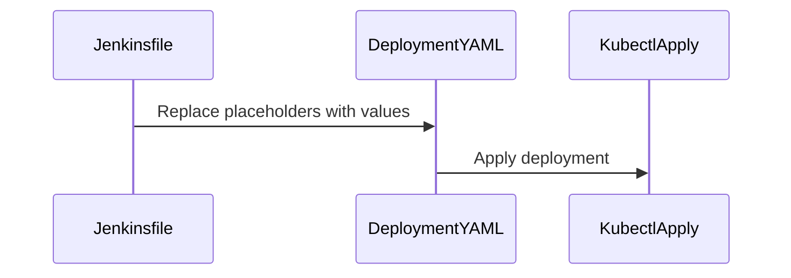

## Setting Environmental Variables in Jenkins

In the context of integrating Kubernetes deployments into a CI/CD pipeline, managing environmental variables is crucial. These variables often contain sensitive information such as API keys, database connection strings, or other configuration details that are necessary for your application to function correctly. In Jenkins, there are several ways to manage these environmental variables, including direct assignment within scripts, using the `environment` block, and setting them globally.

### Direct Assignment Within Scripts

One straightforward method to set environmental variables is through direct assignment within a Jenkinsfile script. This approach is useful for simple scenarios where you need to set a few variables and use them immediately.

```groovy
pipeline {
    agent any
    environment {
        IMAGE_NAME = 'my-java-maven-image'
        APP_NAME = 'JavaMavenApp'
    }
    stages {
        stage('Build') {
            steps {
                script {
                    env.IMAGE_NAME = 'my-java-maven-image'
                    env.APP_NAME = 'JavaMavenApp'
                    echo "Image Name: ${env.IMAGE_NAME}"
                    echo "App Name: ${env.APP_NAME}"
                }
            }
        }
    }
}
```

### Using the `environment` Block

The `environment` block in Jenkins allows you to define variables that can be used throughout the pipeline. This is particularly useful for defining variables that are used across multiple stages.

```groovy
pipeline {
    agent any
    environment {
        IMAGE_NAME = 'my-java-maven-image'
        APP_NAME = 'JavaMavenApp'
    }
    stages {
        stage('Build') {
            steps {
                echo "Image Name: ${IMAGE_NAME}"
                echo "App Name: ${APP_NAME}"
            }
        }
        stage('Deploy') {
            steps {
                sh 'kubectl apply -f deployment.yaml'
            }
        }
    }
}
```

### Global Usage

For variables that need to be accessible globally across the entire pipeline, you can define them at the top level of the Jenkinsfile.

```groovy
pipeline {
    agent any
    environment {
        IMAGE_NAME = 'my-java-maven-image'
        APP_NAME = 'JavaMMavenApp'
    }
    stages {
        stage('Build') {
            steps {
                echo "Image Name: ${IMAGE_NAME}"
                echo "App Name: ${APP_NAME}"
            }
        }
        stage('Deploy') {
            steps {
                sh 'kubectl apply -f deployment.yaml'
            }
        }
    }
}
```

### Substituting Values in YAML Files

Once you have defined your environmental variables in Jenkins, you need to ensure that these values are passed to your Kubernetes deployment YAML files. This is typically done using placeholders in the YAML file that are replaced with the actual values during the build process.

#### Example YAML File

Here is an example of a Kubernetes deployment YAML file with placeholders for environmental variables:

```yaml
apiVersion: apps/v1
kind: Deployment
metadata:
  name: ${APP_NAME}
spec:
  replicas: 3
  selector:
    matchLabels:
      app: ${APP_NAME}
  template:
    metadata:
      labels:
        app: ${APP_NAME}
    spec:
      containers:
      - name: ${APP_NAME}
        image: ${IMAGE_NAME}
        ports:
        - containerPort: 8080
```

#### Substitution Process

To substitute the values in the YAML file, you can use tools like `sed` or `yq` to replace the placeholders with the actual values from Jenkins.

```groovy
pipeline {
    agent any
    environment {
        IMAGE_NAME = 'my-java-maven-image'
        APP_NAME = 'JavaMavenApp'
    }
    stages {
        stage('Build') {
            steps {
                script {
                    def deploymentYaml = readFile('deployment.yaml')
                    deploymentYaml = deploymentYaml.replaceAll(/\${IMAGE_NAME}/, env.IMAGE_NAME)
                    deploymentYaml = deploymentYaml.replaceAll(/\${APP_NAME}/, env.APP_NAME)
                    writeFile(file: 'deployment.yaml', text: deploymentYaml)
                }
            }
        }
        stage('Deploy') {
            steps {
                sh 'kubectl apply -f deployment.yaml'
            }
        }
    }
}
```

### Mermaid Diagrams

Let's visualize the process using a mermaid diagram:



### Real-World Examples

#### Recent CVEs/Breaches

One notable breach involving misconfigured environmental variables was the **GitHub Actions Secret Exposure** (CVE-2021-22205). This vulnerability allowed attackers to access sensitive information stored in GitHub Actions secrets due to improper handling and exposure in logs.

#### Secure Coding Practices

To prevent such issues, it is essential to follow secure coding practices:

1. **Use Secret Management Tools**: Utilize tools like HashiCorp Vault or AWS Secrets Manager to securely store and manage secrets.
2. **Limit Exposure**: Ensure that sensitive information is not exposed in logs or other public repositories.
3. **Regular Audits**: Conduct regular audits of your CI/CD pipelines to identify and mitigate potential security risks.

### How to Prevent / Defend

#### Detection

To detect misconfigurations or unauthorized access to environmental variables, implement logging and monitoring:

```groovy
pipeline {
    agent any
    environment {
        IMAGE_NAME = 'my-java-maven-image'
        APP_NAME = 'JavaMavenApp'
    }
    stages {
        stage('Build') {
            steps {
                script {
                    def deploymentYaml = readFile('deployment.yaml')
                    deploymentYaml = deploymentYaml.replaceAll(/\${IMAGE_NAME}/, env.IMAGE_NAME)
                    deploymentYaml = deploymentYaml.replaceAll(/\${APP_NAME}/, env.APP_NAME)
                    writeFile(file: 'deployment.yaml', text: deploymentYaml)
                }
            }
        }
        stage('Deploy') {
            steps {
                sh 'kubectl apply -f deployment.yaml'
            }
        }
    }
    post {
        always {
            archiveArtifacts artifacts: '**/deployment.yaml', allowEmptyArchive: true
            logRotator(numToKeepStr: '10')
        }
    }
}
```

#### Prevention

Implement strict access controls and use secret management tools:

```groovy
pipeline {
    agent any
    environment {
        IMAGE_NAME = credentials('image-name-secret')
        APP_NAME = credentials('app-name-secret')
    }
    stages {
        stage('Build') {
            steps {
                script {
                    def deploymentYaml = readFile('deployment.yaml')
                    deploymentYaml = deploymentYaml.replaceAll(/\${IMAGE_NAME}/, env.IMAGE_NAME)
                    deploymentYaml = deploymentYaml.replaceAll(/\${APP_NAME}/, env.APP_NAME)
                    writeFile(file: 'deployment.yaml', text: deploymentYaml)
                }
            }
        }
        stage('Deploy') {
            steps {
                sh 'kubectl apply -f deployment.yaml'
            }
        }
    }
}
```

### Complete Example

Here is a complete example of a Jenkinsfile that integrates Kubernetes deployment into a CI/CD pipeline:

```groovy
pipeline {
    agent any
    environment {
        IMAGE_NAME = 'my-java-maven-image'
        APP_NAME = 'JavaMavenApp'
    }
    stages {
        stage('Build') {
            steps {
                script {
                    def deploymentYaml = readFile('deployment.yaml')
                    deploymentYaml = deploymentYaml.replaceAll(/\${IMAGE_NAME}/, env.IMAGE_NAME)
                    deploymentYaml = deploymentYaml.replaceAll(/\${APP_NAME}/, env.APP_NAME)
                    writeFile(file: 'deployment.yaml', text: deploymentYaml)
                }
            }
        }
        stage('Deploy') {
            steps {
                sh 'kubectl apply -f deployment.yaml'
            }
        }
    }
    post {
        always {
            archiveArtifacts artifacts: '**/deployment.yaml', allowEmptyArchive: true
            logRotator(numToKeepStr: '10')
        }
    }
}
```

### Conclusion

Managing environmental variables in Jenkins is a critical aspect of integrating Kubernetes deployments into a CI/CD pipeline. By following best practices and using secure coding techniques, you can ensure that your application remains robust and secure. Regular audits and monitoring are essential to detect and mitigate potential security risks.

### Practice Labs

For hands-on practice, consider the following labs:

- **PortSwigger Web Security Academy**: Offers comprehensive labs on web application security.
- **OWASP Juice Shop**: A deliberately insecure web application for practicing web security skills.
- **DVWA (Damn Vulnerable Web Application)**: A PHP/MySQL web application that is riddled with vulnerabilities.
- **WebGoat**: An interactive, gamified training application for learning about web application security.

These labs provide practical experience in securing applications and integrating them into CI/CD pipelines.

---
<!-- nav -->
[[05-Integrating Kubernetes Deployment into CICD Pipeline|Integrating Kubernetes Deployment into CICD Pipeline]] | [[DevOps/DevOps Bootcamp/09-Container Orchestration (Kubernetes)/21-Integrating Kubernetes Deployment Into CI CD Pipeline/00-Overview|Overview]] | [[DevOps/DevOps Bootcamp/09-Container Orchestration (Kubernetes)/21-Integrating Kubernetes Deployment Into CI CD Pipeline/07-Practice Questions & Answers|Practice Questions & Answers]]
