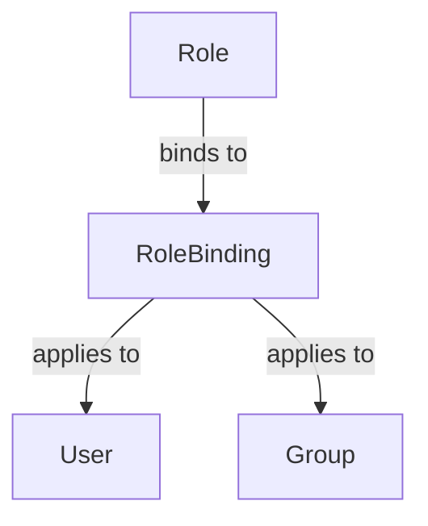
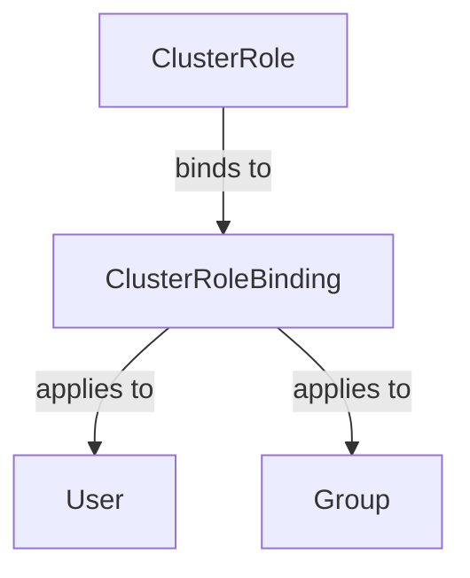

## Kubernetes Authentication, Authorization, and Role-Based Access Control (RBAC)

### Introduction to Kubernetes RBAC

Role-Based Access Control (RBAC) is a method of regulating access to computer or network resources based on the roles of individual users within an organization. In Kubernetes, RBAC is used to control access to the API server, which is the central component responsible for managing the state of the cluster. This ensures that only authorized users can perform actions such as creating, modifying, or deleting resources within the cluster.

### Roles in Kubernetes

A **role** in Kubernetes is a set of permissions that define what actions can be performed on specific resources within a namespace. A role is bound to a specific namespace and defines what resources in that namespace can be accessed and what operations can be performed on those resources.

#### What Are Resources?

In Kubernetes, resources are the fundamental entities that can be managed within a cluster. Common resources include:

- **Pods**: The smallest deployable units in Kubernetes.
- **Deployments**: A higher-level abstraction that manages the lifecycle of pods.
- **Services**: An abstraction that defines a logical set of pods and how to access them.
- **Secrets**: Encrypted data that can be used by pods.
- **ConfigMaps**: Configuration data that can be used by pods.

#### What Operations Can Be Performed?

Operations that can be performed on these resources include:

- **List**: Retrieve a list of resources.
- **Read**: Retrieve details of a specific resource.
- **Create**: Create a new resource.
- **Update**: Modify an existing resource.
- **Delete**: Remove a resource.

### Creating Roles

To create a role, you define a YAML file that specifies the permissions for the role. Here is an example of a role that allows users to list and read pods in a namespace:

```yaml
apiVersion: rbac.authorization.k8s.io/v1
kind: Role
metadata:
  namespace: my-namespace
  name: pod-reader
rules:
- apiGroups: [""]
  resources: ["pods"]
  verbs: ["get", "list"]
```

This role is named `pod-reader` and is bound to the `my-namespace` namespace. It allows users to perform `get` and `list` operations on pods.

### Role Bindings

While roles define the permissions, role bindings associate these roles with specific users or groups. A role binding links a role to a user or a group of users.

#### Creating Role Bindings

To create a role binding, you define a YAML file that specifies the role and the users or groups to which it applies. Here is an example of a role binding that associates the `pod-reader` role with a user named `alice`:

```yaml
apiVersion: rbac.authorization.k8s.io/v1
kind: RoleBinding
metadata:
  name: alice-pod-reader
  namespace: my-namespace
subjects:
- kind: User
  name: alice
  apiGroup: rbac.authorization.k8s.io
roleRef:
  kind: Role
  name: pod-reader
  apiGroup: rbac.authorization.k8s.io
```

This role binding associates the `pod-reader` role with the user `alice` in the `my-namespace` namespace.

### Group Role Bindings

If you have multiple users who need the same permissions, you can create a group and bind the role to the group. Here is an example of a role binding that associates the `pod-reader` role with a group named `dev-team`:

```yaml
apiVersion: rbac.authorization.k8s.io/v1
kind: RoleBinding
metadata:
  name: dev-team-pod-reader
  namespace: my-namespace
subjects:
- kind: Group
  name: dev-team
  apiGroup: rbac.authorization.k8s.io
roleRef:
  kind: Role
  name: pod-reader
  apiGroup: rbac.authorization.k8s.io
```

This role binding associates the `pod-reader` role with the group `dev-team` in the `my-namespace` namespace.

### Cluster Roles and Cluster Role Bindings

Cluster roles and cluster role bindings are similar to roles and role bindings, but they apply across the entire cluster rather than being limited to a specific namespace. Cluster roles are defined similarly to roles, but they are applied at the cluster level.

Here is an example of a cluster role that allows users to list and read pods across the entire cluster:

```yaml
apiVersion: rbac.authorization.k8s.io/v1
kind: ClusterRole
metadata:
  name: pod-reader-cluster
rules:
- apiGroups: [""]
  resources: ["pods"]
  verbs: ["get", "list"]
```

And here is an example of a cluster role binding that associates the `pod-reader-cluster` role with a user named `bob`:

```yaml
apiVersion: rbac.authorization.k8s.io/v1
kind: ClusterRoleBinding
metadata:
  name: bob-pod-reader-cluster
subjects:
- kind: User
  name: bob
  apiGroup: rbac.authorization.k8s.io
roleRef:
  kind: ClusterRole
  name: pod-reader-cluster
  apiGroup: rbac.authorization.k8s.io
```

### Administrators and Full Access

Kubernetes administrators are typically granted full access to the cluster. This is achieved by associating a cluster role that grants all permissions with the administrator account.

Here is an example of a cluster role that grants full access:

```yaml
apiVersion: rbac.authorization.k8s.io/v1
kind: ClusterRole
metadata:
  name: admin-full-access
rules:
- apiGroups: ["*"]
  resources: ["*"]
  verbs: ["*"]
```

And here is an example of a cluster role binding that associates the `admin-full-access` role with a user named `admin`:

```yaml
apiVersion: rbac.authorization.k8s.io/v1
kind: ClusterRoleBinding
metadata:
  name: admin-full-access-binding
subjects:
- kind: User
  name: admin
  apiGroup: rbac.authorization.k8s.io
roleRef:
  kind: ClusterRole
  name: admin-full-access
  apiGroup: rbac.authorization.k8s.io
```

### Mermaid Diagrams

#### Role Binding Diagram



#### Cluster Role Binding Diagram



### Real-World Examples

#### CVE-2021-25741

CVE-2021-25741 is a critical vulnerability in Kubernetes that allows an attacker to escalate privileges and gain full control of the cluster. This vulnerability was due to a flaw in the RBAC implementation that allowed an attacker to bypass RBAC restrictions.

To prevent such vulnerabilities, it is crucial to ensure that RBAC policies are correctly implemented and regularly audited. Here is an example of a secure RBAC policy:

```yaml
apiVersion: rbac.authorization.k8s.io/v1
kind: Role
metadata:
  namespace: my-namespace
  name: pod-reader
rules:
- apiGroups: [""]
  resources: ["pods"]
  verbs: ["get", "list"]
---
apiVersion: rbac.authorization.k8s.io/v1
kind: RoleBinding
metadata:
  name: alice-pod-reader
  namespace: my-namespace
subjects:
- kind: User
  name: alice
  apiGroup: rbac.authorization.k8s.io
roleRef:
  kind: Role
  name: pod-reader
  apiGroup: rbac.authorization.k8s.io
```

### How to Prevent / Defend

#### Detection

Regularly audit your RBAC policies to ensure that they are correctly implemented and that no unauthorized access is possible. Use tools such as `kubectl auth can-i` to check the permissions of users and groups.

#### Prevention

- **Least Privilege Principle**: Ensure that users and groups are granted only the minimum permissions necessary to perform their tasks.
- **Regular Audits**: Regularly review and update RBAC policies to ensure that they remain secure.
- **Secure Configurations**: Ensure that RBAC configurations are secure and follow best practices.

#### Secure Coding Fixes

Compare the vulnerable and secure versions of RBAC configurations:

**Vulnerable Version**

```yaml
apiVersion: rbac.authorization.k8s.io/v1
kind: Role
metadata:
  namespace: my-namespace
  name: pod-reader
rules:
- apiGroups: [""]
  resources: ["pods"]
  verbs: ["*"]
---
apiVersion: rbac.authorization.k8s.io/v1
kind: RoleBinding
metadata:
  name: alice-pod-reader
  namespace: my-namespace
subjects:
- kind: User
  name: alice
  apiGroup: rbac.authorization.k8s.io
roleRef:
  kind: Role
  name: pod-reader
  apiGroup: rbac.authorization.k8s.io
```

**Secure Version**

```yaml
apiVersion: rbac.authorization.k8s.io/v1
kind: Role
metadata:
  namespace: my-namespace
  name: pod-reader
rules:
- apiGroups: [""]
  resources: ["pods"]
  verbs: ["get", "list"]
---
apiVersion: rbac.authorization.k8s.io/v1
kind: RoleBinding
metadata:
  name: alice-pod-reader
  namespace: my-namespace
subjects:
- kind: User
  name: alice
  apiGroup: rbac.authorization.k8s.io
roleRef:
  kind: Role
  name: pod-reader
  apiGroup: rbac.authorization.k8s.io
```

### Hands-On Labs

For hands-on practice with Kubernetes RBAC, consider the following labs:

- **PortSwigger Web Security Academy**: Offers a series of labs that cover various aspects of Kubernetes security, including RBAC.
- **OWASP Juice Shop**: A deliberately insecure web application that includes challenges related to Kubernetes security.
- **Kubernetes Goat**: A security-focused Kubernetes environment designed to help you learn and practice Kubernetes security concepts.

These labs provide practical experience in implementing and securing RBAC policies in a Kubernetes environment.

### Conclusion

Understanding and implementing RBAC in Kubernetes is crucial for maintaining the security and integrity of your cluster. By carefully defining roles and role bindings, you can ensure that only authorized users have access to the resources they need, thereby reducing the risk of unauthorized access and potential security breaches. Regular audits and secure coding practices are essential to maintaining a secure Kubernetes environment.

---
<!-- nav -->
[[03-Kubernetes Authentication, Authorization, and RBAC|Kubernetes Authentication, Authorization, and RBAC]] | [[DevOps/DevOps Bootcamp/09-Container Orchestration (Kubernetes)/22-Kubernetes Authentication Authorization And RBAC/00-Overview|Overview]] | [[DevOps/DevOps Bootcamp/09-Container Orchestration (Kubernetes)/22-Kubernetes Authentication Authorization And RBAC/05-Practice Questions & Answers|Practice Questions & Answers]]
