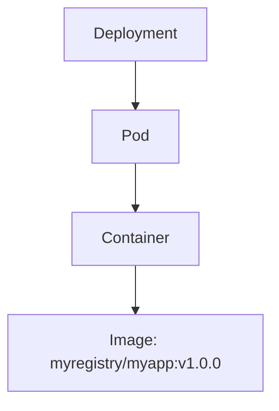

## Kubernetes Configuration Best Practices for Microservices

### Introduction to Kubernetes Configuration Best Practices

In the context of deploying microservices applications within a Kubernetes cluster, ensuring that the configuration files adhere to best practices is crucial. While the application may be running smoothly, adhering to best practices can significantly enhance the reliability, security, and maintainability of the system. This chapter delves into the best practices for Kubernetes configuration, focusing specifically on defining specific image versions for every container image used within pods.

### Importance of Defining Specific Image Versions

One of the most critical best practices in Kubernetes configuration is to explicitly define specific image versions for every container image used within pods. This practice ensures that the exact version of the container image is used consistently across deployments, thereby providing better control and visibility over the versions of applications running in the cluster.

#### Why Define Specific Image Versions?

When a container image is referenced without a specific version, Kubernetes defaults to pulling the `latest` tag. This behavior can lead to unpredictability and potential issues:

1. **Unpredictable Behavior**: If the `latest` tag is updated, restarting a pod could result in a different version of the container being pulled, leading to inconsistent behavior across deployments.
2. **Security Risks**: Using the `latest` tag increases the risk of inadvertently deploying a compromised or insecure version of the container image.
3. **Debugging Difficulties**: Without specific image versions, it becomes challenging to trace and debug issues related to specific versions of the application.

#### Real-World Example: Unpredictable Behavior Due to Latest Tag

Consider a scenario where a microservices application uses a container image without specifying a version. Over time, as new versions of the container image are pushed to the registry, restarting the pod could result in a different version being pulled. This inconsistency can lead to unexpected behavior and make it difficult to reproduce and resolve issues.

```yaml
apiVersion: apps/v1
kind: Deployment
metadata:
  name: my-app-deployment
spec:
  replicas: 3
  selector:
    matchLabels:
      app: my-app
  template:
    metadata:
      labels:
        app: my-app
    spec:
      containers:
      - name: my-app-container
        image: myregistry/myapp:latest
```

In the above configuration, the `myapp:latest` tag is used, which can lead to the issues mentioned earlier.

### How to Define Specific Image Versions

To avoid the issues associated with using the `latest` tag, it is essential to define specific image versions for every container image used within pods. This can be achieved by tagging the container images with specific version numbers and referencing those tags in the Kubernetes configuration files.

#### Step-by-Step Guide to Defining Specific Image Versions

1. **Tagging Container Images**: Ensure that container images are tagged with specific version numbers. For example, instead of using `latest`, use tags like `v1.0.0`, `v1.1.0`, etc.
   
   ```sh
   docker tag myregistry/myapp:latest myregistry/myapp:v1.0.0
   docker push myregistry/myapp:v1.0.0
   ```

2. **Updating Kubernetes Configuration Files**: Modify the Kubernetes configuration files to reference the specific image versions.

   ```yaml
   apiVersion: apps/v1
   kind: Deployment
   metadata:
     name: my-app-deployment
   spec:
     replicas: 3
     selector:
       matchLabels:
         app: my-app
     template:
       metadata:
         labels:
           app: my-app
       spec:
         containers:
         - name: my-app-container
           image: myregistry/myapp:v1.0.0
   ```

### Mermaid Diagram: Pod Configuration with Specific Image Version

A visual representation of the pod configuration with a specific image version can help understand the structure and relationships more clearly.



### Common Pitfalls and How to Avoid Them

#### Pitfall 1: Using the `latest` Tag

Using the `latest` tag can lead to unpredictable behavior and security risks. To avoid this, always use specific image versions.

#### Pitfall 2: Inconsistent Versioning Across Environments

Ensure that the same specific image version is used across all environments (development, testing, production) to maintain consistency and reproducibility.

### How to Prevent / Defend Against Issues

#### Detection

Regularly audit Kubernetes configuration files to ensure that specific image versions are used. Tools like `kubectl` can be used to inspect the current configuration.

```sh
kubectl get deployment my-app-deployment -o yaml
```

#### Prevention

1. **Automated Builds and Tags**: Use automated build pipelines to tag container images with specific version numbers.
2. **Configuration Validation**: Implement validation checks in the CI/CD pipeline to ensure that Kubernetes configuration files reference specific image versions.

#### Secure Code Fix

Compare the vulnerable configuration with the secure configuration to highlight the changes made.

**Vulnerable Configuration:**

```yaml
apiVersion: apps/v1
kind: Deployment
metadata:
  name: my-app-deployment
spec:
  replicas: 3
  selector:
    matchLabels:
      app: my-app
  template:
    metadata:
      labels:
        app: my-app
    spec:
      containers:
      - name: my-app-container
        image: myregistry/myapp:latest
```

**Secure Configuration:**

```yaml
apiVersion: apps/v1
kind: Deployment
metadata:
  name: my-app-deployment
spec:
  replicas: 3
  selector:
    matchLabels:
      app: my-app
  template:
    metadata:
      labels:
        app: my-app
    spec:
      containers:
      - name: my-app-container
        image: myregistry/myapp:v1.0.0
```

### Additional Best Practices

While defining specific image versions is crucial, there are other best practices to consider when configuring Kubernetes for microservices:

1. **Resource Limits and Requests**: Define resource limits and requests for CPU and memory to ensure that pods do not consume excessive resources.
2. **Health Checks**: Implement liveness and readiness probes to ensure that pods are healthy and ready to serve traffic.
3. **Persistent Storage**: Use persistent volumes and volume claims to ensure that data is stored reliably and can be accessed across pod restarts.
4. **Secret Management**: Use Kubernetes secrets to manage sensitive information securely.

### Hands-On Labs

To gain practical experience with Kubernetes configuration best practices, consider the following labs:

- **Kubernetes Goat**: A hands-on lab designed to teach Kubernetes security best practices.
- **OWASP WrongSecrets**: A project that focuses on securing secrets in Kubernetes environments.
- **kube-hunter**: A tool that helps identify misconfigurations and vulnerabilities in Kubernetes clusters.

By following these best practices and engaging in hands-on labs, you can ensure that your microservices applications are deployed securely and efficiently within a Kubernetes cluster.

---
<!-- nav -->
[[03-Environment Variables in Kubernetes Pods|Environment Variables in Kubernetes Pods]] | [[DevOps/DevOps Bootcamp/09-Container Orchestration (Kubernetes)/23-Kubernetes Configuration Best Practices For Microservices/00-Overview|Overview]] | [[05-Labels in Kubernetes|Labels in Kubernetes]]
