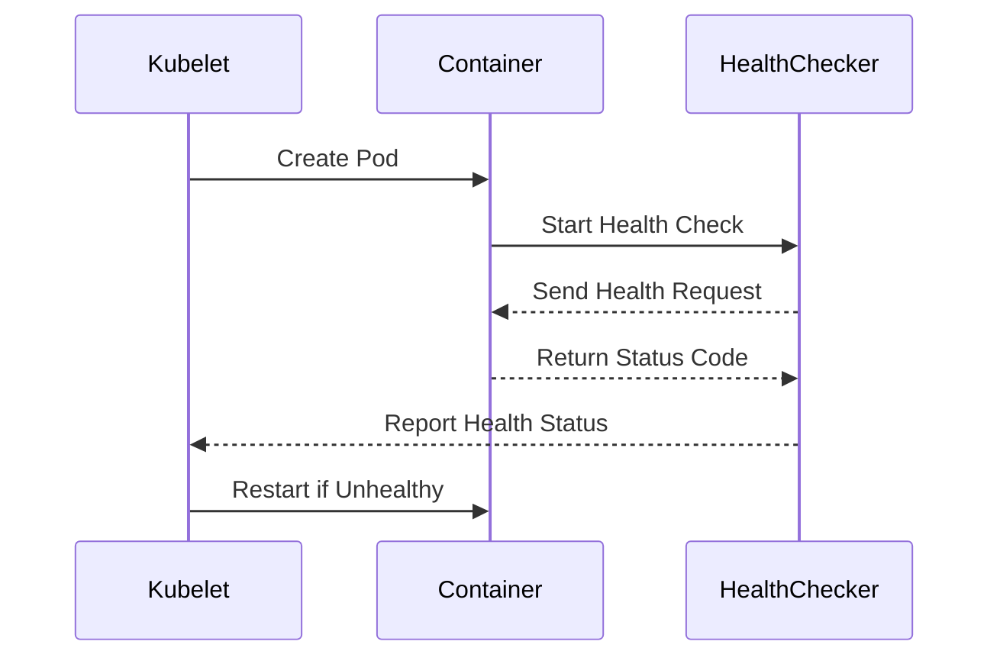

## Liveness Probes

### Background Theory

Kubernetes provides mechanisms to ensure the health and availability of your applications. One such mechanism is the liveness probe. A liveness probe checks whether a container is running and, if not, restarts it. This is particularly useful for applications that might crash or become unresponsive.

### Why Liveness Probes Matter

Liveness probes help ensure that your application remains available even if the container crashes or becomes unresponsive. Without liveness probes, Kubernetes might not detect that the application inside the container has failed, leading to downtime.

### How to Implement Liveness Probes

To implement a liveness probe, you need to define it in the `spec.template.spec.containers` section of your deployment YAML file. You can use various types of probes, such as HTTP GET, TCP socket, or an exec command.

#### Example Deployment YAML with Liveness Probe

```yaml
apiVersion: apps/v1
kind: Deployment
metadata:
  name: my-microservice
spec:
  replicas: 3
  selector:
    matchLabels:
      app: my-microservice
  template:
    metadata:
      labels:
        app: my-microservice
    spec:
      containers:
      - name: my-microservice-container
        image: myregistry/my-microservice:0.2.3
        ports:
        - containerPort: 8080
        livenessProbe:
          httpGet:
            path: /healthz
            port: 8080
          initialDelaySeconds: 5
          periodSeconds: 10
```

### Common Pitfalls

1. **Incorrect Path**: Ensure that the path specified in the liveness probe exists and returns a successful status code.
2. **Overly Aggressive Probing**: Avoid setting the probing interval too low, which can cause unnecessary restarts.

### Real-World Example

Consider a microservice that handles user authentication. If the service crashes due to a bug, Kubernetes might not detect the issue because the container itself is still running. By implementing a liveness probe, Kubernetes can detect the failure and restart the container, ensuring continuous availability.

### How to Prevent / Defend

1. **Proper Health Endpoint**: Ensure that the health endpoint (`/healthz` in the example) is correctly implemented and returns a 200 status code when the application is healthy.
2. **Monitoring**: Implement monitoring to detect and alert on failures in the liveness probe.

### Diagrams

#### Kubernetes Deployment with Liveness Probe



### Conclusion

By specifying and fixing the version of your Docker images and implementing liveness probes, you can ensure consistent and reliable deployments of your microservices. These practices help prevent unexpected behavior and ensure that your applications remain available even in the face of failures.

### Practice Labs

For hands-on experience with Kubernetes configuration best practices, consider the following labs:

- **Kubernetes Goat**: A hands-on lab that covers various aspects of Kubernetes security and best practices.
- **OWASP WrongSecrets**: A series of challenges that cover different aspects of securing microservices and Kubernetes configurations.

These labs provide practical experience and reinforce the concepts discussed in this chapter.

---
<!-- nav -->
[[05-Labels in Kubernetes|Labels in Kubernetes]] | [[DevOps/DevOps Bootcamp/09-Container Orchestration (Kubernetes)/23-Kubernetes Configuration Best Practices For Microservices/00-Overview|Overview]] | [[07-Namespaces in Kubernetes|Namespaces in Kubernetes]]
