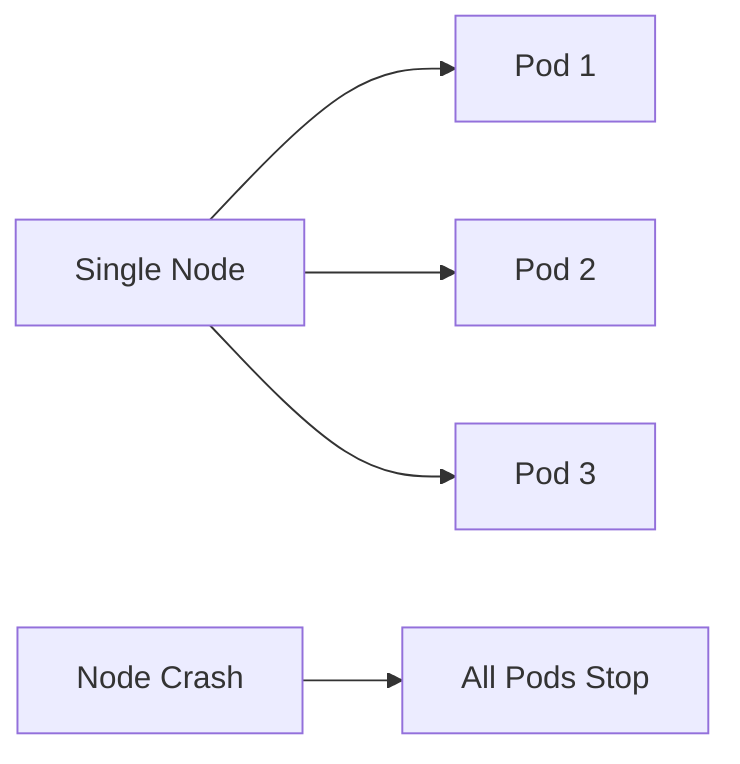

## Single Point of Failure in Kubernetes Clusters

### Understanding Single Points of Failure

In a Kubernetes environment, having a single server where all your pods are running creates a significant risk. This server becomes a **single point of failure** (SPOF). A SPOF is a component of a system that, if it fails, will stop the entire system from working. In the context of Kubernetes, if a single node fails, all the pods running on that node will also fail, leading to downtime and unavailability of your applications.

#### Why Is This Important?

The importance of avoiding SPOFs lies in ensuring high availability and reliability of your applications. High availability means that your applications are accessible and operational most of the time, even in the face of hardware failures or maintenance activities. Reliability ensures that your applications perform consistently and predictably.

### Replicating Nodes

To mitigate the risk of a single point of failure, it is essential to replicate your nodes. Ideally, you should have at least two or three worker nodes in your cluster, even if you are running a simple application. This replication ensures that if one node fails, the others can take over the workload, maintaining the availability of your applications.

#### Example Scenario

Consider a scenario where you have a single-node Kubernetes cluster running a microservice-based application. If this node crashes due to hardware failure or maintenance activities, all the pods running on this node will stop, making your application inaccessible. However, if you have multiple nodes, the pods can be rescheduled to another healthy node, ensuring continuous operation.



### Multiple Replicas Across Nodes

Another best practice is to run multiple replicas of your pods across different nodes. This ensures that even if one node fails, the other replicas can continue to serve requests. Running replicas on different nodes provides better fault tolerance and load distribution.

#### Example Configuration

Here is an example of a Kubernetes deployment configuration that runs multiple replicas of a pod across different nodes:

```yaml
apiVersion: apps/v1
kind: Deployment
metadata:
  name: my-app-deployment
spec:
  replicas: 3
  selector:
    matchLabels:
      app: my-app
  template:
    metadata:
      labels:
        app: my-app
    spec:
      containers:
      - name: my-app-container
        image: my-app-image:latest
        ports:
        - containerPort: 8080
```

#### Full HTTP Request and Response

When deploying this configuration, the following HTTP request is sent to the Kubernetes API server:

```http
POST /apis/apps/v1/namespaces/default/deployments HTTP/1.1
Host: kubernetes.default.svc.cluster.local
Content-Type: application/json
Authorization: Bearer <token>

{
  "apiVersion": "apps/v1",
  "kind": "Deployment",
  "metadata": {
    "name": "my-app-deployment"
  },
  "spec": {
    "replicas": 3,
    "selector": {
      "matchLabels": {
        "app": "my-app"
      }
    },
    "template": {
      "metadata": {
        "labels": {
          "app": "my-app"
        }
      },
      "spec": {
        "containers": [
          {
            "name": "my-app-container",
            "image": "my-app-image:latest",
            "ports": [
              {
                "containerPort": 8080
              }
            ]
          }
        ]
      }
    }
  }
}
```

And the response from the Kubernetes API server would look like this:

```http
HTTP/1.1 201 Created
Content-Type: application/json
Date: Mon, 01 Jan 2024 00:00:00 GMT
Content-Length: 1024

{
  "apiVersion": "apps/v1",
  "kind": "Deployment",
  "metadata": {
    "name": "my-app-deployment",
    "namespace": "default",
    "uid": "unique-id",
    "resourceVersion": "123456",
    "creationTimestamp": "2024-01-01T00:00:00Z"
  },
  "spec": {
    "replicas": 3,
    "selector": {
      "matchLabels": {
        "app": "my-app"
      }
    },
    "template": {
      "metadata": {
        "labels": {
          "app": "my-app"
        }
      },
      "spec": {
        "containers": [
          {
            "name": "my-app-container",
            "image": "my-app-image:latest",
            "ports": [
              {
                "containerPort": 8080
              }
            ]
          }
        ]
      }
    }
  }
}
```

### How to Prevent / Defend Against Single Points of Failure

#### Detection

To detect single points of failure, you can monitor the health of your nodes and pods using tools like Prometheus and Grafana. These tools can alert you if a node or pod goes down, allowing you to take corrective action.

#### Prevention

To prevent single points of failure, ensure that you have multiple nodes in your cluster and run multiple replicas of your pods across different nodes. This can be achieved by configuring your Kubernetes deployment to have multiple replicas and using a node selector or affinity rules to distribute the pods across different nodes.

#### Secure Coding Fixes

Here is an example of a vulnerable deployment configuration with a single replica:

```yaml
apiVersion: apps/v1
kind: Deployment
metadata:
  name: my-app-deployment
spec:
  replicas: 1
  selector:
    matchLabels:
      app: my-app
  template:
    metadata:
      labels:
        app: my-app
    spec:
      containers:
      - name: my-app-container
        image: my-app-image:latest
        ports:
        - containerPort: 8080
```

And here is the corrected secure version with multiple replicas:

```yaml
apiVersion: apps/v1
kind: Deployment
metadata:
  name: my-app-deployment
spec:
  replicas: 3
  selector:
    matchLabels:
      app: my-app
  template:
    metadata:
      labels:
        app: my-app
    spec:
      containers:
      - name: my-app-container
        image: my-app-image:latest
        ports:
        - containerPort:  8080
```

### Using Labels in Kubernetes Resources

### Understanding Labels

Labels are key-value pairs that are attached to Kubernetes components such as pods, services, and deployments. They provide a way to identify and organize your resources. Labels are used to select and manage groups of objects based on their labels.

#### Why Are Labels Important?

Labels are important because they allow you to categorize and filter your resources. For example, you can label your pods with `environment: production` and `team: frontend`, which allows you to easily find and manage all the pods belonging to the frontend team in the production environment.

### Example Label Usage

Here is an example of a Kubernetes deployment configuration with labels:

```yaml
apiVersion: apps/v1
kind: Deployment
metadata:
  name: my-app-deployment
spec:
  replicas: 3
  selector:
    matchLabels:
      app: my-app
  template:
    metadata:
      labels:
        app: my-app
        environment: production
        team: frontend
    spec:
      containers:
      - name: my-app-container
        image: my-app-image:latest
        ports:
        - containerPort: 8080
```

#### Full HTTP Request and Response

When deploying this configuration, the following HTTP request is sent to the Kubernetes API server:

```http
POST /apis/apps/v1/namespaces/default/deployments HTTP/1.1
Host: kubernetes.default.svc.cluster.local
Content-Type: application/json
Authorization: Bearer <token>

{
  "apiVersion": "apps/v1",
  "kind": "Deployment",
  "metadata": {
    "name": "my-app-deployment"
  },
  "spec": {
    "replicas": 3,
    "selector": {
      "matchLabels": {
        "app": "my-app"
      }
    },
    "template": {
      "metadata": {
        "labels": {
        "app": "my-app",
        "environment": "production",
        "team": "frontend"
      }
      },
      "spec": {
        "containers": [
          {
            "name": "my-app-container",
            "image": "my-app-image:latest",
            "ports": [
              {
                "containerPort": 8080
              }
            ]
          }
        ]
      }
    }
  }
}
```

And the response from the Kubernetes API server would look like this:

```http
HTTP/1.1 201 Created
Content-Type: application/json
Date: Mon, 01 Jan 2024 00:00:00 GMT
Content-Length: 1024

{
  "apiVersion": "apps/v1",
  "kind": "Deployment",
  "metadata": {
    "name": "my-app-deployment",
    "namespace": "default",
    "uid": "unique-id",
    "resourceVersion": "123456",
    "creationTimestamp": "2024-01-01T00:00:00Z"
  },
  "spec": {
    "replicas": 3,
    "selector": {
      "matchLabels": {
        "app": "my-app"
      }
    },
    "template": {
      "metadata": {
        "labels": {
          "app": "my-app",
          "environment": "production",
          "team": "frontend"
        }
      },
      "spec": {
        "containers": [
          {
            "name": "my-app-container",
            "image": "my-app-image:latest",
            "ports": [
              {
                "containerPort": 8080
              }
            ]
          }
        ]
      }
    }
  }
}
```

### How to Prevent / Defend Against Misuse of Labels

#### Detection

To detect misuse of labels, you can use tools like `kubectl` to list and inspect the labels of your resources. For example, you can use the following command to list all the pods with a specific label:

```sh
kubectl get pods -l app=my-app
```

#### Prevention

To prevent misuse of labels, ensure that you follow a consistent naming convention for your labels. For example, you can use a prefix like `company-name:` to avoid conflicts with other labels. Additionally, you can use label selectors to ensure that only the intended resources are selected.

#### Secure Coding Fixes

Here is an example of a vulnerable deployment configuration with inconsistent labels:

```yaml
apiVersion: apps/v1
kind: Deployment
metadata:
  name: my-app-deployment
spec:
  replicas: 3
  selector:
    matchLabels:
      app: my-app
  template:
    metadata:
      labels:
        app: my-app
        environment: production
        team: frontend
    spec:
      containers:
      - name: my-app-container
        image: my-app-image:latest
        ports:
        - containerPort: 8080
```

And here is the corrected secure version with consistent labels:

```yaml
apiVersion: apps/v1
kind: Deployment
metadata:
  name: my-app-deployment
spec:
  replicas: 3
  selector:
    matchLabels:
      company-name: my-app
  template:
    metadata:
      labels:
        company-name: my-app
        environment: production
        team: frontend
    spec:
      containers:
      - name: my-app-container
        image: my-app-image:latest
        ports:
        - containerPort: 8080
```

### Hands-On Labs

For hands-on practice with Kubernetes configuration best practices, consider the following labs:

- **Kubernetes Goat**: A hands-on lab for learning Kubernetes security best practices.
- **OWASP WrongSecrets**: A project that includes various challenges related to Kubernetes security and configuration.
- **kube-hunter**: A tool for hunting vulnerabilities in Kubernetes clusters, which can help you understand and mitigate common misconfigurations.

These labs provide practical experience in setting up and managing Kubernetes clusters with best practices in mind.

By following these best practices and using the provided examples and labs, you can ensure that your Kubernetes clusters are highly available, reliable, and secure.

---
<!-- nav -->
[[07-Namespaces in Kubernetes|Namespaces in Kubernetes]] | [[DevOps/DevOps Bootcamp/09-Container Orchestration (Kubernetes)/23-Kubernetes Configuration Best Practices For Microservices/00-Overview|Overview]] | [[09-Specifying and Fixating Image Versions|Specifying and Fixating Image Versions]]
