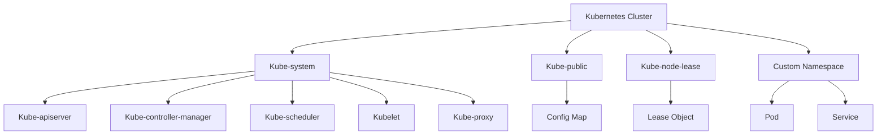

## Introduction to Kubernetes Namespaces

### What is a Namespace in Kubernetes?

A **namespace** in Kubernetes is a way to divide cluster resources between multiple users or projects. Essentially, a namespace is a virtual cluster within a physical cluster. This allows different teams or applications to operate independently within the same Kubernetes cluster, reducing conflicts and improving resource management.

### Why Use Namespaces?

Namespaces provide several benefits:

1. **Resource Isolation**: Different namespaces can have their own set of resources, such as pods, services, and deployments. This prevents one application from interfering with another.
2. **Scalability**: As your organization grows, you can use namespaces to manage different environments (development, testing, production) or different teams.
3. **Security**: By isolating resources, you can apply different security policies to different namespaces, enhancing overall security.

### How Namespaces Work Under the Hood

When you create a namespace, Kubernetes creates a new scope for objects like pods, services, and deployments. Each object in a namespace is uniquely identified by its name and namespace. This means that two objects with the same name can exist in different namespaces without conflict.

### Default Namespaces Provided by Kubernetes

When you create a Kubernetes cluster, several default namespaces are provided out of the box. Let's explore these namespaces in detail:

#### `kube-system` Namespace

The `kube-system` namespace is used for system processes and components that are essential for the operation of the Kubernetes cluster itself. These components include:

- **Kube-apiserver**: The API server that exposes the Kubernetes API.
- **Kube-controller-manager**: A process that runs controller processes.
- **Kube-scheduler**: A process that schedules pods onto nodes.
- **Kubelet**: An agent that runs on each node and ensures that containers are running in a pod.
- **Kube-proxy**: A network proxy that runs on each node and maintains network rules.

**Example Command to List Namespaces:**

```bash
kubectl get namespaces
```

**Output:**

```plaintext
NAME              STATUS   AGE
default           Active   1d
kube-system       Active   1d
kube-public       Active   1d
kube-node-lease   Active   1d
```

### `kube-public` Namespace

The `kube-public` namespace is intended to be readable by all users. It typically contains publicly accessible data, such as configuration maps that contain cluster information. This namespace is useful for providing information that does not require authentication.

**Example Command to Get Cluster Information:**

```bash
kubectl cluster-info
```

**Output:**

```plaintext
Kubernetes master is running at https://<master-ip>:6443
KubeDNS is running at https://<master-ip>:6443/api/v1/namespaces/kube-system/services/kube-dns:dns/proxy
```

### `kube-node-lease` Namespace

The `kube-node-lease` namespace is a recent addition to Kubernetes. It is used to track the health of nodes in the cluster. Each node has a lease object in this namespace, which is updated periodically to indicate that the node is alive.

### `kube-dashboard` Namespace

This namespace is specific to MiniKube installations and is used to deploy the Kubernetes dashboard. The dashboard provides a web-based interface for managing Kubernetes clusters.

### Creating and Managing Namespaces

To create a new namespace, you can use the following command:

```bash
kubectl create namespace <namespace-name>
```

For example, to create a namespace called `dev`, you would run:

```bash
kubectl create namespace dev
```

### Best Practices for Using Namespaces

1. **Isolate Environments**: Use separate namespaces for different environments (development, testing, production).
2. **Limit Access**: Apply role-based access control (RBAC) to limit who can access which namespaces.
3. **Monitor Resources**: Regularly monitor resource usage in each namespace to ensure optimal performance.
4. **Use Labels**: Use labels to tag resources in namespaces for easier management and querying.

### Real-World Examples and CVEs

#### Example: CVE-2021-25741

CVE-2021-25741 is a vulnerability in Kubernetes that allows an attacker to escalate privileges by manipulating the `kubelet` service. This vulnerability highlights the importance of securing namespaces and ensuring that only trusted entities have access to critical components.

**Secure Coding Fix:**

Vulnerable Code:

```yaml
apiVersion: v1
kind: Pod
metadata:
  name: vulnerable-pod
spec:
  containers:
  - name: vulnerable-container
    image: vulnerable-image
    securityContext:
      privileged: true
```

Fixed Code:

```yaml
apiVersion: v1
kind: Pod
metadata:
  name: secure-pod
spec:
  containers:
  - name: secure-container
    image: secure-image
    securityContext:
      privileged: false
```

### How to Prevent / Defend

1. **Role-Based Access Control (RBAC)**: Implement RBAC to restrict access to namespaces based on user roles.
2. **Network Policies**: Use network policies to control traffic between pods in different namespaces.
3. **Audit Logs**: Enable audit logs to track changes and access to namespaces.
4. **Regular Updates**: Keep Kubernetes and all components up to date to mitigate known vulnerabilities.

### Complete Example: Creating and Managing a Namespace

#### Step 1: Create a New Namespace

```bash
kubectl create namespace dev
```

#### Step 2: Deploy a Pod in the Namespace

```yaml
apiVersion: v1
kind: Pod
metadata:
  name: my-pod
  namespace: dev
spec:
  containers:
  - name: my-container
    image: nginx
```

Save this YAML to a file named `pod.yaml` and apply it using:

```bash
kubectl apply -f pod.yaml
```

#### Step 3: Verify the Pod Deployment

```bash
kubectl get pods --namespace=dev
```

**Output:**

```plaintext
NAME     READY   STATUS    RESTARTS   AGE
my-pod   1/1     Running   0          1m
```

### Mermaid Diagrams

#### Kubernetes Namespace Architecture



### Conclusion

Using namespaces effectively in Kubernetes is crucial for managing resources, isolating environments, and enhancing security. By following best practices and implementing robust security measures, you can ensure that your Kubernetes cluster remains secure and efficient.

### Practice Labs

For hands-on experience with Kubernetes namespaces, consider the following labs:

- **PortSwigger Web Security Academy**: Offers practical exercises on Kubernetes security.
- **OWASP Juice Shop**: Provides a vulnerable web application for learning about Kubernetes security.
- **Kubernetes Goat**: A security-focused Kubernetes environment for practicing attacks and defenses.

These labs will help you gain practical experience in managing and securing Kubernetes namespaces.

---
<!-- nav -->
[[DevOps/DevOps Bootcamp/09-Container Orchestration (Kubernetes)/26-Kubernetes Namespace Usage And Best Practices/00-Overview|Overview]] | [[02-Kubernetes Namespace Usage and Best Practices|Kubernetes Namespace Usage and Best Practices]]
