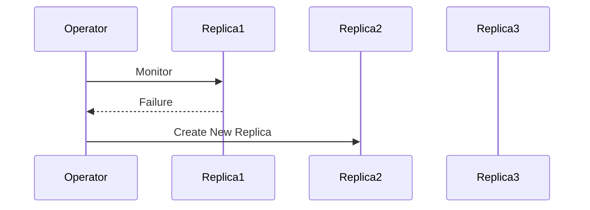

## Introduction to Kubernetes Operators

Kubernetes Operators are a powerful extension to the Kubernetes ecosystem designed to manage complex stateful applications. They automate operational tasks that would otherwise require manual intervention, making them essential for maintaining high availability and consistency across multiple environments. In this chapter, we will delve deep into the concepts, mechanisms, and practical applications of Kubernetes Operators, including their benefits, how they work, and how to implement them securely.

### What Are Kubernetes Operators?

Kubernetes Operators are software extensions that leverage the Kubernetes API to manage applications and their lifecycle. They are essentially custom controllers that watch for changes in the state of the application and take corrective actions as needed. This automation ensures that the application remains in the desired state, even in the face of failures or configuration changes.

#### Why Use Kubernetes Operators?

The primary advantage of using Kubernetes Operators is the automation of operational tasks. Instead of manually configuring and maintaining applications across multiple environments, operators provide a standardized, automated tool that can handle these tasks consistently. This is particularly beneficial for stateful applications, which often require careful management of data and state to ensure high availability and consistency.

### Control Loop Mechanism

At the core of Kubernetes Operators is the control loop mechanism, similar to the one used by Kubernetes itself. This mechanism continuously monitors the state of the application and takes action when necessary. Here’s a detailed breakdown of how this works:

1. **Watch for Changes**: The operator continuously watches for changes in the application state. This could be a failure of a replica, a change in configuration, or an update to the application image.
   
2. **Take Corrective Actions**: When a change is detected, the operator takes appropriate actions to bring the application back to the desired state. For example, if a replica dies, the operator creates a new one. If the application configuration changes, the operator applies the updated configuration.

#### Example: Managing Replica Failures

Consider a scenario where a stateful application consists of multiple replicas. If one of these replicas fails, the operator detects this change and automatically creates a new replica to replace the failed one. This ensures that the application remains highly available and consistent.



### Custom Resource Definitions (CRDs)

Custom Resource Definitions (CRDs) are a key component of Kubernetes Operators. CRDs allow you to define custom resources that extend the Kubernetes API. These custom resources can represent complex application states and configurations that are specific to your application.

#### What Are CRDs?

CRDs are Kubernetes objects that define new kinds of resources. By default, Kubernetes provides several built-in resources such as Deployments, StatefulSets, ConfigMaps, etc. However, you can create your own custom resources using CRDs. These custom resources can be managed by operators to automate the management of complex applications.

#### Example: Defining a CRD

Let’s define a simple CRD for a custom resource called `MyApp`. This CRD will define the structure of the custom resource and how it should be managed.

```yaml
apiVersion: apiextensions.k8s.io/v1
kind: CustomResourceDefinition
metadata:
  name: myapps.example.com
spec:
  group: example.com
  versions:
    - name: v1
      served: true
      storage: true
  scope: Namespaced
  names:
    plural: myapps
    singular: myapp
    kind: MyApp
    shortNames:
    - ma
```

This CRD defines a new resource type `MyApp` with a singular form `myapp` and a plural form `myapps`.

### Implementing an Operator

To implement an operator, you need to write a controller that watches for changes in the custom resources defined by CRDs and takes appropriate actions. Here’s a step-by-step guide to implementing an operator:

1. **Define the CRD**: Define the custom resource using a CRD as shown above.
   
2. **Write the Controller**: Write a controller that watches for changes in the custom resource and takes corrective actions. This controller can be written in any language supported by Kubernetes, such as Go, Python, or JavaScript.

#### Example: Writing a Controller in Go

Here’s an example of a simple controller written in Go that watches for changes in the `MyApp` custom resource and takes corrective actions.

```go
package main

import (
	"context"
	"fmt"
	"time"

	appsv1 "k8s.io/api/apps/v1"
	corev1 "k8s.io/api/core/v1"
	metav1 "k8s.io/apimachinery/pkg/apis/meta/v1"
	"k8s.io/client-go/kubernetes"
	"k8s.io/client-go/rest"
	"k8s.io/client-go/tools/cache"
	"k8s.io/client-go/util/workqueue"
)

type MyAppController struct {
	clientset *kubernetes.Clientset
	queue     workqueue.RateLimitingQueue
}

func NewMyAppController(clientset *kubernetes.Clientset) *MyAppController {
	controller := &MyAppController{
		clientset: clientset,
		queue:     workqueue.NewRateLimitingQueue(workqueue.DefaultControllerRateLimiter()),
	}
	return controller
}

func (c *MyAppController) Run(stopCh <-chan struct{}) {
	defer c.queue.ShutDown()
	fmt.Println("Starting MyAppController")

	go c.runWorker(stopCh)

	// Start watching for changes in MyApp resources
	watchList := cache.NewListWatchFromClient(c.clientset.CoreV1().RESTClient(), "myapps", metav1.NamespaceAll, metav1.ListOptions{})
	cache.NewReflector(watchList, &corev1.Pod{}, c.queue, 0).Run(stopCh)
}

func (c *MyAppController) runWorker(stopCh <-chan struct{}) {
	for {
		key, quit := c.queue.Get()
		if quit {
			break
		}
		defer c.queue.Done(key)

		err := c.handleObject(key.(string))
		if err == nil {
			c.queue.Forget(key)
		} else {
			c.queue.AddRateLimited(key)
		}
	}
}

func (c *MyAppController) handleObject(key string) error {
	namespace, name, err := cache.SplitMetaNamespaceKey(key)
	if err !=
```

### Pitfalls and Best Practices

While Kubernetes Operators offer significant benefits, there are several pitfalls to be aware of:

1. **Complexity**: Operators can introduce complexity into your system, especially if they are not well-designed. Ensure that your operators are modular and easy to understand.
   
2. **Security**: Operators have significant power within the Kubernetes cluster. Ensure that they are properly secured and that they do not introduce vulnerabilities.

#### How to Prevent / Defend

To prevent and defend against potential issues with Kubernetes Operators, follow these best practices:

1. **Secure Configuration**: Ensure that your operators are configured securely. Use RBAC (Role-Based Access Control) to limit the permissions of your operators.
   
2. **Regular Audits**: Regularly audit your operators to ensure that they are functioning as intended and that they are not introducing vulnerabilities.

#### Example: Secure Configuration with RBAC

Here’s an example of how to configure RBAC for a Kubernetes Operator to ensure that it has the minimum necessary permissions.

```yaml
apiVersion: rbac.authorization.k8s.io/v1
kind: ClusterRole
metadata:
  name: myapp-operator
rules:
- apiGroups: ["example.com"]
  resources: ["myapps"]
  verbs: ["get", "list", "watch", "create", "update", "patch", "delete"]
---
apiVersion: rbac.authorization.k8s.io/v1
kind: ClusterRoleBinding
metadata:
  name: myapp-operator-binding
subjects:
- kind: ServiceAccount
  name: myapp-operator
  namespace: default
roleRef:
  kind: ClusterRole
  name: myapp-operator
  apiGroup: rbac.authorization.k8s.io
```

This RBAC configuration ensures that the operator has the necessary permissions to manage `MyApp` resources without unnecessary access.

### Real-World Examples

#### Recent CVEs and Breaches

Recent CVEs and breaches involving Kubernetes Operators highlight the importance of proper configuration and security measures. For example, CVE-2021-25741 affected several Kubernetes operators, allowing attackers to gain unauthorized access to sensitive resources.

#### Example: CVE-2021-25741

CVE-2021-25741 was a critical vulnerability affecting several Kubernetes operators. The vulnerability allowed attackers to gain unauthorized access to sensitive resources by exploiting insecure configurations.

#### How to Detect and Mitigate

To detect and mitigate such vulnerabilities, regularly scan your Kubernetes cluster for known vulnerabilities using tools like Trivy or Kube-Hunter. Additionally, ensure that your operators are configured securely and that they are regularly audited.

### Hands-On Labs

For hands-on practice with Kubernetes Operators, consider the following labs:

- **PortSwigger Web Security Academy**: Offers a series of labs focused on web application security, including some that touch on Kubernetes and container security.
- **OWASP Juice Shop**: A deliberately insecure web application for security training, which can be deployed using Kubernetes and managed with operators.
- **Kubernetes Goat**: A hands-on lab specifically designed to teach Kubernetes security concepts, including the use of operators.

These labs provide practical experience in deploying and managing stateful applications with Kubernetes Operators, helping you to master the skills needed to effectively use operators in real-world scenarios.

### Conclusion

Kubernetes Operators are a powerful tool for managing complex stateful applications. By automating operational tasks and ensuring consistency across multiple environments, operators significantly enhance the reliability and scalability of your applications. Understanding the control loop mechanism, custom resource definitions, and best practices for implementation and security is crucial for effectively using operators in your Kubernetes environment. With the right knowledge and tools, you can leverage Kubernetes Operators to build robust, scalable, and secure applications.

---
<!-- nav -->
[[01-Introduction to Kubernetes Operators for Stateful Applications Management|Introduction to Kubernetes Operators for Stateful Applications Management]] | [[DevOps/DevOps Bootcamp/09-Container Orchestration (Kubernetes)/27-Kubernetes Operators for Stateful Applications Management/00-Overview|Overview]] | [[03-Kubernetes Operators for Stateful Applications Management|Kubernetes Operators for Stateful Applications Management]]
