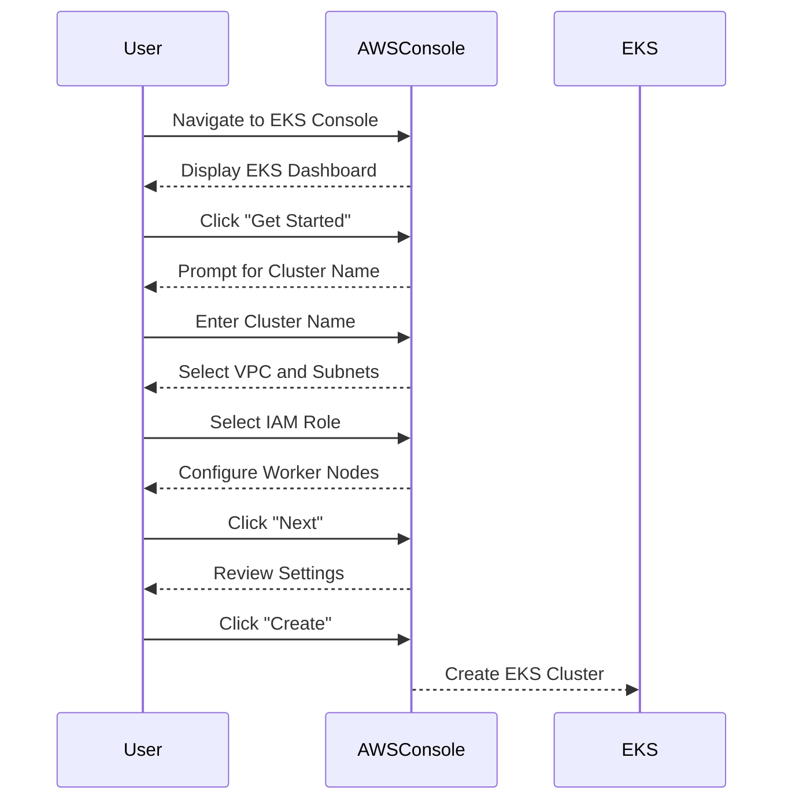

## Introduction to Kubernetes on AWS

Kubernetes, often abbreviated as K8s, is an open-source system for automating deployment, scaling, and management of containerized applications. It was originally designed by Google and is now maintained by the Cloud Native Computing Foundation. Kubernetes provides a platform for automating the deployment and management of containerized applications, making it easier to scale and maintain complex systems.

### Why Kubernetes?

Kubernetes offers several key benefits:

1. **Scalability**: Kubernetes can automatically scale your application based on resource usage and demand.
2. **Resilience**: It ensures that your application remains available even if some nodes fail.
3. **Resource Management**: Kubernetes efficiently manages resources across your infrastructure.
4. **Deployment and Rollout**: It simplifies the process of deploying and rolling out new versions of your application.

### Why AWS?

Amazon Web Services (AWS) is one of the most popular cloud platforms, offering a wide range of services and tools to support Kubernetes deployments. AWS provides managed Kubernetes services like EKS (Elastic Kubernetes Service) which simplifies the setup and management of Kubernetes clusters.

### Setting Up a Kubernetes Cluster on AWS

To set up a Kubernetes cluster on AWS, we will use Amazon EKS. Here’s a step-by-step guide to get started:

#### Prerequisites

Before setting up the cluster, ensure you have the following:

1. **AWS Account**: You need an active AWS account.
2. **IAM Role**: Create an IAM role with permissions to manage EKS.
3. **kubectl**: Install `kubectl`, the command-line tool for interacting with Kubernetes clusters.

#### Step-by-Step Setup

1. **Create an EKS Cluster**:
    - Navigate to the EKS console in the AWS Management Console.
    - Click on "Get Started" to create a new cluster.
    - Provide a name for your cluster and select the VPC and subnets.
    - Choose the IAM role you created earlier.
    - Configure the worker nodes and click "Next".
    - Review the settings and click "Create".



2. **Install kubectl**:
    - Download and install `kubectl` from the official Kubernetes website.
    - Configure `kubectl` to interact with your EKS cluster using the AWS CLI.

```bash
# Install kubectl
curl -LO "https://dl.k8s.io/release/$(curl -L -s https://dl.k8s.io/release/stable.txt)/bin/linux/amd64/kubectl"
chmod +x ./kubectl
sudo mv ./kubectl /usr/local/bin/kubectl

# Configure kubectl
aws eks --region <your-region> update-kubeconfig --name <your-cluster-name>
```

3. **Deploy Applications**:
    - Once the cluster is up and running, you can deploy applications using `kubectl`.
    - Define your application using Kubernetes manifests (YAML files).

```yaml
apiVersion: apps/v1
kind: Deployment
metadata:
  name: my-app
spec:
  replicas: 3
  selector:
    matchLabels:
      app: my-app
  template:
    metadata:
      labels:
        app: my-app
    spec:
      containers:
      - name: my-container
        image: my-image:latest
        ports:
        - containerPort: 80
```

```bash
kubectl apply -f my-app.yaml
```

### Real-World Examples and Recent CVEs

Recent vulnerabilities in Kubernetes and AWS include:

- **CVE-2021-25741**: A vulnerability in the Kubernetes API server allowed unauthorized access to sensitive information.
- **CVE-2022-24700**: An issue in the AWS EKS service allowed unauthorized access to cluster resources.

These vulnerabilities highlight the importance of keeping your Kubernetes and AWS components up-to-date and properly configured.

### How to Prevent / Defend

#### Detection

- **Monitoring**: Use tools like Prometheus and Grafana to monitor your Kubernetes cluster.
- **Logging**: Enable detailed logging for your Kubernetes components and analyze logs regularly.

```bash
# Example Prometheus configuration
scrape_configs:
  - job_name: 'kubernetes'
    kubernetes_sd_configs:
      - role: pod
```

#### Prevention

- **Regular Updates**: Keep your Kubernetes and AWS components updated to the latest versions.
- **RBAC**: Implement Role-Based Access Control (RBAC) to restrict access to sensitive resources.

```yaml
apiVersion: rbac.authorization.k8s.io/v1
kind: Role
metadata:
  namespace: default
  name: pod-reader
rules:
- apiGroups: [""]
  resources: ["pods"]
  verbs: ["get", "watch", "list"]
---
apiVersion: rbac.authorization.k8s.io/v1
kind: RoleBinding
metadata:
  name: read-pods
  namespace: default
subjects:
- kind: Group
  name: manager
roleRef:
  kind: Role
  name: pod-reader
  apiGroup: rbac.authorization.k8s.io
```

#### Secure Coding Fixes

- **Vulnerable Pattern**:
    ```yaml
    apiVersion: v1
    kind: Pod
    metadata:
      name: my-pod
    spec:
      containers:
      - name: my-container
        image: my-image:latest
        ports:
        - containerPort: 80
    ```

- **Secure Pattern**:
    ```yaml
    apiVersion: v1
    kind: Pod
    metadata:
      name: my-pod
    spec:
      containers:
      - name: my-container
        image: my-image:latest
        ports:
        - containerPort: 80
        securityContext:
          runAsNonRoot: true
          allowPrivilegeEscalation: false
    ```

### Conclusion

Setting up and managing a Kubernetes cluster on AWS requires careful planning and execution. By following best practices and staying informed about recent vulnerabilities, you can ensure a secure and efficient deployment. 

### Hands-On Labs

For practical experience, consider the following labs:

- **Kubernetes Goat**: A hands-on lab for learning Kubernetes security.
- **OWASP WrongSecrets**: A series of challenges to test your Kubernetes security skills.

By completing these labs, you can gain deeper insights into Kubernetes deployment and management on AWS.

---
<!-- nav -->
[[DevOps/DevOps Bootcamp/09-Container Orchestration (Kubernetes)/28-Kubernetes on AWS Deployment and Management/00-Overview|Overview]] | [[02-Overview of Kubernetes on AWS|Overview of Kubernetes on AWS]]
