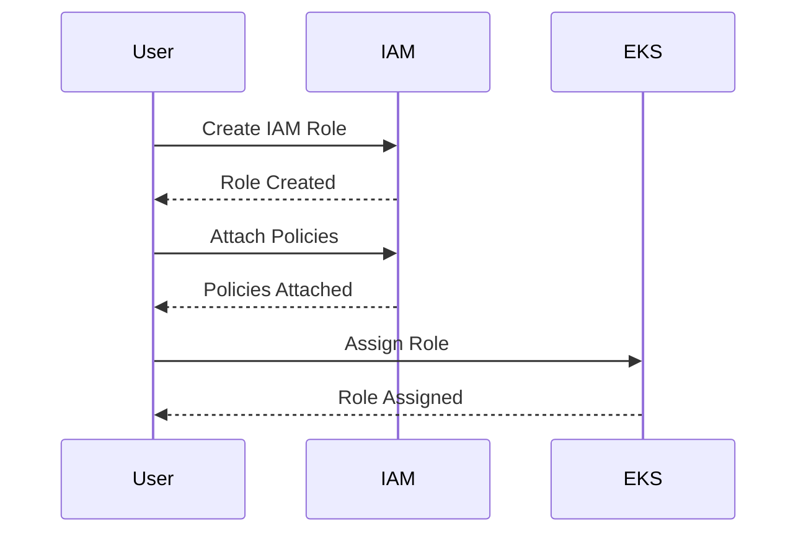
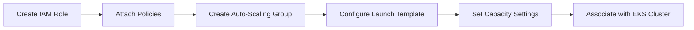
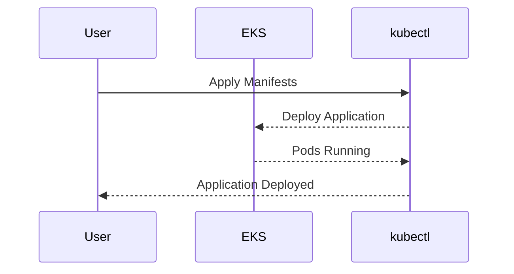

## Introduction to EKS Cluster Creation Using AWS Console

In this section, we will delve into the process of creating an Amazon Elastic Kubernetes Service (EKS) cluster using the AWS Management Console. This involves several key steps, including setting up IAM roles and policies, configuring auto-scaling, and deploying an example application. We will cover each step in detail, explaining the underlying concepts, their importance, and how they work under the hood.

### What is EKS?

Amazon Elastic Kubernetes Service (EKS) is a managed service that makes it easy to run Kubernetes on AWS without needing to install and operate your own Kubernetes control plane. EKS supports the Kubernetes API, so you can use existing tools and plugins to interact with your cluster.

### Why Use EKS?

Using EKS provides several benefits:

1. **Managed Control Plane**: AWS manages the Kubernetes control plane, which includes etcd, API server, controller manager, and scheduler. This reduces the operational burden of maintaining the control plane.
2. **High Availability**: EKS clusters are highly available and span multiple Availability Zones within an AWS region.
3. **Integration with AWS Services**: EKS integrates seamlessly with other AWS services like VPC, IAM, and CloudWatch.
4. **Security**: EKS leverages IAM roles and policies to control access to the cluster and its resources.

### Creating an IAM Role for EKS

The first step in creating an EKS cluster is to create an IAM role that will have specific permissions attached to it. This role will be used by AWS services to manage components in your AWS account on your behalf.

#### What is an IAM Role?

An IAM role is an IAM entity that defines a set of permissions. Roles are similar to users in that they are named entities that have specific permissions that determine what actions they can perform. However, roles are not associated with specific users; instead, they are assumed by entities such as AWS services, federated users, or AWS accounts.

#### Why Create an IAM Role?

Creating an IAM role is crucial because it allows AWS services to assume the role and perform actions on your behalf. This is particularly important for EKS, as the EKS control plane needs to manage various resources in your AWS account.

#### How to Create an IAM Role

To create an IAM role for EKS, follow these steps:

1. **Navigate to IAM Console**:
   - Open the AWS Management Console.
   - Navigate to the IAM dashboard.

2. **Create a New Role**:
   - Click on "Roles" in the left-hand menu.
   - Click on "Create role".
   - Select "AWS service" as the trusted entity type.
   - Choose "EKS" as the service that will use this role.

3. **Attach Policies**:
   - Attach the necessary policies to the role. For EKS, you typically need the `AmazonEKSClusterPolicy`, `AmazonEKSServicePolicy`, and `AmazonEKSVPCResourceController` policies.

4. **Name the Role**:
   - Provide a name for the role, such as `eksClusterRole`.

5. **Review and Create**:
   - Review the settings and click "Create role".



### Configuring Auto-Scaling for the EKS Cluster

Once the IAM role is created, the next step is to configure auto-scaling for the EKS cluster. Auto-scaling ensures that the number of worker nodes in the cluster is dynamically adjusted based on the resource requirements.

#### What is Auto-Scaling?

Auto-scaling is a feature that automatically adjusts the number of EC2 instances in a group based on the demand. In the context of EKS, auto-scaling ensures that the number of worker nodes is adjusted to meet the resource requirements of the pods and applications deployed in the cluster.

#### Why Configure Auto-Scaling?

Configuring auto-scaling is essential because it helps optimize resource utilization and cost. By automatically scaling the number of worker nodes, you ensure that the cluster can handle varying loads efficiently without manual intervention.

#### How to Configure Auto-Scaling

To configure auto-scaling for an EKS cluster, follow these steps:

1. **Create an Auto-Scaling Group**:
   - Navigate to the EC2 Dashboard.
   - Click on "Auto Scaling Groups".
   - Click on "Create Auto Scaling Group".
   - Select "Create a new launch template".
   - Configure the launch template with the desired instance type, AMI, and other settings.
   - Set the minimum, maximum, and desired capacity for the auto-scaling group.

2. **Associate the Auto-Scaling Group with the EKS Cluster**:
   - In the EKS console, navigate to the cluster details page.
   - Under "Compute", click on "Node groups".
   - Click on "Create node group".
   - Select the auto-scaling group you created.



### Deploying an Example Application

After setting up the IAM role and configuring auto-scaling, the final step is to deploy an example application to the EKS cluster.

#### What is an Example Application?

An example application is a simple application that demonstrates the functionality of the EKS cluster. This could be a basic web application, a microservice, or any other type of application that can be deployed using Kubernetes.

#### Why Deploy an Example Application?

Deploying an example application helps verify that the EKS cluster is set up correctly and that you can successfully deploy and manage applications using Kubernetes.

#### How to Deploy an Example Application

To deploy an example application, follow these steps:

1. **Prepare the Application**:
   - Ensure you have the application code and Kubernetes manifests ready.

2. **Deploy the Application**:
   - Use `kubectl` to apply the Kubernetes manifests to the cluster.

```bash
kubectl apply -f <path-to-manifests>
```

3. **Verify Deployment**:
   - Check the status of the deployment using `kubectl get pods`.
   - Access the application through the appropriate service endpoint.



### Common Pitfalls and How to Prevent Them

#### Pitfall 1: Incorrect IAM Role Permissions

**What Goes Wrong?**
If the IAM role does not have the correct permissions, the EKS control plane will not be able to manage the resources in your AWS account.

**How to Prevent?**
Ensure that the IAM role has the necessary policies attached. Use the `AmazonEKSClusterPolicy`, `AmazonEKSServicePolicy`, and `AmazonEKSVPCResourceController` policies.

#### Pitfall 2: Misconfigured Auto-Scaling

**What Goes Wrong?**
If the auto-scaling group is not configured correctly, the number of worker nodes may not scale appropriately, leading to performance issues or unnecessary costs.

**How to Prevent?**
Carefully configure the auto-scaling group with the correct minimum, maximum, and desired capacity settings. Monitor the cluster's resource usage and adjust the settings as needed.

#### Pitfall 3: Deployment Failures

**What Goes Wrong?**
If the Kubernetes manifests are incorrect or the application code is faulty, the deployment may fail.

**How to Prevent?**
Thoroughly test the application and Kubernetes manifests before deploying them to the cluster. Use `kubectl describe` and `kubectl logs` to troubleshoot any issues.

### Real-World Examples and Recent CVEs

#### Example: CVE-2021-20225

**Description:**
CVE-2021-20225 is a vulnerability in Kubernetes that allows an attacker to escalate privileges by manipulating the `seccomp` profile.

**Impact:**
This vulnerability could allow an attacker to gain elevated privileges within the Kubernetes cluster.

**Mitigation:**
Ensure that your Kubernetes cluster is up to date with the latest security patches. Use `kubectl` to check the version of your cluster and apply any available updates.

```bash
kubectl version
```

#### Example: CVE-2021-25741

**Description:**
CVE-2021-25741 is a vulnerability in Kubernetes that allows an attacker to bypass authentication and authorization checks.

**Impact:**
This vulnerability could allow an attacker to gain unauthorized access to the Kubernetes cluster.

**Mitigation:**
Enable and configure RBAC (Role-Based Access Control) in your Kubernetes cluster. Use `kubectl` to apply RBAC policies and ensure that only authorized users have access to the cluster.

```yaml
apiVersion: rbac.authorization.k8s.io/v1
kind: Role
metadata:
  namespace: default
  name: pod-reader
rules:
- apiGroups: [""]
  resources: ["pods"]
  verbs: ["get", "watch", "list"]
---
apiVersion: rbac.authorization.k8s.io/v1
kind: RoleBinding
metadata:
  name: read-pods
  namespace: default
subjects:
- kind: User
  name: jdoe
  apiGroup: rbac.authorization.k8s.io
roleRef:
  kind: Role
  name: pod-reader
  apiGroup: rbac.authorization.k8s.io
```

### Hands-On Labs

For hands-on practice, consider the following labs:

- **PortSwigger Web Security Academy**: Offers a series of labs focused on web application security.
- **OWASP Juice Shop**: A deliberately insecure web application for security training.
- **DVWA (Damn Vulnerable Web Application)**: A PHP/MySQL web application that is riddled with vulnerabilities.
- **WebGoat**: An interactive, gamified training application for learning about web application security.

These labs provide practical experience in setting up and managing EKS clusters, deploying applications, and securing the environment.

### Conclusion

Creating an EKS cluster using the AWS Management Console involves several key steps, including setting up IAM roles and policies, configuring auto-scaling, and deploying an example application. Understanding these concepts and their implementation is crucial for effectively managing and securing your Kubernetes cluster on AWS. By following the detailed steps and best practices outlined in this chapter, you can ensure a robust and secure EKS environment.

---
<!-- nav -->
[[01-Introduction to EKS Cluster Autoscaling|Introduction to EKS Cluster Autoscaling]] | [[DevOps/DevOps Bootcamp/09-Container Orchestration (Kubernetes)/29-Manual EKS Cluster Creation Using AWS Console/00-Overview|Overview]] | [[03-Introduction to EKS Cluster Networking Requirements|Introduction to EKS Cluster Networking Requirements]]
