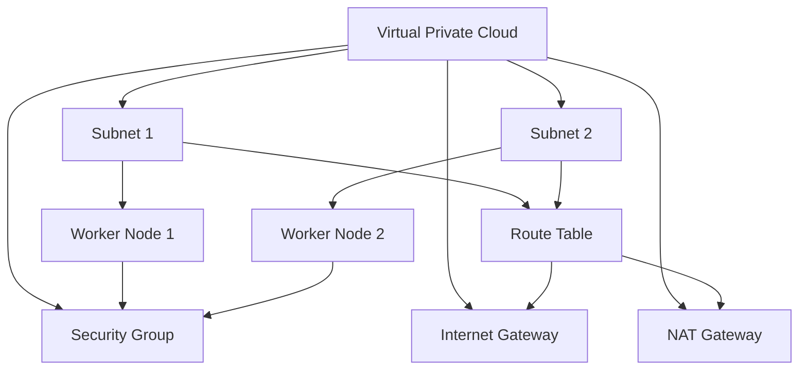

## Introduction to EKS Cluster Networking Requirements

When setting up an Amazon Elastic Kubernetes Service (EKS) cluster, one of the critical aspects to consider is the network configuration. This includes the Virtual Private Cloud (VPC) setup, which is essential for ensuring that the EKS cluster operates smoothly and securely. In this section, we will delve deep into the reasons why a specific VPC configuration is necessary for an EKS cluster, even when a default VPC is already available.

### What is a VPC?

A Virtual Private Cloud (VPC) is a virtual network dedicated to your AWS account. It is logically isolated from other virtual networks in the AWS Cloud. A VPC allows you to launch AWS resources into a virtual network that you define. This includes:

- **Subnets**: Subnets are segments of your VPC’s IP address range. They can be public (accessible from the internet) or private (not accessible from the internet).
- **Route Tables**: Route tables determine where network traffic is directed. Each subnet is associated with a route table.
- **Internet Gateways**: These allow communication between your VPC and the internet.
- **NAT Gateways**: Network Address Translation (NAT) gateways enable instances in a private subnet to connect to the internet while preventing the internet from initiating connections to them.

### Why a New VPC for EKS?

Even though AWS provides a default VPC, it may not be optimized for running an EKS cluster. Here are the key reasons why a new VPC is often required:

1. **Kubernetes Networking Rules**: Kubernetes has specific networking requirements to ensure smooth operation. These include:
   - **Pod CIDR**: Each pod in a Kubernetes cluster is assigned an IP address from a specific range (CIDR). This range must be unique and not overlap with other ranges used in the VPC.
   - **Service CIDR**: Services in Kubernetes also require their own IP range. This ensures that services can communicate effectively within the cluster.
   - **Node CIDR**: The nodes (worker nodes) in the cluster also need their own IP range.

2. **AWS Networking Rules**: AWS imposes additional networking constraints to ensure security and performance. These include:
   - **Security Groups**: These are virtual firewalls that control inbound and outbound traffic to your instances.
   - **Network ACLs**: Network Access Control Lists (ACLs) provide an additional layer of security by filtering traffic at the subnet level.

### Example Configuration

Let's look at an example configuration that might be required for an EKS cluster:

```yaml
# VPC Configuration
{
  "vpc": {
    "cidr_block": "10.0.0.0/16",
    "subnets": [
      {
        "subnet_id": "subnet-12345678",
        "availability_zone": "us-west-2a",
        "cidr_block": "10.0.1.0/24"
      },
      {
        "subnet_id": "subnet-87654321",
        "availability_zone": "us-west-2b",
        "cidr_block": "10.0.2.0/24"
      }
    ],
    "security_groups": [
      {
        "sg_id": "sg-12345678",
        "description": "Allow SSH access"
      }
    ]
  }
}
```

### Creating a VPC for EKS

To create a VPC specifically for an EKS cluster, follow these steps:

1. **Create a VPC**:
   - Go to the VPC Dashboard in the AWS Management Console.
   - Click on "Create VPC".
   - Specify the CIDR block (e.g., `10.0.0.0/16`).

2. **Create Subnets**:
   - Click on "Create subnet".
   - Specify the availability zone and the CIDR block for each subnet.

3. **Configure Route Tables**:
   - Ensure that each subnet is associated with a route table.
   - Add routes to the internet gateway or NAT gateway as needed.

4. **Set Up Security Groups**:
   - Create security groups for the worker nodes.
   - Define rules to allow necessary inbound and outbound traffic.

### Example Security Group Configuration

```json
{
  "GroupId": "sg-12345678",
  "GroupName": "eks-worker-sg",
  "IpPermissions": [
    {
      "IpProtocol": "tcp",
      "FromPort": 22,
      "ToPort": 22,
      "IpRanges": [
        {
          "CidrIp": "0.0.0.0/0"
        }
      ]
    },
    {
      "IpProtocol": "-1",
      "UserIdGroupPairs": [
        {
          "GroupId": "sg-12345678"
        }
      ]
    }
  ]
}
```

### Diagramming the VPC Configuration

Here is a mermaid diagram illustrating the VPC configuration for an EKS cluster:



### Common Pitfalls and How to Avoid Them

#### Overlapping CIDR Blocks

One common pitfall is overlapping CIDR blocks. This can cause routing issues and prevent proper communication between pods and services.

**How to Prevent:**
- Always check the CIDR blocks of existing VPCs and subnets before creating a new VPC.
- Use tools like the AWS VPC Flow Logs to monitor and detect any potential overlaps.

#### Incorrect Security Group Rules

Incorrect security group rules can lead to security vulnerabilities and operational issues.

**How to Prevent:**
- Use the principle of least privilege when defining security group rules.
- Regularly review and audit security group rules to ensure they align with your security policies.

### Real-World Examples

#### CVE-2021-20225: Kubernetes API Server Vulnerability

In 2021, a vulnerability (CVE-2021-20225) was discovered in the Kubernetes API server. This vulnerability allowed attackers to bypass authentication and gain unauthorized access to the cluster.

**Impact:**
- Attackers could potentially gain full control over the Kubernetes cluster, including the ability to deploy malicious containers and steal sensitive data.

**Mitigation:**
- Ensure that your EKS cluster is kept up-to-date with the latest security patches.
- Implement network policies to restrict access to the Kubernetes API server.

### Conclusion

Creating a VPC specifically for an EKS cluster is crucial for ensuring optimal performance and security. By following the guidelines and best practices outlined in this chapter, you can set up a robust and secure network environment for your EKS cluster.

### How to Prevent / Defend

#### Detection

- **Use AWS VPC Flow Logs**: Monitor network traffic within your VPC to detect any unusual activity.
- **Enable AWS CloudTrail**: Track API calls made to your AWS resources to identify any unauthorized access attempts.

#### Prevention

- **Regularly Update Your EKS Cluster**: Keep your EKS cluster and Kubernetes components up-to-date with the latest security patches.
- **Implement Network Policies**: Use Kubernetes network policies to restrict traffic between pods and services.

#### Secure Coding Fixes

**Vulnerable Code:**

```yaml
apiVersion: v1
kind: Pod
metadata:
  name: my-pod
spec:
  containers:
  - name: my-container
    image: my-image
```

**Secure Code:**

```yaml
apiVersion: v1
kind: Pod
metadata:
  name: my-pod
spec:
  containers:
  - name: my-container
    image: my-image
  securityContext:
    runAsUser: 1000
    runAsGroup: 3000
    fsGroup: 2000
```

### Practice Labs

For hands-on practice, consider using the following labs:

- **PortSwigger Web Security Academy**: Offers comprehensive training on web application security.
- **OWASP Juice Shop**: A deliberately insecure web application for security training.
- **DVWA (Damn Vulnerable Web Application)**: A PHP/MySQL web application that is riddled with vulnerabilities.
- **WebGoat**: An interactive, gamified training application for learning about web application security.

By following these detailed steps and best practices, you can ensure that your EKS cluster is set up securely and efficiently.

---
<!-- nav -->
[[02-Introduction to EKS Cluster Creation Using AWS Console|Introduction to EKS Cluster Creation Using AWS Console]] | [[DevOps/DevOps Bootcamp/09-Container Orchestration (Kubernetes)/29-Manual EKS Cluster Creation Using AWS Console/00-Overview|Overview]] | [[04-Introduction to EKS Cluster Role Creation|Introduction to EKS Cluster Role Creation]]
