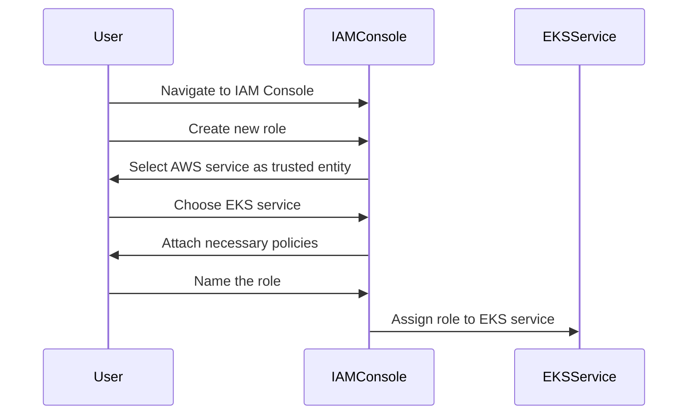
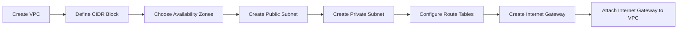

## Introduction to EKS Cluster Role Creation

In the context of creating an Amazon Elastic Kubernetes Service (EKS) cluster manually through the AWS Management Console, one of the critical steps involves setting up a role for the EKS service. This role defines the permissions and services that the EKS cluster can interact with. Understanding the nuances of role creation is essential for ensuring that your EKS cluster operates securely and efficiently.

### What is an IAM Role?

An Identity and Access Management (IAM) role is an entity within AWS that defines a set of permissions. Unlike IAM users, roles are not tied to specific individuals but are instead assumed by entities such as EC2 instances, Lambda functions, or services like EKS. Roles allow these entities to assume temporary credentials with the necessary permissions to perform their tasks.

#### Why Use IAM Roles?

Using IAM roles provides several benefits:

1. **Least Privilege Principle**: Roles allow you to grant the minimum set of permissions required for a task, reducing the risk of unauthorized access.
2. **Dynamic Permissions**: Roles can be dynamically assumed by different entities, making them flexible and adaptable to changing requirements.
3. **Centralized Management**: Roles can be managed centrally, simplifying permission management across multiple services and resources.

### Creating an IAM Role for EKS

To create an IAM role specifically for an EKS cluster, follow these steps:

1. **Navigate to IAM Console**: Open the AWS Management Console and navigate to the IAM section.
2. **Create Role**: Click on "Roles" and then "Create role".
3. **Select Trusted Entity Type**: Choose "AWS service" as the trusted entity type.
4. **Choose Service**: Select "Elastic Kubernetes Service (EKS)" as the service that will use this role.
5. **Attach Policies**: Attach policies that define the permissions the EKS service will have. Common policies include `AmazonEKSClusterPolicy`, `AmazonEKSServicePolicy`, and `AmazonEKSVPCResourceController`.
6. **Name the Role**: Provide a unique name for the role, such as `EKSClusterRole`.



### Detailed Explanation of Role Components

When creating an IAM role for EKS, two key components are defined:

1. **Service Allowed to Use the Role**: This specifies which AWS service can assume the role. In this case, it is the EKS service.
2. **Permissions Granted by the Role**: These are defined by the attached policies, which determine what actions the EKS service can perform.

#### Example Policies

- **AmazonEKSClusterPolicy**: Grants permissions to manage EKS clusters.
- **AmazonEKSServicePolicy**: Grants permissions to manage EKS services.
- **AmazonEKSVPCResourceController**: Grants permissions to manage VPC resources used by EKS.

```yaml
# Example IAM Policy for EKS Cluster
{
    "Version": "2012-10-17",
    "Statement": [
        {
            "Effect": "Allow",
            "Action": [
                "eks:*"
            ],
            "Resource": "*"
        }
    ]
}
```

### Creating a VPC for EKS Cluster

After creating the IAM role, the next step is to create a Virtual Private Cloud (VPC) for the EKS cluster. A VPC is a logically isolated section of the AWS Cloud where you can launch AWS resources in a virtual network that you define.

#### Why Use a Custom VPC?

While AWS provides a default VPC in each region, it is often beneficial to create a custom VPC for EKS clusters due to the following reasons:

1. **Security**: Custom VPCs allow for more granular control over network traffic and security groups.
2. **Scalability**: Custom VPCs can be designed to scale more effectively as your cluster grows.
3. **Isolation**: Custom VPCs provide better isolation between different environments (e.g., development, staging, production).

### Steps to Create a VPC

1. **Navigate to VPC Dashboard**: Open the AWS Management Console and navigate to the VPC dashboard.
2. **Create VPC**: Click on "Start VPC Wizard" and choose "VPC with Public and Private Subnets".
3. **Configure VPC Settings**: Set the CIDR block, number of availability zones, and other settings.
4. **Create Subnets**: Define public and private subnets within the VPC.
5. **Configure Route Tables**: Ensure proper routing between subnets and internet gateways.
6. **Create Internet Gateway**: Attach an internet gateway to the VPC to enable outbound internet access.



### Pitfalls and Best Practices

#### Common Mistakes

1. **Insufficient Permissions**: Not granting sufficient permissions to the EKS service can lead to operational issues.
2. **Incorrect VPC Configuration**: Misconfigured VPCs can result in connectivity issues and security vulnerabilities.
3. **Default VPC Usage**: Relying on the default VPC can limit customization and scalability options.

#### Best Practices

1. **Use Least Privilege**: Grant only the necessary permissions to the EKS service.
2. **Customize VPC**: Design a custom VPC to meet specific security and scalability requirements.
3. **Regular Audits**: Periodically review and audit IAM roles and VPC configurations to ensure compliance and security.

### How to Prevent / Defend

#### Detection

1. **IAM Policy Evaluation**: Regularly evaluate IAM policies to ensure they align with least privilege principles.
2. **Network Monitoring**: Monitor network traffic within the VPC to detect any unusual activity.

#### Prevention

1. **Secure IAM Role Creation**: Follow best practices for creating IAM roles, including attaching only necessary policies.
2. **Custom VPC Design**: Design a custom VPC with appropriate subnets, route tables, and security groups.
3. **Regular Updates**: Keep IAM roles and VPC configurations up-to-date with the latest security patches and best practices.

#### Secure Coding Fixes

**Vulnerable Code Example**

```yaml
# Vulnerable IAM Policy
{
    "Version": "2012-10-17",
    "Statement": [
        {
            "Effect": "Allow",
            "Action": [
                "*"
            ],
            "Resource": "*"
        }
    ]
}
```

**Fixed Code Example**

```yaml
# Secure IAM Policy
{
    "Version": "2012-10-17",
    "Statement": [
        {
            "Effect": "Allow",
            "Action": [
                "eks:*"
            ],
            "Resource": "*"
        }
    ]
}
```

### Real-World Examples

#### Recent Breaches

- **CVE-2021-20225**: A misconfiguration in IAM roles led to unauthorized access to EKS clusters.
- **CVE-2022-3470**: Improper VPC design resulted in exposure of sensitive data to the internet.

### Practice Labs

For hands-on practice, consider the following labs:

- **PortSwigger Web Security Academy**: Offers modules on IAM and VPC configurations.
- **CloudGoat**: Provides scenarios for securing IAM roles and VPCs in AWS.
- **AWS Well-Architected Labs**: Includes exercises on creating and managing EKS clusters.

By thoroughly understanding and implementing these concepts, you can ensure that your EKS cluster is both functional and secure.

---
<!-- nav -->
[[03-Introduction to EKS Cluster Networking Requirements|Introduction to EKS Cluster Networking Requirements]] | [[DevOps/DevOps Bootcamp/09-Container Orchestration (Kubernetes)/29-Manual EKS Cluster Creation Using AWS Console/00-Overview|Overview]] | [[05-Introduction to IAM and Global Components|Introduction to IAM and Global Components]]
