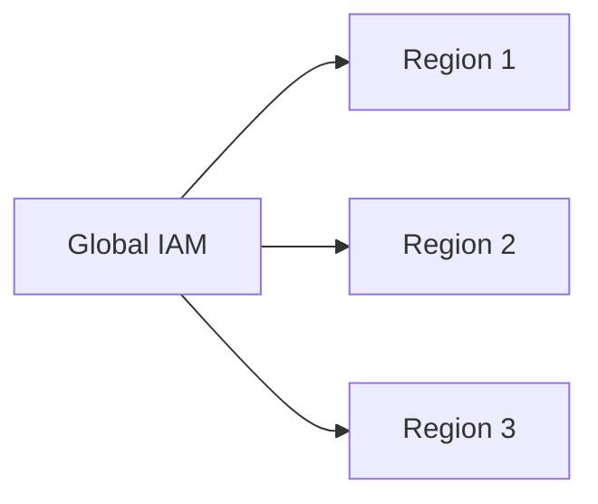

## Introduction to IAM and Global Components

### What is IAM?

IAM stands for Identity and Access Management. It is a web service that helps you securely control access to AWS resources for your users. You can use IAM to control who is authenticated (signed in) and authorized (has permissions) to use resources. IAM allows you to manage access to AWS services and resources securely.

### Why is IAM Important?

IAM is crucial because it enables you to define and enforce policies that specify who can access your AWS resources and under what conditions. This ensures that only authorized individuals can perform actions within your AWS environment, thereby enhancing security and compliance.

### How Does IAM Work?

IAM works by creating and managing identities such as users, groups, and roles. These identities are then associated with policies that define their permissions. Policies are JSON documents that specify which actions can be performed on which resources.

### Global Nature of IAM

One important aspect of IAM is that it is global across all regions in an AWS account. This means that IAM roles, users, and groups are available across all regions once they are created. This global nature simplifies management and ensures consistency across different regions.

### Example: Global IAM Usage

Consider a scenario where you have multiple regions (e.g., `us-east-1`, `eu-west-1`). If you create an IAM role in one region, it will be accessible in all other regions. This is particularly useful when you need to manage access across multiple regions without duplicating roles.



### Pitfalls of Global IAM

While the global nature of IAM simplifies management, it also introduces potential risks. For instance, if a malicious actor gains access to your IAM credentials, they could potentially access resources across all regions. Therefore, it is essential to implement strong security practices such as multi-factor authentication (MFA) and least privilege principles.

### How to Prevent / Defend Against IAM Risks

#### Detection

- **AWS CloudTrail**: Monitor API calls made to IAM using CloudTrail logs. This helps in detecting unauthorized changes.
- **IAM Access Advisor**: Use IAM Access Advisor to see which services were accessed by a user or role.

#### Prevention

- **Multi-Factor Authentication (MFA)**: Enable MFA for all IAM users to add an extra layer of security.
- **Least Privilege Principle**: Grant only the minimum permissions necessary for a user or role to perform their tasks.

#### Secure Coding Fix

**Vulnerable Code:**
```json
{
  "Version": "2012-10-17",
  "Statement": [
    {
      "Effect": "Allow",
      "Action": "*",
      "Resource": "*"
    }
  ]
}
```

**Fixed Code:**
```json
{
  "Version": "2012-10-17",
  "Statement": [
    {
      "Effect": "Allow",
      "Action": [
        "ec2:*",
        "elasticloadbalancing:*",
        "autoscaling:*"
      ],
      "Resource": "*"
    }
  ]
}
```

---
<!-- nav -->
[[04-Introduction to EKS Cluster Role Creation|Introduction to EKS Cluster Role Creation]] | [[DevOps/DevOps Bootcamp/09-Container Orchestration (Kubernetes)/29-Manual EKS Cluster Creation Using AWS Console/00-Overview|Overview]] | [[06-Introduction to Infrastructure as Code (IaC)|Introduction to Infrastructure as Code (IaC)]]
