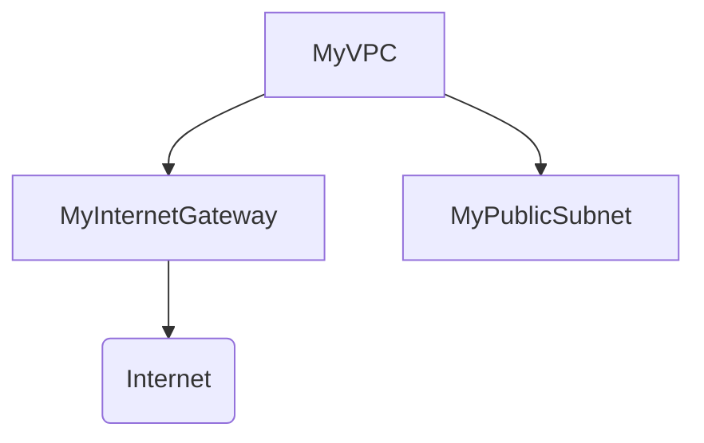

## Introduction to Infrastructure as Code (IaC)

Infrastructure as Code (IaC) is a practice where infrastructure is managed and provisioned through machine-readable definition files, rather than physical hardware configuration or interactive configuration tools. This approach allows developers and operations teams to manage and automate the provisioning of infrastructure resources in a consistent and repeatable manner. AWS CloudFormation is one of the most popular tools for implementing IaC on the AWS platform.

### What is CloudFormation?

CloudFormation is an AWS service that helps you model and set up your Amazon Web Services resources so that you can spend less time managing those resources and more time focusing on your applications that run in AWS. You create a template that describes all the AWS resources that you want (like Amazon EC2 instances or Amazon RDS DB instances), and CloudFormation takes care of provisioning and configuring those resources for you.

#### Why Use CloudFormation?

1. **Consistency**: CloudFormation ensures that your infrastructure is consistently deployed across different environments (development, testing, production).
2. **Automation**: Automates the deployment process, reducing manual errors and saving time.
3. **Version Control**: Allows you to keep your infrastructure definitions in version control systems like Git, making it easier to track changes and collaborate.
4. **Reproducibility**: Ensures that the same infrastructure can be recreated multiple times with the same configuration.
5. **Cost Management**: Helps in managing costs by allowing you to define and enforce resource limits and policies.

### How Does CloudFormation Work?

CloudFormation uses templates written in JSON or YAML format to describe the desired state of your infrastructure. These templates define the resources you want to create, their properties, and dependencies between them. When you create a stack using a CloudFormation template, AWS provisions the resources described in the template.

#### Example Template Structure

```yaml
Resources:
  MyVPC:
    Type: "AWS::EC2::VPC"
    Properties:
      CidrBlock: "10.0.0.0/16"
      EnableDnsSupport: true
      EnableDnsHostnames: true
      Tags:
        - Key: Name
          Value: MyVPC
```

This template defines a VPC with a specific CIDR block and enables DNS support and hostnames.

### Creating a Stack Using CloudFormation

To create a stack using CloudFormation, follow these steps:

1. **Create a Template**: Write a CloudFormation template that describes the resources you want to create.
2. **Upload the Template**: Upload the template to an S3 bucket or specify a URL where the template is hosted.
3. **Create a Stack**: Use the AWS Management Console, AWS CLI, or SDKs to create a stack based on the template.

#### Step-by-Step Example

1. **Write the Template**:
   ```yaml
   Resources:
     MyVPC:
       Type: "AWS::EC2::VPC"
       Properties:
         CidrBlock: "11.0.0.0/16"
         EnableDnsSupport: true
         EnableDnsHostnames: true
         Tags:
           - Key: Name
             Value: MyVPC
     MyInternetGateway:
       Type: "AWS::EC2::InternetGateway"
       Properties:
         Tags:
           - Key: Name
             Value: MyInternetGateway
     MyVPCGatewayAttachment:
       Type: "AWS::EC2::VPCGatewayAttachment"
       Properties:
         VpcId: !Ref MyVPC
         InternetGatewayId: !Ref MyInternetGateway
     MyPublicSubnet:
       Type: "AWS::EC2::Subnet"
       Properties:
         VpcId: !Ref MyVPC
         CidrBlock: "11.0.0.0/24"
         AvailabilityZone: "us-west-2a"
         MapPublicIpOnLaunch: true
         Tags:
           - Key: Name
             Value: MyPublicSubnet
   ```

2. **Upload the Template**:
   ```sh
   aws s3 cp my-template.yaml s3://my-bucket/templates/
   ```

3. **Create a Stack**:
   ```sh
   aws cloudformation create-stack \
     --stack-name my-stack \
     --template-url https://s3.amazonaws.com/my-bucket/templates/my-template.yaml \
     --capabilities CAPABILITY_IAM
   ```

### Understanding the Components

1. **VPC (Virtual Private Cloud)**: A logically isolated section of the AWS Cloud where you can launch AWS resources in a virtual network that you define.
2. **Internet Gateway**: A horizontally scaled, redundant, and highly available VPC component that allows communication between the instances in a VPC and the Internet.
3. **Subnet**: A range of IP addresses in your VPC. Subnets are either public (with access to the Internet) or private (without direct access to the Internet).

### Mermaid Diagram of VPC Components



### Common Pitfalls and Best Practices

1. **Security Groups**: Ensure that security groups are properly configured to allow only necessary traffic.
2. **IAM Roles**: Use IAM roles to grant permissions to EC2 instances within the VPC.
3. **CIDR Blocks**: Plan your CIDR blocks carefully to avoid overlapping subnets.
4. **Resource Dependencies**: Define dependencies correctly to ensure that resources are created in the correct order.

### How to Prevent / Defend

#### Secure Configuration

1. **Use Secure Templates**: Ensure that your CloudFormation templates are secure and do not expose sensitive information.
2. **Limit Permissions**: Use least privilege principles when granting permissions to IAM roles.
3. **Monitor Changes**: Use AWS CloudTrail to monitor changes made to your CloudFormation stacks.

#### Example of Vulnerable vs. Secure Configuration

**Vulnerable Configuration**:
```yaml
Resources:
  MyInstance:
    Type: "AWS::EC2::Instance"
    Properties:
      ImageId: "ami-0c55b159cbfafe1f0"
      InstanceType: "t2.micro"
      SecurityGroupIds:
        - "sg-0123456789abcdef0"
      KeyName: "my-key-pair"
```

**Secure Configuration**:
```yaml
Resources:
  MyInstance:
    Type: "AWS::EC2::Instance"
    Properties:
      ImageId: "ami-0c55b159cbfafe1f0"
      InstanceType: "t2.micro"
      SecurityGroupIds:
        - !Ref MySecurityGroup
      KeyName: "my-key-pair"
  MySecurityGroup:
    Type: "AWS::EC2::SecurityGroup"
    Properties:
      GroupDescription: "Allow SSH and HTTP"
      VpcId: !Ref MyVPC
      SecurityGroupIngress:
        - IpProtocol: tcp
          FromPort: 22
          ToPort: 22
          CidrIp: "0.0.0.0/0"
        - IpProtocol: tcp
          FromPort: 80
          ToPort: 80
          CidrIp: "0.0.0.0/0"
```

### Real-World Examples

#### Recent Breaches

One notable breach involving misconfigured VPCs was the Capital One data breach in 2019. The attacker exploited a misconfigured WAF rule that allowed unauthorized access to the company's AWS S3 buckets. This highlights the importance of proper configuration and monitoring of AWS resources.

### Hands-On Labs

For hands-on practice with CloudFormation and VPC creation, consider the following labs:

- **PortSwigger Web Security Academy**: Offers labs on securing AWS infrastructure.
- **OWASP Juice Shop**: Provides a web application with various security vulnerabilities, including misconfigured AWS resources.
- **DVWA (Damn Vulnerable Web Application)**: Useful for practicing web application security, including securing backend infrastructure.
- **WebGoat**: An interactive lab for learning about web application security.

By following these detailed steps and best practices, you can effectively use CloudFormation to manage and automate your AWS infrastructure, ensuring consistency, security, and efficiency.

---
<!-- nav -->
[[05-Introduction to IAM and Global Components|Introduction to IAM and Global Components]] | [[DevOps/DevOps Bootcamp/09-Container Orchestration (Kubernetes)/29-Manual EKS Cluster Creation Using AWS Console/00-Overview|Overview]] | [[07-Introduction to Kubernetes Clusters and Networking|Introduction to Kubernetes Clusters and Networking]]
