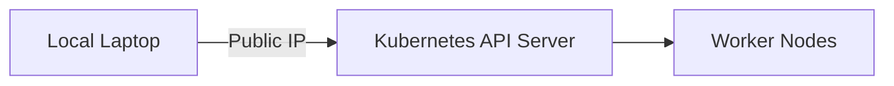
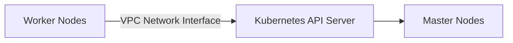

## Introduction to Kubernetes Clusters and Networking

In this section, we delve into the intricacies of creating and managing a Kubernetes cluster, specifically focusing on the networking aspects when setting up an Amazon Elastic Kubernetes Service (EKS) cluster manually via the AWS console. We'll explore the concepts of public and private endpoints, their implications, and how to configure them effectively. This knowledge is crucial for anyone looking to deploy scalable and secure applications on Kubernetes clusters hosted on AWS.

### What is Kubernetes?

Kubernetes is an open-source platform designed to automate deploying, scaling, and operating application containers. It was originally designed by Google and is now maintained by the Cloud Native Computing Foundation. Kubernetes provides a framework for automating deployment, scaling, and operations of application containers across clusters of hosts.

### What is Amazon EKS?

Amazon Elastic Kubernetes Service (EKS) is a managed service that makes it easy to run Kubernetes on AWS without needing to stand up or maintain your own Kubernetes control plane. EKS supports the Kubernetes API, so you can use any Kubernetes-compliant tool with EKS.

### Public vs. Private Endpoints

When setting up an EKS cluster, one of the critical decisions is whether to enable a public or private endpoint for the cluster. These endpoints determine how the Kubernetes API server can be accessed and how the worker nodes communicate with the master nodes.

#### Public Endpoint

A public endpoint allows external access to the Kubernetes API server. This means you can interact with the cluster from outside the VPC, such as from your local laptop using `kubectl` or accessing the Kubernetes dashboard from a browser.

**Why Use a Public Endpoint?**

- **Convenience**: You can manage the cluster from anywhere, provided you have internet access.
- **Flexibility**: Useful for development and testing environments where remote access is necessary.

**How Does It Work?**

When a public endpoint is enabled, the Kubernetes API server is accessible via a public IP address. This allows tools like `kubectl` to connect to the cluster from outside the VPC.



#### Private Endpoint

A private endpoint restricts access to the Kubernetes API server to within the VPC. This means that only resources within the VPC can communicate with the master nodes.

**Why Use a Private Endpoint?**

- **Security**: Reduces the attack surface by limiting access to the cluster from within the VPC.
- **Optimization**: Ensures that communication between the worker nodes and the master nodes is optimized by staying within the VPC.

**How Does It Work?**

When a private endpoint is enabled, a network interface is created within the VPC. This network interface allows the worker nodes to communicate with the master nodes directly through the VPC.



### Configuring Public and Private Endpoints in EKS

To configure public and private endpoints in EKS, you need to set up the cluster appropriately during creation. Let's walk through the steps to create an EKS cluster with both public and private endpoints.

#### Step-by-Step Configuration

1. **Create an EKS Cluster with Public Endpoint**
   
   - Log in to the AWS Management Console.
   - Navigate to the EKS service.
   - Click on "Clusters" and then "Create".
   - Choose "Manual Setup" and select "Public Access".
   - Configure the VPC settings as needed.
   - Complete the setup process.

2. **Enable Private Endpoint**

   - After creating the cluster, navigate to the "Networking" tab.
   - Click on "Edit" to modify the network settings.
   - Enable the private endpoint by selecting the appropriate VPC and subnet configurations.
   - Save the changes.

#### Example Configuration

Here’s an example of how you might configure an EKS cluster with both public and private endpoints using the AWS CLI:

```bash
# Create the EKS cluster with public endpoint
aws eks create-cluster --name my-cluster --role-arn arn:aws:iam::123456789012:role/eksClusterRole --resources-vpc-config subnetIds=subnet-12345678,subnet-23456789,subnet-34567890 --public-access

# Enable private endpoint
aws eks update-cluster-config --name my-cluster --resources-vpc-config subnetIds=subnet-12345678,subnet-23456789,subnet-34567890 --private-access
```

### Real-World Examples and Security Implications

#### Recent Breaches and CVEs

One notable breach involving Kubernetes clusters is the **CVE-2021-25741**, which affected the Kubernetes API server. This vulnerability allowed attackers to bypass authentication mechanisms and gain unauthorized access to the cluster. Such vulnerabilities highlight the importance of securing both public and private endpoints.

#### Security Best Practices

- **Network Segmentation**: Use network segmentation to isolate different parts of your infrastructure.
- **Least Privilege Principle**: Ensure that users and services have the minimum permissions necessary to perform their tasks.
- **Regular Audits**: Conduct regular security audits to identify and mitigate potential vulnerabilities.

### How to Prevent / Defend

#### Detection

- **Logging and Monitoring**: Implement comprehensive logging and monitoring solutions to detect unusual activity.
- **Security Tools**: Use tools like AWS CloudTrail, AWS Config, and Kubernetes-native security tools like Falco.

#### Prevention

- **Secure Configuration**: Follow best practices for configuring public and private endpoints.
- **IAM Policies**: Use strict IAM policies to limit access to the Kubernetes API server.
- **Encryption**: Ensure that all data in transit and at rest is encrypted.

#### Secure Coding Fixes

Here’s an example of how to configure a secure IAM policy for accessing the Kubernetes API server:

**Vulnerable Policy:**

```json
{
    "Version": "2012-10-17",
    "Statement": [
        {
            "Effect": "Allow",
            "Action": "eks:*",
            "Resource": "*"
        }
    ]
}
```

**Secure Policy:**

```json
{
    "Version": "2012-10-17",
    "Statement": [
        {
            "Effect": "Allow",
            "Action": [
                "eks:DescribeCluster",
                "eks:ListClusters"
            ],
            "Resource": "arn:aws:eks:us-west-2:123456789012:cluster/my-cluster"
        }
    ]
}
```

### Conclusion

Understanding the nuances of public and private endpoints in EKS is crucial for deploying secure and efficient Kubernetes clusters. By following best practices and implementing robust security measures, you can ensure that your cluster remains resilient against potential threats.

### Practice Labs

For hands-on experience with EKS cluster creation and management, consider the following labs:

- **PortSwigger Web Security Academy**: Offers practical exercises on securing Kubernetes clusters.
- **OWASP Juice Shop**: Provides a vulnerable web application that can be deployed on Kubernetes for security testing.
- **CloudGoat**: A series of labs designed to help you understand and secure AWS services, including EKS.

By combining theoretical knowledge with practical experience, you can become proficient in managing Kubernetes clusters on AWS.

---
<!-- nav -->
[[06-Introduction to Infrastructure as Code (IaC)|Introduction to Infrastructure as Code (IaC)]] | [[DevOps/DevOps Bootcamp/09-Container Orchestration (Kubernetes)/29-Manual EKS Cluster Creation Using AWS Console/00-Overview|Overview]] | [[08-Introduction to VPCs and Subnets|Introduction to VPCs and Subnets]]
