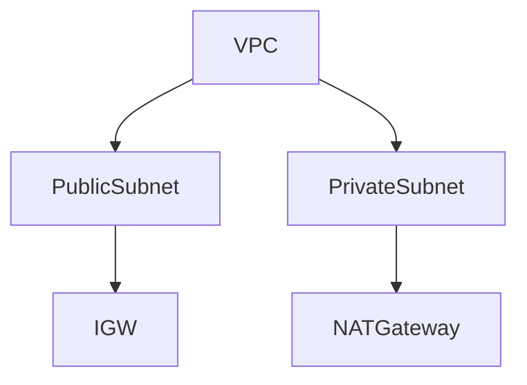

## Introduction to VPCs and Subnets

In the context of Amazon Web Services (AWS), a Virtual Private Cloud (VPC) is a logically isolated section of the AWS cloud where you can launch resources in a virtual network that you define. A VPC allows you to have complete control over the IP address range, subnets, routing tables, and network gateways. This setup provides a secure environment for your applications and services.

### What is a VPC?

A VPC is essentially a virtual network dedicated to your AWS account. You can think of it as a private cloud within the larger AWS infrastructure. By default, a VPC spans all the Availability Zones (AZs) in the region, but you can limit it to specific AZs if needed.

#### Key Components of a VPC

1. **Subnets**: These are segments of your VPC’s IP address range. Subnets can be either public or private.
    - **Public Subnets**: These have a route to an Internet Gateway (IGW), allowing instances in these subnets to communicate with the internet.
    - **Private Subnets**: These do not have a route to an IGW, making them more secure as they cannot directly communicate with the internet.

2. **Internet Gateway (IGW)**: This is a horizontally scaled, redundant, and highly available VPC component that allows communication between instances in a VPC and the internet.

3. **Route Tables**: These determine where network traffic from your subnet is directed. Route tables contain routes, which are rules that specify where network traffic should be directed based on the destination IP address.

4. **Network Access Control Lists (ACLs)**: These are stateless rules that allow or deny traffic to your subnets. They operate at the subnet level and can be used to filter traffic based on IP addresses and port numbers.

5. **Security Groups**: These are stateful rules that control inbound and outbound traffic to your instances. They operate at the instance level and can be used to filter traffic based on IP addresses and port numbers.

### Why Use VPCs?

Using VPCs provides several benefits:

- **Isolation**: You can isolate your resources from other AWS customers, enhancing security.
- **Control**: You have complete control over your network configuration, including IP addressing, routing, and security policies.
- **Scalability**: You can scale your network as needed, adding or removing subnets and resources as required.

### Example of a VPC Setup

Consider a simple VPC setup with one public subnet and one private subnet:

In this diagram:
- `VPC` represents the overall virtual network.
- `PublicSubnet` is connected to an `IGW`, allowing instances in this subnet to communicate with the internet.
- `PrivateSubnet` is not directly connected to the internet but can access the internet through a `NATGateway`.

---
<!-- nav -->
[[07-Introduction to Kubernetes Clusters and Networking|Introduction to Kubernetes Clusters and Networking]] | [[DevOps/DevOps Bootcamp/09-Container Orchestration (Kubernetes)/29-Manual EKS Cluster Creation Using AWS Console/00-Overview|Overview]] | [[09-Overview of EKS Cluster Creation Using AWS Console|Overview of EKS Cluster Creation Using AWS Console]]
