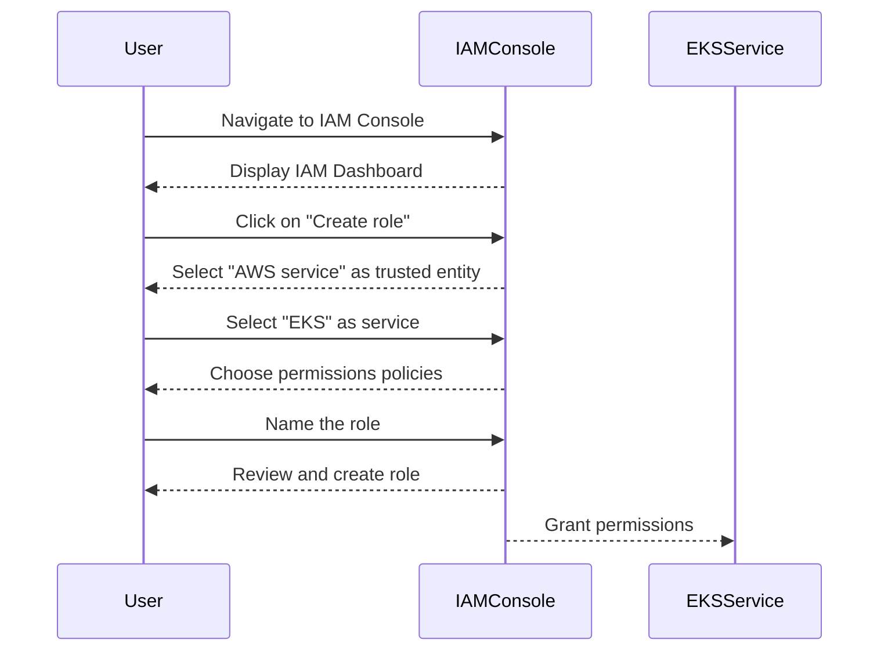
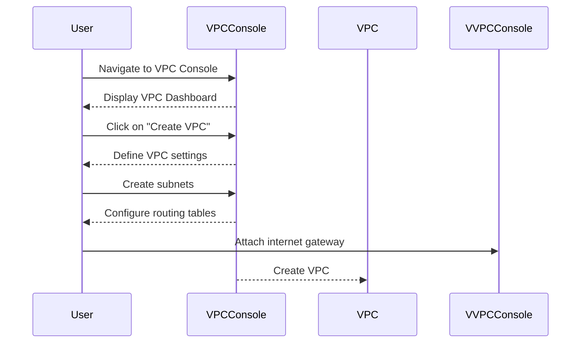
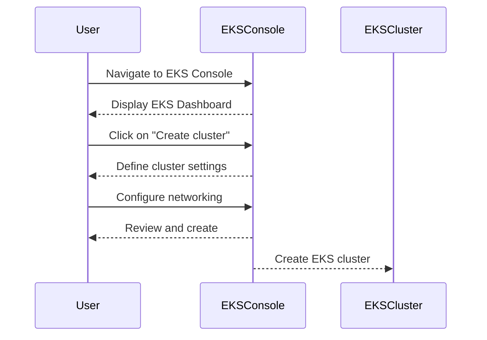
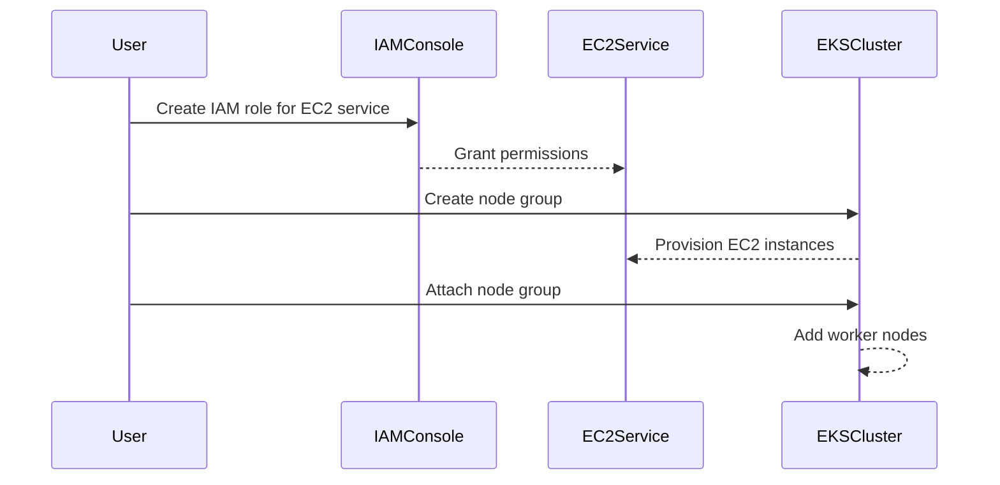

## Creating an EKS Cluster Manually Using AWS Management Console

In this section, we will delve into the process of creating an Amazon Elastic Kubernetes Service (EKS) cluster manually using the AWS Management Console. We will cover the necessary steps, including creating IAM roles, setting up a Virtual Private Cloud (VPC), creating the EKS cluster itself, and configuring worker nodes. Each step will be explained in detail, including the underlying concepts, potential pitfalls, and best practices for securing your setup.

### Step 1: Create an IAM Role for EKS Service

The first step in creating an EKS cluster is to create an Identity and Access Management (IAM) role for the EKS service. This role grants the EKS service specific permissions to perform actions within your AWS account.

#### What is an IAM Role?

An IAM role is an entity that defines a set of permissions that can be assumed by entities within your AWS account. In the context of EKS, the IAM role allows the EKS service to manage resources such as EC2 instances, VPCs, and other AWS services.

#### Why is an IAM Role Necessary?

Creating an IAM role for the EKS service is crucial because it ensures that the EKS service has the necessary permissions to create and manage resources in your AWS account. Without this role, the EKS service would not be able to perform its intended functions, leading to errors and failures in cluster creation and management.

#### How to Create an IAM Role for EKS Service

To create an IAM role for the EKS service, follow these steps:

1. **Navigate to the IAM Console**: Log in to the AWS Management Console and navigate to the IAM dashboard.
2. **Create a New Role**: Click on "Roles" in the left-hand menu, then click on "Create role".
3. **Select Trusted Entity Type**: Choose "AWS service" as the trusted entity type.
4. **Choose Service and Permissions**: Select "EKS" as the service that will use this role. Then, choose the permissions policy that grants the necessary permissions to the EKS service. Typically, you would select the "AmazonEKSClusterPolicy" and "AmazonEKSServicePolicy".
5. **Name the Role**: Provide a name for the role, such as "eks-cluster-role".
6. **Review and Create**: Review the settings and click "Create role".

Here is an example of the IAM role creation process:



#### Potential Pitfalls and Best Practices

- **Insufficient Permissions**: Ensure that the IAM role has the necessary permissions to perform all required actions. Insufficient permissions can lead to errors during cluster creation and management.
- **Least Privilege Principle**: Follow the least privilege principle by granting only the minimum necessary permissions to the IAM role. This helps minimize the attack surface and reduces the risk of unauthorized access.

### Step 2: Create a VPC for Worker Nodes

The next step is to create a Virtual Private Cloud (VPC) where the worker nodes will run. A VPC is a logically isolated virtual network within AWS, providing a secure environment for your resources.

#### What is a VPC?

A VPC is a private network that you define within an AWS region. It allows you to launch AWS resources into a virtual network that you control. You can customize the IP address range, create subnets, and configure routing tables and gateways.

#### Why is a VPC Necessary?

Creating a VPC for your worker nodes is essential because it provides a secure and isolated environment for your Kubernetes cluster. It allows you to control network traffic, enforce security policies, and ensure that your resources are protected from external threats.

#### How to Create a VPC

To create a VPC, follow these steps:

1. **Navigate to the VPC Console**: Log in to the AWS Management Console and navigate to the VPC dashboard.
2. **Create a New VPC**: Click on "Your VPCs" in the left-hand menu, then click on "Create VPC".
3. **Define VPC Settings**: Specify the VPC settings, including the CIDR block, availability zones, and DNS support.
4. **Create Subnets**: Define one or more subnets within the VPC. Subnets are segments of the VPC's IP address range that are used to host resources.
5. **Configure Routing Tables**: Set up routing tables to control how traffic flows between subnets and to/from the internet.
6. **Attach Internet Gateway**: Attach an internet gateway to the VPC to enable outbound internet access for resources within the VPC.

Here is an example of the VPC creation process:



#### Potential Pitfalls and Best Practices

- **Security Groups**: Use security groups to control inbound and outbound traffic to your VPC. Ensure that security groups are configured to allow only necessary traffic.
- **Network ACLs**: Use network access control lists (ACLs) to provide an additional layer of security by filtering traffic at the subnet level.
- **Private Subnets**: Consider using private subnets for your worker nodes to further isolate them from the public internet.

### Step 3: Create the EKS Cluster

With the IAM role and VPC in place, the next step is to create the actual EKS cluster. An EKS cluster consists of a set of master nodes that are managed by AWS, along with worker nodes that run your applications.

#### What is an EKS Cluster?

An EKS cluster is a managed Kubernetes cluster provided by AWS. It includes a set of master nodes that are managed by AWS, along with worker nodes that you can provision and manage. The master nodes handle the orchestration of the cluster, while the worker nodes run your applications.

#### Why is an EKS Cluster Necessary?

Creating an EKS cluster is necessary because it provides a managed Kubernetes environment that simplifies the deployment and management of containerized applications. AWS handles the management of the master nodes, allowing you to focus on deploying and managing your applications.

#### How to Create an EKS Cluster

To create an EKS cluster, follow these steps:

1. **Navigate to the EKS Console**: Log in to the AWS Management Console and navigate to the EKS dashboard.
2. **Create a New Cluster**: Click on "Clusters" in the left-hand menu, then click on "Create cluster".
3. **Define Cluster Settings**: Specify the cluster settings, including the cluster name, IAM role, VPC, and subnets.
4. **Configure Networking**: Set up networking options, such as the cluster endpoint and public access settings.
5. **Review and Create**: Review the settings and click "Create".

Here is an example of the EKS cluster creation process:



#### Potential Pitfalls and Best Practices

- **Cluster Endpoint**: Ensure that the cluster endpoint is configured correctly to allow access to the cluster from your local machine.
- **Public Access**: Consider disabling public access to the cluster endpoint to reduce the attack surface and improve security.
- **Monitoring and Logging**: Enable monitoring and logging for the EKS cluster to gain insights into the health and performance of the cluster.

### Step 4: Connect to the EKS Cluster Using `kubectl`

Once the EKS cluster is created, the next step is to connect to the cluster using the `kubectl` command-line tool from your local machine.

#### What is `kubectl`?

`kubectl` is the command-line tool for interacting with a Kubernetes cluster. It allows you to deploy applications, manage resources, and troubleshoot issues within the cluster.

#### Why is `kubectl` Necessary?

Using `kubectl` is necessary because it provides a powerful interface for managing your Kubernetes cluster. With `kubectl`, you can deploy applications, manage resources, and troubleshoot issues from your local machine.

#### How to Connect to the EKS Cluster Using `kubectl`

To connect to the EKS cluster using `kubectl`, follow these steps:

1. **Install `kubectl`**: Install `kubectl` on your local machine if it is not already installed.
2. **Download Cluster Configuration**: Download the cluster configuration file from the EKS console.
3. **Set Up `kubectl` Context**: Use the downloaded configuration file to set up the `kubectl` context for your EKS cluster.
4. **Verify Connection**: Verify that you can connect to the cluster by running `kubectl get nodes`.

Here is an example of connecting to the EKS cluster using `kubectl`:

```bash
# Install kubectl
curl -LO "https://dl.k8s.io/release/$(curl -L -s https://dl.k8s.io/release/stable.txt)/bin/linux/amd64/kubectl"
chmod +x ./kubectl
sudo mv ./kubectl /usr/local/bin/kubectl

# Download cluster configuration
aws eks update-kubeconfig --name <cluster-name> --region <region>

# Verify connection
kubectl get nodes
```

#### Potential Pitfalls and Best Practices

- **Authentication**: Ensure that you have the necessary authentication credentials to connect to the EKS cluster.
- **Context Management**: Manage multiple `kubectl` contexts to avoid confusion when working with multiple clusters.
- **Resource Limits**: Set resource limits for your applications to prevent them from consuming excessive resources and impacting the performance of the cluster.

### Step 5: Create Worker Nodes for the EKS Cluster

The final step is to create worker nodes for the EKS cluster. Worker nodes are EC2 instances that run your applications within the Kubernetes cluster.

#### What are Worker Nodes?

Worker nodes are EC2 instances that are part of the Kubernetes cluster. They run the Kubernetes runtime and execute your applications. Each worker node is assigned to a node group, which is a collection of worker nodes that share similar configurations.

#### Why are Worker Nodes Necessary?

Creating worker nodes is necessary because they provide the compute resources needed to run your applications within the Kubernetes cluster. Without worker nodes, your applications would not be able to run.

#### How to Create Worker Nodes

To create worker nodes, follow these steps:

1. **Create an IAM Role for EC2 Service**: Create an IAM role for the EC2 service to grant it the necessary permissions to call AWS APIs and configure resources.
2. **Create a Node Group**: Create a node group, which is a collection of EC2 instances that will run as worker nodes in the Kubernetes cluster.
3. **Attach Node Group to EKS Cluster**: Attach the node group to the EKS cluster to make the worker nodes available for your applications.

Here is an example of creating worker nodes:



#### Potential Pitfalls and Best Practices

- **IAM Role Permissions**: Ensure that the IAM role for the EC2 service has the necessary permissions to call AWS APIs and configure resources.
- **Node Group Configuration**: Configure the node group settings carefully to ensure that the worker nodes have the necessary resources and capabilities.
- **Scaling**: Consider using auto-scaling groups to automatically scale the number of worker nodes based on demand.

### Conclusion

Creating an EKS cluster manually using the AWS Management Console involves several steps, including creating IAM roles, setting up a VPC, creating the EKS cluster, and configuring worker nodes. Each step is crucial for ensuring that your Kubernetes cluster is secure, reliable, and scalable. By following the steps outlined in this chapter, you can successfully create and manage an EKS cluster in your AWS account.

### How to Prevent / Defend

#### Detection

- **Logging and Monitoring**: Enable logging and monitoring for your EKS cluster to detect any suspicious activity or anomalies.
- **Security Groups and Network ACLs**: Use security groups and network ACLs to monitor and control network traffic to and from your VPC and worker nodes.

#### Prevention

- **IAM Role Permissions**: Ensure that IAM roles have the minimum necessary permissions to perform their intended functions.
- **VPC Isolation**: Use private subnets and network isolation techniques to protect your worker nodes from external threats.
- **Secure Configuration**: Follow secure configuration guidelines for your EKS cluster and worker nodes to minimize the risk of vulnerabilities.

#### Secure Coding Fixes

- **IAM Role Example**:
  - **Vulnerable Code**:
    ```yaml
    {
      "Version": "2012-10-17",
      "Statement": [
        {
          "Effect": "Allow",
          "Action": "*",
          "Resource": "*"
        }
      ]
    }
    ```
  - **Fixed Code**:
    ```yaml
    {
      "Version": "2012-10-17",
      "Statement": [
        {
          "Effect": "Allow",
          "Action": [
            "eks:*",
            "ec2:*",
            "iam:PassRole"
          ],
          "Resource": "*"
        }
      ]
    }
    ```

- **VPC Configuration Example**:
  - **Vulnerable Code**:
    ```json
    {
      "VpcId": "vpc-12345678",
      "Subnets": [
        "subnet-abcdefgh",
        "subnet-ijklmnop"
      ],
      "SecurityGroupIds": [
        "sg-qrstuvwxyz"
      ]
    }
    ```
  - **Fixed Code**:
    ```json
    {
      "VpcId": "vpc-12345678",
      "Subnets": [
        "subnet-abcdefgh",
        "subnet-ijklmnop"
      ],
      "SecurityGroupIds": [
        "sg-qrstuvwxyz"
      ],
      "PublicAccessCidrs": [],
      "EndpointPrivateAccess": true,
      "EndpointPublicAccess": false
    }
    ```

#### Hardening

- **IAM Role Hardening**: Limit IAM role permissions to the minimum necessary to perform their intended functions.
- **VPC Hardening**: Use private subnets and network isolation techniques to protect your worker nodes from external threats.
- **Cluster Hardening**: Enable monitoring and logging for your EKS cluster to detect and respond to suspicious activity.

### Practice Labs

For hands-on practice with creating an EKS cluster manually using the AWS Management Console, consider the following labs:

- **PortSwigger Web Security Academy**: While primarily focused on web application security, this platform offers valuable lessons on securing cloud environments.
- **OWASP Juice Shop**: This interactive web application security training platform includes modules on securing cloud infrastructure.
- **DVWA (Damn Vulnerable Web Application)**: Although primarily focused on web application security, DVWA can help you understand the importance of securing cloud environments.

By following the steps and best practices outlined in this chapter, you can successfully create and manage an EKS cluster in your AWS account, ensuring that it is secure, reliable, and scalable.

---
<!-- nav -->
[[09-Overview of EKS Cluster Creation Using AWS Console|Overview of EKS Cluster Creation Using AWS Console]] | [[DevOps/DevOps Bootcamp/09-Container Orchestration (Kubernetes)/29-Manual EKS Cluster Creation Using AWS Console/00-Overview|Overview]] | [[11-Creating an EKS Role Using IAM|Creating an EKS Role Using IAM]]
