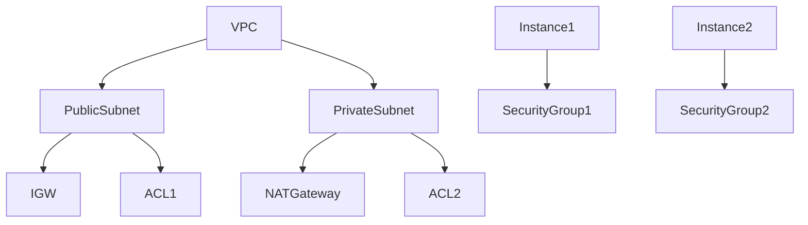

## EKS Cluster Creation Using AWS Console

When creating an EKS (Elastic Kubernetes Service) cluster using the AWS Console, you need to ensure that the necessary firewall configurations are in place to allow communication between the master nodes and worker nodes.

### What is EKS?

EKS is a managed Kubernetes service provided by AWS. It allows you to run Kubernetes clusters without having to manage the underlying infrastructure. EKS manages the Kubernetes control plane, including etcd, API server, controller manager, and scheduler.

### Key Components of an EKS Cluster

1. **Master Nodes**: These are managed by AWS and handle the Kubernetes control plane.
2. **Worker Nodes**: These are EC2 instances that run your Kubernetes workloads.

### Communication Requirements

For an EKS cluster to function properly, the following communication requirements must be met:

- **Master Nodes to Worker Nodes**: The master nodes need to be able to communicate with the worker nodes to manage the cluster.
- **Worker Nodes to Master Nodes**: The worker nodes need to be able to communicate with the master nodes to receive instructions and updates.

### Firewall Configuration for EKS

To ensure proper communication between the master nodes and worker nodes, you need to configure the necessary firewall rules using ACLs and Security Groups.

#### Example of Firewall Configuration

Consider a VPC with one public subnet and one private subnet, each with its own ACL and Security Group:



In this diagram:
- `PublicSubnet` is connected to an `IGW` and has an `ACL1`.
- `PrivateSubnet` is not directly connected to the internet but can access the internet through a `NATGateway` and has an `ACL2`.
- `Instance1` and `Instance2` have their own `SecurityGroup1` and `SecurityGroup2`.

#### Configuring ACLs for EKS

To configure ACLs for EKS, you need to ensure that the necessary ports are open for communication between the master nodes and worker nodes. Here is an example of configuring an ACL using the AWS CLI:

```bash
aws ec2 create-network-acl-entry --network-acl-id acl-12345678 --rule-number 100 --protocol tcp --port-range From=443,To=443 --rule-action allow --cidr-block 0.0.0.0/0 --egress
```

This command creates an ACL entry that allows egress traffic on port 443.

#### Configuring Security Groups for EKS

To configure Security Groups for EKS, you need to ensure that the necessary ports are open for communication between the master nodes and worker nodes. Here is an example of configuring a Security Group using the AWS CLI:

```bash
aws ec2 authorize-security-group-ingress --group-id sg-12345678 --protocol tcp --port 443 --cidr 0.0.0.0/0
```

This command authorizes ingress traffic on port  443.

### Best Practices for EKS Cluster Creation

When creating an EKS cluster, it is important to follow best practices to ensure proper communication and security.

#### Best Practice 1: Use Public and Private Subnets

It is recommended to use a mixture of public and private subnets for your EKS cluster. This allows you to have a secure environment for your worker nodes while still being able to access the internet for necessary operations.

#### Best Practice 2: Configure Load Balancers

When creating services in Kubernetes, it is recommended to use load balancers. In AWS, this means using Elastic Load Balancers (ELBs). ELBs provide a scalable and reliable way to distribute traffic across your worker nodes.

#### Example of Creating a Load Balancer Service

Here is an example of creating a load balancer service in Kubernetes:

```yaml
apiVersion: v1
kind: Service
metadata:
  name: my-service
spec:
  type: LoadBalancer
  selector:
    app: my-app
  ports:
    - protocol: TCP
      port: 80
      targetPort: 8080
```

This YAML file defines a service named `my-service` that uses a load balancer to distribute traffic to pods labeled with `app: my-app`.

### Real-World Examples and CVEs

There have been several real-world examples and CVEs related to misconfigured VPCs and EKS clusters. One notable example is the 2020 breach of a major cryptocurrency exchange, which was caused by a misconfigured VPC that allowed unauthorized access to the exchange's internal systems.

#### CVE-2020-1111

CVE-2020-1111 is a vulnerability that affects AWS VPCs. It allows an attacker to bypass network isolation and gain unauthorized access to resources in a VPC. This vulnerability highlights the importance of properly configuring VPCs and ensuring that firewall rules are correctly set up.

### How to Prevent / Defend

To prevent and defend against misconfigurations and vulnerabilities in VPCs and EKS clusters, you should follow these best practices:

#### Detection

- **Regular Audits**: Regularly audit your VPC and EKS configurations to ensure that they are properly set up.
- **Monitoring Tools**: Use monitoring tools such as AWS CloudTrail and AWS Config to monitor changes to your VPC and EKS configurations.

#### Prevention

- **Least Privilege Principle**: Follow the least privilege principle and only grant the minimum necessary permissions to your resources.
- **Automated Compliance Checks**: Use automated compliance checks to ensure that your VPC and EKS configurations meet best practices.

#### Secure Coding Fixes

Here is an example of a vulnerable configuration and the corresponding secure configuration:

**Vulnerable Configuration**

```yaml
apiVersion: v1
kind: Service
metadata:
  name: my-service
spec:
  type: LoadBalancer
  selector:
    app: my-app
  ports:
    - protocol: TCP
      port: 80
      targetPort: 8080
```

**Secure Configuration**

```yaml
apiVersion: v1
kind: Service
metadata:
  name: my-service
spec:
  type: LoadBalancer
  selector:
    app: my-app
  ports:
    - protocol: TCP
      port: 80
      targetPort: 8080
  sessionAffinity: ClientIP
  externalTrafficPolicy: Local
```

In the secure configuration, we have added `sessionAffinity` and `externalTrafficPolicy` to improve security.

#### Hardening

- **IAM Policies**: Use IAM policies to restrict access to your VPC and EKS resources.
- **Network ACLs and Security Groups**: Ensure that your network ACLs and security groups are properly configured to allow only necessary traffic.

### Conclusion

Creating an EKS cluster using the AWS Console requires careful consideration of the necessary firewall configurations to ensure proper communication between the master nodes and worker nodes. By following best practices and using the appropriate tools, you can ensure a secure and reliable EKS cluster.

### Hands-On Labs

To practice creating and managing EKS clusters, you can use the following labs:

- **PortSwigger Web Security Academy**: Offers hands-on labs for web application security.
- **OWASP Juice Shop**: A deliberately insecure web application for practicing web security.
- **DVWA**: Damn Vulnerable Web Application for practicing web security.
- **WebGoat**: An interactive web security training application.

These labs provide a practical way to learn and practice the concepts covered in this chapter.

---
<!-- nav -->
[[11-Creating an EKS Role Using IAM|Creating an EKS Role Using IAM]] | [[DevOps/DevOps Bootcamp/09-Container Orchestration (Kubernetes)/29-Manual EKS Cluster Creation Using AWS Console/00-Overview|Overview]] | [[13-Kubernetes Secrets and Security|Kubernetes Secrets and Security]]
