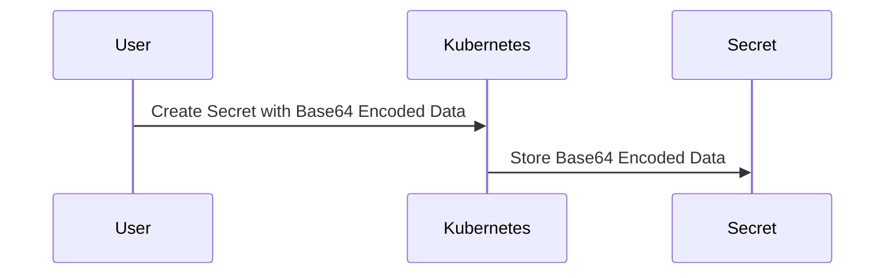
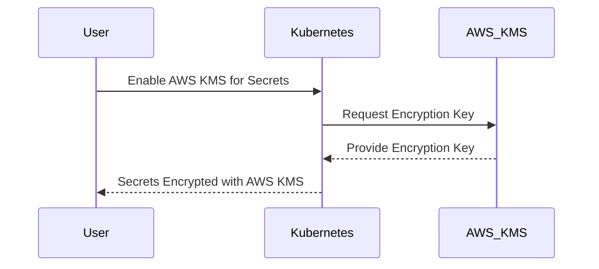

## Kubernetes Secrets and Security

### Introduction to Kubernetes Secrets

Kubernetes is a powerful container orchestration platform that allows developers to manage and scale applications efficiently. One of the key features of Kubernetes is the ability to store sensitive data securely within the cluster. This is achieved through a mechanism called **secrets**. Secrets are used to store sensitive information such as passwords, tokens, and keys in a secure manner.

#### What Are Secrets?

Secrets in Kubernetes are objects that contain a small amount of sensitive data, such as a password, a token, or a key. These secrets are designed to be consumed by pods and other Kubernetes resources. The data stored in secrets is base64 encoded, which provides a basic level of obfuscation but does not provide strong encryption.

#### Why Use Secrets?

Using secrets in Kubernetes is essential for several reasons:

1. **Security**: Storing sensitive data in plain text within the application code or configuration files is highly insecure. By using secrets, you can ensure that sensitive data is not exposed in your source code or configuration files.
   
2. **Isolation**: Secrets allow you to isolate sensitive data from your application code. This separation ensures that even if an attacker gains access to your application code, they cannot easily obtain sensitive data.

3. **Flexibility**: Secrets can be dynamically updated without requiring changes to your application code. This flexibility allows you to rotate credentials or update sensitive data without redeploying your application.

### Base64 Encoding in Secrets

The data stored in Kubernetes secrets is base64 encoded. Base64 encoding is a method of encoding binary data into ASCII characters. While base64 encoding provides a basic level of obfuscation, it is not a secure form of encryption. Anyone with access to the encoded data can easily decode it using simple tools.

#### How Base64 Encoding Works

Base64 encoding works by converting binary data into a string of ASCII characters. Each group of three bytes (24 bits) is converted into four characters, each representing 6 bits. The resulting string is then stored in the secret object.



#### Example of Base64 Encoding

Let's take a look at an example of how base64 encoding works. Suppose we have a password `mysecret`. We can encode this password using base64 encoding.

```bash
echo -n 'mysecret' | base64
```

The output will be:

```
bXlzZWNyZXQ=
```

This encoded string can be stored in a Kubernetes secret.

### Vulnerabilities of Base64 Encoding

While base64 encoding provides a basic level of obfuscation, it is not a secure form of encryption. If an attacker gains access to the encoded data, they can easily decode it using simple tools. This makes base64 encoding vulnerable to attacks.

#### Real-World Examples

There have been several real-world examples where base64 encoded secrets were compromised. For instance, in the case of the **GitHub Actions breach** (CVE-2021-22205), attackers were able to access base64 encoded secrets stored in GitHub repositories. They then decoded these secrets to gain unauthorized access to sensitive systems.

### Encrypting Secrets in Kubernetes

To address the vulnerabilities of base64 encoding, Kubernetes provides mechanisms to encrypt secrets. Encryption ensures that even if an attacker gains access to the encoded data, they cannot easily decode it.

#### Encryption Mechanisms

There are several mechanisms available to encrypt secrets in Kubernetes:

1. **Kubernetes Key Management Service (KMS)**: Kubernetes provides a built-in key management service that can be used to encrypt secrets. This service integrates with AWS Key Management Service (KMS) to provide encryption capabilities.

2. **External Key Management Services**: You can also use external key management services such as HashiCorp Vault or AWS KMS to encrypt secrets.

#### Using AWS KMS for Encryption

AWS provides a managed key management service called AWS Key Management Service (KMS). This service can be used to encrypt secrets in Kubernetes clusters. To enable encryption using AWS KMS, you need to configure the Kubernetes cluster to use the KMS service.



#### Example Configuration

To enable encryption using AWS KMS, you need to configure the Kubernetes cluster to use the KMS service. Here is an example configuration:

```yaml
apiVersion: v1
kind: Secret
metadata:
  name: my-secret
type: Opaque
data:
  password: bXlzZWNyZXQ= # Base64 encoded password
```

To encrypt this secret using AWS KMS, you need to configure the Kubernetes cluster to use the KMS service. This can be done by setting up the appropriate annotations and labels in the secret definition.

```yaml
apiVersion: v1
kind: Secret
metadata:
  name: my-secret
  annotations:
    kms.aws.amazon.com/encryption-key: arn:aws:kms:us-west-2:123456789012:key/abcd1234-a123-456a-a12b-a123b4c5d6ef
type: Opaque
data:
  password: bXlzZWNyZXQ= # Base64 encoded password
```

### How to Prevent / Defend Against Secret Compromise

To prevent and defend against secret compromise, you should follow these best practices:

1. **Use Strong Encryption**: Always use strong encryption mechanisms such as AWS KMS to encrypt secrets. Avoid using base64 encoding alone for sensitive data.

2. **Limit Access**: Limit access to secrets to only those users and applications that require it. Use role-based access control (RBAC) to restrict access to secrets.

3. **Monitor Access**: Monitor access to secrets to detect any unauthorized access attempts. Use logging and monitoring tools to track access to secrets.

4. **Regularly Rotate Secrets**: Regularly rotate secrets to minimize the window of opportunity for attackers. Use automated tools to rotate secrets periodically.

5. **Secure Storage**: Ensure that secrets are stored securely both within the Kubernetes cluster and in external storage systems. Use encrypted storage solutions to protect secrets.

### Conclusion

In conclusion, Kubernetes secrets are a crucial component of securing sensitive data within a Kubernetes cluster. While base64 encoding provides a basic level of obfuscation, it is not a secure form of encryption. To address this vulnerability, you should use strong encryption mechanisms such as AWS KMS to encrypt secrets. By following best practices for securing secrets, you can ensure that sensitive data remains protected within your Kubernetes cluster.

### Practice Labs

For hands-on experience with Kubernetes secrets and encryption, you can use the following labs:

- **PortSwigger Web Security Academy**: Offers a series of labs on Kubernetes security, including exercises on managing and securing secrets.
- **OWASP Juice Shop**: Provides a vulnerable web application that includes exercises on managing and securing secrets in a Kubernetes environment.
- **CloudGoat**: Offers a series of labs on AWS security, including exercises on managing and securing secrets in an EKS cluster.

By completing these labs, you can gain practical experience in managing and securing secrets in a Kubernetes environment.

---
<!-- nav -->
[[12-EKS Cluster Creation Using AWS Console|EKS Cluster Creation Using AWS Console]] | [[DevOps/DevOps Bootcamp/09-Container Orchestration (Kubernetes)/29-Manual EKS Cluster Creation Using AWS Console/00-Overview|Overview]] | [[14-Networking Configuration for EKS Cluster|Networking Configuration for EKS Cluster]]
