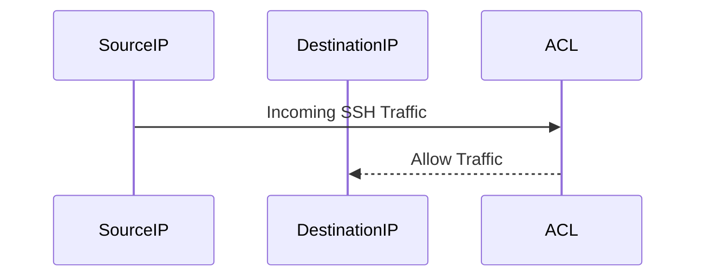
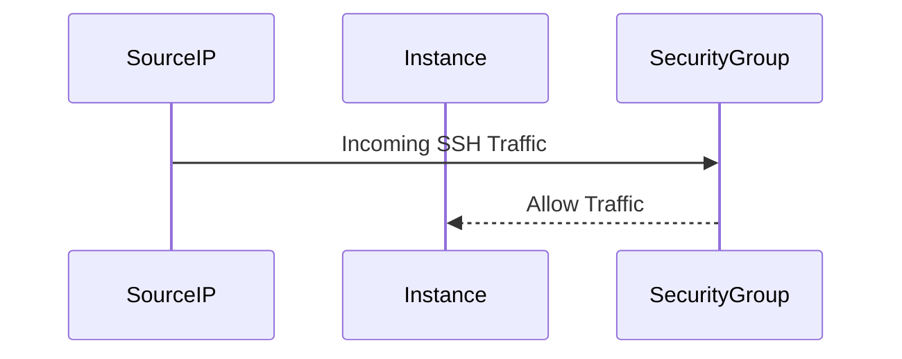
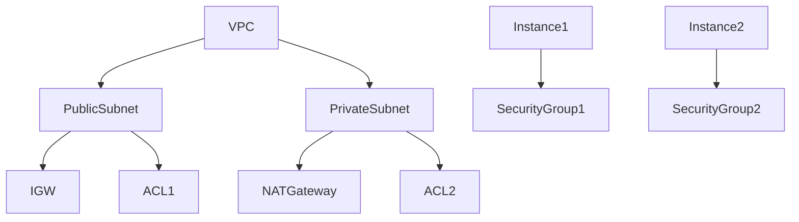

## Subnets and Firewall Rules

Subnets within a VPC can have their own firewall rules, which are configured using Network Access Control Lists (ACLs) and Security Groups.

### Network Access Control Lists (ACLs)

ACLs are stateless rules that apply to subnets. They can be used to allow or deny traffic based on IP addresses and port numbers.

#### How ACLs Work

ACLs operate at the subnet level and can be associated with one or more subnets. They consist of numbered rules that are evaluated in order. Each rule specifies whether to allow or deny traffic based on the source and destination IP addresses and port numbers.

#### Example of an ACL Rule

Here is an example of an ACL rule that allows incoming SSH traffic from a specific IP address:



In this sequence diagram:
- `SourceIP` sends an SSH request to `DestinationIP`.
- The `ACL` evaluates the request and allows it based on the rule.

#### Configuring ACLs

To configure an ACL, you would typically use the AWS Management Console or the AWS CLI. Here is an example of creating an ACL using the AWS CLI:

```bash
aws ec2 create-network-acl --vpc-id vpc-12345678
```

This command creates a new ACL in the specified VPC.

### Security Groups

Security Groups are stateful rules that apply to instances. They can be used to allow or deny traffic based on IP addresses and port numbers.

#### How Security Groups Work

Security Groups operate at the instance level and can be associated with one or more instances. They consist of numbered rules that are evaluated in order. Each rule specifies whether to allow or deny traffic based on the source and destination IP addresses and port numbers.

#### Example of a Security Group Rule

Here is an example of a Security Group rule that allows incoming SSH traffic from a specific IP address:



In this sequence diagram:
- `SourceIP` sends an SSH request to `Instance`.
- The `SecurityGroup` evaluates the request and allows it based on the rule.

#### Configuring Security Groups

To configure a Security Group, you would typically use the AWS Management Console or the AWS CLI. Here is an example of creating a Security Group using the AWS CLI:

```bash
aws ec2 create-security-group --group-name my-sg --description "My Security Group"
```

This command creates a new Security Group named `my-sg`.

### Differences Between ACLs and Security Groups

While both ACLs and Security Groups are used to control traffic, they differ in several ways:

- **Statefulness**: Security Groups are stateful, meaning that if you allow incoming traffic, the corresponding outgoing traffic is automatically allowed. ACLs are stateless, meaning you need to explicitly allow both incoming and outgoing traffic.
- **Scope**: ACLs operate at the subnet level, while Security Groups operate at the instance level.
- **Order of Evaluation**: ACLs evaluate rules in order, while Security Groups evaluate rules in the order they were added.

### Example of a VPC with ACLs and Security Groups

Consider a VPC with one public subnet and one private subnet, each with its own ACL and Security Group:



In this diagram:
- `PublicSubnet` is connected to an `IGW` and has an `ACL1`.
- `PrivateSubnet` is not directly connected to the internet but can access the internet through a `NATGateway` and has an `ACL2`.
- `Instance1` and `Instance2` have their own `SecurityGroup1` and `SecurityGroup2`.

---
<!-- nav -->
[[14-Networking Configuration for EKS Cluster|Networking Configuration for EKS Cluster]] | [[DevOps/DevOps Bootcamp/09-Container Orchestration (Kubernetes)/29-Manual EKS Cluster Creation Using AWS Console/00-Overview|Overview]] | [[DevOps/DevOps Bootcamp/09-Container Orchestration (Kubernetes)/29-Manual EKS Cluster Creation Using AWS Console/16-Practice Questions & Answers|Practice Questions & Answers]]
