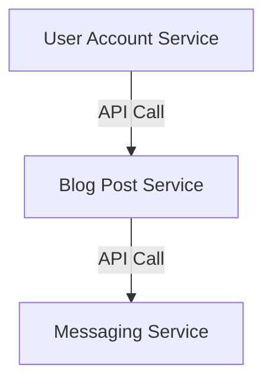
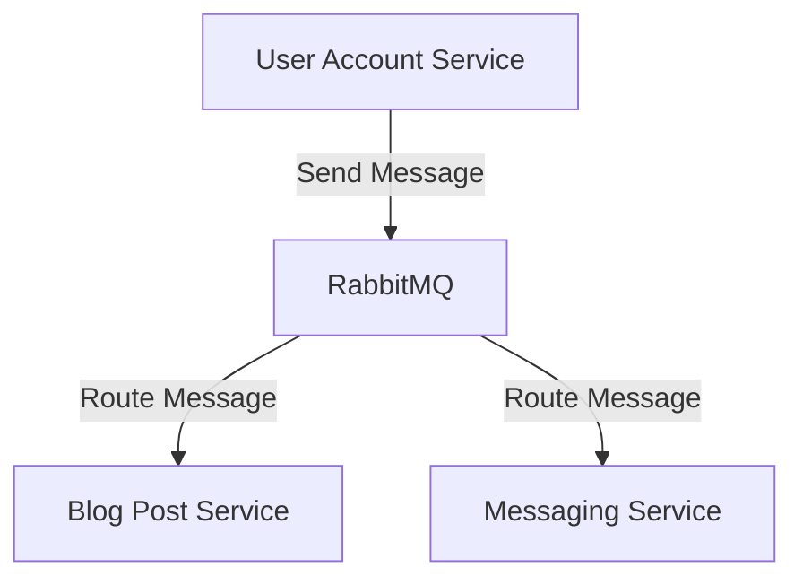

## Introduction to Microservices Communication in Kubernetes Clusters

Microservices architecture is a design approach where a large application is composed of small, independent services that communicate with each other using well-defined APIs. Each microservice is a small, loosely coupled component that can be developed, deployed, and scaled independently. In a Kubernetes cluster, these microservices run as individual pods, and their communication is crucial for the overall functionality of the application.

### Understanding Microservices Independence

In a microservices architecture, each service is designed to be independent and loosely coupled. This means that each microservice can be developed, tested, and deployed separately from the others. However, despite this independence, microservices often need to interact with each other to form a cohesive application. For example, in a social media platform like LinkedIn, a user account microservice might need to communicate with a messaging service or a blog post service.

### Communication Mechanisms Between Microservices

There are several mechanisms through which microservices can communicate with each other:

1. **Direct API Calls**: Microservices can communicate directly via APIs.
2. **Message Brokers**: Microservices can use a third-party message broker to facilitate communication.

#### Direct API Calls

One of the most straightforward ways for microservices to communicate is through direct API calls. Each microservice exposes a set of APIs that other services can call to perform specific operations. These APIs are typically RESTful endpoints that return data in JSON format.

##### Example: User Account Service API

Let's consider a simple example of a user account service that provides an API for creating and retrieving user information.

```python
from flask import Flask, jsonify, request

app = Flask(__name__)

users = {}

@app.route('/users', methods=['POST'])
def create_user():
    user_data = request.json
    user_id = len(users) + 1
    users[user_id] = user_data
    return jsonify({"id": user_id, "data": user_data}), 201

@app.route('/users/<int:user_id>', methods=['GET'])
def get_user(user_id):
    user_data = users.get(user_id)
    if user_data:
        return jsonify({"id": user_id, "data": user_data})
    else:
        return jsonify({"error": "User not found"}), 404

if __name__ == '__main__':
    app.run(debug=True)
```

This Flask application defines two endpoints: one for creating a new user and another for retrieving user information by ID.

##### HTTP Request and Response

Here is an example of an HTTP request and response for creating a user:

```http
POST /users HTTP/1.1
Host: localhost:5000
Content-Type: application/json

{
  "username": "john_doe",
  "email": "john@example.com"
}
```

Response:

```http
HTTP/1.1 201 Created
Content-Type: application/json

{
  "id": 1,
  "data": {
    "username": "john_doe",
    "email": "john@example.com"
  }
}
```

And here is an example of an HTTP request and response for retrieving a user:

```http
GET /users/1 HTTP/1.1
Host: localhost:5000
```

Response:

```http
HTTP/1.1 200 OK
Content-Type: application/json

{
  "id": 1,
  "data": {
    "username": "john_doe",
    "email": "john@example.com"
  }
}
```

#### Message Brokers

Another common method for microservices to communicate is through message brokers. A message broker acts as an intermediary that manages the communication between microservices. Instead of each service directly calling APIs of other services, they send messages to the broker, which then routes the messages to the appropriate services.

##### Popular Message Brokers

Some popular message brokers include:

- **Redis**: An in-memory data structure store that can be used as a message broker.
- **RabbitMQ**: A robust and highly scalable message broker that supports various messaging protocols.

##### Example: Using RabbitMQ

Let's consider an example where a user account service sends a message to a blog post service via RabbitMQ.

```python
import pika

# Establish a connection to RabbitMQ server
connection = pika.BlockingConnection(pika.ConnectionParameters('localhost'))
channel = connection.channel()

# Declare a queue
channel.queue_declare(queue='blog_post_queue')

# Send a message to the queue
message = {
    "user_id": 1,
    "post_title": "My First Blog Post",
    "post_content": "This is my first blog post."
}

channel.basic_publish(exchange='',
                      routing_key='blog_post_queue',
                      body=str(message))

print(" [x] Sent message")

# Close the connection
connection.close()
```

On the receiving end, the blog post service listens for messages on the queue and processes them accordingly.

```python
import pika

def callback(ch, method, properties, body):
    print(f" [x] Received {body}")
    # Process the message here

# Establish a connection to RabbitMQ server
connection = pika.BlockingConnection(pika.ConnectionParameters('localhost'))
channel = connection.channel()

# Declare a queue
channel.queue_declare(queue='blog_post_queue')

# Set up a consumer to listen for messages
channel.basic_consume(queue='blog_post_queue',
                      auto_ack=True,
                      on_message_callback=callback)

print(' [*] Waiting for messages. To exit press CTRL+C')
channel.start_consuming()
```

### Mermaid Diagrams for Communication Topologies

To visualize the communication topology between microservices, we can use mermaid diagrams.

#### Direct API Call Topology



#### Message Broker Topology



### Pitfalls and Best Practices

While microservices offer many benefits, they also introduce challenges such as increased complexity in communication and potential points of failure. Here are some common pitfalls and best practices:

#### Common Pitfalls

1. **Over-Complexity**: Over-engineering the communication between microservices can lead to unnecessary complexity.
2. **Single Points of Failure**: Relying too heavily on a single message broker can create a single point of failure.
3. **Security Risks**: Improperly securing APIs and message brokers can expose your application to security vulnerabilities.

#### Best Practices

1. **Keep APIs Simple**: Design APIs to be simple and easy to understand.
2. **Use Circuit Breakers**: Implement circuit breakers to handle failures gracefully.
3. **Secure Communication**: Ensure that all communication between microservices is secure, using HTTPS and proper authentication mechanisms.

### Real-World Examples and CVEs

#### Recent Breaches and CVEs

- **CVE-2021-21974**: A vulnerability in Apache Kafka, a popular message broker, allowed unauthorized access to sensitive data.
- **CVE-2022-22965**: A security flaw in Redis allowed attackers to execute arbitrary commands on the server.

These examples highlight the importance of securing communication channels and regularly updating dependencies to mitigate risks.

### How to Prevent / Defend

#### Detection

- **Monitoring Tools**: Use tools like Prometheus and Grafana to monitor the health and performance of microservices.
- **Logging**: Implement centralized logging to track communication between services and detect anomalies.

#### Prevention

- **Secure APIs**: Use OAuth 2.0 and JWT for authentication and authorization.
- **Hardening Configurations**: Secure configurations of message brokers like RabbitMQ and Redis.

#### Secure Code Fixes

Here is an example of a vulnerable and secure version of a microservice API:

**Vulnerable Version**

```python
from flask import Flask, jsonify, request

app = Flask(__name__)

@app.route('/users', methods=['POST'])
def create_user():
    user_data = request.json
    # Vulnerable: No validation or sanitization
    users.append(user_data)
    return jsonify({"success": True}), 201

if __name__ == '__main__':
    app.run(debug=True)
```

**Secure Version**

```python
from flask import Flask, jsonify, request
from werkzeug.security import check_password_hash

app = Flask(__name__)

@app.route('/users', methods=['POST'])
def create_user():
    user_data = request.json
    # Secure: Validate and sanitize input
    if validate_user_data(user_data):
        users.append(user_data)
        return jsonify({"success": True}), 201
    else:
        return jsonify({"error": "Invalid user data"}), 400

def validate_user_data(data):
    # Add validation logic here
    return True

if __name__ == '__main__':
    app.run(debug=True)
```

### Conclusion

In conclusion, microservices communication in Kubernetes clusters is a critical aspect of building scalable and resilient applications. By understanding the different communication mechanisms and following best practices, developers can ensure that their microservices interact effectively and securely. Regular monitoring, secure coding practices, and timely updates are essential to maintaining the integrity and performance of microservices-based applications.

### Practice Labs

For hands-on practice with microservices deployment and communication in Kubernetes, consider the following labs:

- **Kubernetes Goat**: A hands-on lab for learning Kubernetes security.
- **OWASP WrongSecrets**: A series of challenges to learn about secure coding practices.
- **kube-hunter**: A tool for finding security issues in Kubernetes clusters.

These labs provide practical experience in deploying and securing microservices in a Kubernetes environment.

---
<!-- nav -->
[[DevOps/DevOps Bootcamp/09-Container Orchestration (Kubernetes)/30-Microservices Deployment in Kubernetes Clusters/00-Overview|Overview]] | [[02-Introduction to Microservices Deployment in Kubernetes Clusters|Introduction to Microservices Deployment in Kubernetes Clusters]]
