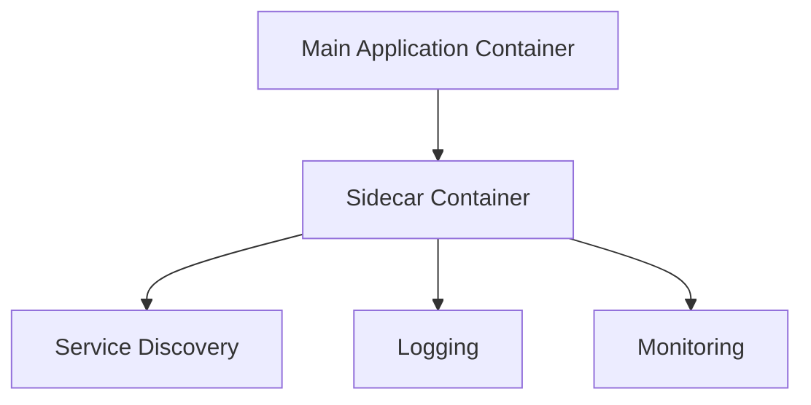

## Introduction to Microservices Deployment in Kubernetes Clusters

### What Are Microservices?

Microservices architecture is a method of developing software systems that structures an application as a collection of loosely coupled services. Each service implements a set of distinct functions and operates independently. This approach allows teams to develop, deploy, and scale applications more efficiently compared to monolithic architectures.

#### Why Microservices Matter

Microservices offer several advantages:

1. **Scalability**: Individual services can be scaled independently based on demand.
2. **Isolation**: Faults in one service do not affect others.
3. **Flexibility**: Different services can be written in different languages and frameworks.
4. **Team Autonomy**: Smaller teams can manage individual services, leading to faster development cycles.

However, microservices also introduce complexity, particularly in deployment and management. This is where Kubernetes comes into play.

### Kubernetes Overview

Kubernetes (often abbreviated as K8s) is an open-source platform designed to automate deploying, scaling, and operating application containers. It was originally designed by Google and is now maintained by the Cloud Native Computing Foundation.

#### Key Concepts in Kubernetes

1. **Pods**: The smallest deployable units in Kubernetes. A pod encapsulates application containers, storage resources, and options that define how the container should run.
2. **Services**: An abstraction which defines a logical set of pods and a policy by which to access them.
3. **Deployments**: A resource that manages the creation and updating of pods.
4. **Namespaces**: Virtual clusters that provide a scope for names, allowing multiple users to use a single cluster without name collisions.

### Service Mesh Architecture

A service mesh is a dedicated infrastructure layer for handling service-to-service communication. Instead of relying on a centralized message broker, each microservice has its own helper program (sidecar container) that handles communication.

#### Sidecar Containers

In Kubernetes, a sidecar container is a container that runs alongside the main application container within the same pod. The sidecar container typically provides additional functionality such as logging, monitoring, or service discovery.



#### Popular Service Mesh: Istio

Istio is one of the most popular service meshes. It provides a uniform way to secure, control, and observe interactions between microservices.

##### Key Components of Istio

1. **Envoy Proxy**: A high-performance proxy that sits between the application and the network.
2. **Pilot**: Manages Envoy proxies and provides service discovery.
3. **Mixer**: Enforces policies and collects telemetry data.
4. **Citadel**: Manages authentication and authorization.

### Deploying Microservices in Kubernetes

As a DevOps engineer, your primary responsibility is to deploy and manage microservices applications in a Kubernetes cluster. This involves understanding the requirements and configurations provided by the developers.

#### Information Needed from Developers

To effectively deploy microservices, you need the following information from the developers:

1. **Docker Images**: The Docker images for each microservice.
2. **Configuration Files**: Kubernetes manifests (YAML files) defining the deployment, service, and other necessary resources.
3. **Environment Variables**: Any environment variables required by the microservices.
4. **Dependencies**: Any external dependencies or services that the microservices rely on.
5. **Health Checks**: Liveness and readiness probes to ensure the microservices are running correctly.

### Example Deployment

Let's walk through a complete example of deploying a microservices application using Kubernetes.

#### Step 1: Define the Microservices

Assume we have two microservices: `user-account` and `messenger`.

```yaml
# user-account-deployment.yaml
apiVersion: apps/v1
kind: Deployment
metadata:
  name: user-account
spec:
  replicas: 3
  selector:
    matchLabels:
      app: user-account
  template:
    metadata:
      labels:
        app: user-account
    spec:
      containers:
      - name: user-account
        image: user-account:latest
        ports:
        - containerPort: 8080
---
# user-account-service.yaml
apiVersion: v1
kind: Service
metadata:
  name: user-account
spec:
  selector:
    app: user-account
  ports:
  - protocol: TCP
    port: 80
    targetPort: 8080
  type: ClusterIP
```

```yaml
# messenger-deployment.yaml
apiVersion: apps/v1
kind: Deployment
metadata:
  name: messenger
spec:
  replicas: 3
  selector:
    matchLabels:
      app: messenger
  template:
    metadata:
      labels:
        app: messenger
    spec:
      containers:
      - name: messenger
        image: messenger:latest
        ports:
        - containerPort: 8080
---
# messenger-service.yaml
apiVersion: v1
kind: Service
metadata:
  name: messenger
spec:
  selector:
    app: messenger
  ports:
  - protocol: TCP
    port: 80
    targetPort:  8080
  type: ClusterIP
```

#### Step 2: Apply the Configuration

Use `kubectl` to apply the configuration files.

```bash
kubectl apply -f user-account-deployment.yaml
kubectl apply -f user-account-service.yaml
kubectl apply -f messenger-deployment.yaml
kubectl apply -f messenger-service.yaml
```

#### Step 3: Verify the Deployment

Check the status of the deployments and services.

```bash
kubectl get deployments
kubectl get services
```

### Service Mesh Integration with Istio

To integrate Istio into our microservices deployment, we need to install Istio and configure the sidecar containers.

#### Install Istio

Follow the official Istio documentation to install Istio on your Kubernetes cluster.

```bash
curl -L https://istio.io/downloadIstio | ISTIO_VERSION=1.11.0 sh -
cd istio-1.11.0
export PATH=$PWD/bin:$PATH
istioctl install --set profile=demo -y
```

#### Configure Istio for Microservices

Annotate the deployments to enable Istio sidecars.

```yaml
# user-account-deployment.yaml
apiVersion: apps/v1
kind: Deployment
metadata:
  name: user-account
  annotations:
    sidecar.istio.io/inject: "true"
spec:
  replicas: 3
  selector:
    matchLabels:
      app: user-account
  template:
    metadata:
      labels:
        app: user-account
    spec:
      containers:
      - name: user-account
        image: user-account:latest
        ports:
        - containerPort: 8080
---
# messenger-deployment.yaml
apiVersion: apps/v1
kind: Deployment
metadata:
  name: messenger
  annotations:
    sidecar.istio.io/inject: "true"
spec:
  replicas: 3
  selector:
    matchLabels:
      app: messenger
  template:
    metadata:
      labels:
        app: messenger
    spec:
      containers:
      - name: messenger
        image: messenger:latest
        ports:
        - containerPort: 8080
```

Apply the updated configurations.

```bash
kubectl apply -f user-account-deployment.yaml
kubectl apply -f messenger-deployment.yaml
```

### Monitoring and Observability

With Istio, you can leverage its built-in observability features to monitor the health and performance of your microservices.

#### Metrics and Tracing

Istio integrates with Prometheus for metrics and Jaeger for tracing.

```bash
kubectl get svc -n istio-system
```

Access the Grafana dashboard via the `grafana` service.

### Security Considerations

Security is paramount in microservices architectures. Istio provides several mechanisms to secure service-to-service communication.

#### Mutual TLS

Enable mutual TLS to encrypt traffic between services.

```yaml
apiVersion: networking.istio.io/v1alpha3
kind: DestinationRule
metadata:
  name: user-account
spec:
  host: user-account
  trafficPolicy:
    tls:
      mode: ISTIO_MUTUAL
---
apiVersion: networking.istio.io/v1alpha3
kind: DestinationRule
metadata:
  name: messenger
spec:
  host: messenger
  trafficPolicy:
    tls:
      mode: ISTIO_MUTUAL
```

Apply the configuration.

```bash
kubectl apply -f destination-rule.yaml
```

### How to Prevent / Defend

#### Detection

Monitor the cluster for unauthorized access and anomalies using tools like Prometheus and Grafana.

#### Prevention

1. **RBAC Policies**: Implement Role-Based Access Control (RBAC) to restrict access to sensitive resources.
2. **Network Policies**: Use Kubernetes Network Policies to control traffic between pods.
3. **Secure Configurations**: Ensure all configurations follow best practices, such as enabling mutual TLS.

#### Secure Coding Fixes

Compare the insecure and secure versions of the configuration files.

**Insecure Version**

```yaml
apiVersion: apps/v1
kind: Deployment
metadata:
  name: user-account
spec:
  replicas: 3
  selector:
    matchLabels:
      app: user-account
  template:
    metadata:
      labels:
        app: user-account
    spec:
      containers:
      - name: user-account
        image: user-account:latest
        ports:
        - containerPort: 8080
```

**Secure Version**

```yaml
apiVersion: apps/v1
kind: Deployment
metadata:
  name: user-account
  annotations:
    sidecar.istio.io/inject: "true"
spec:
  replicas: 3
  selector:
    matchLabels:
      app: user-account
  template:
    metadata:
      labels:
        app: user-account
    spec:
      containers:
      - name: user-account
        image: user-account:latest
        ports:
        - containerPort: 8080
---
apiVersion: networking.istio.io/v1alpha3
kind: DestinationRule
metadata:
  name: user-account
spec:
  host: user-account
  trafficPolicy:
    tls:
      mode: ISTIO_MUTUAL
```

### Real-World Examples

#### Recent Breaches

One notable breach involving microservices was the Capital One breach in 2019. The attacker exploited a misconfigured web application firewall, leading to unauthorized access to customer data.

#### CVEs

CVE-2021-25283: A vulnerability in Kubernetes allowed attackers to bypass RBAC policies and gain elevated privileges.

### Hands-On Labs

For practical experience with microservices deployment in Kubernetes, consider the following labs:

- **PortSwigger Web Security Academy**: Offers hands-on labs for web application security.
- **OWASP Juice Shop**: A deliberately insecure web application for practicing security skills.
- **CloudGoat**: Provides a series of labs for learning cloud security concepts using AWS.

### Conclusion

Deploying microservices in Kubernetes requires a deep understanding of both the architecture and the tools involved. By leveraging service meshes like Istio, you can enhance the observability, security, and scalability of your microservices applications. Always ensure that you follow best practices for securing your deployments and regularly monitor your cluster for potential threats.

---
<!-- nav -->
[[01-Introduction to Microservices Communication in Kubernetes Clusters|Introduction to Microservices Communication in Kubernetes Clusters]] | [[DevOps/DevOps Bootcamp/09-Container Orchestration (Kubernetes)/30-Microservices Deployment in Kubernetes Clusters/00-Overview|Overview]] | [[03-Introduction to Microservices|Introduction to Microservices]]
