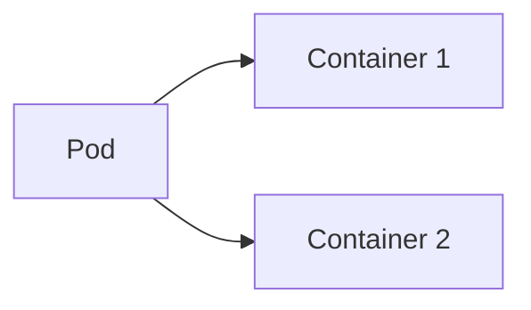
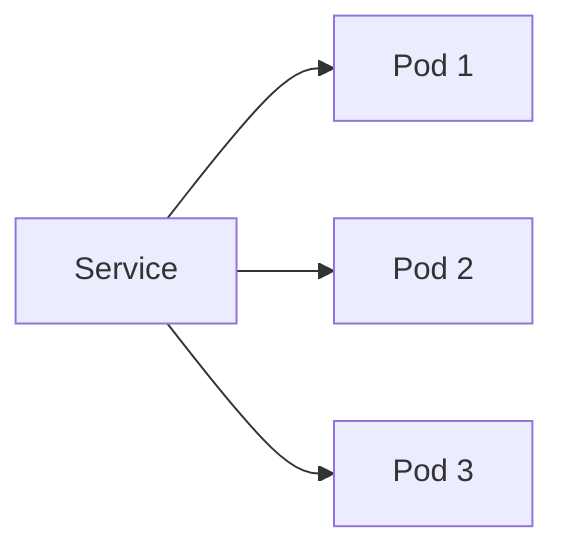
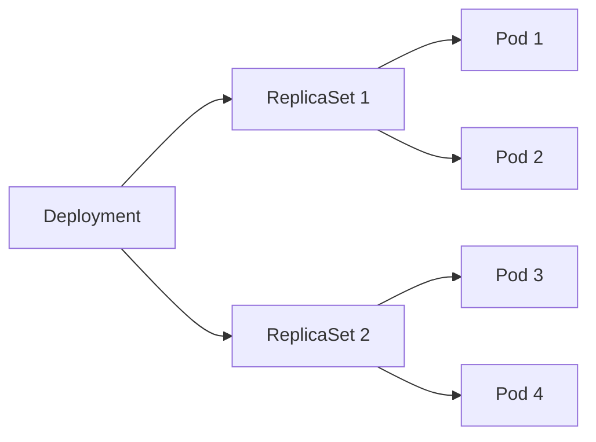

## Kubernetes and Microservices

Kubernetes is an open-source platform designed to automate the deployment, scaling, and management of containerized applications. It provides a robust framework for deploying and managing microservices in a scalable and resilient manner.

### Key Concepts in Kubernetes

#### Pods

A pod is the smallest deployable unit in Kubernetes. It represents a group of one or more containers that are tightly coupled and share the same storage and network resources. Containers within a pod are always co-located and co-scheduled, and run in a shared context on the same node.



#### Services

A service in Kubernetes is an abstraction that defines a logical set of pods and a policy by which to access them. Services provide a stable IP address and DNS name for a set of pods, making it easy to discover and communicate with them.



#### Deployments

A deployment manages the rolling update of pods. It ensures that the desired number of replicas are running and handles the rollout of new versions of the application.



### Deploying Microservices in Kubernetes

To deploy a microservice in Kubernetes, you need to define a `Deployment` and a `Service`. Here’s an example of a simple microservice deployment:

#### Deployment Configuration

```yaml
apiVersion: apps/v1
kind: Deployment
metadata:
  name: my-microservice
spec:
  replicas: 3
  selector:
    matchLabels:
      app: my-microservice
  template:
    metadata:
      labels:
        app: my-microservice
    spec:
      containers:
      - name: my-microservice-container
        image: my-microservice-image:latest
        ports:
        - containerPort: 8080
```

#### Service Configuration

```yaml
apiVersion: v1
kind: Service
metadata:
  name: my-microservice-service
spec:
  selector:
    app: my-microservice
  ports:
  - protocol: TCP
    port: 80
    targetPort: 8080
  type: LoadBalancer
```

### Deploying the Microservice

To deploy the microservice, you would apply the configurations using `kubectl`:

```sh
kubectl apply -f deployment.yaml
kubectl apply -f service.yaml
```

### Scaling the Microservice

Scaling the microservice is straightforward. You can increase the number of replicas by updating the `replicas` field in the `Deployment` configuration:

```sh
kubectl scale deployment/my-microservice --replicas=5
```

### Rolling Updates

Kubernetes supports rolling updates, which allow you to update the microservice without downtime. This is achieved by gradually replacing old pods with new ones:

```sh
kubectl set image deployment/my-microservice my-microservice-container=my-microservice-image:new-version
```

### Monitoring and Logging

Monitoring and logging are crucial for maintaining the health and performance of microservices. Kubernetes provides several tools for monitoring and logging, such as Prometheus for metrics and Fluentd for log aggregation.

#### Example: Prometheus Configuration

```yaml
apiVersion: monitoring.coreos.com/v1
kind: ServiceMonitor
metadata:
  name: my-microservice-monitor
spec:
  selector:
    matchLabels:
      app: my-microservice
  endpoints:
  - port: http
    interval: 30s
```

### Security Considerations

Security is a critical aspect of deploying microservices in Kubernetes. Here are some key security considerations:

#### Network Policies

Network policies control the communication between pods. They ensure that only authorized traffic is allowed to flow between pods.

```yaml
apiVersion: networking.k8s.io/v1
kind: NetworkPolicy
metadata:
  name: my-microservice-network-policy
spec:
  podSelector:
    matchLabels:
      app: my-microservice
  ingress:
  - from:
    - podSelector:
        matchLabels:
          app: frontend
```

#### Role-Based Access Control (RBAC)

RBAC is used to control access to Kubernetes resources. It ensures that users and processes have only the permissions they need.

```yaml
apiVersion: rbac.authorization.k8s.io/v1
kind: Role
metadata:
  namespace: default
  name: my-microservice-role
rules:
- apiGroups: [""]
  resources: ["pods"]
  verbs: ["get", "watch", "list"]
---
apiVersion: rbac.authorization.k8s.io/v1
kind: RoleBinding
metadata:
  name: my-microservice-rolebinding
  namespace: default
subjects:
- kind: ServiceAccount
  name: my-microservice-sa
roleRef:
  kind: Role
  name: my-microservice-role
  apiGroup: rbac.authorization.k8s.io
```

### How to Prevent / Defend

#### Detection

Regularly monitor your Kubernetes cluster for unusual activity. Tools like Prometheus and Grafana can help you visualize and alert on anomalies.

#### Prevention

- **Use Network Policies**: Ensure that only authorized traffic is allowed between pods.
- **Implement RBAC**: Restrict access to Kubernetes resources based on roles.
- **Secure Secrets**: Use Kubernetes secrets to store sensitive information securely.
- **Regular Audits**: Conduct regular security audits and penetration testing.

#### Secure Coding Fixes

Compare the insecure and secure versions of a configuration:

**Insecure Version**

```yaml
apiVersion: v1
kind: Pod
metadata:
  name: my-pod
spec:
  containers:
  - name: my-container
    image: my-image:latest
    ports:
    - containerPort: 8080
```

**Secure Version**

```yaml
apiVersion: v1
kind: Pod
metadata:
  name: my-pod
spec:
  containers:
  - name: my-container
    image: my-image:latest
    ports:
    - containerPort: 8080
    securityContext:
      runAsUser: 1000
      readOnlyRootFilesystem: true
```

### Real-World Examples

#### CVE-2021-25741

CVE-2021-25741 is a vulnerability in Kubernetes that allows an attacker to escalate privileges by manipulating the `securityContext` of a pod. This vulnerability highlights the importance of securing pod configurations and implementing strict RBAC policies.

#### Example Breach: Capital One Data Breach

The Capital One data breach in 2019 involved unauthorized access to customer data stored in an AWS S3 bucket. While this breach was not directly related to Kubernetes, it underscores the importance of securing cloud resources and implementing proper access controls.

### Hands-On Labs

For hands-on practice with microservices deployment in Kubernetes, consider the following labs:

- **Kubernetes Goat**: A hands-on lab for learning Kubernetes security.
- **CloudGoat**: A lab for practicing cloud security in AWS.
- **Pacu**: A lab for practicing cloud security in various cloud environments.

These labs provide practical experience in deploying and securing microservices in Kubernetes clusters.

---
<!-- nav -->
[[03-Introduction to Microservices|Introduction to Microservices]] | [[DevOps/DevOps Bootcamp/09-Container Orchestration (Kubernetes)/30-Microservices Deployment in Kubernetes Clusters/00-Overview|Overview]] | [[05-Microservices Deployment in Kubernetes Clusters|Microservices Deployment in Kubernetes Clusters]]
