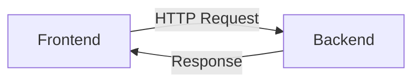

## Microservices Deployment in Kubernetes Clusters

### Background Theory

Microservices architecture is a design approach where an application is composed of small, independent services that communicate with each other using well-defined APIs. Each microservice can be developed, deployed, and scaled independently, making it easier to manage complex applications. Kubernetes is an open-source platform designed to automate deploying, scaling, and operating application containers. It provides a robust framework for managing containerized applications across clusters of hosts.

### Hosting Application on a Git Repository

Before deploying a microservices-based application in a Kubernetes cluster, the application code should be hosted in a Git repository. This allows for version control, collaboration among developers, and easy integration with CI/CD pipelines.

#### Example: Hosting a Microservices Application on GitHub

Let's consider a simple microservices application consisting of two services: `frontend` and `backend`. We will host this application on GitHub.

1. **Create a GitHub Repository**:
    - Log in to your GitHub account.
    - Click on the "+" icon in the top-right corner and select "New repository".
    - Name the repository (e.g., `microservices-app`).
    - Initialize the repository with a README file and a `.gitignore` file for Go or Java, depending on your language of choice.

2. **Clone the Repository Locally**:
    ```sh
    git clone https://github.com/yourusername/microservices-app.git
    cd microservices-app
    ```

3. **Add Microservices Code**:
    - Create directories for each service:
        ```sh
        mkdir frontend backend
        ```
    - Add code for each service. For simplicity, let's assume both services are written in Go.

4. **Commit and Push Changes**:
    ```sh
    git add .
    git commit -m "Initial commit"
    git push origin main
    ```

### Deploying the Application in a Kubernetes Cluster

Once the application is hosted in a Git repository, the next step is to deploy it in a Kubernetes cluster. This involves creating Kubernetes manifests (YAML files) that define the desired state of the application.

#### Example: Kubernetes Manifests for Microservices

Let's create Kubernetes manifests for our `frontend` and `backend` services.

1. **Dockerfile for Each Service**:
    - Create a `Dockerfile` in each service directory to build Docker images.
    - Example `Dockerfile` for the `frontend` service:
        ```Dockerfile
        FROM golang:1.18 AS builder
        WORKDIR /app
        COPY . .
        RUN go build -o frontend .

        FROM alpine:latest
        COPY --from=builder /app/frontend /usr/local/bin/
        CMD ["frontend"]
        ```

2. **Kubernetes Deployment and Service YAML Files**:
    - Create `deployment.yaml` and `service.yaml` files for each service.
    - Example `deployment.yaml` for the `frontend` service:
        ```yaml
        apiVersion: apps/v1
        kind: Deployment
        metadata:
          name: frontend-deployment
        spec:
          replicas: 3
          selector:
            matchLabels:
              app: frontend
          template:
            metadata:
              labels:
                app: frontend
            spec:
              containers:
              - name: frontend
                image: yourusername/frontend:latest
                ports:
                - containerPort: 8080
        ```

    - Example `service.yaml` for the `frontend` service:
        ```yaml
        apiVersion: v1
        kind: Service
        metadata:
          name: frontend-service
        spec:
          selector:
            app: frontend
          ports:
            - protocol: TCP
              port: 80
              targetPort: 8080
          type: LoadBalancer
        ```

3. **Deploy the Application**:
    - Build and push Docker images to a registry (e.g., Docker Hub).
    - Apply the Kubernetes manifests:
        ```sh
        kubectl apply -f frontend/deployment.yaml
        kubectl apply -f frontend/service.yaml
        kubectl apply -f backend/deployment.yaml
        kubectl apply -f backend/service.yaml
        ```

### Network Topology and Communication

To understand how the microservices communicate within the Kubernetes cluster, let's visualize the network topology using a `mermaid` diagram.



In this diagram, the `frontend` service sends HTTP requests to the `backend` service, and the `backend` service responds to these requests.

### Common Pitfalls and How to Prevent/Defend

#### Pitfall: Insecure API Endpoints

One common pitfall is exposing insecure API endpoints that can be exploited by attackers. For example, an unsecured endpoint might allow unauthorized access to sensitive data.

##### Example Vulnerable Code

Consider a `backend` service with an insecure API endpoint:

```go
package main

import (
	"net/http"
)

func main() {
	http.HandleFunc("/data", func(w http.ResponseWriter, r *http.Request) {
		w.Write([]byte("Sensitive Data"))
	})
	http.ListenAndServe(":8080", nil)
}
```

##### Secure Code Fix

To secure this endpoint, you can implement authentication and authorization mechanisms. For example, using JWT (JSON Web Tokens):

```go
package main

import (
	"net/http"
	"github.com/dgrijalva/jwt-go"
)

var jwtKey = []byte("secret_key")

func authenticate(next http.Handler) http.Handler {
	return http.HandlerFunc(func(w http.ResponseWriter, r *http.Request) {
		tokenString := r.Header.Get("Authorization")
		if tokenString == "" {
			http.Error(w, "Unauthorized", http.StatusUnauthorized)
			return
		}

		token, err := jwt.Parse(tokenString, func(token *jwt.Token) (interface{}, error) {
			return jwtKey, nil
		})

		if err != nil || !token.Valid {
			http.Error(w, "Unauthorized", http.StatusUnauthorized)
			return
		}

		next.ServeHTTP(w, r)
	})
}

func main() {
	http.HandleFunc("/data", func(w http.ResponseWriter, r *http.Request) {
		w.Write([]byte("Sensitive Data"))
	})

	http.Handle("/", authenticate(http.DefaultServeMux))
	http.ListenAndServe(":8080", nil)
}
```

#### Pitfall: Inadequate Resource Limits

Another common issue is not setting appropriate resource limits for pods, which can lead to resource exhaustion and denial-of-service attacks.

##### Example Vulnerable Configuration

A deployment without resource limits:

```yaml
apiVersion: apps/v1
kind: Deployment
metadata:
  name: frontend-deployment
spec:
  replicas: 3
  selector:
    matchLabels:
      app: frontend
  template:
    metadata:
      labels:
        app: frontend
    spec:
      containers:
      - name: frontend
        image: yourusername/frontend:latest
        ports:
        - containerPort: 8080
```

##### Secure Configuration Fix

Set resource limits to

---
<!-- nav -->
[[04-Kubernetes and Microservices|Kubernetes and Microservices]] | [[DevOps/DevOps Bootcamp/09-Container Orchestration (Kubernetes)/30-Microservices Deployment in Kubernetes Clusters/00-Overview|Overview]] | [[06-Understanding Microservices Deployment in Kubernetes Clusters|Understanding Microservices Deployment in Kubernetes Clusters]]
