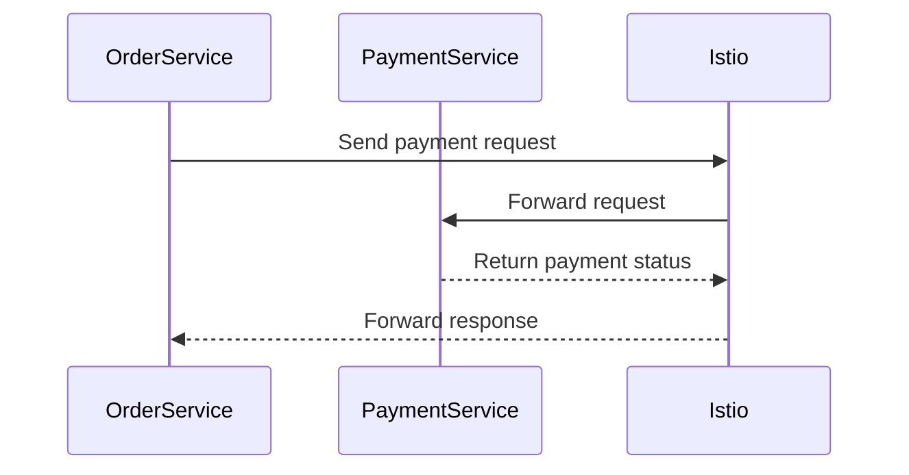

## Understanding Microservices Deployment in Kubernetes Clusters

### Introduction to Microservices

Microservices architecture is a design approach where an application is composed of small, independent services that communicate with each other using well-defined APIs. Each microservice is responsible for a specific business function and can be developed, deployed, and scaled independently. This architecture allows for greater agility, scalability, and resilience compared to monolithic applications.

#### Why Microservices Matter

Microservices offer several advantages:

1. **Decoupling**: Services can evolve independently, reducing the risk of breaking changes.
2. **Scalability**: Individual services can scale based on demand, optimizing resource usage.
3. **Resilience**: Failures in one service do not necessarily affect others, improving overall system reliability.
4. **Team Autonomy**: Different teams can work on different services concurrently, accelerating development cycles.

However, microservices also introduce complexity in terms of communication, deployment, and management. To effectively manage microservices, orchestration tools like Kubernetes are essential.

### Preparing for Microservices Deployment

Before deploying microservices in a Kubernetes cluster, it is crucial to understand the following aspects:

1. **Identifying Microservices**: Determine which microservices are required and their individual functionalities.
2. **Communication Patterns**: Understand how microservices interact with each other and external systems.
3. **Dependencies**: Identify third-party services and databases that the microservices rely on.
4. **Port Configuration**: Ensure each microservice runs on a specific port.

#### Identifying Microservices

Each microservice should have a clear, distinct responsibility. For example, consider a typical e-commerce application:

- **Product Service**: Manages product data.
- **Order Service**: Handles order processing.
- **Payment Service**: Facilitates payment transactions.
- **Inventory Service**: Tracks inventory levels.

#### Communication Patterns

Microservices can communicate through various methods:

1. **API Calls**: Direct HTTP requests between services.
2. **Message Brokers**: Asynchronous communication using message queues (e.g., RabbitMQ, Kafka).
3. **Service Mesh**: A layer that provides observability and control over service-to-service communication (e.g., Istio).

**Example: API Calls**

```http
GET /api/products HTTP/1.1
Host: products-service.example.com
```

**Example: Message Broker**

```plaintext
Producer sends message to queue:
{
    "event": "order_placed",
    "data": {
        "orderId": "12345"
    }
}
```

**Example: Service Mesh**



#### Dependencies

Microservices often depend on external services such as databases, message brokers, and third-party APIs. These dependencies must be identified and configured appropriately.

**Example: Database Dependency**

```yaml
# Example PostgreSQL deployment
apiVersion: apps/v1
kind: Deployment
metadata:
  name: postgres-deployment
spec:
  replicas: 1
  selector:
    matchLabels:
      app: postgres
  template:
    metadata:
      labels:
        app: postgres
    spec:
      containers:
      - name: postgres
        image: postgres:latest
        ports:
        - containerPort: 5432
```

#### Port Configuration

Each microservice should run on a specific port to avoid conflicts. For example:

```yaml
# Example Product Service deployment
apiVersion: apps/v1
kind: Deployment
metadata:
  name: product-service-deployment
spec:
  replicas: 1
  selector:
    matchLabels:
      app: product-service
  template:
    metadata:
      labels:
        app: product-service
    spec:
      containers:
      - name: product-service
        image: product-service:latest
        ports:
        - containerPort: 8080
```

### Preparing the Kubernetes Environment

Once the microservices and their dependencies are identified, the next step is to prepare the Kubernetes environment.

#### Deploying Third-Party Services

Deploy any third-party services that the microservices depend on. For example, deploying a message broker:

```yaml
# Example RabbitMQ deployment
apiVersion: apps/v1
kind: Deployment
metadata:
  name: rabbitmq-deployment
spec:
  replicas: 1
  selector:
    matchLabels:
      app: rabbitmq
  template:
    metadata:
      labels:
        app: rabbitmq
    spec:
      containers:
      - name: rabbitmq
        image: rabbitmq:latest
        ports:
        - containerPort: 5672
```

#### Creating Secrets and ConfigMaps

Kubernetes Secrets and ConfigMaps store sensitive and non-sensitive configuration data respectively.

**Example: Secret for Database Credentials**

```yaml
apiVersion: v1
kind: Secret
metadata:
  name: db-secret
type: Opaque
data:
  username: dXNlcm5hbWU=  # base64 encoded
  password: cGFzc3dvcmQ=  # base64 encoded
```

**Example: ConfigMap for Application Settings**

```yaml
apiVersion: v1
kind: ConfigMap
metadata:
  name: app-config
data:
  apiEndpoint: "https://api.example.com"
  timeout: "3000"
```

### Creating Kubernetes Manifest Files

After preparing the environment, create Kubernetes manifest files for each microservice.

#### Deployment and Service Components

A typical microservice deployment includes a `Deployment` and a `Service`.

**Example: Product Service Deployment and Service**

```yaml
# Product Service Deployment
apiVersion: apps/v1
kind: Deployment
metadata:
  name: product-service-deployment
spec:
  replicas: 1
  selector:
    matchLabels:
      app: product-service
  template:
    metadata:
      labels:
        app: product-service
    spec:
      containers:
      - name: product-service
        image: product-service:latest
        ports:
        - containerPort: 8080
---
# Product Service Service
apiVersion: v1
kind: Service
metadata:
  name: product-service
spec:
  selector:
    app: product-service
  ports:
    - protocol: TCP
      port: 80
      targetPort: 8080
  type: ClusterIP
```

#### Namespace Configuration

Decide whether microservices should run in the same namespace or each in its own namespace.

**Example: Single Namespace**

```yaml
apiVersion: v1
kind: Namespace
metadata:
  name: microservices-namespace
```

**Example: Multiple Namespaces**

```yaml
apiVersion: v1
kind: Namespace
metadata:
  name: product-service-namespace
---
apiVersion: v1
kind: Namespace
metadata:
  name: order-service-namespace
```

### Hands-On Demo Project

In the next section, we will walk through a hands-on demo project to deploy an existing microservice into a Kubernetes cluster.

#### Real-World Example: E-commerce Application

Consider an e-commerce application with the following microservices:

- **Product Service**
- **Order Service**
- **Payment Service**
- **Inventory Service**

We will deploy these microservices into a Kubernetes cluster, ensuring proper communication and dependency management.

#### Step-by-Step Deployment

1. **Prepare the Environment**
2. **Deploy Third-Party Services**
3. **Create Secrets and ConfigMaps**
4. **Deploy Microservices**
5. **Verify Deployment**

**Example: Full Deployment Process**

```yaml
# Step 1: Prepare the Environment
apiVersion: v1
kind: Namespace
metadata:
  name: microservices-namespace
---
# Step 2: Deploy Third-Party Services
apiVersion: apps/v1
kind: Deployment
metadata:
  name: postgres-deployment
  namespace: microservices-namespace
spec:
  replicas: 1
  selector:
    matchLabels:
      app: postgres
  template:
    metadata:
      labels:
        app: postgres
    spec:
      containers:
      - name: postgres
        image: postgres:latest
        ports:
        - containerPort: 5432
---
# Step 3: Create Secrets and ConfigMaps
apiVersion: v1
kind: Secret
metadata:
  name: db-secret
  namespace: microservices-namespace
type: Opaque
data:
  username: dXNlcm5hbWU=  # base64 encoded
  password: cGFzc3dvcmQ=  # base64 encoded
---
apiVersion: v1
kind: ConfigMap
metadata:
  name: app-config
  namespace: micro
```

### How to Prevent / Defend

#### Detection

Regularly monitor the Kubernetes cluster for anomalies using tools like Prometheus and Grafana. Set up alerts for unusual behavior, such as unexpected service restarts or high CPU usage.

#### Prevention

1. **Secure Configuration Management**: Use Kubernetes Secrets and ConfigMaps securely.
2. **Network Policies**: Implement network policies to restrict traffic between pods.
3. **RBAC**: Use Role-Based Access Control (RBAC) to limit access to resources.
4. **Pod Security Policies**: Enforce pod security policies to ensure pods are configured securely.

**Example: Network Policy**

```yaml
apiVersion: networking.k8s.io/v1
kind: NetworkPolicy
metadata:
  name: allow-from-same-namespace
  namespace: microservices-namespace
spec:
  podSelector: {}
  ingress:
  - from:
    - podSelector: {}
```

**Example: RBAC**

```yaml
apiVersion: rbac.authorization.k8s.io/v1
kind: Role
metadata:
  namespace: microservices-namespace
  name: pod-reader
rules:
- apiGroups: [""]
  resources: ["pods"]
  verbs: ["get", "watch", "list"]
---
apiVersion: rbac.authorization.k8s.io/v1
kind: RoleBinding
metadata:
  name: read-pods
  namespace: microservices-namespace
subjects:
- kind: ServiceAccount
  name: default
  namespace: microservices-namespace
roleRef:
  kind: Role
  name: pod-reader
  apiGroup: rbac.authorization.k8s.io
```

### Conclusion

Deploying microservices in a Kubernetes cluster requires careful planning and execution. By understanding the microservices, their communication patterns, dependencies, and port configurations, you can prepare the Kubernetes environment effectively. Creating Kubernetes manifest files and managing namespaces ensures a well-organized deployment. Regular monitoring and security measures help maintain a robust and secure environment.

### Practice Labs

For hands-on practice, consider the following labs:

- **Kubernetes Goat**: A hands-on lab for learning Kubernetes security.
- **OWASP WrongSecrets**: A series of challenges to learn about secrets management.
- **kube-hunter**: A tool to find security issues in Kubernetes clusters.

These labs provide practical experience in deploying and securing microservices in Kubernetes environments.

---
<!-- nav -->
[[05-Microservices Deployment in Kubernetes Clusters|Microservices Deployment in Kubernetes Clusters]] | [[DevOps/DevOps Bootcamp/09-Container Orchestration (Kubernetes)/30-Microservices Deployment in Kubernetes Clusters/00-Overview|Overview]] | [[DevOps/DevOps Bootcamp/09-Container Orchestration (Kubernetes)/30-Microservices Deployment in Kubernetes Clusters/07-Conclusion|Conclusion]]
