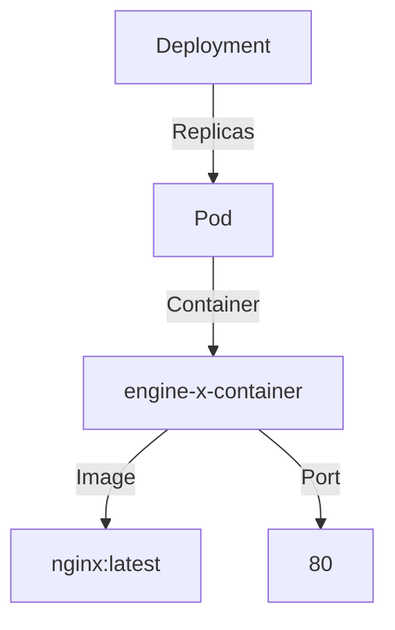
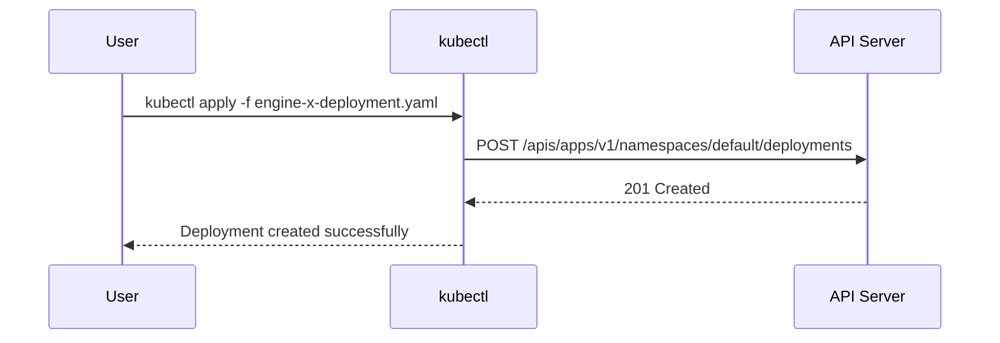

## Introduction to Kubernetes Configuration Files

Kubernetes is an open-source system for automating deployment, scaling, and management of containerized applications. At the heart of Kubernetes is the ability to define your application's desired state through configuration files. These files are typically written in YAML or JSON format and describe the components of your application, such as deployments, services, and pods.

### What Are Configuration Files?

Configuration files in Kubernetes are used to define the desired state of your application. They contain information about the components you want to deploy, their properties, and how they should interact with each other. These files are then applied to the Kubernetes cluster using the `kubectl` command-line tool.

#### Why Use Configuration Files?

Using configuration files provides several benefits:

1. **Declarative Approach**: You specify the desired state of your application, and Kubernetes ensures that the actual state matches the desired state.
2. **Version Control**: Configuration files can be stored in version control systems like Git, allowing you to track changes and collaborate with team members.
3. **Reproducibility**: Configuration files make it easy to reproduce the same environment across different clusters or environments.
4. **Automation**: Configuration files can be used in CI/CD pipelines to automate the deployment process.

### Basic Structure of a Configuration File

A typical Kubernetes configuration file consists of several key components:

1. **API Version**: Specifies the API version of the resource being defined.
2. **Kind**: Specifies the type of resource being defined (e.g., Deployment, Service, Pod).
3. **Metadata**: Contains metadata about the resource, such as its name and labels.
4. **Spec**: Contains the specifications for the resource, including details about the containers, replicas, and other properties.

### Example Configuration File

Let's create a simple configuration file for a deployment named `engine-x-deployment`. Here is the YAML representation of the configuration file:

```yaml
apiVersion: apps/v1
kind: Deployment
metadata:
  name: engine-x-deployment
spec:
  replicas: 3
  selector:
    matchLabels:
      app: engine-x
  template:
    metadata:
      labels:
        app: engine-x
    spec:
      containers:
      - name: engine-x-container
        image: nginx:latest
        ports:
        - containerPort: 80
```

### Explanation of Each Component

1. **API Version**: `apps/v1` specifies the version of the API used to define the deployment.
2. **Kind**: `Deployment` indicates that this resource is a deployment.
3. **Metadata**:
   - `name`: `engine-x-deployment` is the name of the deployment.
   - `labels`: Labels are used to categorize and select objects. In this case, we are using a label `app: engine-x`.
4. **Spec**:
   - `replicas`: `3` specifies the number of replicas of the pod to run.
   - `selector`: `matchLabels` is used to match the labels of the pods.
   - `template`: Defines the pod template.
     - `metadata`: Contains labels for the pod.
     - `spec`: Defines the specifications for the pod.
       - `containers`: Defines the containers within the pod.
         - `name`: `engine-x-container` is the name of the container.
         - `image`: `nginx:latest` is the Docker image to use.
         - `ports`: `containerPort: 80` specifies the port the container listens on.

### Applying the Configuration File Using `kubectl`

To apply the configuration file to the Kubernetes cluster, you use the `kubectl apply` command. The `-f` flag specifies the file to apply.

```sh
kubectl apply -f engine-x-deployment.yaml
```

### Full HTTP Request and Response

When you run the `kubectl apply` command, it sends an HTTP request to the Kubernetes API server. Here is an example of the full HTTP request and response:

#### HTTP Request

```http
POST /apis/apps/v1/namespaces/default/deployments HTTP/1.1
Host: localhost:8080
Content-Type: application/json
Authorization: Bearer <token>

{
  "apiVersion": "apps/v1",
  "kind": "Deployment",
  "metadata": {
    "name": "engine-x-deployment"
  },
  "spec": {
    "replicas": 3,
    "selector": {
      "matchLabels": {
        "app": "engine-x"
      }
    },
    "template": {
      "metadata": {
        "labels": {
          "app": "engine-x"
        }
      },
      "spec": {
        "containers": [
          {
            "name": "engine-x-container",
            "image": "nginx:latest",
            "ports": [
              {
                "containerPort": 80
              }
            ]
          }
        ]
      }
    }
  }
}
```

#### HTTP Response

```http
HTTP/1.1 201 Created
Content-Type: application/json
Date: Mon, 01 Jan 2024 00:00:00 GMT
Content-Length: 1024

{
  "apiVersion": "apps/v1",
  "kind": "Deployment",
  "metadata": {
    "name": "engine-x-deployment",
    "namespace": "default",
    "uid": "12345678-1234-1234-1234-1234567890ab",
    "resourceVersion": "123456",
    "creationTimestamp": "2024-01-01T00:00:00Z"
  },
  "spec": {
    "replicas": 3,
    "selector": {
      "matchLabels": {
        "app": "engine-x"
      }
    },
    "template": {
      "metadata": {
        "labels": {
          "app": "engine-x"
        }
      },
      "spec": {
        "containers": [
          {
            "name": "engine-x-container",
            "image": "nginx:latest",
            "ports": [
              {
                "containerPort": 80
              }
            ]
          }
        ]
      }
    }
  },
  "status": {
    "observedGeneration": 1,
    "replicas": 3,
    "updatedReplicas": 3,
    "readyReplicas": 3,
    "availableReplicas": 3
  }
}
```

### Common Pitfalls and Best Practices

#### Pitfall: Incorrect API Version

Using an incorrect API version can lead to errors. Always ensure that the API version matches the version of the Kubernetes cluster.

#### Best Practice: Use Latest API Versions

Always use the latest stable API versions to take advantage of new features and improvements.

#### Pitfall: Missing Required Fields

Missing required fields in the configuration file can cause the deployment to fail. Ensure that all required fields are included.

#### Best Practice: Validate Configuration Files

Use tools like `kubectl` to validate configuration files before applying them. For example:

```sh
kubectl create --validate=true -f engine-x-deployment.yaml
```

### Real-World Examples and Recent CVEs

#### Example: CVE-2021-25741

CVE-2021-25741 is a vulnerability in Kubernetes that allows an attacker to bypass RBAC (Role-Based Access Control) restrictions and gain elevated privileges. This vulnerability highlights the importance of securing your Kubernetes cluster and ensuring that your configuration files are properly validated and secured.

#### Secure Configuration Example

Here is a secure configuration example that includes RBAC rules to restrict access to the deployment:

```yaml
apiVersion: rbac.authorization.k8s.io/v1
kind: Role
metadata:
  namespace: default
  name: engine-x-role
rules:
- apiGroups: ["apps"]
  resources: ["deployments"]
  verbs: ["get", "list", "watch", "create", "update", "patch", "delete"]

---
apiVersion: rbac.authorization.k8s.io/v1
kind: RoleBinding
metadata:
  name: engine-x-rolebinding
  namespace: default
subjects:
- kind: ServiceAccount
  name: engine-x-sa
  namespace: default
roleRef:
  kind: Role
  name: engine-x-role
  apiGroup: rbac.authorization.k8s.io
```

### How to Prevent / Defend

#### Detection

Regularly audit your Kubernetes cluster for misconfigurations and vulnerabilities. Use tools like `kube-bench` and `kubescape` to perform security checks.

#### Prevention

1. **Validate Configuration Files**: Use `kubectl` to validate configuration files before applying them.
2. **Use RBAC**: Implement Role-Based Access Control to restrict access to resources.
3. **Secure Secrets**: Use Kubernetes secrets to securely store sensitive data.
4. **Monitor and Audit**: Regularly monitor and audit your Kubernetes cluster for suspicious activity.

#### Secure Coding Fixes

Here is a comparison of a vulnerable configuration file and a secure configuration file:

##### Vulnerable Configuration File

```yaml
apiVersion: apps/v1
kind: Deployment
metadata:
  name: engine-x-deployment
spec:
  replicas: 3
  selector:
    matchLabels:
      app: engine-x
  template:
    metadata:
      labels:
        app: engine-x
    spec:
      containers:
      - name: engine-x-container
        image: nginx:latest
        ports:
        - containerPort: 80
```

##### Secure Configuration File

```yaml
apiVersion: apps/v1
kind: Deployment
metadata:
  name: engine-x-deployment
spec:
  replicas: 3
  selector:
    matchLabels:
      app: engine-x
  template:
    metadata:
      labels:
        app: engine-x
    spec:
      serviceAccountName: engine-x-sa
      containers:
      - name: engine-x-container
        image: nginx:latest
        ports:
        - containerPort: 80
```

### Mermaid Diagrams

#### Deployment Architecture



#### Request/Response Flow



### Hands-On Labs

For hands-on practice with Kubernetes configuration files, consider the following labs:

- **PortSwigger Web Security Academy**: Offers a variety of labs related to Kubernetes security.
- **OWASP Juice Shop**: Provides a vulnerable web application that can be deployed using Kubernetes.
- **Kubernetes Goat**: A security-focused Kubernetes lab that teaches you how to secure your Kubernetes cluster.

By following these steps and best practices, you can effectively manage your Kubernetes cluster using configuration files and ensure the security and reliability of your applications.

---
<!-- nav -->
[[DevOps/DevOps Bootcamp/09-Container Orchestration (Kubernetes)/31-MiniCube Cluster Management with CubeCTL Commands/00-Overview|Overview]] | [[02-Introduction to MiniCube Cluster Management with CubeCTL Commands|Introduction to MiniCube Cluster Management with CubeCTL Commands]]
