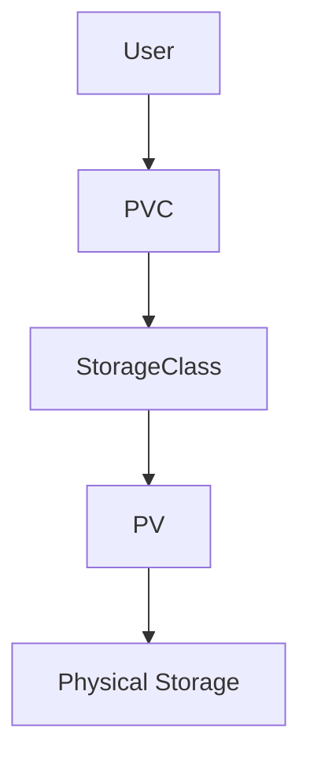
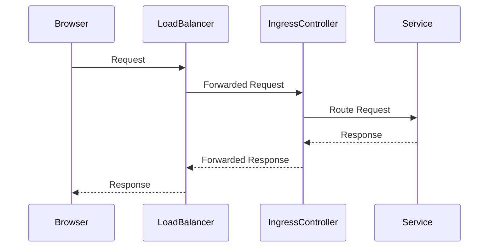

## Introduction to Kubernetes Storage and Ingress

In this section, we will delve into the intricacies of managing storage and ingress in a Kubernetes cluster, specifically focusing on using Linode's managed Kubernetes service. We'll cover the concepts of storage classes, persistent volumes, and how to efficiently manage data storage for applications such as databases. Additionally, we'll explore the setup and configuration of an Ingress controller to enable external access to your applications via a browser.

### Background Theory: Persistent Volumes and Storage Classes

Persistent Volumes (PVs) are a fundamental resource in Kubernetes that provide storage capacity to Pods. They are claimed by Persistent Volume Claims (PVCs), which are requests for storage resources. A PV represents a piece of storage in the cluster, while a PVC is a request for that storage by a user.

#### What is a Storage Class?

A Storage Class is a way to define different types of storage that can be provisioned dynamically. It allows you to specify parameters such as performance, reliability, and cost. Linode provides a default storage class that automatically creates persistent volumes with the respective physical storage in the background.



#### Why Use Storage Classes?

Using a storage class simplifies the process of provisioning storage for your applications. Instead of manually creating and attaching volumes, you can define a PVC that references a storage class, and the system will automatically create and attach the necessary PVs.

#### How Does It Work Under the Hood?

When you create a PVC that references a storage class, the Kubernetes control plane checks if there is an available PV that matches the requirements specified in the PVC. If not, it triggers the dynamic provisioning process, where the storage class creates a new PV and binds it to the PVC.

#### Example: Creating a PVC with Linode Storage Class

Here’s an example of a PVC that uses Linode's default storage class:

```yaml
apiVersion: v1
kind: PersistentVolumeClaim
metadata:
  name: my-pvc
spec:
  accessModes:
    - ReadWriteOnce
  resources:
    requests:
      storage: 10Gi
  storageClassName: linode-block-storage
```

This PVC requests 10Gi of storage and specifies the `linode-block-storage` storage class. Linode will automatically create a PV and bind it to this PVC.

#### Common Mistakes and Pitfalls

One common mistake is not specifying a storage class, which can lead to unexpected behavior. Always ensure that your PVCs reference a specific storage class to avoid issues.

#### How to Prevent / Defend

To prevent issues with storage provisioning, always validate your PVC configurations and ensure that the storage class is correctly specified. Regularly monitor the status of your PVCs and PVs to catch any provisioning failures early.

### Database Application Setup

Now that we have covered the basics of storage management, let's move on to setting up a database application, such as MongoDB, with replicas and storage configured.

#### What is MongoDB?

MongoDB is a popular NoSQL database that stores data in flexible, JSON-like documents. It supports horizontal scaling through sharding and high availability through replication.

#### Why Use Replicas?

Replication ensures high availability and fault tolerance. By maintaining multiple copies of your data across different nodes, you can ensure that your application remains operational even if one or more nodes fail.

#### How to Set Up MongoDB with Replicas

To set up MongoDB with replicas, you need to create a StatefulSet that defines the replica set and a PVC for each replica's storage.

```yaml
apiVersion: apps/v1
kind: StatefulSet
metadata:
  name: mongodb-replica-set
spec:
  serviceName: "mongodb"
  replicas: 3
  selector:
    matchLabels:
      app: mongodb
  template:
    metadata:
      labels:
        app: mongodb
    spec:
      containers:
      - name: mongodb
        image: mongo:latest
        ports:
        - containerPort: 27017
        volumeMounts:
        - name: mongo-persistent-storage
          mountPath: /data/db
  volumeClaimTemplates:
  - metadata:
      name: mongo-persistent-storage
    spec:
      accessModes: [ "ReadWriteOnce" ]
      resources:
        requests:
          storage: 10Gi
      storageClassName: linode-block-storage
```

This StatefulSet creates three MongoDB replicas, each with its own PVC for storage.

#### Common Mistakes and Pitfalls

One common pitfall is not properly configuring the replica set, which can lead to data inconsistencies. Ensure that you initialize the replica set correctly and monitor its health regularly.

#### How to Prevent / Defend

To prevent issues with MongoDB replicas, initialize the replica set correctly and use tools like `mongostat` to monitor the health of your cluster. Regularly back up your data and test your recovery procedures.

### Setting Up Ingress for External Access

Now that we have our database and application running, we need to set up Ingress to allow external access to our application via a browser.

#### What is Ingress?

Ingress is a Kubernetes resource that manages external access to the services in a cluster, typically HTTP. An Ingress controller is a component that implements the Ingress resource and routes incoming requests to the appropriate services.

#### Why Use Ingress?

Ingress provides a centralized way to manage external access to your services. It allows you to define routing rules and apply security policies, such as SSL termination and rate limiting.

#### How Does Ingress Work Under the Hood?

An Ingress controller listens for incoming requests and routes them to the appropriate services based on the defined rules. On cloud platforms, you often have cloud providers' own load balancers that sit in front of the Ingress controller.



#### Example: Configuring Ingress Rules

Here’s an example of an Ingress resource that routes traffic to a Node.js application:

```yaml
apiVersion: networking.k8s.io/v1
kind: Ingress
metadata:
  name: my-ingress
spec:
  rules:
  - host: myapp.example.com
    http:
      paths:
      - path: /
        pathType: Prefix
        backend:
          service:
            name: my-nodejs-service
            port:
              number: 80
```

This Ingress rule routes traffic to the `my-nodejs-service` service.

#### Common Mistakes and Pitfalls

One common mistake is not configuring the Ingress controller correctly, which can lead to routing issues. Ensure that your Ingress controller is properly installed and configured.

#### How to Prevent / Defend

To prevent issues with In ingress, regularly monitor the status of your Ingress rules and ensure that your Ingress controller is properly configured. Use tools like `kubectl describe ingress` to check the status of your Ingress resources.

### Real-World Examples and Recent Breaches

#### Example: CVE-2021-25741

CVE-2021-25741 is a vulnerability in the NGINX Ingress Controller that allows attackers to bypass authentication and gain unauthorized access to services. This highlights the importance of securing your Ingress rules and ensuring that your Ingress controller is up to date.

#### Example: MongoDB Exposed to the Internet

In 2020, several MongoDB instances were exposed to the internet due to misconfigured Ingress rules, leading to data breaches. This underscores the importance of properly securing your database services and ensuring that they are not accessible from the internet unless necessary.

### Practice Labs

For hands-on practice with Kubernetes storage and Ingress, consider the following labs:

- **Kubernetes Goat**: A hands-on lab that covers various aspects of Kubernetes security, including storage and Ingress.
- **OWASP Juice Shop**: A deliberately insecure web application that includes challenges related to Kubernetes and cloud security.

By following these detailed explanations and examples, you should have a comprehensive understanding of how to manage storage and Ingress in a Kubernetes cluster, ensuring efficient and secure operation of your applications.

---
<!-- nav -->
[[01-Introduction to Kubernetes Clusters|Introduction to Kubernetes Clusters]] | [[DevOps/DevOps Bootcamp/09-Container Orchestration (Kubernetes)/32-Running Kubernetes on Cloud Efficiently/00-Overview|Overview]] | [[03-Introduction to Kubernetes on Cloud|Introduction to Kubernetes on Cloud]]
