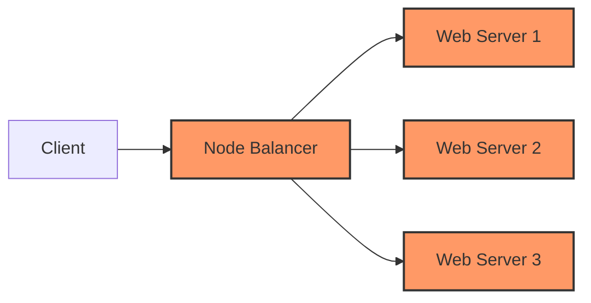

## Introduction to Load Balancers in Kubernetes Clusters

In the context of deploying applications on Kubernetes clusters, ensuring high availability and scalability is crucial. One of the key components that enable this is the load balancer. A load balancer distributes incoming network traffic across multiple backend services, such as web servers or databases, to ensure no single service becomes overwhelmed. This setup is particularly important in cloud environments where applications need to handle varying levels of traffic efficiently.

### What is a Load Balancer?

A load balancer is a device or software that acts as a middleman between clients and backend services. Its primary function is to distribute incoming network traffic across multiple backend services to ensure optimal resource utilization and fault tolerance. Load balancers can operate at different layers of the OSI model, but most commonly, they operate at Layer 4 (Transport Layer) or Layer 7 (Application Layer).

#### Why Use a Load Balancer?

1. **Scalability**: Load balancers allow you to scale your application horizontally by distributing traffic across multiple backend services. This ensures that no single service becomes a bottleneck during high traffic periods.
   
2. **Fault Tolerance**: By distributing traffic across multiple backend services, load balancers provide redundancy. If one backend service fails, the load balancer can automatically route traffic to other healthy services, ensuring continuous availability.

3. **Performance Optimization**: Load balancers can optimize performance by directing traffic to the least busy backend services, reducing latency and improving overall user experience.

4. **Security**: Load balancers can also enhance security by providing an additional layer of protection. They can perform SSL offloading, which offloads the computationally expensive task of decrypting SSL/TLS traffic to the load balancer, freeing up resources on the backend services.

### Example Scenario: Linode Node Balancer

Let's consider a scenario where we have a Kubernetes cluster deployed on Linode, a popular cloud provider. In this scenario, we have two Linode instances:

1. **Instance 1**: Runs a database application.
2. **Instance 2**: Runs a web server.

Initially, the web server is exposed using a public IP address, allowing browsers to send requests directly to the web server. However, this setup has several limitations:

1. **Scalability Issues**: If the web server starts receiving a lot of traffic, it can quickly become a bottleneck, leading to degraded performance and potential downtime.
   
2. **Maintenance Downtime**: Any maintenance activities, such as rebooting or reconfiguring the web server, can cause the application to become unavailable.

To address these issues, we can introduce a load balancer, specifically Linode's Node Balancer, which will act as the entry point to our application.

### How Linode Node Balancer Works

The Linode Node Balancer operates as follows:

1. **Public IP Address**: The Node Balancer is assigned a public IP address, which is the only IP address exposed to the internet. Clients send their requests to this public IP address.
   
2. **Private IP Addresses**: The backend services (web servers) are assigned private IP addresses and are only accessible through the Node Balancer. This setup hides the backend services from the internet, enhancing security.

3. **Traffic Distribution**: The Node Balancer receives incoming requests and distributes them across multiple backend services based on predefined rules. This ensures that no single backend service becomes overloaded.

#### Example Configuration

Let's configure a simple scenario where we have two web servers behind a Linode Node Balancer.

```yaml
# Linode Node Balancer Configuration
---
apiVersion: networking.k8s.io/v1
kind: Ingress
metadata:
  name: web-server-ingress
spec:
  loadBalancerIP: 192.0.2.1  # Public IP address of the Node Balancer
  backend:
    serviceName: web-server-service
    servicePort: 80
```

In this configuration:

- `loadBalancerIP`: Specifies the public IP address of the Node Balancer.
- `backend.serviceName`: Refers to the Kubernetes service that fronts the web servers.
- `backend.servicePort`: Specifies the port on which the web servers listen.

### Full HTTP Request and Response

When a client sends a request to the Node Balancer, the following HTTP request and response occur:

```http
# Client Request
GET / HTTP/1.1
Host: 192.0.2.1
User-Agent: curl/7.74.0
Accept: */*

# Node Balancer Response
HTTP/1.1 200 OK
Date: Mon, 20 Mar 2023 12:00:00 GMT
Server: nginx/1.19.10
Content-Type: text/html; charset=UTF-8
Content-Length: 1234
Connection: keep-alive

<!DOCTYPE html>
<html>
<head>
<title>Welcome to the Web Server</title>
</head>
<body>
<h1>Hello, World!</h1>
</body>
</html>
```

### Mermaid Diagram: Network Topology

Here is a mermaid diagram illustrating the network topology:



### Adding Multiple Web Servers

To scale the application, we can add more web servers behind the Node Balancer. This allows us to distribute the incoming traffic more evenly and handle higher loads.

```yaml
# Additional Web Server Configuration
---
apiVersion: apps/v1
kind: Deployment
metadata:
  name: web-server-deployment
spec:
  replicas: 3  # Number of web server replicas
  selector:
    matchLabels:
      app: web-server
  template:
    metadata:
      labels:
        app: web-server
    spec:
      containers:
      - name: web-server
        image: nginx:latest
        ports:
        - containerPort: 80
```

### Full HTTP Request and Response with Multiple Web Servers

When a client sends a request to the Node Balancer, the following HTTP request and response occur:

```http
# Client Request
GET / HTTP/1.1
Host: 192.0.2.1
User-Agent: curl/7.74.0
Accept: */*

# Node Balancer Response
HTTP/1.1 200 OK
Date: Mon, 20 Mar 2023 12:00:00 GMT
Server: nginx/1.19.10
Content-Type: text/html; charset=UTF-8
Content-Length: 1234
Connection: keep-alive

<!DOCTYPE html>
<html>
<head>
<title>Welcome to the Web Server</title>
</head>
<body>
<h1>Hello, World!</h1>
</body>
</html>
```

### How to Prevent / Defend

#### Detection

To detect issues with the load balancer, you can monitor the following metrics:

- **Request Latency**: Measure the time taken for requests to be processed.
- **Error Rates**: Track the number of errors returned by the backend services.
- **Backend Health**: Monitor the health status of the backend services.

#### Prevention

To prevent issues with the load balancer, follow these best practices:

1. **Use Health Checks**: Configure health checks to ensure that only healthy backend services receive traffic.
   
2. **Implement Auto-scaling**: Use auto-scaling policies to dynamically adjust the number of backend services based on traffic patterns.

3. **Secure the Load Balancer**: Ensure that the load balancer is configured securely by enabling SSL/TLS encryption and restricting access to the backend services.

#### Secure Coding Fixes

Here is an example of a vulnerable configuration and its secure counterpart:

**Vulnerable Configuration**

```yaml
# Vulnerable Configuration
---
apiVersion: networking.k8s.io/v1
kind: Ingress
metadata:
  name: web-server-ingress
spec:
  loadBalancerIP: 192.0.2.1
  backend:
    serviceName: web-server-service
    servicePort: 80
```

**Secure Configuration**

```yaml
# Secure Configuration
---
apiVersion: networking.k8s.io/v1
kind: Ingress
metadata:
  name: web-server-ingress
spec:
  loadBalancerIP: 192.0.2.1
  backend:
    serviceName: web-server-service
    servicePort: 80
  tls:
  - hosts:
    - 192.0.2.1
    secretName: tls-secret
```

### Real-World Examples

#### Recent CVEs and Breaches

One notable example is the Heartbleed vulnerability (CVE-2014-0160), which affected OpenSSL, a widely used cryptographic library. This vulnerability allowed attackers to steal sensitive information from the memory of systems using OpenSSL, including private keys and session data. To mitigate such vulnerabilities, it is essential to keep all software components, including the load balancer, up to date with the latest security patches.

### Practice Labs

For hands-on practice with Kubernetes and load balancers, consider the following labs:

- **Kubernetes Goat**: A hands-on lab for learning Kubernetes security.
- **OWASP WrongSecrets**: A series of challenges to learn about various security concepts, including load balancing.
- **kube-hunter**: A tool for hunting security misconfigurations in Kubernetes clusters.

By following these guidelines and practicing with real-world scenarios, you can effectively deploy and manage load balancers in Kubernetes clusters, ensuring high availability and scalability for your applications.

---
<!-- nav -->
[[03-Introduction to Kubernetes on Cloud|Introduction to Kubernetes on Cloud]] | [[DevOps/DevOps Bootcamp/09-Container Orchestration (Kubernetes)/32-Running Kubernetes on Cloud Efficiently/00-Overview|Overview]] | [[05-Introduction to Running Kubernetes on Cloud Efficiently|Introduction to Running Kubernetes on Cloud Efficiently]]
