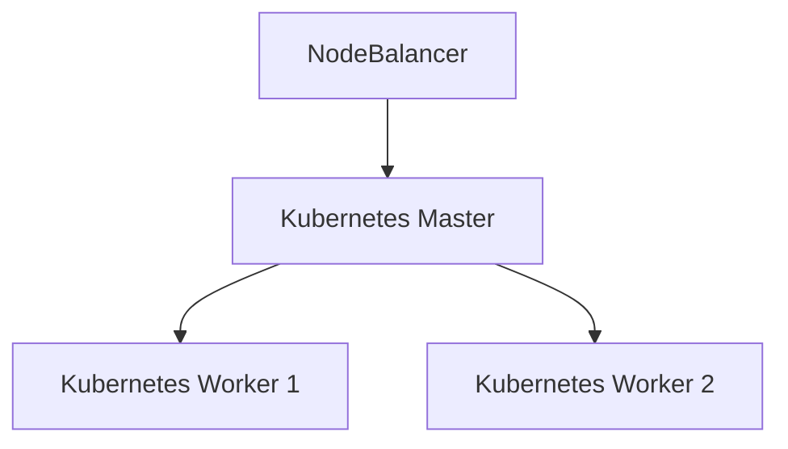

## Introduction to Running Kubernetes on Cloud Efficiently

In the realm of modern DevOps practices, automating infrastructure management is crucial for efficiency and scalability. Tools like Terraform and Enzibal (which we will refer to as Enzibal for the sake of this discussion) play pivotal roles in streamlining the process of deploying and managing Kubernetes clusters on cloud platforms such as Linode. This chapter delves into the intricacies of using these tools to achieve efficient and scalable Kubernetes deployments.

### What Are Terraform and Enzibal?

**Terraform** is an open-source infrastructure as code (IaC) tool developed by HashiCorp. It allows users to define and provision infrastructure across multiple cloud providers using a declarative configuration language called HCL (HashiCorp Configuration Language). Terraform supports a wide range of cloud providers, including Linode, AWS, Azure, and GCP.

**Enzibal** is a hypothetical automation tool similar to Terraform but with its own unique set of features and providers. For the purposes of this discussion, we will assume that Enzibal also supports Linode and other major cloud providers.

### Why Use Automation Tools for Kubernetes Deployment?

Automation tools like Terraform and Enzibal provide several benefits:

1. **Consistency**: Automated scripts ensure that the same infrastructure is deployed consistently across different environments.
2. **Scalability**: These tools make it easy to scale up or down based on demand.
3. **Efficiency**: Automating repetitive tasks saves time and reduces human error.
4. **Version Control**: Infrastructure configurations can be version-controlled, allowing for better collaboration and rollback capabilities.

### Connecting to Linode Platform

Linode is a popular cloud hosting provider that offers virtual private servers (VPS) and other cloud services. Both Terraform and Enzibal can connect to Linode to manage resources programmatically.

#### Terraform Provider for Linode

To use Terraform with Linode, you need to configure the Linode provider in your Terraform configuration file. Here’s an example of how to set up the Linode provider:

```hcl
provider "linode" {
  token = var.linode_token
}
```

In this example, `var.linode_token` is a variable that holds your Linode API token. You can define this variable in a separate `.tfvars` file or pass it via the command line.

#### Enzibal Provider for Linode

For Enzibal, the setup would be similar but with its own syntax. Here’s an example:

```yaml
providers:
  linode:
    token: ${env.LINODE_TOKEN}
```

In this example, `${env.LINODE_TOKEN}` is an environment variable that holds your Linode API token.

### Automating DevOps Work with Terraform and Enzibal

Once the providers are configured, you can start defining resources to be managed by Terraform or Enzibal. Let’s look at some examples of how to create Kubernetes clusters on Linode using these tools.

#### Example: Creating a Kubernetes Cluster with Terraform

Here’s a complete example of creating a Kubernetes cluster on Linode using Terraform:

```hcl
provider "linode" {
  token = var.linode_token
}

resource "linode_nodebalancer" "example" {
  label = "example-nodebalancer"
}

resource "linode_instance" "kubernetes_master" {
  label           = "kubernetes-master"
  region          = "us-east"
  type            = "g6-standard-1"
  image           = "ubuntu-20.04"
  authorized_users = ["admin"]
}

resource "linode_instance" "kubernetes_worker" {
  label           = "kubernetes-worker"
  region          = "us-east"
  type            = "g6-standard-1"
  image           = "ubuntu-20.04"
  authorized_users = ["admin"]
}

resource "linode_kube_cluster" "example" {
  label = "example-kube-cluster"
  node_pool {
    label = "master"
    instance_type = linode_instance.kubernetes_master.type
    count = 1
  }
  node_pool {
    label = "worker"
    instance_type = linode_instance.kkubernetes_worker.type
    count = 2
  }
}
```

This configuration sets up a Linode NodeBalancer, two instances (one master and one worker), and a Kubernetes cluster with one master node and two worker nodes.

#### Example: Creating a Kubernetes Cluster with Enzibal

Here’s a similar example using Enzibal:

```yaml
resources:
  - type: linode_nodebalancer
    name: example-nodebalancer
    properties:
      label: example-nodebalancer

  - type: linode_instance
    name: kubernetes-master
    properties:
      label: kubernetes-master
      region: us-east
      type: g6-standard-1
      image: ubuntu-20.04
      authorized_users:
        - admin

  - type: linode_instance
    name: kubernetes-worker
    properties:
      label: kubernetes-worker
      region: us-east
      type: g6-standard-1
      image: ubuntu-20.04
      authorized_users:
        - admin

  - type: linode_kube_cluster
    name: example-kube-cluster
    properties:
      label: example-kube-cluster
      node_pools:
        - label: master
          instance_type: g6-standard-1
          count: 1
        - label: worker
          instance_type: g6-standard-1
          count: 2
```

This configuration achieves the same result as the Terraform example but uses Enzibal’s syntax.

### Mermaid Diagrams for Infrastructure Topology

To visualize the infrastructure topology, we can use Mermaid diagrams. Here’s a diagram showing the setup described above:



### Common Pitfalls and How to Avoid Them

When using automation tools like Terraform and Enzibal, there are several common pitfalls to watch out for:

1. **Configuration Drift**: Ensure that your infrastructure-as-code definitions match the actual state of your infrastructure. Regularly run `terraform plan` or equivalent commands to check for drift.
2. **Security Risks**: Be cautious with sensitive information like API tokens. Use environment variables or secure vaults to store secrets.
3. **Resource Leaks**: Always clean up unused resources to avoid unnecessary costs. Use lifecycle hooks to automatically delete resources when they are no longer needed.

### How to Prevent / Defend

#### Detection

Regularly audit your infrastructure definitions against the actual state. Use tools like `terraform plan` to identify discrepancies.

#### Prevention

1. **Use Version Control**: Store your infrastructure definitions in a version control system like Git.
2. **Automate Testing**: Integrate automated testing into your CI/CD pipeline to catch issues early.
3. **Secure Secrets Management**: Use tools like HashiCorp Vault or AWS Secrets Manager to securely manage secrets.

#### Secure Coding Fixes

Here’s an example of how to securely manage secrets in Terraform:

```hcl
variable "linode_token" {
  description = "Linode API token"
  sensitive = true
}

provider "linode" {
  token = var.linode_token
}
```

And here’s the corresponding Enzibal configuration:

```yaml
variables:
  LINODE_TOKEN:
    description: Linode API token
    sensitive: true

providers:
  linode:
    token: ${env.LINODE_TOKEN}
```

### Real-World Examples and Recent Breaches

One notable breach involving cloud infrastructure misconfiguration was the Capital One data breach in 2019. The breach occurred due to a misconfigured firewall rule, which allowed unauthorized access to customer data stored in AWS S3 buckets. This highlights the importance of proper configuration and regular audits.

### Practice Labs

For hands-on practice with Kubernetes deployment on cloud platforms, consider the following labs:

- **PortSwigger Web Security Academy**: Offers a comprehensive course on web application security, including sections on cloud security.
- **OWASP Juice Shop**: A deliberately insecure web application for practicing web security skills.
- **Kubernetes Goat**: A vulnerable Kubernetes cluster for learning about Kubernetes security.

These labs provide practical experience in deploying and securing Kubernetes clusters on various cloud platforms.

### Conclusion

Using automation tools like Terraform and Enzibal to deploy Kubernetes clusters on cloud platforms like Linode can significantly improve efficiency and consistency. By understanding the concepts, avoiding common pitfalls, and implementing robust security measures, you can ensure that your Kubernetes deployments are both effective and secure.

---
<!-- nav -->
[[04-Introduction to Load Balancers in Kubernetes Clusters|Introduction to Load Balancers in Kubernetes Clusters]] | [[DevOps/DevOps Bootcamp/09-Container Orchestration (Kubernetes)/32-Running Kubernetes on Cloud Efficiently/00-Overview|Overview]] | [[06-Introduction to Running Kubernetes on Cloud|Introduction to Running Kubernetes on Cloud]]
