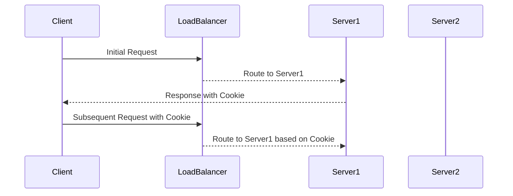

## Session Stickiness in Load Balancing

### What is Session Stickiness?

Session stickiness, also known as session persistence or sticky sessions, is a feature in load balancing that ensures that a client's requests are consistently directed to the same backend server. This is particularly important in scenarios where the backend servers maintain session state in memory, such as in web applications that rely on in-memory session management.

### Why is Session Stickiness Important?

When a client interacts with a web application, the server often maintains session state in memory. This state includes information like authentication status, user preferences, and other context-specific data. Without session stickiness, subsequent requests from the same client might be routed to different backend servers, leading to loss of session state and potential issues such as:

- **Authentication Issues**: A client might be authenticated on one server but not recognized on another.
- **Data Inconsistency**: User-specific data might not be available on a different server, leading to inconsistent user experience.

### How Does Session Stickiness Work?

In a load-balanced environment, session stickiness can be configured to ensure that a client's requests are consistently directed to the same backend server. This is typically achieved through the following mechanisms:

1. **Cookie-Based Stickiness**: The load balancer sets a cookie on the client's browser, which contains an identifier for the backend server. Subsequent requests from the client include this cookie, allowing the load balancer to route the request to the same server.
2. **IP-Based Stickiness**: The load balancer uses the client's IP address to determine which backend server to route the request to. This method is less reliable due to NAT and proxy servers but can be useful in certain scenarios.

### Example Configuration with Linux Load Balancer

Let's consider a scenario where we have a Linux-based load balancer (such as HAProxy) configured to handle session stickiness. Here’s how you can set it up:



#### Step-by-Step Configuration

1. **Install HAProxy**:
   ```bash
   sudo apt-get update
   sudo apt-get install haproxy
   ```

2. **Configure HAProxy for Session Stickiness**:
   Edit the `/etc/haproxy/haproxy.cfg` file to include the following configuration:

   ```plaintext
   frontend http_front
       bind *:80
       default_backend http_back

   backend http_back
       balance roundrobin
       stick-table type ip size 200k expire 30m
       stick on src
       server server1 192.168.1.101:80 check
       server server2 192.168.1.102:80 check
   ```

   In this configuration:
   - `stick-table` defines a table to store sticky entries.
   - `stick on src` specifies that the stickiness should be based on the client's source IP address.

3. **Restart HAProxy**:
   ```bash
   sudo systemctl restart haproxy
   ```

### Real-World Example: CVE-2021-21972

A real-world example of the importance of session stickiness is the CVE-2021-21972 vulnerability in the Apache Struts framework. This vulnerability allowed attackers to bypass authentication checks by manipulating session IDs. Proper session stickiness could have helped mitigate this issue by ensuring that session state was maintained consistently across requests.

### How to Prevent / Defend Against Session Stickiness Issues

#### Detection

To detect issues related to session stickiness, you can monitor the following:

- **Logs**: Check load balancer logs for inconsistencies in routing.
- **User Feedback**: Monitor user reports of inconsistent behavior or authentication issues.

#### Prevention

1. **Use Persistent Storage for Sessions**: Instead of relying on in-memory session storage, use persistent storage solutions like Redis or Memcached.
2. **Implement Secure Cookies**: Ensure that cookies used for session stickiness are secure and cannot be tampered with.
3. **Regular Audits**: Regularly audit your load balancer configurations to ensure they are correctly set up for session stickiness.

### Secure Code Fix Example

#### Vulnerable Code

```python
# Vulnerable Flask Application
from flask import Flask, session

app = Flask(__name__)
app.secret_key = 'supersecretkey'

@app.route('/')
def index():
    if 'username' in session:
        return f'Welcome {session["username"]}'
    else:
        return 'Please log in'
```

#### Fixed Code

```python
# Fixed Flask Application with Persistent Storage
from flask import Flask, session
import redis

app = Flask(__name__)
app.secret_key = 'supersecretkey'
redis_client = redis.Redis(host='localhost', port=6379, db=0)

@app.route('/')
def index():
    username = redis_client.get('username')
    if username:
        return f'Welcome {username.decode()}'
    else:
        return 'Please log in'
```

### Configuring SSL/TLS Certificates

### What is SSL/TLS?

SSL (Secure Sockets Layer) and its successor TLS (Transport Layer Security) are cryptographic protocols designed to provide secure communication over a computer network. They ensure that data transmitted between a client and a server is encrypted and cannot be intercepted or modified by unauthorized parties.

### Why is SSL/TLS Important?

Without SSL/TLS, data transmitted over the network can be intercepted and read by malicious actors. This includes sensitive information such as passwords, credit card details, and personal data. SSL/TLS provides the following benefits:

- **Encryption**: Ensures that data is encrypted during transmission.
- **Authentication**: Verifies the identity of the server to the client.
- **Integrity**: Ensures that data has not been tampered with during transmission.

### How to Configure SSL/TLS Certificates

#### Using Cert Manager on Linode

Cert Manager is a popular tool for managing SSL/TLS certificates in Kubernetes environments. It automates the process of obtaining and renewing certificates from Let's Encrypt or other Certificate Authorities (CAs).

1. **Install Cert Manager**:
   ```bash
   kubectl apply -f https://github.com/cert-manager/cert-manager/releases/download/v1.10.0/cert-manager.yaml
   ```

2. **Create Issuer**:
   Create an issuer resource to specify the CA and configuration details.

   ```yaml
   apiVersion: cert-manager.io/v1
   kind: Issuer
   metadata:
     name: letsencrypt-prod
   spec:
     acme:
       email: your-email@example.com
       server: https://acme-v02.api.letsencrypt.org/directory
       privateKeySecretRef:
         name: letsencrypt-prod-private-key
       solvers:
       - http01:
           ingress:
             class: nginx
   ```

3. **Request Certificate**:
   Create a certificate resource to request a certificate from the issuer.

   ```yaml
   apiVersion: cert-manager.io/v1
   kind: Certificate
   metadata:
     name: example-com-tls
   spec:
     secretName: example-com-tls
     dnsNames:
     - example.com
     issuerRef:
       name: letsencrypt-prod
       kind: Issuer
   ```

4. **Store Certificate as Kubernetes Secret**:
   Once the certificate is issued, it will be stored as a Kubernetes secret.

   ```yaml
   apiVersion: v1
   kind: Secret
   metadata:
     name: example-com-tls
   type: kubernetes.io/tls
   data:
     tls.crt: <base64-encoded-certificate>
     tls.key: <base64-encoded-private-key>
   ```

5. **Use Certificate to Secure Connection**:
   Use the certificate to secure the connection to your Kubernetes cluster.

   ```yaml
   apiVersion: networking.k8s.io/v1
   kind: Ingress
   metadata:
     name: example-ingress
     annotations:
       cert-manager.io/cluster-issuer: letsencrypt-prod
   spec:
     tls:
     - hosts:
       - example.com
       secretName: example-com-tls
     rules:
     - host: example.com
       http:
         paths:
         - path: /
           pathType: Prefix
           backend:
             service:
               name: example-service
               port:
                 number: 80
   ```

### Real-World Example: Heartbleed Bug (CVE-2014-0160)

The Heartbleed bug (CVE-2014-0160) was a serious vulnerability in the OpenSSL library that allowed attackers to steal private keys and other sensitive information from servers. Proper SSL/TLS configuration and regular updates could have helped mitigate this issue.

### How to Prevent / Defend Against SSL/TLS Issues

#### Detection

To detect SSL/TLS issues, you can perform the following:

- **Certificate Expiry Monitoring**: Monitor certificate expiry dates to ensure timely renewal.
- **Security Scanning**: Use tools like SSL Labs to scan your server for vulnerabilities.

#### Prevention

1. **Regular Updates**: Keep your SSL/TLS libraries and dependencies up to date.
2. **Strong Ciphers**: Use strong ciphers and disable weak ones.
3. **HSTS**: Implement HTTP Strict Transport Security (HSTS) to enforce secure connections.

### Complete Example: Full HTTP Request and Response

#### HTTP Request

```http
GET /api/data HTTP/1.1
Host: example.com
Accept: application/json
Authorization: Bearer <token>
```

#### HTTP Response

```http
HTTP/1.1 200 OK
Date: Mon, 20 Nov 2023 12:00:00 GMT
Content-Type: application/json
Content-Length: 1024
Connection: keep-alive
Set-Cookie: session_id=abc123; Path=/; HttpOnly; Secure

{
  "data": [
    {
      "id": 1,
      "name": "John Doe",
      "email": "john.doe@example.com"
    }
  ]
}
```

### Pitfalls and Common Mistakes

#### Pitfall: Misconfigured Load Balancer

Misconfiguring the load balancer can lead to issues such as:

- **Incorrect Routing**: Requests may not be routed to the correct backend server.
- **Session Loss**: Clients may lose session state if requests are not consistently routed.

#### Common Mistake: Weak Ciphers

Using weak ciphers can expose your application to vulnerabilities such as:

- **Man-in-the-Middle Attacks**: Attackers can intercept and decrypt traffic.
- **Data Exposure**: Sensitive data can be exposed if encryption is weak.

### Hands-On Lab Suggestions

For hands-on practice with Kubernetes and load balancing, consider the following labs:

- **Kubernetes Goat**: A hands-on lab for learning Kubernetes security.
- **OWASP WrongSecrets**: A lab for practicing secure coding and configuration.
- **kube-hunter**: A tool for finding misconfigurations and vulnerabilities in Kubernetes clusters.

These labs provide practical experience in configuring and securing Kubernetes environments, including load balancing and SSL/TLS configurations.

By thoroughly understanding and implementing these concepts, you can ensure that your Kubernetes deployments are both efficient and secure.

---
<!-- nav -->
[[07-Running Kubernetes on Cloud Efficiently|Running Kubernetes on Cloud Efficiently]] | [[DevOps/DevOps Bootcamp/09-Container Orchestration (Kubernetes)/32-Running Kubernetes on Cloud Efficiently/00-Overview|Overview]] | [[09-Vendor Lock-In in Kubernetes on Cloud Platforms|Vendor Lock-In in Kubernetes on Cloud Platforms]]
