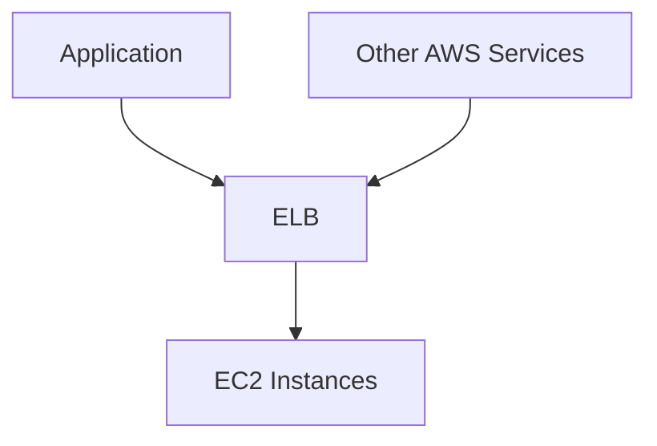

## Vendor Lock-In in Kubernetes on Cloud Platforms

When setting up a Kubernetes cluster on a cloud platform, such as AWS, Google Cloud, or Azure, one often leverages the native services provided by these platforms. These services include load balancers, storage solutions, and APIs that are specific to the cloud provider. While these services are incredibly useful and can significantly enhance the performance and reliability of your applications, they come with a significant downside: **vendor lock-in**.

### What is Vendor Lock-In?

Vendor lock-in occurs when an organization becomes dependent on a particular vendor's products or services, making it difficult or costly to switch to another vendor. In the context of Kubernetes on cloud platforms, this means that your application or parts of your application become tightly coupled to the specific cloud provider's services. This tight coupling makes it challenging to migrate your application to another cloud provider or even to an on-premises environment.

### Why Does Vendor Lock-In Matter?

Vendor lock-in matters because it limits your flexibility and can increase costs. Here are some reasons why:

1. **Cost**: Cloud providers often charge premium rates for their proprietary services. If you are locked into these services, you might find it difficult to negotiate better pricing or switch to a more cost-effective solution.
   
2. **Flexibility**: Being locked into a specific cloud provider means you lose the ability to choose the best service for your needs based on factors such as cost, performance, and features. This can be particularly problematic if the cloud provider introduces changes that negatively impact your application.

3. **Innovation**: Cloud providers frequently introduce new services and features. However, relying heavily on these proprietary services can stifle innovation within your organization, as you may be constrained by the limitations of the cloud provider's ecosystem.

### Real-World Example: AWS Elastic Load Balancer

Consider the case of AWS Elastic Load Balancer (ELB). ELB is a highly available and scalable load balancing service provided by AWS. While it is incredibly powerful and easy to use, it is also tightly integrated with other AWS services. If you build your application around ELB, moving to another cloud provider or on-premises environment would require significant rework.



### How to Prevent Vendor Lock-In

To avoid vendor lock-in, you should aim to use cloud-neutral solutions and tools that can work across different cloud providers. Here are some strategies:

1. **Use Cloud-Native Solutions**: Leverage cloud-native solutions that are designed to work across multiple cloud providers. For example, instead of using AWS ELB, you could use a cloud-neutral load balancer like NGINX or HAProxy.

2. **Containerization**: Use containerization technologies like Docker and orchestration tools like Kubernetes. Containers are portable and can run on any platform that supports Docker and Kubernetes.

3. **Infrastructure as Code (IaC)**: Use IaC tools like Terraform, Ansible, or Pulumi to manage your infrastructure. These tools allow you to define your infrastructure in code, making it easier to migrate between different cloud providers.

#### Example: Using Terraform for Cloud-Neutral Infrastructure

Here’s an example of how you can use Terraform to define a simple Kubernetes cluster that can be deployed on multiple cloud providers:

```hcl
provider "aws" {
  region = "us-west-2"
}

resource "aws_vpc" "example" {
  cidr_block = "10.0.0.0/16"
}

resource "aws_subnet" "example" {
  vpc_id     = aws_vpc.example.id
  cidr_block = "10.0.1.0/24"
}

resource "kubernetes_cluster" "example" {
  name     = "example-cluster"
  vpc_id   = aws_vpc.example.id
  subnet_ids = [aws_subnet.example.id]
}
```

This Terraform configuration defines a VPC and a subnet on AWS and then creates a Kubernetes cluster using these resources. By using Terraform, you can easily modify the provider and resource definitions to deploy the same infrastructure on a different cloud provider.

### How to Detect Vendor Lock-In

Detecting vendor lock-in involves analyzing your application and infrastructure to identify dependencies on cloud-specific services. Here are some steps to follow:

1. **Dependency Analysis**: Review your application code and infrastructure configurations to identify dependencies on cloud-specific services. Look for API calls, service integrations, and configuration settings that are specific to a particular cloud provider.

2. **Code Reviews**: Conduct regular code reviews to ensure that new dependencies on cloud-specific services are identified and addressed promptly.

3. **Automated Scanning Tools**: Use automated scanning tools like SonarQube or Snyk to identify dependencies on cloud-specific services. These tools can help you detect and address vendor lock-in issues proactively.

### How to Prevent Vendor Lock-In: Secure Coding Fixes

To prevent vendor lock-in, you should refactor your code and infrastructure to use cloud-neutral solutions. Here’s an example of how you can refactor a dependency on AWS S3 to use a cloud-neutral storage solution like MinIO:

#### Vulnerable Code: Dependency on AWS S3

```python
import boto3

def upload_to_s3(file_path, bucket_name):
    s3 = boto3.client('s3')
    s3.upload_file(file_path, bucket_name, file_path)
```

#### Refactored Code: Using MinIO

```python
from minio import Minio

def upload_to_minio(file_path, bucket_name):
    client = Minio("play.min.io", access_key="YOUR-ACCESS-KEY", secret_key="YOUR-SECRET-KEY")
    client.fput_object(bucket_name, file_path, file_path)
```

By refactoring your code to use MinIO, you can avoid vendor lock-in and make your application more portable.

### Automating Infrastructure and Deployment

As your setup grows in size, you will likely deploy more and more services, leading to a more complex infrastructure configuration. To manage this complexity, you should automate as much as possible. Automation can help you create, configure, tear down, and deploy your infrastructure and applications efficiently.

### Tools for Automation

For Linux specifically, you can use various automation tools to manage your infrastructure and deployments. Some popular tools include:

1. **Terraform**: A tool for building, changing, and combining infrastructure safely and efficiently. Terraform can manage your entire infrastructure as code, making it easier to deploy and manage across different cloud providers.

2. **Ansible**: A simple IT automation engine that automates software provisioning, configuration management, and application deployment. Ansible uses a simple YAML-based language to define your infrastructure and application deployments.

3. **Pulumi**: A modern infrastructure as code tool that allows you to write your infrastructure in familiar programming languages like JavaScript, Python, and Go. Pulumi integrates seamlessly with popular cloud providers and provides a rich set of features for managing your infrastructure.

### Example: Using Ansible for Infrastructure Automation

Here’s an example of how you can use Ansible to automate the creation and configuration of a Kubernetes cluster:

```yaml
---
- name: Create Kubernetes Cluster
  hosts: localhost
  tasks:
    - name: Create Kubernetes Cluster
      k8s:
        api_version: v1
        kind: Namespace
        metadata:
          name: my-namespace
```

This Ansible playbook creates a Kubernetes namespace. You can extend this playbook to include additional tasks for creating and configuring other Kubernetes resources.

### How to Prevent Vendor Lock-In: Detection and Prevention

To prevent vendor lock-in, you should regularly review your application and infrastructure to identify and address dependencies on cloud-specific services. Here are some steps to follow:

1. **Regular Code Reviews**: Conduct regular code reviews to identify dependencies on cloud-specific services. Address these dependencies promptly to avoid vendor lock-in.

2. **Automated Scanning Tools**: Use automated scanning tools like SonarQube or Snyk to identify dependencies on cloud-specific services. These tools can help you detect and address vendor lock-in issues proactively.

3. **Refactor Code**: Refactor your code to use cloud-neutral solutions. For example, refactor dependencies on AWS S3 to use a cloud-neutral storage solution like MinIO.

### Conclusion

Vendor lock-in is a significant concern when setting up a Kubernetes cluster on a cloud platform. By using cloud-neutral solutions and tools, you can avoid vendor lock-in and make your application more portable. Regular code reviews and automated scanning tools can help you detect and address vendor lock-in issues proactively. Automating your infrastructure and deployments can help you manage the complexity of your setup and improve efficiency.

### Practice Labs

To gain hands-on experience with these concepts, consider the following practice labs:

- **Kubernetes Goat**: A hands-on lab for learning Kubernetes security.
- **OWASP WrongSecrets**: A hands-on lab for learning about secure coding practices.
- **kube-hunter**: A tool for hunting vulnerabilities in Kubernetes clusters.

These labs provide practical experience with the concepts discussed in this chapter and can help you deepen your understanding of how to avoid vendor lock-in and manage your Kubernetes cluster effectively.

---
<!-- nav -->
[[08-Session Stickiness in Load Balancing|Session Stickiness in Load Balancing]] | [[DevOps/DevOps Bootcamp/09-Container Orchestration (Kubernetes)/32-Running Kubernetes on Cloud Efficiently/00-Overview|Overview]] | [[DevOps/DevOps Bootcamp/09-Container Orchestration (Kubernetes)/32-Running Kubernetes on Cloud Efficiently/10-Practice Questions & Answers|Practice Questions & Answers]]
