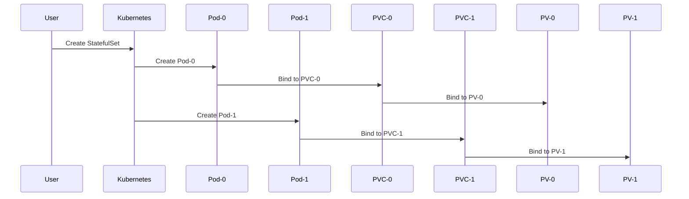

## Scaling and Replicating Containers in Kubernetes

In Kubernetes, one of the core concepts is the ability to scale and replicate applications efficiently. This is particularly important for stateless applications, which can be easily scaled horizontally by simply increasing the number of replicas. However, stateful applications require more careful handling due to their reliance on persistent storage and unique identities.

### What Are StatefulSets?

StatefulSets are a type of workload in Kubernetes designed specifically for managing stateful applications. Unlike Deployments, which manage stateless applications, StatefulSets ensure that each pod has a unique identity and persistent storage. This makes them ideal for databases, distributed systems, and other applications that require consistent data across restarts and rescheduling.

#### Why Use StatefulSets?

StatefulSets are crucial for applications that need to maintain a consistent state across multiple instances. For example, a database cluster requires each node to have a unique identifier and access to its own persistent storage. Without StatefulSets, managing such applications would be complex and error-prone.

#### How StatefulSets Work

StatefulSets work by creating pods with unique identifiers and associating them with PersistentVolumeClaims (PVCs). Each pod is guaranteed to have a stable network identity and persistent storage, even if the pod is rescheduled to a different node.



### Scaling StatefulSets

Scaling StatefulSets involves increasing or decreasing the number of replicas. This is done using the `kubectl scale` command or by updating the `replicas` field in the StatefulSet definition.

#### Example: Scaling a StatefulSet

Let's consider a simple StatefulSet for a database cluster. We will start with two replicas and then scale it to three.

```yaml
apiVersion: apps/v1
kind: StatefulSet
metadata:
  name: db-cluster
spec:
  serviceName: "db-cluster"
  replicas: 2
  selector:
    matchLabels:
      app: db
  template:
    metadata:
      labels:
        app: db
    spec:
      containers:
      - name: db
        image: postgres:latest
        ports:
        - containerPort: 5432
        volumeMounts:
        - name: db-storage
          mountPath: /var/lib/postgresql/data
  volumeClaimTemplates:
  - metadata:
      name: db-storage
    spec:
      accessModes: ["ReadWriteOnce"]
      resources:
        requests:
          storage: 1Gi
```

To scale this StatefulSet to three replicas, you can use the following command:

```sh
kubectl scale statefulset db-cluster --replicas=3
```

This will create a new pod (`db-cluster-2`) with its own PVC and PV.

### Real-World Example: PostgreSQL Cluster

Consider a PostgreSQL cluster managed by a StatefulSet. In a real-world scenario, this could be used in a production environment where high availability and data consistency are critical.

```yaml
apiVersion: apps/v1
kind: StatefulSet
metadata:
  name: postgres-cluster
spec:
  serviceName: "postgres-cluster"
  replicas: 3
  selector:
    matchLabels:
      app: postgres
  template:
    metadata:
      labels:
        app: postgres
    spec:
      containers:
      - name: postgres
        image: postgres:latest
        ports:
        - containerPort: 5432
        volumeMounts:
        - name: pg-data
          mountPath: /var/lib/postgresql/data
  volumeClaimTemplates:
  - metadata:
      name: pg-data
    spec:
      accessModes: ["ReadWriteOnce"]
      resources:
        requests:
          storage: 10Gi
```

### Pitfalls and Best Practices

While StatefulSets provide a robust way to manage stateful applications, there are several pitfalls to be aware of:

1. **Persistent Storage Management**: Ensure that PersistentVolumes are properly configured and managed. Misconfiguration can lead to data loss or corruption.
2. **Network Identity**: Each pod in a StatefulSet has a unique network identity. Ensure that your application can handle this correctly.
3. **Scaling Considerations**: Scaling up or down can affect the overall performance and stability of your application. Always test thoroughly in a staging environment before making changes in production.

### How to Prevent / Defend

#### Detection

Monitor the StatefulSet and its associated pods for any anomalies. Use tools like Prometheus and Grafana to visualize metrics and set alerts for unexpected behavior.

#### Prevention

1. **Secure Persistent Volumes**: Ensure that PersistentVolumes are encrypted and access-controlled. Use Kubernetes secrets to manage sensitive data.
2. **Automated Backups**: Implement automated backups for your stateful applications. Use tools like Velero to backup and restore StatefulSets.
3. **Regular Testing**: Regularly test your StatefulSets in a staging environment to ensure they behave as expected under various conditions.

#### Secure-Coding Fixes

Compare the vulnerable and secure versions of a StatefulSet configuration:

**Vulnerable Version:**
```yaml
apiVersion: apps/v1
kind: StatefulSet
metadata:
  name: db-cluster
spec:
  serviceName: "db-cluster"
  replicas: 2
  selector:
    matchLabels:
      app: db
  template:
    metadata:
      labels:
        app: db
    spec:
      containers:
      - name: db
        image: postgres:latest
        ports:
        - containerPort: 5432
        volumeMounts:
        - name: db-storage
          mountPath: /var/lib/postgresql/data
  volumeClaimTemplates:
  - metadata:
      name: db-storage
    spec:
      accessModes: ["ReadWriteOnce"]
      resources:
        requests:
          storage: 1Gi
```

**Secure Version:**
```yaml
apiVersion: apps/v1
kind: StatefulSet
metadata:
  name: db-cluster
spec:
  serviceName: "db-cluster"
  replicas: 2
  selector:
    matchLabels:
      app: db
  template:
    metadata:
      labels:
        app: db
    spec:
      containers:
      - name: db
        image: postgres:latest
        ports:
        - containerPort:  5432
        volumeMounts:
        - name: db-storage
          mountPath: /var/lib/post

---
<!-- nav -->
[[01-Introduction to StatefulSets in Kubernetes|Introduction to StatefulSets in Kubernetes]] | [[DevOps/DevOps Bootcamp/09-Container Orchestration (Kubernetes)/33-StatefulSets in Kubernetes Explained/00-Overview|Overview]] | [[03-StatefulSets in Kubernetes Explained|StatefulSets in Kubernetes Explained]]
