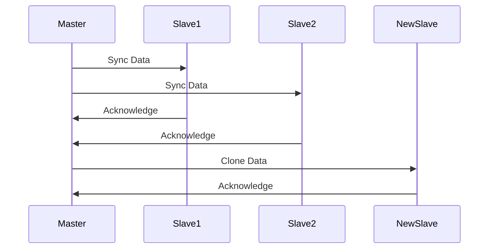

## StatefulSets in Kubernetes Explained

### Introduction to StatefulSets

In Kubernetes, a `StatefulSet` is a controller that manages stateful applications. Unlike `Deployments`, which manage stateless applications, `StatefulSets` ensure that each pod has a unique identity and persistent storage. This is particularly important for applications that require consistent and stable network identifiers and storage across pod rescheduling and restarts.

### Key Concepts

#### Pods and Storage

Pods within a `StatefulSet` do not share the same physical storage. Each pod has its own replica of the storage that it can access independently. This means that each pod replica must maintain the same data as the others. To achieve this, the pods must continuously synchronize their data.

#### Master-Slave Architecture

In a typical master-slave architecture, the master node is responsible for managing the data. The slave nodes replicate the data from the master and ensure that they remain synchronized. In the context of a `StatefulSet`, the master pod is the primary source of truth, and the slave pods replicate the data from the master.

### Data Synchronization Mechanism

The synchronization process ensures that all slave pods have the same data as the master pod. This is crucial for maintaining consistency across the cluster. The master pod is the only one allowed to change the data, and the slaves must be aware of these changes to update their own storage.

#### Continuous Synchronization

To ensure that all pods have the same state, the system uses a continuous synchronization mechanism. Whenever the master pod makes a change, all slave pods receive notifications and update their storage accordingly. This ensures that each pod has the most up-to-date information.

### Example: MySQL Cluster

Consider a scenario where you have one master pod and two slave pods running MySQL. The master pod is responsible for managing the data, and the slave pods replicate the data from the master.

#### Initial Setup

When a new pod replica joins the existing setup, it must first clone the data from the previous part. This ensures that the new pod has the same data as the existing pods.



### Persistent Volume Claims (PVCs)

Each pod in a `StatefulSet` requires a Persistent Volume Claim (PVC) to ensure that the storage is persistent even if the pod is rescheduled. PVCs are used to bind pods to specific volumes, ensuring that the data remains consistent.

#### Creating PVCs

Here is an example of creating a PVC for a pod:

```yaml
apiVersion: v1
kind: PersistentVolumeClaim
metadata:
  name: my-pvc
spec:
  accessModes:
    - ReadWriteOnce
  resources:
    requests:
      storage: 1Gi
```

### StatefulSet Configuration

A `StatefulSet` is defined using a YAML manifest. Here is an example of a `StatefulSet` configuration for a MySQL cluster:

```yaml
apiVersion: apps/v1
kind: StatefulSet
metadata:
  name: mysql-cluster
spec:
  serviceName: mysql-cluster
  replicas: 3
  selector:
    matchLabels:
      app: mysql
  template:
    metadata:
      labels:
        app: mysql
    spec:
      containers:
      - name: mysql
        image: mysql:5.7
        ports:
        - containerPort: 3306
        volumeMounts:
        - name: mysql-storage
          mountPath: /var/lib/mysql
  volumeClaimTemplates:
  - metadata:
      name: mysql-storage
    spec:
      accessModes: [ "ReadWriteOnce" ]
      resources:
        requests:
          storage: 1Gi
```

### Real-World Examples

#### CVE-2021-27325: MySQL Replication Vulnerability

CVE-2021-27325 is a vulnerability in MySQL replication that could allow an attacker to execute arbitrary code on the slave server. This highlights the importance of ensuring that all pods in a `StatefulSet` are properly synchronized and that security measures are in place to prevent unauthorized access.

#### How to Prevent / Defend

##### Detection

Regularly monitor the logs and metrics of your `StatefulSet` to detect any anomalies. Use tools like Prometheus and Grafana to visualize and analyze the data.

##### Prevention

1. **Secure Configuration**: Ensure that all pods are configured securely. Use strong passwords and enable encryption for data in transit and at rest.
   
2. **Network Policies**: Implement network policies to restrict communication between pods. Only allow necessary traffic to ensure that unauthorized access is prevented.

3. **Regular Updates**: Keep your applications and dependencies up to date to mitigate known vulnerabilities.

4. **Backup and Recovery**: Regularly back up your data and test your recovery procedures to ensure that you can recover quickly in case of a failure.

##### Secure Code Fix

Here is an example of a vulnerable configuration and a secure configuration:

**Vulnerable Configuration:**

```yaml
apiVersion: apps/v1
kind: StatefulSet
metadata:
  name: mysql-cluster
spec:
  serviceName: mysql-cluster
  replicas: 3
  selector:
    matchLabels:
      app: mysql
  template:
    metadata:
      labels:
        app: mysql
    spec:
      containers:
      - name: mysql
        image: mysql:5.7
        ports:
        - containerPort: 3306
        volumeMounts:
        - name: mysql-storage
          mountPath: /var/lib/mysql
  volumeClaimTemplates:
  - metadata:
      name: mysql-storage
    spec:
      accessModes: [ "ReadWriteOnce" ]
      resources:
        requests:
          storage: 1Gi
```

**Secure Configuration:**

```yaml
apiVersion: apps/v1
kind: StatefulSet
metadata:
  name: mysql-cluster
spec:
  serviceName: mysql-cluster
  replicas: 3
  selector:
    matchLabels:
      app: mysql
  template:
    metadata:
      labels:
        app: mysql
    spec:
      containers:
      - name: mysql
        image: mysql:5.7
        ports:
        - containerPort: 3306
        volumeMounts:
        - name: mysql-storage
          mountPath: /var/lib/mysql
        env:
        - name: MYSQL_ROOT_PASSWORD
          valueFrom:
            secretKeyRef:
              name: mysql-secret
              key: password
  volumeClaimTemplates:
  - metadata:
      name: mysql-storage
    spec:
      accessModes: [ "ReadWriteOnce" ]
      resources:
        requests:
          storage: 1Gi
```

### Hands-On Labs

For hands-on practice with `StatefulSets`, consider the following labs:

- **Kubernetes Goat**: A hands-on lab for learning Kubernetes security concepts.
- **OWASP WrongSecrets**: A series of challenges to learn about secrets management and secure coding practices.
- **kube-hunter**: A tool for discovering and exploiting misconfigurations in Kubernetes clusters.

These labs provide practical experience with setting up and securing `StatefulSets` in a Kubernetes environment.

### Conclusion

Understanding and implementing `StatefulSets` in Kubernetes is crucial for managing stateful applications. By ensuring that each pod has a unique identity and persistent storage, you can maintain consistency and stability across the cluster. Regular monitoring, secure configurations, and regular updates are essential to prevent vulnerabilities and ensure the security of your applications.

---
<!-- nav -->
[[02-Scaling and Replicating Containers in Kubernetes|Scaling and Replicating Containers in Kubernetes]] | [[DevOps/DevOps Bootcamp/09-Container Orchestration (Kubernetes)/33-StatefulSets in Kubernetes Explained/00-Overview|Overview]] | [[04-Understanding Stateful Applications and StatefulSets in Kubernetes|Understanding Stateful Applications and StatefulSets in Kubernetes]]
