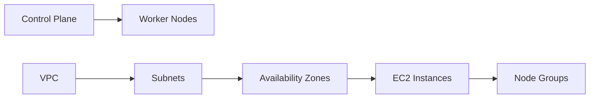

## Introduction to EKS Cluster Lifecycle Management with Terraform

In the context of DevOps and cloud-native application deployment, managing the lifecycle of an Amazon Elastic Kubernetes Service (EKS) cluster is a critical task. This chapter delves into the process of setting up and managing an EKS cluster using Terraform, a popular infrastructure-as-code (IAC) tool. We will cover the creation of the control plane, worker nodes, and the underlying networking components such as Virtual Private Clouds (VPCs).

### Control Plane and Worker Nodes

The Kubernetes cluster consists of two main components:

1. **Control Plane**: This includes the Kubernetes master nodes, which manage the cluster. The control plane is responsible for maintaining the desired state of the cluster, scheduling pods, and handling communication between different parts of the cluster.

2. **Worker Nodes**: These are the nodes where your applications run. They are typically EC2 instances that are connected to the control plane.

#### Creating Worker Nodes

To create a complete cluster, we need to set up both the control plane and the worker nodes. The worker nodes are created as EC2 instances, which can be managed manually or through node groups. Node groups simplify the management of worker nodes by automatically provisioning and configuring the necessary EC2 instances.

### Virtual Private Cloud (VPC)

A VPC is a logically isolated section of the AWS Cloud where you can launch AWS resources in a virtual network that you define. The VPC provides the network infrastructure for the worker nodes to run within.

#### Creating a VPC

To create a VPC using Terraform, we need to define the VPC configuration in our Terraform files. Here is an example of how to create a VPC:

```hcl
resource "aws_vpc" "main" {
  cidr_block           = "10.0.0.0/16"
  enable_dns_hostnames = true
  enable_dns_support   = true

  tags = {
    Name = "main-vpc"
  }
}
```

This configuration creates a VPC with a CIDR block of `10.0.0.0/16`. The `enable_dns_hostnames` and `enable_dns_support` options ensure that DNS resolution works within the VPC.

### Creating Worker Nodes

Once the VPC is set up, we can proceed to create the worker nodes. There are two primary methods to create worker nodes:

1. **Directly as EC2 Instances**
2. **Using Node Groups**

#### Directly as EC2 Instances

Creating worker nodes directly as EC2 instances involves defining the EC2 instances in Terraform and configuring them to join the EKS cluster. Here is an example of how to create an EC2 instance:

```hcl
resource "aws_instance" "worker_node" {
  ami           = data.aws_ami.worker.id
  instance_type = "t2.micro"

  vpc_security_group_ids = [aws_security_group.worker_sg.id]
  subnet_id              = aws_subnet.public.id

  key_name = aws_key_pair.worker.key_name

  tags = {
    Name = "worker-node"
  }
}
```

#### Using Node Groups

Node groups are a simpler way to manage worker nodes. They handle the provisioning and configuration of EC2 instances, ensuring that they are correctly configured to join the EKS cluster. Here is an example of how to create a node group:

```hcl
resource "aws_eks_node_group" "example" {
  cluster_name    = aws_eks_cluster.example.name
  node_group_name = "example"
  node_role_arn   = aws_iam_role.node.arn
  subnet_ids      = [aws_subnet.public.id]

  scaling_config {
    desired_size = 2
    max_size     = 2
    min_size     = 2
  }

  tags = {
    Environment = "dev"
  }
}
```

### Region and Availability Zones

When creating an EKS cluster, it is important to consider the region and availability zones (AZs) where the cluster will be deployed. Each region has multiple AZs, which provide redundancy and high availability.

#### Example Region: EUS3 (Paris)

Let's assume we are deploying the cluster in the `eu-west-3` region, which corresponds to Paris. This region has three AZs, which we can leverage to ensure high availability.

Here is an example of how to define the VPC subnets across multiple AZs:

```hcl
resource "aws_subnet" "public" {
  count          = 3
  cidr_block     = ["10.0.${count.index + 1}.0/24"]
  vpc_id         = aws_vpc.main.id
  availability_zone = ["eu-west-3a", "eu-west-3b", "eu-west-3c"]

  tags = {
    Name = "public-subnet-${count.index + 1}"
  }
}
```

### Architecture Diagram

To visualize the architecture, we can use a Mermaid diagram:



### Pitfalls and Best Practices

#### Common Pitfalls

1. **Incorrect Subnet Configuration**: Ensure that the subnets are correctly configured across multiple AZs to achieve high availability.
2. **Security Group Misconfiguration**: Incorrect security group rules can lead to security vulnerabilities.
3. **IAM Role Permissions**: Ensure that the IAM roles used by the worker nodes have the correct permissions to interact with the EKS cluster.

#### Best Practices

1. **Use Node Groups**: Node groups simplify the management of worker nodes and reduce the risk of misconfiguration.
2. **Enable VPC Flow Logs**: Enable VPC flow logs to monitor network traffic and detect potential security issues.
3. **Regularly Update AMIs**: Use the latest AMIs for worker nodes to ensure that they have the latest security patches.

### How to Prevent / Defend

#### Detection

1. **CloudTrail**: Use AWS CloudTrail to log API calls made to your AWS resources. This can help detect unauthorized access or changes to your EKS cluster.
2. **VPC Flow Logs**: Monitor VPC flow logs to detect unusual network traffic patterns.

#### Prevention

1. **IAM Policies**: Implement strict IAM policies to limit access to the EKS cluster and associated resources.
2. **Network ACLs**: Use network ACLs to restrict inbound and outbound traffic to the VPC.

#### Secure Coding Fixes

Here is an example of how to configure a secure IAM role for worker nodes:

```hcl
resource "aws_iam_role" "node" {
  name = "eks-node-role"

  assume_role_policy = jsonencode({
    Version = "2012-10-17"
    Statement = [
      {
        Effect = "Allow"
        Principal = {
          Service = "ec2.amazonaws.com"
        }
        Action = "sts:AssumeRole"
      }
    ]
  })
}

resource "aws_iam_role_policy_attachment" "node_policy" {
  role       = aws_iam_role.node.name
  policy_arn = "arn:aws:iam::aws:policy/AmazonEKSCNIPolicy"
}
```

### Real-World Examples

#### Recent Breaches

One notable breach involving Kubernetes clusters was the **CVE-2021-25741** vulnerability in the Kubernetes API server. This vulnerability allowed attackers to bypass authentication and gain unauthorized access to the cluster. To mitigate such risks, it is crucial to keep your Kubernetes components up to date and implement strict access controls.

### Conclusion

Managing the lifecycle of an EKS cluster using Terraform involves setting up the control plane, worker nodes, and the underlying networking components. By following best practices and implementing robust security measures, you can ensure that your EKS cluster is secure and highly available.

### Practice Labs

For hands-on practice with Terraform and EKS, consider the following labs:

- **PortSwigger Web Security Academy**: Offers a comprehensive course on web security, including sections on cloud-native security.
- **AWS Official Workshops**: Provides guided labs on various AWS services, including EKS and Terraform.
- **Pacu**: A penetration testing framework for AWS that can help you test the security of your EKS cluster.

By completing these labs, you can gain practical experience in managing EKS clusters with Terraform and ensure that your deployments are secure and reliable.

---
<!-- nav -->
[[DevOps/DevOps Bootcamp/09-Container Orchestration (Kubernetes)/34-Terraform Management of EKS Cluster Lifecycle/00-Overview|Overview]] | [[02-Introduction to Tags in AWS|Introduction to Tags in AWS]]
