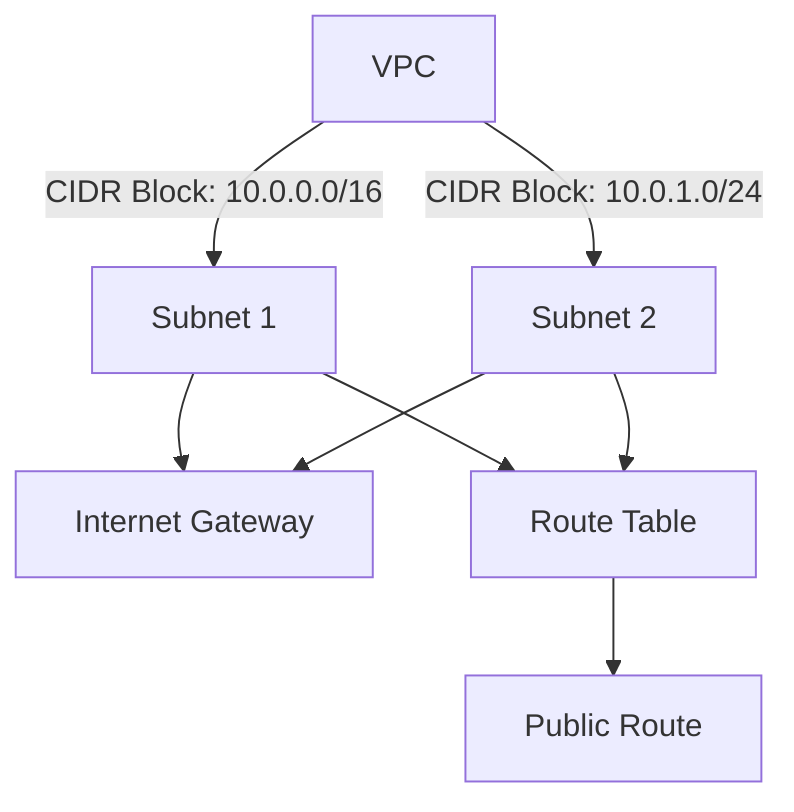
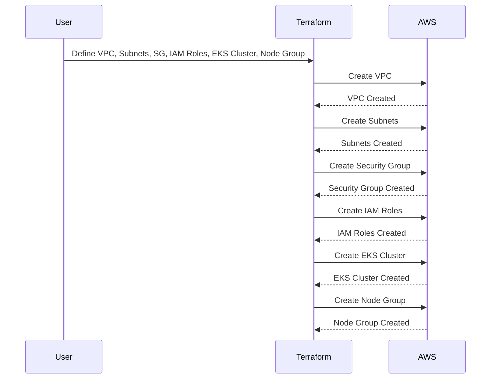

## Introduction to Terraform Management of EKS Cluster Lifecycle

### Background Theory

Amazon Elastic Kubernetes Service (EKS) is a managed service that makes it easy to run Kubernetes on AWS without needing to stand up or maintain your own Kubernetes control plane. Kubernetes is an open-source system for automating deployment, scaling, and management of containerized applications. 

Terraform is an infrastructure as code (IaC) tool that allows you to define and provision your infrastructure using declarative configuration files. This approach enables you to manage your infrastructure in a consistent and repeatable manner, which is particularly useful when dealing with complex systems like EKS clusters.

### Why Use Terraform for EKS Cluster Management?

When creating an EKS cluster manually through the AWS Management Console or using the `eksctl` tool, you encounter several challenges:

1. **Complexity**: Creating an EKS cluster involves numerous steps, such as setting up VPCs, subnets, security groups, IAM roles, and worker nodes. Each of these components requires careful configuration.
2. **Change Management**: Once the cluster is set up, making changes becomes cumbersome. You need to navigate through various AWS services to adjust configurations, and keeping track of these changes can be difficult.
3. **Reproducibility**: Replicating the same environment across different AWS accounts or environments (e.g., production, development, testing) requires remembering and reapplying the exact configurations used previously.
4. **Cleanup**: Deleting the entire cluster and associated resources requires careful orchestration to avoid leaving behind orphaned resources.

Using Terraform to manage the lifecycle of an EKS cluster addresses these issues by providing a declarative way to define and manage your infrastructure.

### Key Concepts

#### Infrastructure as Code (IaC)

Infrastructure as Code (IaC) is the practice of managing and provisioning computer data centers through machine-readable definition files, rather than physical hardware configuration or interactive configuration tools. This approach allows you to treat your infrastructure like software, enabling version control, automated testing, and continuous integration/continuous delivery (CI/CD).

#### Terraform Modules

Terraform modules are reusable collections of resources that can be combined to form more complex infrastructure. By using modules, you can abstract away the details of individual resources and focus on higher-level abstractions.

#### State Management

Terraform maintains a state file that tracks the current state of your infrastructure. This state file is crucial for Terraform to understand what resources exist and how they should be managed. Proper state management ensures consistency and reliability in your infrastructure.

### Setting Up Terraform for EKS Cluster Management

To manage an EKS cluster using Terraform, you need to define the necessary resources in Terraform configuration files. Below is a step-by-step guide to setting up an EKS cluster using Terraform.

#### Prerequisites

Before you begin, ensure you have the following:

1. **AWS Account**: An active AWS account with the necessary permissions.
2. **Terraform Installed**: Ensure Terraform is installed on your local machine.
3. **AWS CLI Configured**: Configure the AWS CLI with your credentials.

#### Step-by-Step Guide

1. **Initialize Terraform**:
    ```bash
    terraform init
    ```

2. **Define the VPC**:
    ```hcl
    resource "aws_vpc" "main" {
      cidr_block = "10.0.0.0/16"
    }
    ```

3. **Create Subnets**:
    ```hcl
    resource "aws_subnet" "public" {
      count             = 2
      vpc_id            = aws_vpc.main.id
      cidr_block        = ["10.0.${count.index}.0/24", "10.0.${count.index + 1}.0/24"]
      availability_zone = ["us-west-2a", "us-west-2b"]
    }
    ```

4. **Set Up Internet Gateway and Route Tables**:
    ```hcl
    resource "aws_internet_gateway" "main" {
      vpc_id = aws_vpc.main.id
    }

    resource "aws_route_table" "public" {
      vpc_id = aws_vpc.main.id

      route {
        cidr_block = "0.0.0.0/0"
        gateway_id = aws_internet_gateway.main.id
      }
    }

    resource "aws_route_table_association" "public" {
      count          = 2
      subnet_id      = element(aws_subnet.public.*.id, count.index)
      route_table_id = aws_route_table.public.id
    }
    ```

5. **Create Security Groups**:
    ```hcl
    resource "aws_security_group" "eks" {
      name        = "eks-sg"
      description = "Security group for EKS cluster"
      vpc_id      = aws_vpc.main.id

      ingress {
        from_port   = 443
        to_port     = 443
        protocol    = "tcp"
        cidr_blocks = ["0.0.0.0/0"]
      }

      egress {
        from_port   = 0
        to_port     = 0
        protocol    = "-1"
        cidr_blocks = ["0.0.0.0/0"]
      }
    }
    ```

6. **Create IAM Roles**:
    ```hcl
    resource "aws_iam_role" "eks_worker_node" {
      name = "eks-worker-node"

      assume_role_policy = jsonencode({
        Version = "2012-10-17"
        Statement = [
          {
            Action = "sts:AssumeRole"
            Effect = "Allow"
            Principal = {
              Service = "ec2.amazonaws.com"
            }
          }
        ]
      })
    }

    resource "aws_iam_role_policy_attachment" "eks_worker_node_policy" {
      role       = aws_iam_role.eks_worker_node.name
      policy_arn = "arn:aws:iam::aws:policy/AmazonEKSClusterPolicy"
    }
    ```

7. **Create EKS Cluster**:
    ```hcl
    resource "aws_eks_cluster" "main" {
      name     = "my-eks-cluster"
      role_arn = aws_iam_role.eks_control_plane.arn

      vpc_config {
        subnet_ids = aws_subnet.public.*.id
      }
    }
    ```

8. **Create Node Group**:
    ```hcl
    resource "aws_eks_node_group" "main" {
      cluster_name    = aws_eks_cluster.main.name
      node_group_name = "my-node-group"
      node_role_arn   = aws_iam_role.eks_worker_node.arn
      subnet_ids      = aws_subnet.public.*.id

      scaling_config {
        desired_size = 2
        max_size     = 4
        min_size     = 1
      }
    }
    ```

9. **Apply the Configuration**:
    ```bash
    terraform apply
    ```

### Mermaid Diagrams

#### Network Topology


#### Resource Flow


### Common Pitfalls and Best Practices

#### Common Mistakes

1. **Incorrect CIDR Blocks**: Using overlapping CIDR blocks can lead to routing conflicts.
2. **Insufficient Permissions**: Not granting sufficient permissions to IAM roles can cause failures during cluster creation.
3. **Incomplete Cleanup**: Failing to delete all associated resources can leave behind orphaned resources.

#### Best Practices

1. **Version Control**: Store your Terraform configuration files in a version control system to track changes.
2. **State Management**: Use remote state storage (e.g., S3 bucket) to share state across team members.
3. **Automated Testing**: Implement automated tests to validate your infrastructure definitions.

### Real-World Examples

#### Recent Breaches and CVEs

One notable breach involving misconfigured Kubernetes clusters was the **CVE-2021-20225**. This vulnerability allowed unauthorized access to Kubernetes API servers due to misconfigured RBAC policies. Using Terraform to manage your EKS cluster helps mitigate such risks by ensuring consistent and secure configurations.

### How to Prevent / Defend

#### Detection

1. **Audit Logs**: Enable AWS CloudTrail to log API calls made to your EKS cluster.
2. **Monitoring Tools**: Use tools like AWS CloudWatch to monitor the health and performance of your cluster.

#### Prevention

1. **Secure IAM Policies**: Ensure IAM roles have the minimum necessary permissions.
2. **Network Isolation**: Use private subnets and network isolation techniques to limit access to your EKS cluster.

#### Secure Coding Fixes

##### Vulnerable Configuration
```hcl
resource "aws_iam_role" "eks_worker_node" {
  name = "eks-worker-node"

  assume_role_policy = jsonencode({
    Version = "2012-10-17"
    Statement = [
      {
        Action = "sts:AssumeRole"
        Effect = "Allow"
        Principal = {
          Service = "ec2.amazonaws.com"
        }
      }
    ]
  })
}

resource "aws_iam_role_policy_attachment" "eks_worker_node_policy" {
  role       = aws_iam_role.eks_worker_node.name
  policy_arn = "arn:aws:iam::aws:policy/AmazonEKSClusterPolicy"
}
```

##### Secure Configuration
```hcl
resource "aws_iam_role" "eks_worker_node" {
  name = "eks-worker-node"

  assume_role_policy = jsonencode({
    Version = "2012-10-17"
    Statement = [
      {
        Action = "sts:AssumeRole"
        Effect = "Allow"
        Principal = {
          Service = "ec2.amazonaws.com"
        }
      }
    ]
  })
}

resource "aws_iam_role_policy_attachment" "eks_worker_node_policy" {
  role       = aws__iam_role.eks_worker_node.name
  policy_arn = "arn:aws:iam::aws:policy/AmazonEKSServicePolicy"
}
```

### Complete Example

#### Full Terraform Configuration

```hcl
provider "aws" {
  region = "us-west-2"
}

resource "aws_vpc" "main" {
  cidr_block = "10.0.0.0/16"
}

resource "aws_subnet" "public" {
  count             = 2
  vpc_id            = aws_vpc.main.id
  cidr_block        = ["10.0.${count.index}.0/24", "10.0.${count.index + 1}.0/24"]
  availability_zone = ["us-west-2a", "us-west-2b"]
}

resource "aws_internet_gateway" "main" {
  vpc_id = aws_vpc.main.id
}

resource "aws_route_table" "public" {
  vpc_id = aws_vpc.main.id

  route {
    cidr_block = "0.0.0.0/0"
    gateway_id = aws_internet_gateway.main.id
  }
}

resource "aws_route_table_association" "public" {
  count          = 2
  subnet_id      = element(aws_subnet.public.*.id, count.index)
  route_table_id = aws_route_table.public.id
}

resource "aws_security_group" "eks" {
  name        = "eks-sg"
  description = "Security group for EKS cluster"
  vpc_id      = aws_vpc.main.id

  ingress {
    from_port   = 443
    to_port     = 443
    protocol    = "tcp"
    cidr_blocks = ["0.0.0.0/0"]
  }

  egress {
    from_port   = 0
    to_port     = 0
    protocol    = "-1"
    cidr_blocks = ["0.0.0.0/0"]
  }
}

resource "aws_iam_role" "eks_worker_node" {
  name = "eks-worker-node"

  assume_role_policy = jsonencode({
    Version = "2012-10-17"
    Statement = [
      {
        Action = "sts:AssumeRole"
        Effect = "Allow"
        Principal = {
          Service = "ec2.amazonaws.com"
        }
      }
    ]
  })
}

resource "aws_iam_role_policy_attachment" "eks_worker_node_policy" {
  role       = aws_iam_role.eks_worker_node.name
  policy_arn = "arn:aws:iam::aws:policy/AmazonEKSServicePolicy"
}

resource "aws_eks_cluster" "main" {
  name     = "my-eks-cluster"
  role_arn = aws_iam_role.eks_control_plane.arn

  vpc_config {
    subnet_ids = aws_subnet.public.*.id
  }
}

resource "aws_eks_node_group" "main" {
  cluster_name    = aws_eks_cluster.main.name
  node_group_name = "my-node-group"
  node_role_arn   = aws_iam_role.eks_worker_node.arn
  subnet_ids      = aws_subnet.public.*.id

  scaling_config {
    desired_size = 2
    max_size     = 4
    min_size     = 1
  }
}
```

#### Full HTTP Request and Response

```http
POST /terraform/apply HTTP/1.1
Host: api.example.com
Content-Type: application/json
Authorization: Bearer <token>

{
  "configuration": "<full Terraform configuration>"
}
```

```http
HTTP/1.1 200 OK
Content-Type: application/json

{
  "status": "success",
  "message": "Terraform apply completed successfully."
}
```

### Practice Labs

For hands-on experience with Terraform and EKS cluster management, consider the following labs:

- **PortSwigger Web Security Academy**: Focuses on web application security but includes sections on infrastructure security.
- **OWASP Juice Shop**: A deliberately insecure web application for security training.
- **DVWA (Damn Vulnerable Web Application)**: Another web application for security training.
- **Kubernetes Goat**: A vulnerable Kubernetes cluster for learning security practices.
- **OWASP WrongSecrets**: A series of challenges to learn about secrets management.
- **kube-hunter**: A tool for discovering and exploiting vulnerabilities in Kubernetes clusters.

These labs provide practical experience in managing and securing EKS clusters using Terraform.

### Conclusion

Managing the lifecycle of an EKS cluster using Terraform provides a robust and scalable solution for infrastructure management. By leveraging Terraform's declarative approach, you can simplify the creation, modification, and deletion of your EKS cluster, ensuring consistency and security across different environments.

---
<!-- nav -->
[[02-Introduction to Tags in AWS|Introduction to Tags in AWS]] | [[DevOps/DevOps Bootcamp/09-Container Orchestration (Kubernetes)/34-Terraform Management of EKS Cluster Lifecycle/00-Overview|Overview]] | [[04-Introduction to Terraform and EKS Cluster Management|Introduction to Terraform and EKS Cluster Management]]
