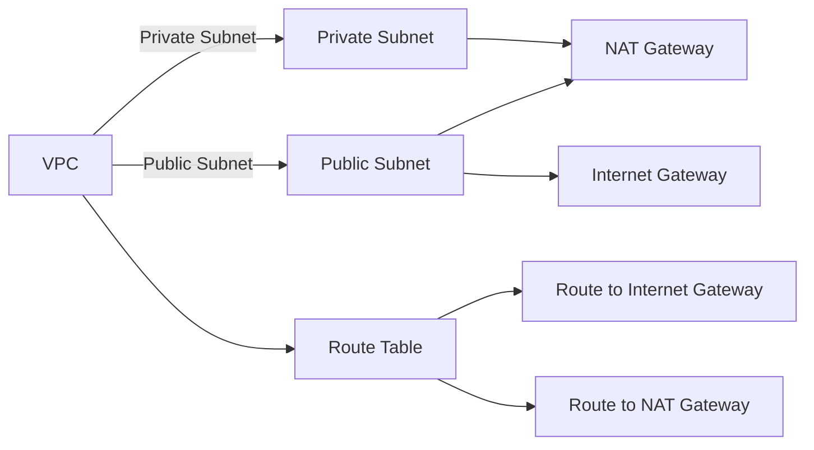

## Introduction to Terraform and EKS Cluster Management

In the realm of DevOps, managing infrastructure as code (IaC) is crucial for maintaining consistency, automation, and scalability. One of the most popular tools for IaC is Terraform, which allows you to define your infrastructure in a declarative manner using a high-level configuration language. This chapter focuses on using Terraform to manage the lifecycle of an Amazon Elastic Kubernetes Service (EKS) cluster, specifically focusing on the creation of a Virtual Private Cloud (VPC).

### Understanding Terraform

Terraform is an open-source infrastructure as code software tool created by HashiCorp. It enables users to safely and predictably create, change, and improve infrastructure. Terraform can manage infrastructure across multiple cloud providers and even on-premises environments. This makes it highly versatile and widely adopted in the industry.

#### Key Concepts in Terraform

1. **Providers**: Providers are plugins for Terraform that allow it to interact with different cloud services. Each provider is responsible for a specific cloud service, such as AWS, Azure, or Google Cloud. Providers are essentially packages of code that get installed and downloaded whenever needed.

2. **Modules**: Modules are reusable components in Terraform that encapsulate a set of related resources. They help in organizing and reusing configurations. By using modules, you can abstract away complex configurations and focus on higher-level abstractions.

3. **State Management**: Terraform maintains an internal state of the infrastructure it manages. This state is stored in a `.tfstate` file and is used to track the current state of the infrastructure. Terraform uses this state to determine what changes need to be made to bring the actual infrastructure in line with the desired state defined in the configuration files.

### Comparison with CloudFormation

CloudFormation is another popular IaC tool, but it is specific to AWS. While both Terraform and CloudFormation serve similar purposes, there are some key differences:

- **Platform Independence**: Terraform supports multiple cloud providers and on-premises environments, whereas CloudFormation is specific to AWS.
- **Syntax and Configuration**: Terraform uses a more flexible and expressive configuration language compared to CloudFormation, which uses JSON or YAML.
- **Community and Ecosystem**: Terraform has a larger community and a richer ecosystem of modules and providers, making it easier to find pre-built solutions.

### Creating a VPC for EKS Cluster

To create a VPC for an EKS cluster, we can leverage existing Terraform modules available in the Terraform Registry. These modules provide pre-built configurations that can be customized with input parameters.

#### Step-by-Step Guide to Creating a VPC Module

1. **Identify the Module**: In the Terraform Registry, locate the VPC module that suits your requirements. For example, the `terraform-aws-modules/vpc/aws` module is widely used and well-maintained.

2. **Create a New File**: Create a new Terraform configuration file named `vpc.tf`. This file will contain the configuration for the VPC module.

3. **Define the Module**: Define the module in your `vpc.tf` file. You need to specify the source of the module and pass in the required parameters.

```hcl
module "my_app_vpc" {
  source = "terraform-aws-modules/vpc/aws"
  name = "my-app-vpc"
  cidr = "10.0.0.0/16"
  azs = ["us-west-2a", "us-west-2b", "us-west-2c"]
  public_subnets = ["10.0.1.0/24", "10.0.2.0/24", "10.0.3.0/24"]
  private_subnets = ["10.0.4.0/24", "10.0.5.0/24", "10.0.6.0/24"]
  enable_nat_gateway = true
}
```

#### Explanation of Parameters

- **name**: A unique name for the VPC.
- **cidr**: The CIDR block for the VPC.
- **azs**: Availability zones where the VPC will be deployed.
- **public_subnets**: CIDR blocks for public subnets.
- **private_subnets**: CIDR blocks for private subnets.
- **enable_nat_gateway**: Whether to enable a NAT gateway for outbound traffic from private subnets.

### Detailed Configuration Example

Let's dive deeper into the configuration and understand each component in detail.

#### Full Configuration Example

```hcl
provider "aws" {
  region = "us-west-2"
}

module "my_app_vpc" {
  source = "terraform-aws-modules/vpc/aws"
  name = "my-app-vpc"
  cidr = "10.0.0.0/16"
  azs = ["us-west-2a", "us-west-2b", "us-west-2c"]
  public_subnets = ["10.0.1.0/24", "10.0.2.0/24", "10.0.3.0/24"]
  private_subnets = ["1.0.4.0/24", "10.0.5.0/24", "10.0.6.0/24"]
  enable_nat_gateway = true
  enable_dns_hostnames = true
  enable_dns_support = true
  tags = {
    Name = "My App VPC"
    Environment = "Production"
  }
}
```

#### Explanation of Additional Parameters

- **enable_dns_hostnames**: Enables DNS hostnames for the VPC.
- **enable_dns_support**: Enables DNS support for the VPC.
- **tags**: Custom tags to be applied to the VPC resources.

### Mermaid Diagrams for VPC Architecture

To better visualize the VPC architecture, we can use a mermaid diagram.



### Common Pitfalls and Best Practices

When working with Terraform and VPCs, there are several common pitfalls to avoid:

1. **CIDR Block Overlap**: Ensure that the CIDR blocks for subnets do not overlap with other networks.
2. **Security Groups**: Properly configure security groups to control inbound and outbound traffic.
3. **NAT Gateway**: Ensure that the NAT gateway is properly configured for outbound traffic from private subnets.
4. **DNS Support**: Enable DNS support and hostnames for the VPC to ensure proper resolution of internal resources.

### How to Prevent / Defend

#### Detection

- **Regular Audits**: Regularly audit your VPC configurations to ensure they align with your security policies.
- **Logging and Monitoring**: Enable logging and monitoring for VPC resources to detect any unauthorized changes or access attempts.

#### Prevention

- **IAM Policies**: Use strict IAM policies to limit access to VPC resources.
- **Network ACLs**: Configure Network Access Control Lists (ACLs) to restrict traffic based on IP addresses and ports.
- **Security Groups**: Use security groups to control traffic between subnets and external networks.

#### Secure Coding Fixes

**Vulnerable Code Example**

```hcl
module "my_app_vpc" {
  source = "terraform-aws-modules/vpc/aws"
  name = "my-app-vpc"
  cidr = "10.0.0.0/16"
  azs = ["us-west-2a", "us-west-2b", "us-west-2c"]
  public_subnets = ["10.0.1.0/24", "10.0.2.0/24", "10.0.3.0/24"]
  private_subnets = ["10.0.4.0/24", "10.0.5.0/24", "10.0.6.0/24"]
  enable_nat_gateway = false
}
```

**Secure Code Example**

```hcl
module "my_app_vpc" {
  source = "terraform-aws-modules/vpc/aws"
  name = "my-app-vpc"
  cidr = "10.0.0.0/16"
  azs = ["us-west-2a", "us-west-2b", "us-west-2c"]
  public_subnets = ["10.0.1.0/24", "10.0.2.0/24", "10.0.3.0/24"]
  private_subnets = ["10.0.4.0/24", "10.0.5.0/24", "10.0.6.0/24"]
  enable_nat_gateway = true
  enable_dns_hostnames = true
  enable_dns_support = true
  tags = {
    Name = "My App VPC"
    Environment = "Production"
  }
}
```

### Real-World Examples and Breaches

Recent breaches and vulnerabilities often involve misconfigured VPCs and security groups. For example, the Capital One breach in 2019 was partly due to misconfigured security groups, allowing unauthorized access to sensitive data.

### Hands-On Labs

For practical experience, consider the following labs:

- **PortSwigger Web Security Academy**: Offers hands-on labs for web application security.
- **OWASP Juice Shop**: A deliberately insecure web application for practicing security skills.
- **DVWA (Damn Vulnerable Web Application)**: Another web application for learning security concepts.
- **WebGoat**: An interactive web application for learning about web security.

### Conclusion

Managing the lifecycle of an EKS cluster using Terraform involves creating a robust VPC configuration. By leveraging existing modules and best practices, you can ensure that your infrastructure is secure, scalable, and maintainable. Always remember to regularly audit and monitor your configurations to prevent potential security issues.

---
<!-- nav -->
[[03-Introduction to Terraform Management of EKS Cluster Lifecycle|Introduction to Terraform Management of EKS Cluster Lifecycle]] | [[DevOps/DevOps Bootcamp/09-Container Orchestration (Kubernetes)/34-Terraform Management of EKS Cluster Lifecycle/00-Overview|Overview]] | [[05-Specifying the Provider in Terraform|Specifying the Provider in Terraform]]
