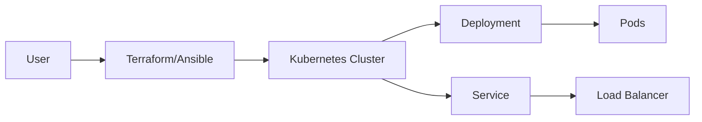

## Introduction to Kubernetes Deployment Using Terraform and Ansible

In this section, we will delve into deploying Kubernetes components using Terraform and Ansible. Specifically, we will focus on deploying Kubernetes components from a YAML configuration file. This approach allows us to leverage existing configuration files, making our deployments more modular and maintainable.

### Background Theory

Kubernetes is an open-source system for automating deployment, scaling, and management of containerized applications. It groups containers that make up an application into logical units called pods, which can be managed and scaled as a single entity. Kubernetes provides mechanisms for deploying applications, scaling them, and managing their lifecycle.

Terraform is an infrastructure as code (IaC) tool that allows you to define and provision your infrastructure using declarative configuration files. It supports a wide range of cloud providers and services, including Kubernetes clusters.

Ansible is an automation tool that enables you to manage your infrastructure and applications. It uses playbooks written in YAML to describe the desired state of your systems and applies these changes in a consistent and repeatable manner.

### Deploying Kubernetes Components from YAML Configuration Files

When deploying Kubernetes components, it is often useful to use existing YAML configuration files. These files contain the necessary specifications for creating and managing Kubernetes resources such as deployments, services, and namespaces.

#### Example YAML Configuration File

Let's consider a simple Kubernetes deployment and service configuration:

```yaml
# deployment.yaml
apiVersion: apps/v1
kind: Deployment
metadata:
  name: engine-x-deployment
spec:
  replicas: 3
  selector:
    matchLabels:
      app: engine-x
  template:
    metadata:
      labels:
        app: engine-x
    spec:
      containers:
      - name: engine-x
        image: nginx:latest
        ports:
        - containerPort: 80

---
# service.yaml
apiVersion: v1
kind: Service
metadata:
  name: engine-x-service
spec:
  type: LoadBalancer
  selector:
    app: engine-x
  ports:
  - protocol: TCP
    port: 80
    targetPort: 80
```

This configuration defines a deployment with three replicas of the `nginx` container and a load balancer service that exposes the deployment.

### Using Terraform to Deploy Kubernetes Resources

To deploy these resources using Terraform, we can use the `kubernetes_deployment` and `kubernetes_service` resources. Here is an example Terraform configuration:

```hcl
provider "kubernetes" {
  config_path = "~/.kube/config"
}

resource "kubernetes_deployment" "engine_x" {
  metadata {
    name = "engine-x-deployment"
  }
  spec {
    replicas = 3
    selector {
      match_labels = {
        app = "engine-x"
      }
    }
    template {
      metadata {
        labels = {
          app = "engine-x"
        }
      }
      spec {
        container {
          name  = "engine-x"
          image = "nginx:latest"
          port {
            container_port = 80
          }
        }
      }
    }
  }
}

resource "kubernetes_service" "engine_x" {
  metadata {
    name = "engine-x-service"
  }
  spec {
    type = "LoadBalancer"
    selector = {
      app = "engine-x"
    }
    port {
      port        = 80
      target_port = 80
    }
  }
}
```

### Using Ansible to Deploy Kubernetes Resources

Alternatively, we can use Ansible to deploy these resources. Ansible provides a `k8s` module that can be used to apply Kubernetes configurations from YAML files.

Here is an example Ansible playbook:

```yaml
---
- name: Deploy Kubernetes resources
  hosts: localhost
  gather_facts: false
  tasks:
    - name: Apply deployment configuration
      k8s:
        src: deployment.yaml
        state: present

    - name: Apply service configuration
      k8s:
        src: service.yaml
        state: present
```

### Specifying the Source Attribute in Ansible

The `src` attribute in the `k8s` module specifies the path to the Kubernetes YAML configuration file. This allows Ansible to read the configuration from the file and apply it to the Kubernetes cluster.

For example, if we have the following directory structure:

```
.
├── deployment.yaml
└── service.yaml
```

We can specify the `src` attribute as follows:

```yaml
- name: Apply deployment configuration
  k8s:
    src: ./deployment.yaml
    state: present

- name: Apply service configuration
  k8s:
    src: ./service.yaml
    state: present
```

### Managing State with Ansible

The `state` attribute in the `k8s` module determines whether the resource should be created (`present`) or deleted (`absent`). This allows us to manage the lifecycle of our Kubernetes resources.

For example, to delete the resources, we can set the `state` attribute to `absent`:

```yaml
- name: Delete deployment configuration
  k8s:
    src: ./deployment.yaml
    state: absent

- name: Delete service configuration
  k8s:
    src: ./service.yaml
    state: absent
```

### Specifying the Context and Namespace

When deploying Kubernetes resources, it is important to specify the context and namespace. The context determines which Kubernetes cluster to use, and the namespace determines the scope of the resources.

For example, to specify the context and namespace, we can use the `context` and `namespace` attributes in the `k8s` module:

```yaml
- name: Apply deployment configuration
  k8s:
    src: ./deployment.yaml
    state: present
    context: my-context
    namespace: my-namespace

- name: Apply service configuration
  k8s:
    src: ./service.yaml
    state: present
    context: my-context
    namespace: my-namespace
```

If the Kubernetes configuration file does not specify a namespace, the resources will be created in the default namespace.

### Real-World Examples and Recent CVEs

Deploying Kubernetes resources from YAML configuration files is a common practice in modern DevOps workflows. However, it is important to be aware of potential security risks and vulnerabilities.

One recent example is the Kubernetes API server vulnerability (CVE-2021-25741), which allowed unauthenticated attackers to bypass authentication and gain unauthorized access to the Kubernetes cluster. This vulnerability highlights the importance of securing the Kubernetes API server and ensuring proper authentication and authorization mechanisms are in place.

### How to Prevent / Defend

To prevent and defend against potential security risks when deploying Kubernetes resources, follow these best practices:

1. **Secure the Kubernetes API Server**: Ensure that the Kubernetes API server is properly secured and configured with strong authentication and authorization mechanisms. Use TLS encryption for all communication between the API server and clients.

2. **Use Role-Based Access Control (RBAC)**: Implement RBAC to control access to Kubernetes resources based on roles and permissions. Limit the privileges of users and service accounts to the minimum required for their tasks.

3. **Validate YAML Configuration Files**: Validate the YAML configuration files before applying them to the Kubernetes cluster. Use tools like `kubectl` to validate the configuration files and ensure they conform to the expected schema.

4. **Monitor and Audit**: Monitor the Kubernetes cluster for suspicious activity and audit the logs regularly. Use tools like Kubernetes audit logging to track changes to the cluster and detect potential security incidents.

5. **Keep Software Up-to-Date**: Keep the Kubernetes cluster and related software up-to-date with the latest security patches and updates. Regularly review and update the configuration files to address any known vulnerabilities.

### Complete Example

Here is a complete example of deploying Kubernetes resources using Ansible:

```yaml
---
- name: Deploy Kubernetes resources
  hosts: localhost
  gather_facts: false
  tasks:
    - name: Apply deployment configuration
      k8s:
        src: ./deployment.yaml
        state: present
        context: my-context
        namespace: my-namespace

    - name: Apply service configuration
      k8s:
        src: ./service.yaml
        state: present
        context: my-context
        namespace: my-namespace
```

### Pitfalls and Common Mistakes

When deploying Kubernetes resources from YAML configuration files, there are several common pitfalls and mistakes to avoid:

1. **Incorrect Configuration**: Ensure that the YAML configuration files are correct and valid. Use tools like `kubectl` to validate the configuration files before applying them to the Kubernetes cluster.

2. **Missing Context or Namespace**: Ensure that the context and namespace are specified correctly. If the context or namespace is missing, the resources may be deployed in the wrong cluster or namespace.

3. **Insufficient Permissions**: Ensure that the user or service account has sufficient permissions to deploy the resources. Use RBAC to control access to the Kubernetes resources based on roles and permissions.

4. **Security Risks**: Be aware of potential security risks and vulnerabilities when deploying Kubernetes resources. Follow best practices to secure the Kubernetes cluster and prevent unauthorized access.

### Conclusion

Deploying Kubernetes components from YAML configuration files using Terraform and Ansible is a powerful and flexible approach. By leveraging existing configuration files, we can manage our Kubernetes resources in a consistent and repeatable manner. However, it is important to be aware of potential security risks and follow best practices to secure the Kubernetes cluster and prevent unauthorized access.

### Practice Labs

To gain hands-on experience with deploying Kubernetes resources using Terraform and Ansible, consider the following practice labs:

- **PortSwigger Web Security Academy**: Offers a variety of labs focused on web application security, including Kubernetes security.
- **OWASP Juice Shop**: A deliberately insecure web application for security training.
- **Kubernetes Goat**: A Kubernetes-based security training platform.
- **WrongSecrets**: A series of challenges focused on Kubernetes security.

These labs provide practical experience with deploying and securing Kubernetes resources, helping you to master the skills needed for effective DevOps practices.



This diagram illustrates the workflow of deploying Kubernetes resources using Terraform or Ansible. The user interacts with Terraform or Ansible, which then deploys the resources to the Kubernetes cluster. The deployment creates pods, and the service exposes the deployment through a load balancer.

---
<!-- nav -->
[[01-Introduction to Kubernetes Configuration with Ansible|Introduction to Kubernetes Configuration with Ansible]] | [[DevOps/DevOps Bootcamp/09-Container Orchestration (Kubernetes)/35-Terraform and Ansible for Kubernetes Deployment/00-Overview|Overview]] | [[03-Introduction to Kubernetes Deployment with Ansible|Introduction to Kubernetes Deployment with Ansible]]
