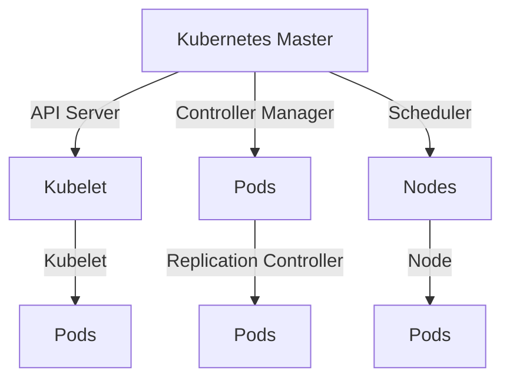
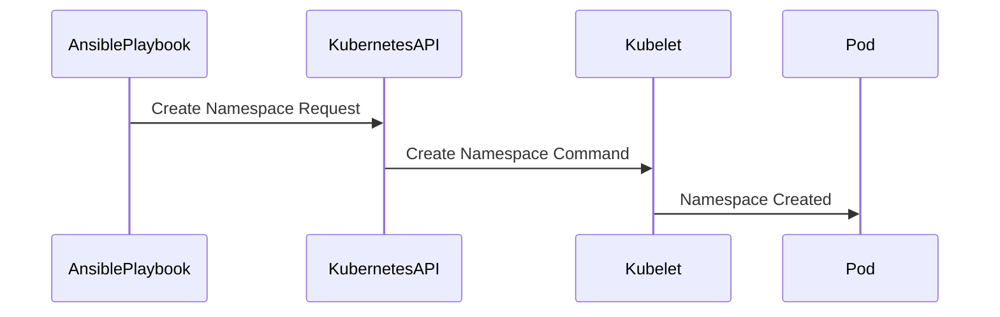

## Introduction to Kubernetes Deployment with Ansible

In the realm of DevOps, automation tools such as Ansible and Terraform play a crucial role in managing and deploying applications across various environments. One of the most popular container orchestration platforms is Kubernetes, which provides a robust framework for deploying, scaling, and managing containerized applications. This chapter will delve into using Ansible to manage Kubernetes deployments, focusing on the `kubernetes.core` module, which simplifies interactions with Kubernetes clusters.

### Background Theory

Kubernetes is an open-source platform designed to automate the deployment, scaling, and management of containerized applications. It provides a suite of tools to manage containerized workloads and services, making it easier to run stateless and stateful applications at scale. Kubernetes uses a declarative model, where users define the desired state of their applications through configuration files, typically written in YAML.

Ansible, on the other hand, is an automation tool that allows you to manage infrastructure as code. It uses simple YAML-based playbooks to describe the desired state of your systems. By combining Ansible with Kubernetes, you can automate the deployment and management of Kubernetes resources, reducing the complexity and potential for human error.

### The Kubernetes Module in Ansible

The `kubernetes.core` module in Ansible is specifically designed to interact with Kubernetes clusters. This module provides a set of actions that allow you to create, update, delete, and manage various Kubernetes resources, such as pods, services, deployments, and namespaces. The module abstracts away the need to manually run `kubectl` commands, making it easier to integrate Kubernetes operations into your Ansible playbooks.

#### Key Features of the Kubernetes Module

- **Ease of Use**: The module simplifies the process of interacting with Kubernetes resources by providing a high-level interface.
- **Flexibility**: You can use the module to perform a wide range of operations, from creating namespaces to deploying complex applications.
- **Integration**: The module integrates seamlessly with Ansible's playbook structure, allowing you to define and manage Kubernetes resources alongside other infrastructure configurations.

### Creating a Namespace in Kubernetes Using Ansible

A namespace in Kubernetes is a way to divide cluster resources between multiple users or projects. Namespaces provide a scope for names, so you can have multiple resources with the same name but in different namespaces. This is particularly useful in multi-tenant environments where you might want to isolate different teams or applications.

To demonstrate the use of the `kubernetes.core` module, let's start by creating a namespace in a Kubernetes cluster using Ansible.

#### Step-by-Step Example

1. **Define the Playbook**:
   Create a playbook named `deploy_application_in_new_namespace.yml`. This playbook will contain the task to create a namespace in the Kubernetes cluster.

```yaml
---
- name: Deploy Application in New Namespace
  hosts: localhost
  gather_facts: false
  tasks:
    - name: Create a namespace in the cluster
      kubernetes.core.k8s:
        api_version: v1
        kind: Namespace
        metadata:
          name: my-new-namespace
```

2. **Run the Playbook**:
   Execute the playbook using the `ansible-playbook` command.

```bash
ansible-playbook deploy_application_in_new_namespace.yml
```

3. **Verify the Namespace Creation**:
   After running the playbook, you can verify that the namespace was created successfully by using the `kubectl` command.

```bash
kubectl get namespaces
```

You should see `my-new-namespace` listed among the available namespaces.

### Understanding the Configuration File

The configuration file used in the Ansible task closely mirrors the structure of a Kubernetes YAML configuration file. This is intentional, as it allows you to leverage your existing knowledge of Kubernetes YAML files when working with Ansible.

#### YAML Configuration Structure

- **api_version**: Specifies the API version of the resource being created. In this case, `v1` refers to the core Kubernetes API.
- **kind**: Specifies the type of Kubernetes resource being created. Here, it is `Namespace`.
- **metadata**: Contains metadata about the resource, including its name.

### Real-World Examples and Recent Breaches

While Kubernetes and Ansible provide powerful tools for managing containerized applications, they are not immune to security vulnerabilities. Recent breaches and CVEs highlight the importance of securing your Kubernetes deployments.

#### Example: CVE-2021-25741

CVE-2021-25741 is a critical vulnerability in Kubernetes that affects the `kube-apiserver` component. This vulnerability allows an attacker to bypass authentication and authorization mechanisms, potentially gaining unauthorized access to the cluster.

**Impact**: An attacker could exploit this vulnerability to execute arbitrary commands within the cluster, leading to data theft or service disruption.

**Mitigation**: To prevent such attacks, ensure that your Kubernetes cluster is up-to-date with the latest security patches. Additionally, implement strict RBAC (Role-Based Access Control) policies to limit the permissions of users and services within the cluster.

### How to Prevent / Defend

#### Detection

- **Monitoring**: Use tools like Prometheus and Grafana to monitor the health and performance of your Kubernetes cluster.
- **Logging**: Enable logging for all Kubernetes components and store logs in a centralized location for analysis.

#### Prevention

- **RBAC Policies**: Implement strict RBAC policies to control access to Kubernetes resources.
- **Network Policies**: Use Kubernetes Network Policies to restrict traffic between pods and external networks.
- **Pod Security Policies**: Define Pod Security Policies to enforce security standards for pod creation.

#### Secure Coding Fixes

Here is an example of a vulnerable configuration and its secure counterpart:

**Vulnerable Configuration**:

```yaml
apiVersion: v1
kind: Pod
metadata:
  name: vulnerable-pod
spec:
  containers:
  - name: vulnerable-container
    image: vulnerable-image
    ports:
    - containerPort: 8080
```

**Secure Configuration**:

```yaml
apiVersion: v1
kind: Pod
metadata:
  name: secure-pod
spec:
  containers:
  - name: secure-container
    image: secure-image
    ports:
    - containerPort: 8080
  securityContext:
    runAsUser: 1000
    runAsGroup: 3000
    fsGroup: 2000
```

### Complete Example: Full Playbook and Results

Let's expand our previous example to include more detailed steps and configurations.

#### Full Playbook

```yaml
---
- name: Deploy Application in New Namespace
  hosts: localhost
  gather_facts: false
  tasks:
    - name: Create a namespace in the cluster
      kubernetes.core.k8s:
        api_version: v1
        kind: Namespace
        metadata:
          name: my-new-namespace
    - name: Create a deployment in the new namespace
      kubernetes.core.k8s:
        api_version: apps/v1
        kind: Deployment
        metadata:
          name: my-deployment
          namespace: my-new-namespace
        spec:
          replicas: 3
          selector:
            matchLabels:
              app: my-app
          template:
            metadata:
              labels:
                app: my-app
            spec:
              containers:
              - name: my-container
                image: nginx:latest
                ports:
                - containerPort: 80
```

#### Running the Playbook

```bash
ansible-playbook deploy_application_in_new_namespace.yml
```

#### Verifying the Deployment

```bash
kubectl get namespaces
kubectl get deployments -n my-new-namespace
```

### Diagrams and Topologies

#### Kubernetes Cluster Topology



#### Sequence Diagram for Namespace Creation



### Conclusion

Using Ansible to manage Kubernetes deployments offers a powerful and flexible approach to automating the creation and management of Kubernetes resources. By leveraging the `kubernetes.core` module, you can simplify the process of creating namespaces, deployments, and other Kubernetes objects, while ensuring that your configurations are secure and robust.

### Practice Labs

For hands-on practice with Kubernetes and Ansible, consider the following labs:

- **PortSwigger Web Security Academy**: Offers a variety of labs focused on web application security, including some that involve Kubernetes.
- **OWASP Juice Shop**: A deliberately insecure web application for security training purposes, which can be deployed using Kubernetes and managed with Ansible.
- **Kubernetes Goat**: A Kubernetes-themed capture-the-flag (CTF) environment that includes challenges related to Kubernetes security and automation.

By completing these labs, you can gain practical experience in deploying and managing Kubernetes clusters using Ansible, reinforcing the concepts covered in this chapter.

---
<!-- nav -->
[[02-Introduction to Kubernetes Deployment Using Terraform and Ansible|Introduction to Kubernetes Deployment Using Terraform and Ansible]] | [[DevOps/DevOps Bootcamp/09-Container Orchestration (Kubernetes)/35-Terraform and Ansible for Kubernetes Deployment/00-Overview|Overview]] | [[04-Introduction to Python Modules and Package Management|Introduction to Python Modules and Package Management]]
