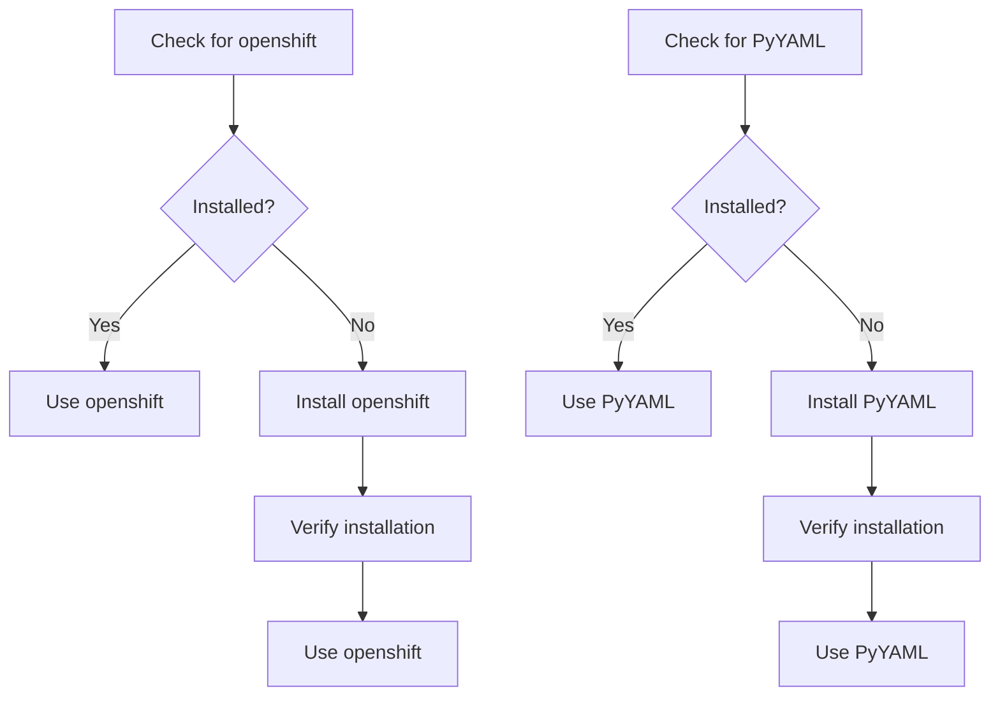

## Introduction to Python Modules and Package Management

In the context of DevOps, managing dependencies and ensuring that the required libraries and modules are available on the host machine is crucial for the successful execution of scripts and applications. This section delves into the process of checking and installing Python modules, specifically `openshift` and `PyYAML`, which are often used in automation and deployment tasks involving Kubernetes and OpenShift.

### What Are Python Modules?

Python modules are files containing Python code that define functions, classes, variables, and more. They allow for code reuse and organization. When a script imports a module, it gains access to the functionality provided by that module. For instance, the `openshift` module provides a Python interface to interact with OpenShift clusters, while `PyYAML` allows for parsing and generating YAML data, which is commonly used in Kubernetes configurations.

### Why Check and Install Modules?

Before executing a script that relies on specific modules, it is essential to ensure that those modules are installed and up-to-date. Failure to do so can result in runtime errors, such as the `ModuleNotFoundError`. Checking and installing modules ensures that the environment is properly configured, leading to smoother and more reliable operations.

### How to Check for Installed Modules

To verify whether a module is installed, you can use the Python interpreter to attempt importing it. If the module is not found, Python will raise an error. Here’s how you can check for the `openshift` and `PyYAML` modules:

```python
# Check for openshift module
try:
    import openshift
    print("openshift module is installed.")
except ImportError:
    print("openshift module is not installed.")

# Check for PyYAML module
try:
    import yaml
    print("PyYAML module is installed.")
except ImportError:
    print("PyYAML module is not installed.")
```

### Installing Python Modules Using pip

If the modules are not installed, you can use `pip`, the Python package installer, to install them. The `pip` command can be run from the command line, and it supports various options to control the installation process.

#### Installing `openshift` Module

To install the `openshift` module, you would typically use the following command:

```bash
pip3 install openshift --user
```

The `--user` flag specifies that the package should be installed in the user's home directory rather than system-wide. This approach avoids requiring elevated privileges and ensures that the installation does not interfere with system-wide Python packages.

#### Installing `PyYAML` Module

Similarly, to install the `PyYAML` module, you would use:

```bash
pip3 install PyYAML --user
```

### Verifying Installation

After installing the modules, you should verify that they are correctly installed and accessible. You can do this by attempting to import them again in a Python script:

```python
import openshift
import yaml

print("Both openshift and PyYAML modules are installed successfully.")
```

### Recent Real-World Examples

#### Example: CVE-2021-25285

In 2021, a critical vulnerability was discovered in the `PyYAML` library, identified as CVE-2021-25285. This vulnerability allowed attackers to execute arbitrary code through crafted YAML input. This highlights the importance of keeping modules up-to-date and ensuring that they are securely configured.

### Complete Code Example

Here is a complete example demonstrating the process of checking and installing the required Python modules:

```python
# Check for openshift module
try:
    import openshift
    print("openshift module is installed.")
except ImportError:
    print("openshift module is not installed. Installing...")
    import subprocess
    subprocess.run(["pip3", "install", "openshift", "--user"], check=True)
    print("openshift module installed successfully.")

# Check for PyYAML module
try:
    import yaml
    print("PyYYAML module is installed.")
except ImportError:
    print("PyYAML module is not installed. Installing...")
    import subprocess
    subprocess.run(["pip3", "install", "PyYAML", "--user"], check=True)
    print("PyYAML module installed successfully.")
```

### Mermaid Diagram: Module Installation Flow

A visual representation of the module installation process can help understand the flow better:



### Pitfalls and Common Mistakes

#### Mistake: Not Using `--user` Flag

Failing to use the `--user` flag can lead to permission issues, especially if the user does not have administrative privileges. Always use `--user` to avoid such problems.

#### Mistake: Not Keeping Modules Updated

Neglecting to update modules can leave your environment vulnerable to known security issues. Regularly check for updates and apply them.

### How to Prevent / Defend

#### Detection

Regularly audit your environment to ensure that all required modules are installed and up-to-date. Use tools like `pip list` to check installed packages and their versions.

#### Prevention

1. **Secure Coding Practices**: Ensure that your scripts handle exceptions gracefully and provide meaningful error messages.
2. **Automated Dependency Management**: Use tools like `pipenv` or `poetry` to manage dependencies and ensure consistency across environments.
3. **Security Updates**: Keep track of security advisories and update modules promptly.

#### Secure Code Fix

Here is an example showing a vulnerable script and its secure counterpart:

**Vulnerable Script**

```python
import openshift
import yaml

# Vulnerable code that does not check for module availability
```

**Secure Script**

```python
try:
    import openshift
except ImportError:
    print("openshift module is not installed. Please install it.")
    exit(1)

try:
    import yaml
except ImportError:
    print("PyYAML module is not installed. Please install it.")
    exit(1)

# Secure code that checks for module availability
```

### Conclusion

Ensuring that the necessary Python modules are installed and up-to-date is a fundamental aspect of DevOps. By following the steps outlined above, you can effectively manage dependencies and maintain a robust development environment. Always prioritize security and regularly update your modules to mitigate potential vulnerabilities.

---
<!-- nav -->
[[03-Introduction to Kubernetes Deployment with Ansible|Introduction to Kubernetes Deployment with Ansible]] | [[DevOps/DevOps Bootcamp/09-Container Orchestration (Kubernetes)/35-Terraform and Ansible for Kubernetes Deployment/00-Overview|Overview]] | [[05-Introduction to Terraform and Ansible for Kubernetes Deployment|Introduction to Terraform and Ansible for Kubernetes Deployment]]
