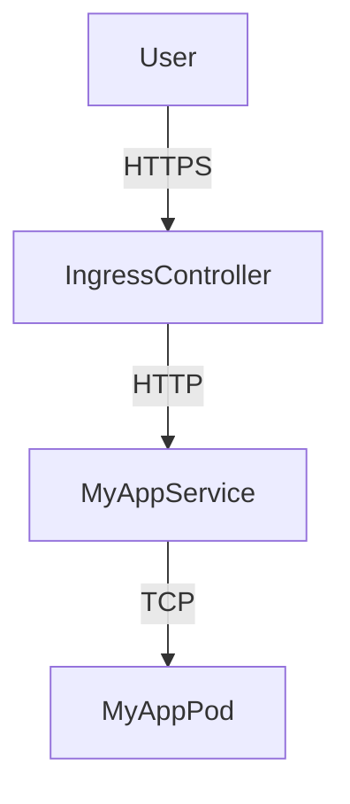
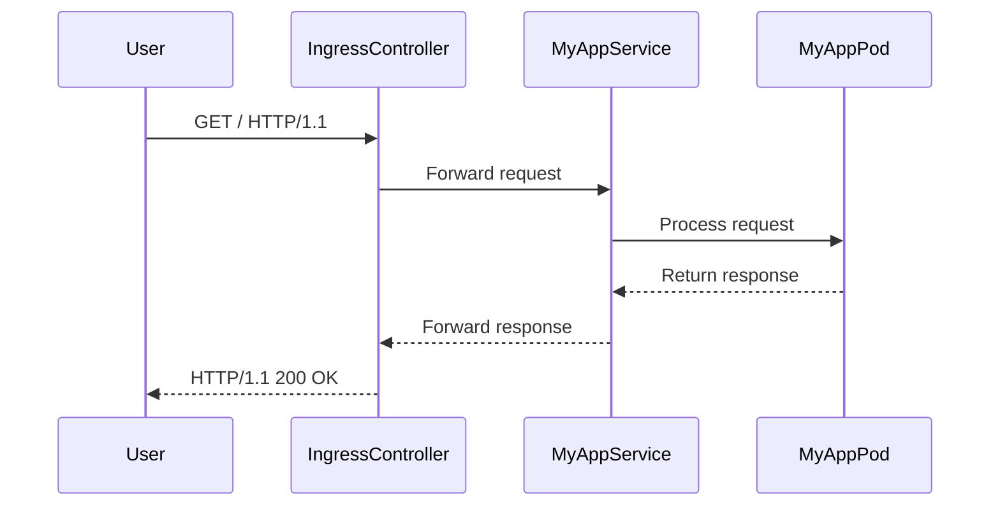

## Understanding and Using Kubernetes Ingress

### What is Kubernetes Ingress?

In Kubernetes, an **Ingress** is a resource that manages external access to the services in a cluster, typically HTTP. It provides a way to expose your applications to the internet, allowing users to access them via a browser. An Ingress controller is responsible for routing traffic to the appropriate services based on rules defined in the Ingress resource.

#### Why Use Ingress?

The primary reasons for using Ingress are:

1. **External Access**: Expose your applications to the internet securely.
2. **Load Balancing**: Distribute incoming traffic across multiple pods.
3. **Routing**: Route traffic to different services based on URL paths or hostnames.
4. **SSL/TLS Termination**: Handle SSL/TLS encryption at the edge, reducing the load on backend services.

### Simple Kubernetes Cluster Example

Let's start with a simple Kubernetes cluster where we have a pod running an application and its corresponding service.

```yaml
apiVersion: v1
kind: Service
metadata:
  name: my-app-service
spec:
  selector:
    app: my-app
  ports:
    - protocol: TCP
      port: 80
      targetPort: 8080
```

This service selects pods labeled with `app: my-app` and forwards traffic to port 8080 on those pods.

### External Access Without Ingress

One straightforward way to make your application accessible externally is to create an external service. This service exposes the application using the IP address of a node and a specific port.

```yaml
apiVersion: v1
kind: Service
metadata:
  name: my-app-external-service
spec:
  type: NodePort
  selector:
    app: my-app
  ports:
    - protocol: TCP
      port: 80
      targetPort: 8080
```

With this setup, you can access your application using the IP address of a node and the assigned NodePort. For example, `http://<node-ip>:<node-port>`.

However, this approach is not ideal for production environments due to several reasons:

1. **Security**: Exposing services directly to the internet increases the attack surface.
2. **Scalability**: Managing multiple services with unique IP addresses and ports can become cumbersome.
3. **User Experience**: Users prefer accessing applications via domain names rather than IP addresses.

### Using Ingress for Production Environments

To address these issues, Kubernetes provides the **Ingress** resource. An Ingress controller handles external access to the cluster and routes traffic to the appropriate services based on rules defined in the Ingress resource.

#### Creating an Ingress Resource

Here’s an example of an Ingress resource that routes traffic to the `my-app-service`.

```yaml
apiVersion: networking.k8s.io/v1
kind: Ingress
metadata:
  name: my-app-ingress
  annotations:
    nginx.ingress.kubernetes.io/rewrite-target: /
spec:
  rules:
    - host: myapp.example.com
      http:
        paths:
          - path: /
            pathType: Prefix
            backend:
              service:
                name: my-app-service
                port:
                  number: 80
```

This Ingress resource defines a rule that routes traffic to `myapp.example.com` to the `my-app-service`.

#### Ingress Controller

An Ingress controller is required to handle the routing logic. A popular choice is the **NGINX Ingress Controller**.

```yaml
apiVersion: apps/v1
kind: Deployment
metadata:
  name: nginx-ingress-controller
spec:
  replicas: 2
  selector:
    matchLabels:
      app: nginx-ingress
  template:
    metadata:
      labels:
        app: nginx-ingress
    spec:
      containers:
        - name: nginx-ingress-controller
          image: quay.io/kubernetes-ingress-controller/nginx-ingress-controller:latest
          args:
            - /nginx-ingress-controller
            - --configmap=$(POD_NAMESPACE)/nginx-configuration
            - --default-backend-service=$(POD_NAMESPACE)/default-http-backend
```

This deployment sets up two replicas of the NGINX Ingress Controller.

### Full HTTP Request and Response Example

When a user accesses `http://myapp.example.com`, the following HTTP request is sent:

```http
GET / HTTP/1.1
Host: myapp.example.com
User-Agent: curl/7.64.1
Accept: */*
```

The NGINX Ingress Controller receives this request and forwards it to the `my-app-service`. The response from the service is then returned to the user.

```http
HTTP/1.1 200 OK
Date: Mon, 01 Jan 2024 00:00:00 GMT
Content-Type: text/html; charset=utf-8
Content-Length: 12
Connection: keep-alive

Hello, World!
```

### Security Considerations

Using Ingress introduces several security considerations:

1. **SSL/TLS Termination**: Ensure that SSL/TLS is properly terminated at the Ingress controller to protect data in transit.
2. **Access Control**: Implement proper access control mechanisms to restrict unauthorized access.
3. **Rate Limiting**: Protect against DDoS attacks by implementing rate limiting.

#### How to Prevent / Defend

1. **Secure Configuration**:
   - Enable SSL/TLS termination in the Ingress controller.
   - Use strong TLS versions and ciphers.

   ```yaml
   apiVersion: networking.k8s.io/v1
   kind: Ingress
   metadata:
     name: my-app-ingress
     annotations:
       nginx.ingress.kubernetes.io/ssl-redirect: "true"
       nginx.ingress.kubernetes.io/secure-backends: "true"
   spec:
     tls:
       - hosts:
           - myapp.example.com
         secretName: my-tls-secret
     rules:
       - host: myapp.example.com
         http:
           paths:
             - path: /
               pathType: Prefix
               backend:
                 service:
                   name: my-app-service
                   port:
                     number: 80
   ```

2. **Access Control**:
   - Use authentication and authorization mechanisms such as OAuth2 or JWT.

   ```yaml
   apiVersion: networking.k8s.io/v1
   kind: Ingress
   metadata:
     name: my-app-ingress
     annotations:
       nginx.ingress.kubernetes.io/auth-url: "http://auth-service.default.svc.cluster.local/oauth2/auth"
       nginx.ingress.kubernetes.io/auth-signin: "http://auth-service.default.svc.cluster.local/oauth2/start?rd=$request_uri"
   spec:
     rules:
       - host: myapp.example.com
         http:
           paths:
             - path: /
               pathType: Prefix
               backend:
                 service:
                   name: my-app-service
                   port:
                     number: 80
   ```

3. **Rate Limiting**:
   - Configure rate limiting to protect against DDoS attacks.

   ```yaml
   apiVersion: networking.k8s.io/v1
   kind: Ingress
   metadata:
     name: my-app-ingress
     annotations:
       nginx.ingress.kubernetes.io/limit-rate: "10r/s"
       nginx.ingress.kubernetes.io/limit-burst: "20"
   spec:
     rules:
       - host: myapp.example.com
         http:
           paths:
             - path: /
               pathType: Prefix
               backend:
                 service:
                   name: my-app-service
                   port:
                     number: 80
   ```

### Real-World Examples and Breaches

Recent breaches involving Kubernetes Ingress include:

1. **CVE-2021-25741**: A vulnerability in the NGINX Ingress Controller allowed attackers to bypass authentication and gain unauthorized access to services.
2. **CVE-2022-2528**: A misconfiguration in the Ingress controller exposed sensitive data to unauthorized users.

These examples highlight the importance of securing Ingress configurations and regularly auditing them for vulnerabilities.

### Mermaid Diagrams

#### Network Topology



#### Request/Response Flow



### Common Pitfalls and Best Practices

1. **Misconfigured Ingress Rules**: Ensure that Ingress rules are correctly configured to avoid exposing unintended services.
2. **Insecure Communication**: Always use SSL/TLS for communication between the Ingress controller and backend services.
3. **Insufficient Logging and Monitoring**: Implement comprehensive logging and monitoring to detect and respond to security incidents promptly.

### Hands-On Labs

For hands-on practice with Kubernetes Ingress, consider the following labs:

- **Kubernetes Goat**: A security-focused Kubernetes environment designed for learning and testing security controls.
- **OWASP WrongSecrets**: A series of challenges that focus on various aspects of Kubernetes security, including Ingress configurations.

These labs provide practical experience in configuring and securing Kubernetes Ingress resources.

### Conclusion

Understanding and effectively using Kubernetes Ingress is crucial for managing external access to your applications securely and efficiently. By following best practices and securing your Ingress configurations, you can ensure that your applications remain protected against potential threats.

---
<!-- nav -->
[[DevOps/DevOps Bootcamp/09-Container Orchestration (Kubernetes)/36-Understanding and Using Kubernetes Ingress/00-Overview|Overview]] | [[DevOps/DevOps Bootcamp/09-Container Orchestration (Kubernetes)/36-Understanding and Using Kubernetes Ingress/02-Practice Questions & Answers|Practice Questions & Answers]]
