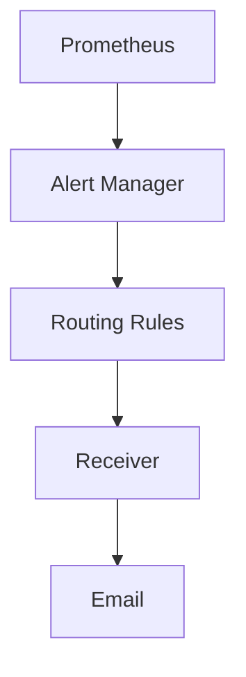

## Introduction to Alert Manager in Kubernetes Clusters

Alert Manager is a crucial component in the monitoring stack of Kubernetes clusters. It is responsible for managing alerts generated by Prometheus, another key monitoring tool. Alert Manager handles the routing, deduplication, and aggregation of alerts, ensuring that the appropriate teams receive notifications about issues in a timely manner.

### What is Alert Manager?

Alert Manager is a highly configurable system designed to handle alerts generated by Prometheus. It allows you to define rules for sending alerts to different receivers based on specific conditions. Receivers can be configured to send notifications via various channels such as email, Slack, PagerDuty, and more.

### Why Use Alert Manager?

Using Alert Manager provides several benefits:

1. **Centralized Alert Management**: It centralizes the management of alerts, making it easier to handle and route them.
2. **Flexible Routing Rules**: You can define complex routing rules to ensure that alerts are sent to the right people at the right time.
3. **Deduplication and Aggregation**: It helps in deduplicating and aggregating similar alerts, reducing noise and improving efficiency.
4. **Customizable Notifications**: You can customize the format and content of notifications to suit your team’s needs.

### How Does Alert Manager Work?

Alert Manager operates by receiving alerts from Prometheus and processing them according to predefined rules. These rules determine how alerts are routed to different receivers. The process involves the following steps:

1. **Receiving Alerts**: Prometheus sends alerts to Alert Manager.
2. **Processing Alerts**: Alert Manager processes these alerts based on defined rules.
3. **Routing Alerts**: It routes alerts to the appropriate receivers.
4. **Sending Notifications**: Receivers send notifications to the specified channels.

### Example Scenario

Consider a scenario where you have a Kubernetes cluster with multiple applications running. Prometheus is monitoring these applications and generating alerts when certain conditions are met (e.g., high CPU usage, disk space issues). Alert Manager receives these alerts and routes them to the appropriate teams based on predefined rules.

### Recent Real-World Examples

In recent years, several high-profile incidents have highlighted the importance of effective alert management:

- **CVE-2021-20225**: A vulnerability in Prometheus allowed unauthorized access to sensitive metrics, leading to potential data exposure. Proper alert management could have helped detect and mitigate such issues.
- **Twitter Breach (2020)**: The breach involved unauthorized access to internal systems. Effective alert management could have helped detect and respond to such incidents more quickly.

### Complete Configuration Example

Let's walk through a complete example of configuring Alert Manager inside a Kubernetes cluster. We will cover the entire process, including setting up the configuration file, reloading the configuration, and verifying the results.

#### Step 1: Setting Up the Configuration File

The configuration file for Alert Manager is typically stored in a `ConfigMap` within the Kubernetes cluster. Below is an example of a configuration file:

```yaml
apiVersion: v1
kind: ConfigMap
metadata:
  name: alertmanager-config
  namespace: monitoring
data:
  alertmanager.yml: |
    global:
      resolve_timeout: 5m
    route:
      group_by: ['alertname']
      group_wait: 30s
      group_interval: 5m
      repeat_interval: 1h
      receiver: 'email'
    receivers:
    - name: 'email'
      email_configs:
      - to: 'team@example.com'
        from: 'alertmanager@example.com'
        smarthost: 'smtp.example.com:587'
        auth_username: 'alertmanager@example.com'
        auth_password: 'yourpassword'
```

This configuration file defines a global section with a `resolve_timeout`, a routing rule that groups alerts by `alertname`, and a receiver named `email`. The `email_configs` section specifies the details for sending emails.

#### Step 2: Applying the Configuration

To apply the configuration, you need to create the `ConfigMap` in the Kubernetes cluster:

```bash
kubectl apply -f alertmanager-config.yaml
```

#### Step 3: Reloading the Configuration

After applying the configuration, you need to trigger a reload in Alert Manager to apply the changes. This can be done using the following command:

```bash
curl -X POST http://<alertmanager-service>:9093/-/reload
```

Replace `<alertmanager-service>` with the actual service name of Alert Manager in your cluster.

#### Step 4: Verifying the Results

Once the configuration is reloaded, you can verify that the changes have been applied correctly. You can check the current configuration by accessing the Alert Manager UI or by querying the API:

```bash
curl http://<alertmanager-service>:9093/api/v2/status
```

This will return the current status of Alert Manager, including the active configuration.

### Detailed Explanation of Configuration Sections

#### Global Section

The `global` section contains settings that apply globally across all alerts. Key settings include:

- `resolve_timeout`: The duration after which an unresolved alert is considered resolved.

#### Route Section

The `route` section defines how alerts are routed. Key settings include:

- `group_by`: Specifies the labels used to group alerts.
- `group_wait`: The initial wait period before sending grouped alerts.
- `group_interval`: The interval between subsequent grouped alerts.
- `repeat_interval`: The interval at which to resend grouped alerts.

#### Receiver Section

The `receiver` section defines the receivers to which alerts are sent. In this example, we have an `email` receiver. Key settings include:

- `to`: The recipient email address.
- `from`: The sender email address.
- `smarthost`: The SMTP server details.
- `auth_username`: The username for authentication.
- `auth_password`: The password for authentication.

### Mermaid Diagrams

Below is a mermaid diagram illustrating the flow of alerts from Prometheus to Alert Manager and then to the receivers:



### Pitfalls and Common Mistakes

When configuring Alert Manager, there are several common pitfalls and mistakes to avoid:

1. **Incorrect Configuration Syntax**: Ensure that the configuration file is syntactically correct. Any errors will prevent the configuration from being applied.
2. **Misconfigured Receivers**: Ensure that the receivers are correctly configured with valid credentials and endpoints.
3. **Insufficient Logging**: Enable logging to help diagnose issues when alerts are not being received as expected.

### How to Prevent / Defend

#### Detection

To detect issues with Alert Manager configuration, you can:

1. **Monitor Logs**: Monitor the logs of Alert Manager for any errors or warnings.
2. **Check Status API**: Regularly check the status API to ensure that the configuration is being applied correctly.

#### Prevention

To prevent issues with Alert Manager configuration, you can:

1. **Use Configuration Validation Tools**: Use tools like `yamllint` to validate the configuration file before applying it.
2. **Automate Testing**: Automate testing of the configuration using tools like `kube-linter`.

#### Secure Coding Fixes

Here is an example of a vulnerable configuration and the corresponding secure configuration:

**Vulnerable Configuration:**

```yaml
receivers:
- name: 'email'
  email_configs:
  - to: 'team@example.com'
    from: 'alertmanager@example.com'
    smarthost: 'smtp.example.com:587'
    auth_username: 'alertmanager@example.com'
    auth_password: 'yourpassword'
```

**Secure Configuration:**

```yaml
receivers:
- name: 'email'
  email_configs:
  - to: 'team@example.com'
    from: 'alertmanager@example.com'
    smarthost: 'smtp.example.com:587'
    auth_username: 'alertmanager@example.com'
    auth_password: 'yoursecurepassword'
```

In the secure configuration, ensure that the `auth_password` is securely managed and not hardcoded in the configuration file.

### Conclusion

Effective configuration and management of Alert Manager in Kubernetes clusters is essential for ensuring timely and accurate alerting. By following the steps outlined in this chapter, you can set up and manage Alert Manager effectively, ensuring that your team is notified promptly of any issues in your cluster.

### Practice Labs

For hands-on practice with Alert Manager configuration, consider the following labs:

- **PortSwigger Web Security Academy**: Offers a comprehensive course on web application security, including sections on monitoring and alerting.
- **OWASP Juice Shop**: Provides a vulnerable web application for practicing security skills, including monitoring and alerting configurations.
- **Kubernetes Goat**: A hands-on lab for practicing Kubernetes security, including monitoring and alerting configurations.

These labs provide practical experience in configuring and managing Alert Manager in real-world scenarios.

---
<!-- nav -->
[[01-Introduction to Alert Manager Configuration in Kubernetes Clusters|Introduction to Alert Manager Configuration in Kubernetes Clusters]] | [[DevOps/DevOps Bootcamp/10-Monitoring & Alerting/01-Alert Manager Configuration Inside Kubernetes Clusters/00-Overview|Overview]] | [[03-Alert Manager Configuration Inside Kubernetes Clusters|Alert Manager Configuration Inside Kubernetes Clusters]]
