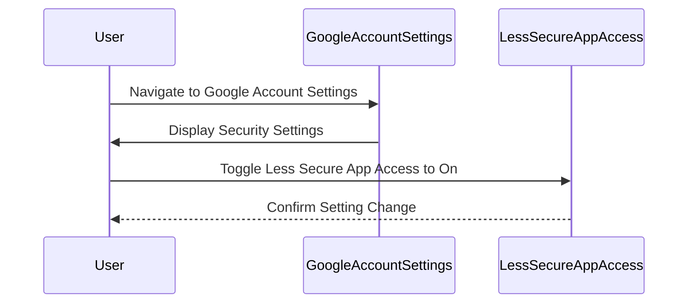

## Two-Factor Authentication and Less Secure Apps Configuration

### Background Theory

Two-Factor Authentication (2FA) is a security process in which users provide two different authentication factors to verify themselves. This method adds an additional layer of security to the authentication process, making it more difficult for unauthorized individuals to access an account even if they have obtained the password. 

In the context of Google accounts, enabling 2FA significantly reduces the risk of unauthorized access. However, when 2FA is enabled, applications that attempt to authenticate using only a username and password will be blocked. This is because these applications do not support the second factor required for authentication.

### Less Secure Apps Configuration

When 2FA is disabled, one can enable the "Allow Less Secure Apps" setting. This configuration allows applications that do not support modern authentication methods to access the account. However, this comes with significant security risks, as it makes the account more susceptible to unauthorized access.

#### Enabling Less Secure Apps

To enable the "Allow Less Secure Apps" setting for a Google account:

1. Navigate to the Google Account settings page.
2. Click on "Security."
3. Scroll down to the "Less secure app access" section.
4. Toggle the switch to "On."

Here is a step-by-step guide with screenshots:



### Security Implications

Enabling "Allow Less Secure Apps" is generally discouraged due to the increased risk of unauthorized access. This setting should only be used for testing purposes or when absolutely necessary. In a production environment, it is recommended to use more secure authentication methods such as OAuth2.

#### Real-World Example

A notable breach involving less secure apps occurred in 2019 when a large number of Google accounts were compromised due to the "Allow Less Secure Apps" setting being enabled. Hackers exploited this setting to gain unauthorized access to user accounts, leading to significant data breaches.

### Configuring Alert Manager in Kubernetes

Alert Manager is a component of Prometheus, a popular monitoring system. It is responsible for managing and routing alerts generated by Prometheus. Configuring Alert Manager within a Kubernetes cluster involves several steps, including setting up email receivers and configuring routes.

### Email Receiver Configuration

The first step in configuring Alert Manager is to set up the email receiver. This involves specifying the SMTP server details, sender email address, and recipient email addresses.

#### Example Configuration

Here is an example of an Alert Manager configuration file (`alertmanager.yml`) with an email receiver setup:

```yaml
global:
  smtp_smarthost: 'smtp.gmail.com:587'
  smtp_from: 'your-email@gmail.com'
  smtp_auth_username: 'your-email@gmail.com'
  smtp_auth_password: 'your-password'

route:
  group_by: ['alertname']
  group_wait: 30s
  group_interval: 5m
  repeat_interval: 1h
  receiver: 'email-receiver'

receivers:
- name: 'email-receiver'
  email_configs:
  - to: 'recipient-email@example.com'
    from: 'your-email@gmail.com'
    smarthost: 'smtp.gmail.com:587'
    auth_username: 'your-email@gmail.com'
    auth_password: 'your-password'
```

### Route Configuration

The next step is to configure the route section. This involves defining the rules for how alerts are grouped and routed to receivers.

#### Example Route Configuration

Here is an example of a route configuration within the `alertmanager.yml` file:

```yaml
route:
  group_by: ['alertname']
  group_wait: 30s
  group_interval: 5m
  repeat_interval: 1h
  receiver: 'email-receiver'
  routes:
  - match:
      severity: 'critical'
    receiver: 'critical-email-receiver'
  - match:
      severity: 'warning'
    receiver: 'warning-email-receiver'
```

### Matchers

Matchers are used to filter alerts based on specific labels. For example, you can define a matcher to route alerts with a specific severity level to different receivers.

#### Example Matcher Configuration

Here is an example of a matcher configuration within the `alertmanager.yml` file:

```yaml
routes:
- match:
    severity: 'critical'
  receiver: 'critical-email-receiver'
- match:
    severity: 'warning'
  receiver: 'warning-email-receiver'
```

### How to Prevent / Defend

#### Detection

To detect unauthorized access attempts, monitor login activities and alert on suspicious behavior. Use tools like Google's Security Checkup to review and manage account access.

#### Prevention

1. **Enable 2FA**: Always enable 2FA for Google accounts to add an extra layer of security.
2. **Use OAuth2**: Instead of enabling "Allow Less Secure Apps," use OAuth2 for authentication.
3. **Regular Audits**: Regularly audit account access and permissions to ensure only authorized users have access.

#### Secure Code Fix

Here is a comparison of the insecure and secure configurations:

**Insecure Configuration**

```yaml
global:
  smtp_smarthost: 'smtp.gmail.com:587'
  smtp_from: 'your-email@gmail.com'
  smtp_auth_username: 'your-email@gmail.com'
  smtp_auth_password: 'your-password'
```

**Secure Configuration**

```yaml
global:
  smtp_smarthost: 'smtp.gmail.com:587'
  smtp_from: 'your-email@gmail.com'
  smtp_auth_username: 'your-email@gmail.com'
  smtp_oauth2_file: '/path/to/oauth2.json'
```

### Conclusion

Configuring Alert Manager in a Kubernetes cluster involves setting up email receivers and defining routes. While enabling "Allow Less Secure Apps" can simplify the setup, it poses significant security risks. It is recommended to use more secure authentication methods and regularly audit account access to prevent unauthorized access.

### Practice Labs

For hands-on practice with Alert Manager configuration, consider the following labs:

- **PortSwigger Web Security Academy**: Offers a comprehensive course on web security, including sections on monitoring and alerting.
- **OWASP Juice Shop**: A deliberately insecure web application for security training, which includes scenarios for setting up monitoring and alerting systems.
- **Kubernetes Goat**: A security-focused Kubernetes lab that includes exercises on configuring Alert Manager and other monitoring tools.

These labs provide practical experience in setting up and securing monitoring systems within a Kubernetes environment.

---
<!-- nav -->
[[03-Alert Manager Configuration Inside Kubernetes Clusters|Alert Manager Configuration Inside Kubernetes Clusters]] | [[DevOps/DevOps Bootcamp/10-Monitoring & Alerting/01-Alert Manager Configuration Inside Kubernetes Clusters/00-Overview|Overview]] | [[DevOps/DevOps Bootcamp/10-Monitoring & Alerting/01-Alert Manager Configuration Inside Kubernetes Clusters/05-Practice Questions & Answers|Practice Questions & Answers]]
