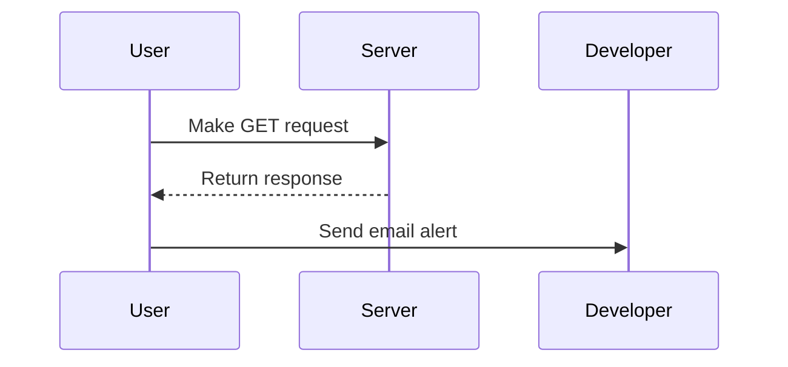

## Introduction to Error Handling and Automated Email Alerts

In the realm of DevOps, ensuring the reliability and stability of applications is paramount. One critical aspect of this is handling unexpected errors and notifying relevant parties when such errors occur. This chapter delves into the concept of automated email alerts for application status codes, focusing on the use of `try-except` blocks in Python to manage exceptions effectively.

### Background Theory

Error handling is a fundamental practice in software development. It ensures that applications can gracefully handle unexpected conditions without crashing. In Python, the `try-except` block is a powerful mechanism for managing exceptions. An exception is an event that occurs during the execution of a program that disrupts the normal flow of instructions.

#### What is an Exception?

An exception is an error that occurs during the execution of a program. It can be caused by various factors, such as invalid input, resource unavailability, or programming errors. When an exception occurs, the normal flow of the program is interrupted, and the program may terminate abruptly if the exception is not handled properly.

#### Why Use `try-except`?

The `try-except` block allows developers to catch and handle exceptions gracefully. By wrapping potentially problematic code in a `try` block, you can specify how to handle exceptions that might occur within that block. This ensures that the program can continue running even if an error occurs, providing a better user experience and preventing crashes.

### Example Scenario: Handling Connection Errors

Let's consider a scenario where an application attempts to connect to a remote server but encounters a connection error. This could happen due to various reasons, such as the server being down, network issues, or incorrect configuration.

#### Code Example

Here’s a simple Python script that demonstrates how to handle a connection error using `try-except`:

```python
import requests

def check_server_status(url):
    try:
        response = requests.get(url)
        response.raise_for_status()  # Raises an HTTPError for bad responses
        print(f"Server is up and running: {response.status_code}")
    except requests.exceptions.RequestException as e:
        print(f"Connection error occurred: {e}")
        send_email_alert(e)

def send_email_alert(error_message):
    # Placeholder for sending email
    print(f"Email alert sent: {error_message}")

# Example usage
check_server_status("http://example.com")
```

### Explanation of the Code

1. **Importing the `requests` library**: This library is used to make HTTP requests to the server.
2. **Defining the `check_server_status` function**:
   - The function takes a URL as an argument.
   - Inside the `try` block, it makes a GET request to the specified URL.
   - The `raise_for_status()` method raises an `HTTPError` if the response status code indicates an error.
3. **Handling exceptions**:
   - The `except` block catches any `RequestException` that might occur during the request.
   - It prints an error message and calls the `send_email_alert` function to notify the developer.
4. **Sending an email alert**:
   - The `send_email_alert` function is a placeholder for actual email-sending logic.

### Real-World Examples and Recent Breaches

#### Real-World Example: Connection Errors in Production

Consider a production environment where a web application relies on a remote API for data retrieval. If the API server goes down unexpectedly, the application should handle this gracefully and notify the development team.

#### Recent Breach Example: CVE-2021-3129

CVE-2021-3129 is a vulnerability in the Apache Log4j library that allows attackers to execute arbitrary code by injecting malicious log messages. This vulnerability highlights the importance of robust error handling and notification mechanisms to quickly identify and mitigate such issues.

### Detailed Diagrams

#### Sequence Diagram

A sequence diagram can help visualize the interaction between different components in the system.



### Pitfalls and Common Mistakes

#### Overusing `except` Clauses

One common mistake is catching too broad an exception, which can mask underlying issues. For example, catching all exceptions with `except Exception:` can hide specific errors that need to be addressed individually.

#### Not Providing Useful Error Messages

Another pitfall is not providing informative error messages. A generic error message like "An error occurred" does not help in diagnosing the issue. Always include detailed information about the error.

### How to Prevent / Defend

#### Detection

To detect errors and exceptions, implement logging mechanisms that capture detailed information about the error. Use tools like ELK Stack (Elasticsearch, Logstash, Kibana) or Splunk to centralize and analyze logs.

#### Prevention

1. **Use Specific Exceptions**: Catch specific exceptions rather than broad ones. This helps in identifying and addressing the root cause of the error.
2. **Implement Robust Error Handling**: Ensure that your error handling logic is comprehensive and covers all possible scenarios.
3. **Automate Notifications**: Set up automated email alerts to notify relevant parties when an error occurs. This ensures quick action and minimizes downtime.

#### Secure Coding Fixes

Compare the insecure and secure versions of the code:

**Insecure Version**

```python
import requests

def check_server_status(url):
    try:
        response = requests.get(url)
        response.raise_for_status()
        print(f"Server is up and running: {response.status_code}")
    except Exception as e:
        print(f"An error occurred: {e}")
```

**Secure Version**

```python
import requests

def check_server_status(url):
    try:
        response = requests.get(url)
        response.raise_for_status()
        print(f"Server is up and running: {response.status_code}")
    except requests.exceptions.RequestException as e:
        print(f"Connection error occurred: {e}")
        send_email_alert(e)

def send_email_alert(error_message):
    # Placeholder for sending email
    print(f"Email alert sent: {error_message}")
```

### Hands-On Labs

For practical experience with automated email alerts and error handling, consider the following labs:

- **PortSwigger Web Security Academy**: Offers exercises on handling web application errors and notifications.
- **OWASP Juice Shop**: Provides a vulnerable web application where you can practice implementing error handling and notifications.
- **DVWA (Damn Vulnerable Web Application)**: Another platform for practicing web application security, including error handling.

By mastering these concepts and techniques, you can ensure that your applications are more resilient and reliable, providing a better user experience and minimizing downtime.

---
<!-- nav -->
[[02-Introduction to Automated Email Alerts for Application Status Codes|Introduction to Automated Email Alerts for Application Status Codes]] | [[DevOps/DevOps Bootcamp/10-Monitoring & Alerting/02-Automated Email Alerts for Application Status Codes/00-Overview|Overview]] | [[04-Introduction to Sending Emails via Python|Introduction to Sending Emails via Python]]
