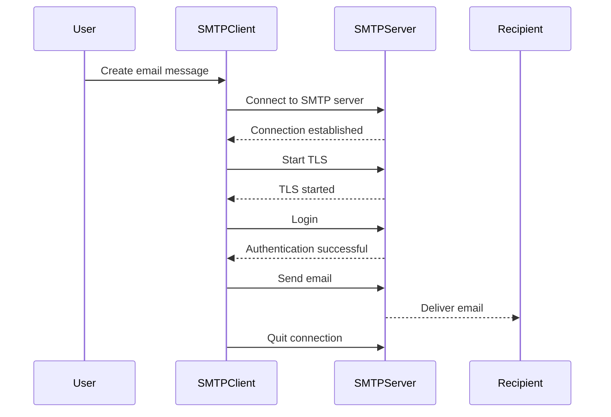
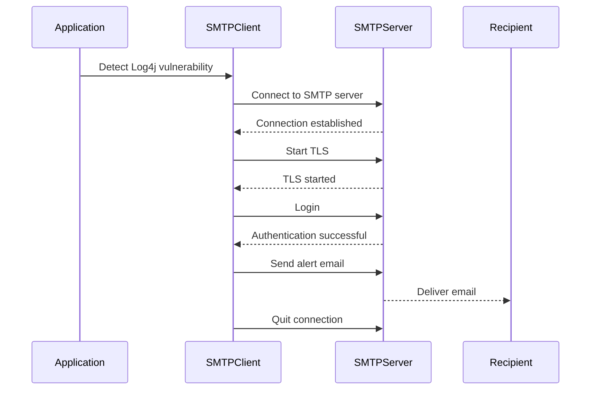

## Automated Email Alerts for Application Status Codes

### Background Theory

Automated email alerts are a critical component of monitoring and maintaining the health of applications. They allow developers and operations teams to receive immediate notifications about application status codes, such as errors or warnings, which can help in quickly identifying and resolving issues. In this section, we will delve into the mechanics of setting up automated email alerts using SMTP (Simple Mail Transfer Protocol) and Python.

### Setting Up SMTP for Gmail

To set up automated email alerts using Gmail, you need to configure your SMTP settings correctly. Here’s a detailed breakdown of the process:

#### SMTP Configuration for Gmail

Gmail uses SMTP to send emails. The SMTP server for Gmail is `smtp.gmail.com`, and the default port for Gmail is `587`. This port is used for sending emails over TLS (Transport Layer Security).

```python
import smtplib
from email.mime.text import MIMEText
from email.mime.multipart import MIMEMultipart

# SMTP Configuration
smtp_server = 'smtp.gmail.com'
smtp_port = 587
smtp_username = 'your-email@gmail.com'
smtp_password = 'your-password'

# Create SMTP client
smtp_client = smtplib.SMTP(smtp_server, smtp_port)
smtp_client.starttls()  # Enable security
smtp_client.login(smtp_username, smtp_password)

# Create email message
message = MIMEMultipart()
message['From'] = smtp_username
message['To'] = 'recipient@example.com'
message['Subject'] = 'Application Status Code Alert'

body = 'The application encountered an error with status code 500.'
message.attach(MIMEText(body, 'plain'))

# Send email
smtp_client.send_message(message)
smtp_client.quit()
```

### Using `with` Statement for Resource Management

In Python, the `with` statement is used for resource management. It ensures that resources are properly cleaned up after they are used, even if an error occurs. This is particularly useful when dealing with external resources like SMTP servers.

```python
import smtplib
from email.mime.text import MIMEText
from email.mime.multipart import MIMEMultipart

# SMTP Configuration
smtp_server = 'smtp.gmail.com'
smtp_port = 587
smtp_username = 'your-email@gmail.com'
smtp_password = 'your-password'

# Create email message
message = MIMEMultipart()
message['From'] = smtp_username
message['To'] = 'recipient@example.com'
message['Subject'] = 'Application Status Code Alert'

body = 'The application encountered an error with status code 500.'
message.attach(MIMEText(body, 'plain'))

# Send email using with statement
with smtplib.SMTP(smtp_server, smtp_port) as smtp_client:
    smtp_client.starttls()  # Enable security
    smtp_client.login(smtp_username, smtp_password)
    smtp_client.send_message(message)
```

### Explanation of the `with` Statement

The `with` statement is a context manager that automatically handles the setup and cleanup of resources. It ensures that the `smtp_client` is properly closed after the block is executed, even if an exception occurs.

#### Example of `with` Statement Usage

```python
with smtplib.SMTP(smtp_server, smtp_port) as smtp_client:
    smtp_client.starttls()  # Enable security
    smtp_client.login(smtp_username, smtp_password)
    smtp_client.send_message(message)
```

### Handling External Resources

When working with external resources like SMTP servers, it is crucial to handle them properly to avoid resource leaks. The `with` statement helps manage these resources effectively.

#### Sequence Diagram for Email Sending Process



### Real-World Examples and CVEs

Automated email alerts can be crucial in detecting and responding to security incidents. For instance, in the case of the [CVE-2021-44228](https://nvd.nist.gov/vuln/detail/CVE-2021-44228) Log4j vulnerability, automated alerts could have helped organizations quickly identify and mitigate the issue.

#### Example of CVE-2021-44228



### Common Pitfalls and How to Avoid Them

#### Incorrect SMTP Configuration

One common pitfall is incorrect SMTP configuration. Ensure that the SMTP server and port are correctly specified. Additionally, make sure that the username and password are correct and that the account has the necessary permissions to send emails.

#### Example of Incorrect SMTP Configuration

```python
# Incorrect SMTP configuration
smtp_server = 'smtp.example.com'  # Incorrect server
smtp_port = 25  # Incorrect port
smtp_username = 'incorrect-email@example.com'  # Incorrect username
smtp_password = 'incorrect-password'  # Incorrect password

# Correct SMTP configuration
smtp_server = 'smtp.gmail.com'
smtp_port = 587
smtp_username = 'your-email@gmail.com'
smtp_password = 'your-password'
```

### How to Prevent / Defend

#### Secure Configuration

Ensure that the SMTP configuration is secure. Use TLS for encryption and ensure that the credentials are stored securely.

#### Example of Secure Configuration

```python
# Secure SMTP configuration
smtp_server = 'smtp.gmail.com'
smtp_port = 587
smtp_username = 'your-email@gmail.com'
smtp_password = 'your-password'

# Create SMTP client
smtp_client = smtplib.SMTP(smtp_server, smtp_port)
smtp_client.starttls()  # Enable security
smtp_client.login(smtp_username, smtp_password)
```

#### Secure Coding Practices

Use secure coding practices to prevent common vulnerabilities. For example, ensure that sensitive information like passwords is not hardcoded in the script.

#### Example of Secure Coding Practices

```python
# Secure coding practices
import os

# Load environment variables
smtp_username = os.getenv('SMTP_USERNAME')
smtp_password = os.getenv('SMTP_PASSWORD')

# Create SMTP client
smtp_client = smtplib.SMTP(smtp_server, smtp_port)
smtp_client.starttls()  # Enable security
smtp_client.login(smtp_username, smtp_password)
```

### Conclusion

Automated email alerts are a powerful tool for monitoring and maintaining the health of applications. By using SMTP and Python, you can set up robust email alerts that notify you of application status codes. Proper resource management using the `with` statement ensures that external resources are handled correctly. By following secure coding practices and configuring SMTP securely, you can prevent common pitfalls and ensure the reliability of your automated email alerts.

### Practice Labs

For hands-on experience with automated email alerts, consider the following labs:

- **PortSwigger Web Security Academy**: Offers a variety of labs related to web security, including automated email alerts.
- **OWASP Juice Shop**: A deliberately insecure web application for security training.
- **DVWA (Damn Vulnerable Web Application)**: A PHP/MySQL web application that is riddled with vulnerabilities for educational purposes.

These labs provide practical experience in setting up and managing automated email alerts in a controlled environment.

---
<!-- nav -->
[[05-Accessing Environment Variables in Python|Accessing Environment Variables in Python]] | [[DevOps/DevOps Bootcamp/10-Monitoring & Alerting/02-Automated Email Alerts for Application Status Codes/00-Overview|Overview]] | [[07-Constants and Environment Variables|Constants and Environment Variables]]
