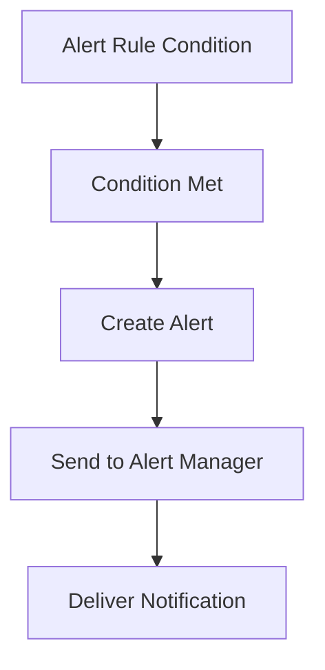

## Introduction to Prometheus Alert Manager

Prometheus is a powerful open-source monitoring system and time series database designed for monitoring various aspects of your infrastructure and applications. One of its key components is the **Alert Manager**, which is responsible for managing and sending out alerts based on predefined rules. These rules are defined in configuration files, typically named `alertmanager.yml` or `prometheus.yml`, depending on the setup.

### What is an Alert Rule?

An alert rule is a condition that, when met, triggers an alert. These alerts can be used to notify operators about issues in the system, such as resource exhaustion, application failures, or other critical events. Alert rules are defined in YAML format within the Prometheus configuration files.

### Why Use Alert Rules?

Using alert rules is crucial for maintaining the health and stability of your systems. They help in:

- **Proactive Monitoring**: Detecting issues before they become critical.
- **Automated Responses**: Triggering automated actions to mitigate issues.
- **Operational Awareness**: Keeping operators informed about the state of the system.

### How Alert Rules Work

Alert rules are evaluated periodically by Prometheus. When a rule's condition is met, an alert is created and sent to the Alert Manager. The Alert Manager then handles the delivery of these alerts to the appropriate channels, such as email, Slack, or other notification services.

### Example Alert Rule Configuration

Here is an example of an alert rule configuration for a simple scenario:

```yaml
groups:
  - name: example
    rules:
      - alert: HighCPUUsage
        expr: sum(rate(node_cpu_seconds_total{mode="idle"}[5m])) BY (instance) < 0.1
        for: 10m
        labels:
          severity: "critical"
        annotations:
          summary: "High CPU usage on {{ $labels.instance }}"
          description: "CPU usage is above 90% on {{ $labels.instance }} for more than 10 minutes."
```

In this example:
- `expr`: The expression that defines the condition for the alert.
- `for`: The duration the condition must be true before the alert is fired.
- `labels`: Additional metadata attached to the alert.
- `annotations`: Human-readable descriptions of the alert.

### Real-World Example: CVE-2021-25280

CVE-2021-25280 is a critical vulnerability in the Kubernetes API server that could allow an attacker to bypass authentication and authorization mechanisms. By setting up alert rules to monitor for unusual API activity, you can detect potential exploitation attempts.

#### Alert Rule for Unusual API Activity

```yaml
groups:
  - name: kubernetes_api_monitoring
    rules:
      - alert: SuspiciousAPIActivity
        expr: sum(increase(kube_apiserver_request_count[5m])) > 1000
        for: 5m
        labels:
          severity: "high"
        annotations:
          summary: "Suspicious API activity detected"
          description: "More than 1000 API requests in the last 5 minutes, which may indicate a security breach."
```

This rule monitors the number of API requests and triggers an alert if there is a sudden spike in activity.

### Understanding Alert Manager Groups

Alert Manager groups are collections of related alert rules. Each group can contain multiple rules, and they are often organized based on the type of service or component being monitored.

#### Example Group Structure

```yaml
groups:
  - name: prometheus_stack
    rules:
      - alert: AlertManagerReloadFailed
        expr: alertmanager_reloading_failed > 0
        for: 5m
        labels:
          severity: "critical"
        annotations:
          summary: "Alert Manager failed to reload"
          description: "The Alert Manager failed to reload its configuration."

  - name: kubernetes_control_plane
    rules:
      - alert: EtcdMemberDown
        expr: etcd_member_is_leader == 0
        for: 5m
        labels:
          severity: "critical"
        annotations:
          summary: "Etcd member is down"
          description: "One or more Etcd members are not responding."
```

### Common Pitfalls and Best Practices

#### Pitfall: Over-Alerting

Over-alerting occurs when too many alerts are generated, leading to alert fatigue. To avoid this, ensure that your alert rules are specific and meaningful.

#### Best Practice: Proper Labeling

Use meaningful labels to categorize alerts. This helps in quickly identifying the severity and context of the alert.

#### Best Practice: Testing Alerts

Regularly test your alert rules to ensure they work as expected. This can be done using tools like `curl` to simulate conditions that should trigger alerts.

### How to Prevent / Defend

#### Detection

To detect potential issues, regularly review your alert logs and ensure that your alert rules cover all critical areas of your infrastructure.

#### Prevention

Implement proper monitoring and alerting practices to catch issues early. Regularly update your alert rules to reflect changes in your environment.

#### Secure Coding Fixes

Compare the vulnerable and secure versions of your alert rules to ensure they are correctly implemented.

**Vulnerable Version:**

```yaml
groups:
  - name: kubernetes_apps
    rules:
      - alert: PodNotReady
        expr: kube_pod_status_ready{condition="false"} > 0
        for: 5m
        labels:
          severity: "critical"
        annotations:
          summary: "Pod is not ready"
          description: "One or more pods are not ready."
```

**Secure Version:**

```yaml
groups:
  - name: kubernetes_apps
    rules:
      - alert: PodNotReady
        expr: kube_pod_status_ready{condition="false"} >  0
        for: 5m
        labels:
          severity: "critical"
        annotations:
          summary: "Pod is not ready"
          description: "One or more pods are not ready."
```

### Complete Example: Full HTTP Request and Response

When configuring alert rules, you might need to interact with the Prometheus API to retrieve or modify configurations. Here is an example of a full HTTP request and response:

#### HTTP Request

```http
GET /api/v1/rules HTTP/1.1
Host: localhost:9090
Accept: application/json
```

#### HTTP Response

```http
HTTP/1.1 200 OK
Content-Type: application/json

{
  "status": "success",
  "data": [
    {
      "name": "example",
      "rules": [
        {
          "alert": "HighCPUUsage",
          "expr": "sum(rate(node_cpu_seconds_total{mode=\"idle\"}[5m])) BY (instance) < 0.1",
          "for": "10m",
          "labels": {
            "severity": "critical"
          },
          "annotations": {
            "summary": "High CPU usage on {{ $labels.instance }}",
            "description": "CPU usage is above 90% on {{ $labels.instance }} for more than 10 minutes."
          }
        }
      ]
    }
  ]
}
```

### Mermaid Diagrams

#### Alert Rule Flow Diagram



### Conclusion

Understanding and effectively using Prometheus alert rules is essential for maintaining the health and stability of your systems. By setting up comprehensive and meaningful alert rules, you can proactively monitor your infrastructure and respond to issues before they become critical. Regular testing and updating of your alert rules ensure that they remain effective and relevant to your environment.

### Hands-On Labs

For practical experience with configuring alert rules in Prometheus, consider the following labs:

- **PortSwigger Web Security Academy**: Offers a section on monitoring and alerting.
- **OWASP Juice Shop**: Provides scenarios for setting up monitoring and alerting in a web application environment.
- **DVWA (Damn Vulnerable Web Application)**: Useful for practicing monitoring and alerting in a controlled environment.

These labs provide real-world scenarios and exercises to deepen your understanding and skills in configuring alert rules for cluster monitoring.

---
<!-- nav -->
[[01-Introduction to Cluster Monitoring and Alerting|Introduction to Cluster Monitoring and Alerting]] | [[DevOps/DevOps Bootcamp/10-Monitoring & Alerting/03-Configuring Alert Rules In Prometheus For Cluster Monitoring/00-Overview|Overview]] | [[03-Introduction to Prometheus Alert Rules|Introduction to Prometheus Alert Rules]]
